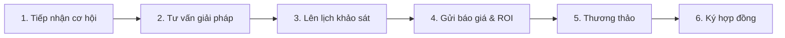

# TÀI LIỆU YÊU CẦU NGHIỆP VỤ (BUSINESS REQUIREMENTS DOCUMENT - BRD)
## DỰ ÁN: NỀN TẢNG MARKETING & CHĂM SÓC KHÁCH HÀNG ĐA KÊNH TÍCH HỢP AI
### ĐƠN VỊ YÊU CẦU: CÔNG TY CỔ PHẦN NĂNG LƯỢNG SOLAVIE

---

| Thông tin dự án | Chi tiết |
|-----------------|----------|
| **Dự án** | Nền tảng Marketing & Chăm sóc khách hàng tự động đa kênh |
| **Phiên bản** | 1.3.0 |
| **Ngày cập nhật** | 30/05/2026 |
| **Trạng thái** | Bản dự thảo (Chờ Ban Giám đốc phê duyệt) |
| **Mức độ bảo mật** | Lưu hành nội bộ (Confidential) |
| **Người soạn thảo** | Đội ngũ Phân tích Nghiệp vụ (BA Team) |

---

## Lịch sử chỉnh sửa (Revision History)

| Phiên bản | Ngày | Tác giả | Nội dung điều chỉnh |
|-----------|------|---------|---------------------|
| 0.1.0 | 28/05/2026 | BA Team | Khởi tạo tài liệu, xác định mục tiêu và phạm vi kinh doanh ban đầu. |
| 0.5.0 | 29/05/2026 | BA Team | Bổ sung quy tắc quản lý quyền nhân viên, so sánh kết nối Zalo/Facebook và quy trình chuyển giao khách cho nhân viên tư vấn. |
| 1.0.0 | 30/05/2026 | BA Team | Tích hợp quy trình lưu trữ tài liệu, quản lý ảnh/video dự án và tự động rút gọn link chiến dịch marketing. |
| 1.3.0 | 30/05/2026 | BA Team | **Nâng cấp toàn diện đặc tả nghiệp vụ Solar và Chatbot:** Khảo sát mái nhà, tính toán tài chính (ROI), báo giá PDF, O&M bảo trì, chi tiết nghiệp vụ Trợ lý ảo AI (Chatbot) tự động, hệ thống cấu hình động và dự toán máy chủ. |

---

## 1. MỤC TIÊU DỰ ÁN & ĐẶC THÙ NGHIỆP VỤ SOLAVIE

### 1.1. Mục tiêu và lộ trình phát triển
Dự án được xây dựng nhằm mục đích tối ưu hóa quy trình bán hàng, tự động hóa tương tác với khách hàng trên các kênh mạng xã hội, đồng thời quản lý hiệu quả hoạt động chăm sóc khách hàng sau bán hàng.
*   **Giai đoạn 1 (MVP - Vận hành nội bộ):** Phục vụ trực tiếp cho hoạt động kinh doanh các sản phẩm điện mặt trời, pin lưu trữ năng lượng và hệ thống sạc xe điện của công ty **Solavie**.
*   **Giai đoạn 2 (SaaS - Thương mại hóa):** Đóng gói phần mềm thành gói dịch vụ để bán cho các doanh nghiệp lắp đặt điện mặt trời khác và mở rộng sang các ngành bán lẻ, dịch vụ ăn uống (F&B), bất động sản.

### 1.2. Đặc thù quy trình bán hàng ngành Điện mặt trời
Sản phẩm điện mặt trời là mặt hàng **giá trị cao (High-Ticket)** và **quy trình tư vấn kéo dài (vài tuần đến vài tháng)**. Trợ lý AI (Chatbot) trong hệ thống này sẽ không trực tiếp "bán hàng" tự động, mà tập trung thực hiện các nhiệm vụ hỗ trợ đội ngũ kinh doanh (Sales):
1.  **Phân loại nhu cầu:** Xác định khách hàng muốn lắp đặt cho hộ gia đình hay cho nhà xưởng/doanh nghiệp.
2.  **Thu thập thông tin ban đầu:** Xin địa chỉ lắp đặt, diện tích mái khả dụng và số tiền điện trung bình mỗi tháng.
3.  **Đặt lịch khảo sát thực địa (Site Survey):** Hỗ trợ khách hàng chọn ngày, giờ để kỹ thuật viên Solavie đến đo đạc mái nhà.
4.  **Hỗ trợ tính toán hiệu quả tài chính:** Tính công suất lắp đặt tối ưu, sản lượng điện dự kiến sinh ra, dòng tiền hoàn vốn và tự động gửi báo giá mẫu (Solar Proposal PDF).
5.  **Quản lý bảo trì sau bán hàng (O&M):** Tiếp nhận thông tin khi khách báo lỗi hệ thống qua Zalo/Facebook và phân công kỹ thuật viên đi sửa chữa.

### 1.3. Bảng so sánh nhu cầu giữa các ngành (Khi mở rộng thương mại)

| Đặc trưng bán hàng | Điện mặt trời (Solavie) | Bán lẻ (E-commerce) | F&B / Nhà hàng |
|---------------------|---------------------------|---------------------------|----------------------|
| **Thời gian chốt đơn** | Kéo dài vài tuần đến vài tháng | Rất nhanh (vài phút đến vài giờ) | Ngay lập tức |
| **Giá trị đơn hàng** | Rất lớn (vài chục triệu đến hàng tỷ) | Thấp đến Trung bình | Thấp |
| **Nhiệm vụ chính của AI**| Thu thập thông tin khách hàng, hẹn lịch khảo sát, tính dòng tiền hoàn vốn. | Báo giá sản phẩm, kiểm tra tồn kho, tạo đơn hàng, tra cứu mã giao hàng. | Gửi thực đơn, nhận đặt bàn, đặt món ăn giao tận nhà. |
| **Tích hợp phần mềm ngoài**| Hệ thống quản lý cơ hội, công cụ đo đạc bức xạ mặt trời, Lịch làm việc. | Hệ thống quản lý kho hàng, quản lý đơn hàng, các đơn vị giao hàng. | Máy in hóa đơn tại quầy, dịch vụ giao đồ ăn (GrabFood, ShopeeFood). |

---

## 2. CHI TIẾT 3 QUY TRÌNH NGHIỆP VỤ ĐIỆN MẶT TRỜI CỐT LÕI

Để phục vụ tối ưu cho Solavie, hệ thống tập trung xây dựng 3 quy trình nghiệp vụ sau:

### 2.1. Quy trình Quản lý cơ hội & Khảo sát mái nhà (Deal Pipeline & Site Survey)
Quy trình bán hàng từ lúc tiếp cận khách hàng đến khi ký hợp đồng được quản lý trực quan qua 6 giai đoạn:

*   **Các bước vận hành chi tiết:**
    1.  **Tiếp nhận khách hàng:** Khi khách hàng nhắn tin cung cấp Tên và Số điện thoại hợp lệ trên Zalo/Facebook, hệ thống tự động tạo một "Cơ hội bán hàng" (Deal) trên màn hình quản lý của Sales.
    2.  **Đặt lịch khảo sát mái:** Khi khách hàng đồng ý cho nhân viên đến nhà đo đạc, nhân viên tư vấn chuyển trạng thái cơ hội sang `Khảo sát`. Hệ thống sẽ hiển thị biểu mẫu để chọn ngày, giờ khảo sát và chỉ định Kỹ thuật viên hiện trường phụ trách. Hệ thống tự động gửi thông báo nhiệm vụ đến tài khoản của Kỹ thuật viên đó.
    3.  **Ghi biên bản thực địa:** Kỹ thuật viên sau khi đến nhà khách hàng đo đạc sẽ sử dụng điện thoại để nhập các thông số thực tế vào hệ thống:
        *   *Diện tích mái khả dụng (m²)*.
        *   *Loại kết cấu mái* (ví dụ: mái ngói, mái tôn, hay mái bê tông).
        *   *Độ dốc mái* và *Hướng đón nắng* (ví dụ: hướng Nam, Đông Nam).
        *   *Chụp ảnh hiện trường* (ảnh kết cấu khung sắt, ảnh tủ điện, ảnh toàn cảnh mái nhà) để tải trực tiếp lên hồ sơ của khách hàng.
    4.  **Tự động chuyển giai đoạn:** Ngay sau khi Kỹ thuật viên lưu biên bản khảo sát thành công, cơ hội bán hàng sẽ tự động chuyển sang trạng thái `Báo giá & ROI` để nhân viên kinh doanh chuẩn bị phương án tài chính.

### 2.2. Quy trình Tính toán hiệu quả đầu tư & Tự động xuất báo giá (Solar Calculator & ROI)
Phần mềm cung cấp công cụ giúp nhân viên kinh doanh tính toán nhanh phương án lắp đặt và tự động tạo báo giá chuyên nghiệp gửi cho khách hàng.
*   **Công thức tính toán hiệu quả tài chính:**
    1.  **Nhập thông tin:** Nhân viên kinh doanh nhập số tiền điện trung bình mỗi tháng của khách hàng và diện tích mái thực tế đã đo đạc.
    2.  **Tính công suất lắp đặt tối ưu:** Hệ thống tự động tính toán xem với hóa đơn điện và diện tích mái như vậy thì khách hàng nên lắp hệ thống công suất bao nhiêu kWp là vừa đủ (tránh lắp quá thừa gây lãng phí hoặc quá thiếu không đủ dùng). *Trung bình 1 kWp pin mặt trời cần khoảng 6 - 7m² diện tích mái.*
    3.  **Tính sản lượng điện dự kiến:** Hệ thống dựa trên số giờ nắng trung bình tại khu vực (miền Nam trung bình khoảng 4.0 - 4.5 giờ nắng/ngày) để tính ra tổng số điện (kWh) hệ thống sẽ sản sinh ra mỗi tháng.
    4.  **Tính toán thời gian hoàn vốn:**
        *   Tính số tiền điện tiết kiệm được mỗi tháng dựa trên bảng giá điện sinh hoạt/kinh doanh hiện hành của EVN.
        *   Lấy tổng chi phí đầu tư ban đầu chia cho số tiền tiết kiệm được hàng năm để ra số năm hoàn vốn (thông thường từ 4.5 - 6 năm).
    5.  **Tích hợp bản đồ bức xạ chuyên nghiệp:** Cho phép hệ thống kết nối với các ứng dụng bản đồ chuyên dụng của bên thứ ba (HelioScope hoặc OpenSolar) để lấy sơ đồ thiết kế 3D tấm pin trên mái nhà và sản lượng bức xạ chính xác theo vị trí định vị vệ tinh của ngôi nhà.
*   **Quy trình xuất file báo giá tự động:**
    *   Nhân viên kinh doanh chỉ cần nhấn nút "Xuất báo giá", hệ thống sẽ tự động ghép các thông tin: Họ tên khách hàng, thông số kỹ thuật mái, kết quả tính toán tài chính (số tiền tiết kiệm, năm hoàn vốn) và ảnh chụp mái nhà vào một mẫu file báo giá PDF chuyên nghiệp của Solavie.
    *   File PDF này được lưu trữ bảo mật trên kho tài liệu của công ty. Hệ thống sẽ sinh ra một đường link tải an toàn để nhân viên kinh doanh gửi trực tiếp cho khách hàng qua tin nhắn Zalo/Facebook. Để đảm bảo an toàn, đường link này sẽ tự động hết hạn sau 15 phút.

### 2.3. Quy trình Tiếp nhận bảo hành & Điều phối kỹ thuật (O&M Ticketing)
Quy trình hỗ trợ kỹ thuật sau khi khách hàng đã lắp đặt và đưa vào sử dụng:
1.  **Báo sự cố:** Khách hàng gửi tin nhắn báo lỗi hệ thống qua Zalo OA hoặc Fanpage (ví dụ: *"Thiết bị biến tần Inverter báo đèn đỏ"*, *"Hôm nay trời nắng to nhưng phần mềm báo sản lượng bằng 0"*).
2.  **Mở phiếu yêu cầu (Ticket):** Nhân viên trực khung chat trên Dashboard chỉ cần nhấn nút "Tạo phiếu hỗ trợ O&M". Hệ thống tự động lấy thông tin khách hàng, tạo phiếu hỗ trợ mới, gán mức độ ưu tiên (Thấp, Trung bình, Cao, Khẩn cấp) và chuyển thông tin đến bộ phận kỹ thuật.
3.  **Phân công sửa chữa:** Trưởng bộ phận bảo trì chỉ định Kỹ thuật viên phụ trách sửa chữa. Hệ thống sẽ gửi thông báo tin nhắn trực tiếp đến Kỹ thuật viên được chỉ định.
4.  **Xác nhận hoàn thành:** Kỹ thuật viên sau khi đến nhà khách hàng khắc phục sự cố xong sẽ chụp ảnh thiết bị hoạt động bình thường trở lại và cập nhật trạng thái "Đã xử lý" trên ứng dụng.
5.  **Đóng phiếu hỗ trợ:** Trưởng bộ phận kiểm tra và đóng phiếu hỗ trợ. Hệ thống sẽ tự động gửi một tin nhắn cảm ơn và kèm theo link khảo sát đánh giá chất lượng dịch vụ đến tài khoản Zalo của khách hàng.

---

## 3. TÍNH NĂNG VÀ NGUYÊN TẮC HOẠT ĐỘNG CỦA TRỢ LÝ ẢO AI (CHATBOT)

Trợ lý ảo AI (Chatbot) là "nhân sự số" hoạt động 24/7 của Solavie, đảm nhận vai trò phản hồi tin nhắn tự động từ khách hàng trên Facebook, Zalo, TikTok. Dưới đây là đặc tả chi tiết các tính năng nghiệp vụ và quy tắc ứng xử của Trợ lý ảo AI:

### 3.1. Phân loại Ý định của khách hàng (Intent Recognition)
Khi nhận tin nhắn từ khách hàng, Trợ lý ảo AI tự động phân tích ngữ nghĩa để xác định chính xác mục tiêu của khách.
*   **Các nhóm ý định chính Chatbot cần nhận biết để xử lý:**
    *   *Chào hỏi:* Chào lại khách hàng theo đúng tên tài khoản mạng xã hội của họ và giới thiệu tổng quan về Solavie.
    *   *Hỏi đáp chung (FAQ):* Trả lời các thắc mắc thông thường của khách hàng (ví dụ: nguyên lý hoạt động của pin mặt trời, thương hiệu pin sử dụng, thời gian bảo hành, chính sách mua trả góp).
    *   *Yêu cầu báo giá/tư vấn lắp đặt:* Kích hoạt luồng thu thập thông tin tiền điện, địa điểm để chuẩn bị cho công cụ tính ROI.
    *   *Đặt lịch khảo sát mái:* Thu thập thông tin ngày hẹn, giờ hẹn và số điện thoại liên hệ để chuyển sang trạng thái hẹn lịch của Sales.
    *   *Báo sự cố kỹ thuật:* Hỏi thông tin lỗi thiết bị để tạo phiếu hỗ trợ O&M.
    *   *Trò chuyện phiếm (Chitchat):* Trả lời lịch sự các câu hỏi ngoài lề của khách hàng (ví dụ: khen chatbot thông minh, hỏi thời tiết) nhưng luôn tìm cách điều hướng khéo léo khách hàng quay lại chủ đề chính là điện mặt trời.

### 3.2. Trả lời tự động dựa trên tài liệu nội bộ của doanh nghiệp (RAG)
Chatbot của Solavie không tự do sáng tạo câu trả lời như các công cụ AI công cộng, mà bắt buộc phải tuân thủ nghiêm ngặt dữ liệu do công ty cung cấp (Cơ sở tri thức gồm tài liệu kỹ thuật, chính sách giá, quy trình thi công do quản lý tải lên).
*   **Nguyên tắc ứng xử chống "ảo tưởng thông tin" (Anti-Hallucination):**
    *   Khi có khách hỏi, chatbot sẽ tra cứu trong tài liệu nội bộ trước. Nếu tài liệu có thông tin, chatbot tổng hợp lại và trả lời.
    *   Nếu trong tài liệu nội bộ hoàn toàn không có thông tin (ví dụ khách hỏi thông tin của đối thủ cạnh tranh hoặc hỏi các câu hỏi kỹ thuật quá sâu nằm ngoài tài liệu), chatbot **KHÔNG ĐƯỢC TỰ BỊA** câu trả lời mà phải phản hồi lịch sự: *"Tôi chưa tìm thấy thông tin chính xác cho câu hỏi này trong cơ sở dữ liệu của Solavie. Để đảm bảo tính chính xác, tôi xin phép chuyển ngay cuộc trò chuyện này cho nhân viên kỹ thuật hỗ trợ bạn nhé"* $\rightarrow$ Kích hoạt quy trình chuyển giao (Handoff) cho người trực.

### 3.3. Duy trì Ngữ cảnh cuộc trò chuyện (Conversation Memory)
Trợ lý ảo AI có khả năng ghi nhớ toàn bộ thông tin đã trao đổi với khách hàng trong cùng một phiên trò chuyện (nhớ được tối đa 10 lượt chat gần nhất).
*   *Ví dụ thực tế:*
    *   *Khách hàng:* "Tôi muốn lắp hệ thống điện mặt trời hộ gia đình."
    *   *Chatbot:* "Dạ, Solavie có các gói từ 3kWp đến 10kWp cho hộ gia đình ạ. Anh/Chị muốn tham khảo gói nào ạ?"
    *   *Khách hàng:* "Chi phí gói nhỏ nhất khoảng bao nhiêu?"
    *   *Trợ lý ảo AI phải tự hiểu:* Khách hàng đang hỏi giá của gói "3kWp cho hộ gia đình" để đưa ra báo giá chính xác, chứ không hỏi ngược lại: "Anh/chị đang hỏi gói nào ạ?".

### 3.4. Thang điểm tin cậy và Cơ chế Chuyển giao tự động cho nhân viên trực (Handoff)
Hệ thống áp dụng thang điểm tin cậy tự động từ `0.0` đến `1.0` cho mỗi câu trả lời của AI.
*   **Quy tắc ra quyết định gửi tin nhắn:**
    *   *Điểm số $\ge$ 0.70 (Tin cậy cao):* Chatbot được phép tự động gửi tin nhắn trả lời khách hàng.
    *   *Điểm số < 0.70 (Không chắc chắn):* Chatbot ngừng trả lời tự động, hiển thị câu thông báo chờ cho khách (ví dụ: *"Yêu cầu của bạn đang được chuyển đến nhân viên tư vấn, vui lòng chờ trong giây lát..."*) và tự động chuyển cuộc chat sang chế độ thủ công (Manual) để đẩy về Dashboard của nhân viên trực.

### 3.5. Nhận diện cảm xúc khách hàng để Handoff khẩn cấp (Sentiment Handoff)
*   Hệ thống liên tục chấm điểm thái độ/cảm xúc của khách hàng qua từng câu chat.
*   **Quy tắc xử lý:** Nếu phát hiện khách hàng đang thể hiện thái độ giận dữ, bức xúc hoặc sử dụng từ ngữ thô tục khiếu nại (điểm tiêu cực $\ge$ 0.60), chatbot lập tức nhường quyền kiểm soát cuộc trò chuyện cho con người, đẩy cuộc chat về hàng đợi ưu tiên của nhân viên và kích hoạt cảnh báo chuông khẩn cấp trên giao diện làm việc.

### 3.6. Trích xuất thông tin từ ảnh chụp hóa đơn tiền điện (AI Vision)
*   Để thuận tiện cho khách hàng, thay vì bắt khách nhập số tiền điện, chatbot cho phép khách hàng chụp ảnh hóa đơn tiền điện gửi lên khung chat.
*   **Quy tắc xử lý hình ảnh:**
    *   *Trường hợp Bật tính năng đọc hóa đơn:* Trợ lý ảo sử dụng công nghệ nhận diện hình ảnh AI để đọc ảnh, tự động bóc tách các thông tin: *Số tiền điện phải đóng*, *Sản lượng tiêu thụ (kWh)*, *Họ tên chủ hộ* và *Mã khách hàng EVN*. Dữ liệu này tự động cập nhật vào CRM của khách hàng.
    *   *Trường hợp Tắt tính năng đọc hóa đơn:* Khi nhận được file ảnh hóa đơn từ khách, chatbot sẽ không phân tích tự động mà thực hiện gán thẳng cuộc chat sang cho nhân viên kinh doanh vào tự xem ảnh và tư vấn trực tiếp cho khách.

### 3.7. Kịch bản thu thập thông tin khách hàng tiềm năng ngoài giờ (Lead Capture Flow)
Khi ngoài giờ làm việc cấu hình trên hệ thống (ví dụ: đêm muộn hoặc ngày nghỉ lễ) hoặc khi chatbot không tự trả lời được, chatbot sẽ tự động kích hoạt kịch bản thu thập thông tin:
1.  *Thông báo:* *"Hiện tại đã ngoài giờ làm việc của Solavie, các bạn tư vấn viên đang nghỉ. Tôi là trợ lý AI, tôi có thể ghi lại thông tin để các bạn liên hệ lại hỗ trợ Anh/Chị vào sáng mai được không ạ?"*
2.  *Xin thông tin:* Hỏi xin Họ tên, Số điện thoại và Địa chỉ lắp đặt.
3.  *Kiểm tra tính hợp lệ của Số điện thoại:* Chatbot tự động kiểm tra định dạng Số điện thoại khách hàng gõ. Số điện thoại hợp lệ phải có đúng 10 chữ số và bắt đầu bằng các đầu số di động của Việt Nam (03, 05, 07, 08, 09). Nếu khách nhập sai (ví dụ thiếu số hoặc nhập chữ), chatbot sẽ lịch sự yêu cầu nhập lại: *"Số điện thoại Anh/Chị vừa cung cấp dường như chưa chính xác, Anh/Chị vui lòng kiểm tra và nhập lại giúp tôi nhé."*
4.  *Ghi nhận cơ hội bán hàng:* Lưu thông tin khách hàng vào danh bạ và khóa tạm thời chatbot (không cho phép chatbot tự do trò chuyện lan man với khách hàng) cho đến khi nhân viên vào làm việc hôm sau để trực tiếp xử lý tiếp.

### 3.8. Hệ thống rào chắn AI an toàn (AI Guardrails)
Để đảm bảo Trợ lý ảo AI hoạt động tin cậy và không gây rủi ro pháp lý hay thương mại cho Solavie, hệ thống tích hợp hai lớp rào chắn an toàn tự động:
*   **Rào chắn đầu vào (Lọc câu hỏi):** Hệ thống tự động phân tích và chặn ngay các câu hỏi mang tính chất tấn công (prompt injection), câu hỏi về các lĩnh vực nhạy cảm (chính trị, tôn giáo, xã hội) hoặc các câu hỏi so sánh trực tiếp/nhắc đến thương hiệu của đối thủ cạnh tranh điện mặt trời. Chatbot sẽ lịch sự từ chối trả lời và định hướng khách hàng về sản phẩm của Solavie.
*   **Rào chắn đầu ra (Chống nói sai sự thật - Anti-Hallucination):** Đối với câu trả lời liên quan đến kỹ thuật hoặc chính sách giá từ cơ sở tri thức (RAG), hệ thống tự động chạy thuật toán đối chiếu câu chữ. Nếu câu trả lời chứa thông tin không có cơ sở xác thực trong tài liệu nội bộ, hệ thống sẽ lập tức chặn câu trả lời đó, tự sinh lại hoặc tự động chuyển cuộc chat sang cho nhân viên trực để tránh báo sai thông tin cho khách hàng.

### 3.9. Kết nối công cụ nghiệp vụ riêng theo từng chi nhánh/đại lý (Multi-tenant Custom MCP)
Khi hệ thống mở rộng thương mại hóa (SaaS), mỗi doanh nghiệp (Tenant) hoặc chi nhánh đại lý của Solavie sẽ sử dụng các phần mềm quản lý nội bộ riêng (phần mềm kế toán, CRM, ERP, công cụ tính Solar ROI, v.v.).
*   Hệ thống cho phép mỗi đại lý đăng ký kết nối bảo mật các công cụ đặc thù của mình thông qua giao thức tiêu chuẩn MCP (Model Context Protocol). Hệ thống chỉ kết nối tới các Custom MCP Server nội bộ đã được whitelisting trong cơ sở dữ liệu và cấm các kết nối tự do đến các public MCP server công cộng để triệt tiêu nguy cơ bảo mật.
*   AI Core sẽ tự động phân giải, tự động tiêm/ghi đè thuộc tính `tenant_id` từ JWT xác thực vào mọi tham số tool để cô lập dữ liệu tuyệt đối ở mức gateway, và chỉ cho phép Trợ lý ảo truy cập đúng các công cụ được đại lý đó cấp quyền, tuyệt đối không xảy ra tình trạng đại lý này truy cập nhầm dữ liệu của đại lý khác.
*   Quyền truy cập thư mục lưu trữ của các công cụ này được giới hạn nghiêm ngặt thông qua ranh giới `Roots Security Boundary` để đảm bảo an toàn hệ thống thông tin.

### 3.10. Kiểm soát hành động của AI bởi con người (Human-in-the-loop) có cấu hình
Mặc dù Trợ lý AI có thể tự động tính toán và đưa ra các đề xuất, đối với các hành động mang tính chất pháp lý hoặc giao dịch nhạy cảm, hệ thống bắt buộc phải có sự kiểm soát của con người:
*   **Cơ chế tạm dừng chờ duyệt:** Khi Trợ lý ảo cần thực hiện các hành động như: lên lịch khảo sát thực địa chính thức cho kỹ thuật viên hoặc tự động tạo báo giá Solar Proposal PDF gửi khách, hệ thống sẽ tạm thời dừng luồng xử lý tự động và đẩy một thông báo chờ phê duyệt lên Dashboard của nhân viên tư vấn.
*   **Cấu hình linh hoạt:** Quản trị viên (Admin) của từng đại lý có quyền cấu hình bật/tắt cơ chế này. Admin có thể quy định cụ thể công cụ nào thì cho phép AI tự động thực thi hoàn toàn (để tăng tốc độ phản hồi), và công cụ nào bắt buộc phải có sự phê duyệt thủ công từ nhân viên kinh doanh trước khi gửi đi.

### 3.11. Tối ưu hóa chi phí vận hành AI (Prompt Caching & Summarization)
Chi phí sử dụng các mô hình ngôn ngữ lớn (LLM) được tính theo số lượng từ ngữ (tokens) truyền gửi. Để tối ưu hóa chi phí vận hành cho doanh nghiệp, hệ thống áp dụng hai cơ chế:
*   **Tóm tắt cuộc trò chuyện tự động:** Khi cuộc trò chuyện giữa khách và AI kéo dài, hệ thống sẽ tự động tóm tắt các nội dung đã thống nhất ở các lượt chat cũ và xóa các chi tiết thừa để giữ cho cửa sổ bộ nhớ luôn tinh gọn, tránh lãng phí chi phí token gửi lên mô hình.
*   **Bộ đệm câu lệnh (Prompt Caching):** Hệ thống tự động ghi nhớ và tái sử dụng các phần nội dung cố định (System Prompt, hướng dẫn thương hiệu, danh sách công cụ MCP và tài liệu kỹ thuật tĩnh). Khi có tin nhắn mới, mô hình AI không cần đọc lại từ đầu toàn bộ các tài liệu này mà tái sử dụng bộ đệm cũ, giúp giảm chi phí xử lý đầu vào lên đến 90% và tăng tốc độ chatbot phản hồi khách hàng lên 80%.

---

## 4. PHÂN QƯỀN LINH HOẠT CHO NHÂN VIÊN (DYNAMIC RBAC)

Hệ thống cho phép Quản trị viên (Admin) tự định nghĩa và quản lý các chức vụ của nhân viên trong công ty mà không cần sự can thiệp của lập trình viên.

### 4.1. Phân tích lợi ích và hạn chế của phân quyền linh hoạt

#### Lợi ích đối với doanh nghiệp:
*   **Tùy biến dễ dàng:** Admin có thể tự tạo ra các vai trò mới phù hợp với cơ cấu tổ chức của Solavie (ví dụ: *"Trưởng nhóm Sales miền Nam"*, *"Nhân viên khảo sát hiện trường"*, *"Cộng tác viên viết bài marketing"*) bằng cách tick chọn các quyền có sẵn trên màn hình cài đặt.
*   **Thay đổi nhanh chóng:** Khi một nhân viên được thăng chức hoặc chuyển bộ phận, Admin chỉ cần thay đổi nhóm quyền của nhân viên đó trên Dashboard, hệ thống sẽ tự động cập nhật ngay lập tức.
*   **Bảo mật dữ liệu nội bộ:** Giúp kiểm soát chặt chẽ việc nhân viên nào được phép xem dữ liệu của nhân viên khác, tránh tình trạng lộ lọt danh sách khách hàng.

#### Hạn chế kỹ thuật và giải pháp xử lý:
*   *Hạn chế:* Việc kiểm tra quyền hạn của nhân viên một cách liên tục tại mỗi lượt click chuột có thể khiến phần mềm chạy chậm đi nếu máy chủ yếu.
    *   *Giải pháp:* Đội ngũ kỹ thuật sử dụng công nghệ lưu trữ tạm thời (Redis Cache) để hệ thống kiểm tra quyền của nhân viên trong vòng chưa đầy 0.05 giây.
*   *Hạn chế:* Khi Admin tước quyền của nhân viên, nhân viên đó vẫn có thể thao tác quyền cũ trong vài phút do phiên đăng nhập cũ chưa hết hạn.
    *   *Giải pháp:* Hệ thống tự động thu hồi và yêu cầu đăng nhập lại ngay lập tức đối với tài khoản vừa bị thay đổi quyền.

### 4.2. Danh sách các quyền hạn sẵn có để Admin gán cho nhân viên:
*   `Quản lý kênh kết nối`: Quyền kết nối hoặc ngắt kết nối Fanpage Facebook, Zalo OA của công ty.
*   `Đọc và chat với khách hàng`: Quyền vào Hộp thư chung để xem và nhắn tin trả lời khách.
*   `Chuyển giao cuộc chat`: Quyền gán cuộc trò chuyện của khách cho nhân viên khác xử lý.
*   `Quản lý danh bạ khách hàng`: Quyền xem, chỉnh sửa thông tin số điện thoại, địa chỉ của khách hàng.
*   `Gộp danh bạ trùng lặp`: Quyền phê duyệt gộp các tài khoản Facebook, Zalo trùng số điện thoại của cùng một khách hàng về một hồ sơ duy nhất.
*   `Xem thông tin nhạy cảm`: Quyền được xem đầy đủ số điện thoại và email của khách hàng. Nếu nhân viên không có quyền này, hệ thống sẽ tự động che đi các chữ số giữa (ví dụ: `091****567`) để bảo mật dữ liệu của công ty.
*   `Sáng tạo & Đăng tải nội dung`: Quyền sử dụng AI viết bài, duyệt bài đăng tiếp thị và lên lịch đăng bài lên mạng xã hội.
*   `Xem báo cáo thống kê`: Quyền xem các biểu đồ doanh thu, hiệu suất làm việc của nhân viên và hiệu quả chiến dịch quảng cáo.

---

## 5. QUY TẮC TÍCH HỢP CÁC KÊNH MẠNG XÃ HỘI

### 5.1. So sánh phương án kết nối Zalo OA và Zalo Cá nhân
Zalo là kênh liên hệ chính tại Việt Nam, tuy nhiên có sự khác biệt rất lớn về mặt kỹ thuật và tính an toàn pháp lý giữa Zalo Official Account (Zalo OA - Trang doanh nghiệp) và Zalo Cá nhân:

| Tiêu chí so sánh | Trang doanh nghiệp (Zalo OA) | Zalo Cá nhân (Zalo Business) |
|----------|--------------------------------|------------------------------|
| **Điều kiện kết nối** | Cần giấy phép đăng ký kinh doanh và xác thực doanh nghiệp. | Tài khoản cá nhân thông thường của nhân viên. |
| **Tính năng kết nối** | **Hỗ trợ kết nối chính thức.** Cho phép tự động nhận tin nhắn, tích hợp chatbot trả lời tự động 24/7. | **Zalo không hỗ trợ cổng kết nối.** Không thể tích hợp phần mềm và chatbot chính thống. |
| **Độ ổn định hệ thống** | Rất cao, hoạt động an toàn và bảo mật. | Rất thấp. Thường xuyên bị mất kết nối khi Zalo cập nhật ứng dụng. |
| **Rủi ro khóa tài khoản** | **Không có rủi ro.** | **Rủi ro rất cao bị Zalo khóa tài khoản vĩnh viễn** do vi phạm chính sách của Zalo khi sử dụng các phần mềm lậu để tự động hóa nhắn tin. |

*   **Quyết định nghiệp vụ:** Hệ thống của Solavie **chỉ tích hợp và sử dụng kênh Zalo OA chính thức** để đảm bảo an toàn tuyệt đối cho tài sản số của công ty và tuân thủ đúng pháp luật.
*   **Giải pháp đăng bài lên Zalo OA:** Zalo không cho phép các phần mềm ngoài tự động đăng bài lên Bảng tin (Newsfeed) của Zalo OA. Do đó, khi nhân viên sử dụng tính năng hẹn giờ đăng bài:
    *   Đối với kênh Facebook/TikTok: Hệ thống đăng bài viết lên bảng tin của Page.
    *   Đối với kênh Zalo OA: Hệ thống sẽ tự động chuyển bài đăng đó thành định dạng **Tin nhắn gửi hàng loạt (Broadcast)** để gửi trực tiếp vào tin nhắn của tất cả những người đang quan tâm trang Zalo OA của công ty.

### 5.2. Quy tắc giới hạn phản hồi 24 giờ của Facebook Messenger
*   **Quy định của Facebook:** Doanh nghiệp chỉ được nhắn tin phản hồi miễn phí cho khách hàng trong vòng 24 giờ kể từ tin nhắn cuối cùng khách hàng gửi đến. Quá thời gian này, Facebook sẽ chặn không cho doanh nghiệp gửi tin nhắn thông thường.
*   **Giải pháp xử lý:** Quá khung giờ 24h, hệ thống sẽ tự động khóa khung nhập văn bản chat của nhân viên kinh doanh. Nhân viên chỉ được gửi tin nhắn thông qua các mẫu thẻ tin nhắn được Facebook cho phép (ví dụ: thẻ gửi thông báo lịch hẹn khảo sát thực tế) hoặc gửi tin nhắn có phí.

---

## 6. QUY TẮC ĐIỀU PHỐI TIN NHẮN & KỊCH BẢN NGOÀI GIỜ

### 6.1. So sánh các cơ chế điều phối tin nhắn khi chuyển từ AI sang người trực (Handoff)

| Cơ chế điều phối | Ưu điểm (Lợi) | Nhược điểm (Hại) | Đánh giá áp dụng |
|--------|---------------|------------------|------------------|
| **1. Chia đều xoay vòng (Round-robin)** | Đảm bảo lượng công việc được chia đều cho tất cả nhân viên đang online. | Không tính đến năng lực xử lý hoặc việc nhân viên đang bận xử lý ca khó. | Khách hàng có thể phải chờ lâu nếu gặp nhân viên đang bận. |
| **2. Phân phối theo tải tối thiểu (Least Busy)**| Gán ngay cho nhân viên đang có ít cửa sổ chat hoạt động nhất. Giảm tối đa thời gian chờ của khách. | Nhân viên làm việc nhanh, xử lý khách hàng gọn lẹ sẽ liên tục bị gán thêm việc. | Áp dụng làm cơ chế gán việc mặc định khi có khách mới. |
| **3. Hàng đợi tự chọn (Queue & Claim)** | Nhân viên chủ động tự vào hàng đợi chọn các ca phù hợp với năng lực của mình. | Có thể xảy ra tình trạng nhân viên chọn việc dễ, bỏ mặc việc khó hoặc bỏ sót tin nhắn. | Áp dụng làm cơ chế bổ trợ để nhân viên chủ động hỗ trợ nhau. |
| **4. Ưu tiên nhân viên cũ (Historical)** | Khách hàng cực kỳ hài lòng vì được gặp lại nhân viên đã tư vấn cho mình trước đó. | Nhân viên cũ có thể đang nghỉ phép hoặc đang quá tải với các khách hàng khác. | **Ưu tiên áp dụng số 1** nếu nhân viên cũ đang online hoạt động. |

*   **Quy trình phân phối tin nhắn hỗn hợp tối ưu (Hybrid Routing) áp dụng cho Solavie:**
    1.  Khi chatbot AI cần chuyển giao cuộc trò chuyện cho con người (do điểm tin cậy câu trả lời thấp hoặc khách hàng yêu cầu gặp người tư vấn).
    2.  Hệ thống kiểm tra xem trước đó khách hàng này đã từng chat với nhân viên kinh doanh nào chưa. Nếu nhân viên đó đang online và chưa quá tải $\rightarrow$ **Tự động gán thẳng cho nhân viên cũ**.
    3.  Nếu nhân viên cũ offline hoặc đang bận $\rightarrow$ Đẩy cuộc trò chuyện vào **Hàng đợi chung**. Trong vòng 3 phút đầu, tất cả nhân viên rảnh có thể chủ động bấm nút nhận hỗ trợ cuộc chat này.
    4.  Nếu sau 3 phút không có nhân viên nào bấm nhận $\rightarrow$ Hệ thống tự động chỉ định và gán trực tiếp cho nhân viên đang online có số lượng ca chat ít nhất tại thời điểm đó.

### 6.2. Quy trình chuyển ngược từ nhân viên sang Chatbot tự động (Manual $\rightarrow$ Auto Mode)
Khi nhân viên đã tư vấn xong, hệ thống cần kích hoạt lại chatbot để tiếp quản khách hàng:
*   **Trường hợp 1 (Agent Resolve):** Nhân viên chủ động bấm nút "Đóng cuộc trò chuyện" trên màn hình chat sau khi đã tư vấn xong $\rightarrow$ Trả quyền tự động trả lời lại cho chatbot.
*   **Trường hợp 2 (Inactivity Auto-Close):** Nếu cả khách và nhân viên không nhắn thêm gì mới sau **2 giờ** $\rightarrow$ Hệ thống tự động đóng cuộc chat và bật lại chatbot AI để chăm sóc khách hàng trong các lượt nhắn tin tiếp theo. (Admin có thể thay đổi thời gian chờ này từ 1 đến 24 giờ tùy thời điểm).

### 6.3. Kịch bản an toàn ngoài giờ làm việc (không có nhân viên trực)
Để tránh việc trợ lý AI tự động trả lời sai lệch thông tin kỹ thuật hoặc đưa ra báo giá không chính xác ngoài giờ làm việc:
1.  Hệ thống nhận diện sự kiện ngoài giờ (dựa trên cấu hình giờ làm việc của Solavie, ví dụ: sau 17:30 tối và ngày chủ nhật).
2.  Khi có khách hàng mới nhắn tin hoặc chatbot cần chuyển giao cho người trực, Trợ lý AI sẽ kích hoạt **Kịch bản thu thập thông tin tự động (Lead Capture)** (Chi tiết tại Mục 3.7).

---

## 7. QUY TẮC GỘP HỒ SƠ KHÁCH HÀNG TRÙNG LẶP (CONTACT MERGE)

Khách hàng của Solavie có thể nhắn tin từ nhiều nguồn khác nhau (Facebook Messenger, Zalo). Hệ thống cần gộp các tài khoản này về cùng một hồ sơ để nhân viên tư vấn có cái nhìn toàn diện:

*   **Từ khóa để nhận diện trùng lặp:** **Số điện thoại** của khách hàng.
*   **Quy tắc gộp tự động (Auto-Merge):**
    *   Hệ thống sẽ tự động gộp các tài khoản của khách hàng làm một nếu: trùng khớp Số điện thoại và trùng khớp Họ tên (không phân biệt dấu hoặc viết hoa/viết thường); hoặc trùng khớp cả Số điện thoại và Email.
*   **Quy tắc gợi ý gộp thủ công (Manual Suggestion):**
    *   Nếu hai tài khoản trùng Số điện thoại nhưng Họ tên khác biệt hoàn toàn (ví dụ: Facebook tên "Hùng Solar", Zalo tên "Nguyễn Văn Hùng"). Hệ thống **KHÔNG ĐƯỢC TỰ ĐỘNG GỘP** vì có thể là hai người khác nhau dùng chung một số điện thoại (ví dụ: vợ chồng, đồng nghiệp). Hệ thống sẽ tạo một thông báo gợi ý gộp trên giao diện để nhân viên kinh doanh kiểm tra lại và tự quyết định bấm gộp hoặc bỏ qua.
*   **Hiển thị sau khi gộp:**
    *   Toàn bộ lịch sử nhắn tin của khách từ Facebook, Zalo sẽ được gộp chung vào một luồng thời gian duy nhất trên màn hình chat của nhân viên.
    *   Mỗi tin nhắn bắt buộc phải gắn biểu tượng kênh nguồn rõ ràng (ví dụ: biểu tượng Facebook hoặc Zalo) để nhân viên biết khách hàng đang nhắn từ đâu và khi gõ câu trả lời, hệ thống sẽ gửi tin qua đúng ứng dụng đó.

---

## 8. HỆ THỐNG CẤU HÌNH ĐỘNG DÀNH CHO QUẢN TRỊ VIÊN (TENANT CONFIG)

Để đảm bảo phần mềm hoạt động linh hoạt, cho phép người quản lý của Solavie chủ động điều chỉnh kịch bản và thông số vận hành mà không cần sửa code, hệ thống cung cấp một **Trang cấu hình hệ thống tập trung** trên Dashboard.
*   **Cơ chế thay đổi không gián đoạn (Hot-reload):** Khi người quản lý lưu thay đổi cấu hình trên giao diện Admin, hệ thống tự động đồng bộ tham số mới xuống toàn bộ các tiến trình đang chạy trong vòng dưới 5 giây. Phần mềm không cần phải khởi động lại (restart) và không gây gián đoạn cho nhân viên đang trực chat.

### 8.1. Danh mục các cấu hình động chi tiết:

#### Nhóm 1: Cấu hình Trợ lý ảo AI & Tri thức
*   `Bật/Tắt Chatbot`: Cho phép tắt hoàn toàn trợ lý ảo tự động trả lời để chuyển 100% sang chế độ nhân viên tự chat.
*   `Lời thoại của Trợ lý AI (System Prompt)`: Ghi đè văn bản hướng dẫn tính cách, quy tắc ứng xử của trợ lý ảo (ví dụ: *"Bạn là chuyên gia tư vấn năng lượng mặt trời của công ty Solavie..."*).
*   `Ngưỡng tin cậy tự động trả lời`: Quy định điểm tối thiểu để chatbot tự động gửi tin cho khách (Khoảng chỉnh: `0.60` đến `0.95`).
*   `Chuyển nhân viên khi khách giận`: Bật/Tắt tự động chuyển sang người khi chatbot nhận diện thái độ tức giận của khách.
*   `Đọc ảnh hóa đơn tự động (AI Vision)`: Bật/Tắt nhận diện thông số tiền điện/kWh từ ảnh chụp hóa đơn.
*   `Độ dài phân đoạn tài liệu`: Quy định số chữ tối đa của từng đoạn văn bản khi chatbot tra cứu tài liệu của Solavie.
*   `Độ khớp tài liệu tối thiểu (RAG Score)`: Điểm số tối thiểu để chatbot xác định tài liệu tìm được là phù hợp để trả lời.

#### Nhóm 2: Cấu hình Phân phối chat & Thời gian hoạt động (SLA)
*   `Giờ làm việc`: Cấu hình khung thời gian hoạt động của công ty theo từng ngày trong tuần.
*   `Hành động ngoài giờ`: Lựa chọn kịch bản AI thu thập thông tin Lead ngoài giờ / Chatbot trả lời tự do kèm cảnh báo / Gửi thông báo nghỉ.
*   `Cơ chế phân phối cuộc chat`: Lựa chọn thuật toán phân phối (Ưu tiên Agent cũ / Chia đều xoay vòng / Phân phối theo tải tối thiểu).
*   `Thời gian tự động đóng chat`: Số giờ chờ để hệ thống tự động đóng cuộc chat của nhân viên và chuyển lại quyền cho chatbot AI (Mặc định: `2` giờ).

#### Nhóm 3: Cấu hình Tạo nội dung & Hẹn giờ đăng bài
*   `Bắt buộc phê duyệt bài viết`: Bật/Tắt quy trình yêu cầu Trưởng phòng duyệt bài đăng tiếp thị do AI tạo ra trước khi xuất bản.
*   `Ngưỡng tự động duyệt bài`: Điểm chất lượng tối thiểu để bài viết được tự động duyệt đăng mà không cần Trưởng phòng bấm duyệt.
*   `Hashtags mặc định`: Danh sách các hashtag tự động chèn vào cuối bài viết theo từng mạng xã hội (ví dụ: `#solavie #dienmattroi`).
*   `Giọng điệu bài đăng`: Lựa chọn tông giọng mặc định cho AI viết bài theo từng kênh (ví dụ: Facebook thân thiện, Zalo trang trọng).

#### Nhóm 4: Cấu hình CRM & Chiến dịch gửi tin
*   `Trọng số điểm tiềm năng (Lead Scoring)`: Định nghĩa điểm số cộng thêm khi khách hàng thực hiện các hành động (ví dụ: cung cấp SĐT +20 điểm, hỏi giá +15 điểm, thái độ tiêu cực -10 điểm).
*   `Ngưỡng khách hàng VIP (Hot Lead)`: Điểm số tối thiểu để hệ thống đánh dấu khách hàng cực kỳ tiềm năng cần Sales gọi điện tư vấn ngay.
*   `Tốc độ gửi tin chiến dịch`: Giới hạn số lượng tin nhắn tối đa được gửi đi trong 1 phút khi chạy chiến dịch marketing hàng loạt (để tránh bị Zalo/Facebook khóa kênh do spam).

#### Nhóm 5: Cấu hình Bảo mật & Bình luận
*   `Che số điện thoại/Email`: Bật/Tắt che ẩn các ký tự thông tin liên lạc nhạy cảm đối với nhân viên tư vấn.
*   `Thời gian tự động đăng xuất`: Số phút không hoạt động để hệ thống tự động khóa màn hình nhân viên nhằm tránh người ngoài đọc trộm thông tin.
*   `Từ khóa cấm lọc comment`: Danh sách các từ thô tục, bôi nhọ để hệ thống tự động ẩn hoặc xóa bình luận của khách trên Fanpage.

---

## 9. YÊU CẦU CẤU HÌNH PHẦN CỨNG MÁY CHỦ VẬN HÀNH (CHO BAN GIÁM ĐỐC)

Hệ thống được thiết kế theo cấu trúc các dịch vụ độc lập hoạt động song song để đảm bảo tính chịu tải cao và tính bảo mật thông tin. Dưới đây là dự toán cấu hình phần cứng máy chủ để Ban Giám đốc Solavie phê duyệt ngân sách triển khai:

### 9.1. Cấu hình phần cứng máy chủ khuyến nghị (Dedicated Cloud / VPS)
*   **Cấu hình tối thiểu (Dành cho chạy thử nghiệm và phát triển):**
    *   Bộ vi xử lý: **4 Cores CPU**.
    *   Bộ nhớ RAM: **16 GB RAM**.
    *   Ổ đĩa cứng: **150 GB ổ cứng SSD tốc độ cao (NVMe)**.
*   **Cấu hình khuyến nghị (Dành cho vận hành chính thức ổn định):**
    *   Bộ vi xử lý: **8 Cores CPU** (để xử lý mượt mà tác vụ nén ảnh, chuyển mã video dự án và chạy các tiến trình trí tuệ nhân tạo).
    *   Bộ nhớ RAM: **32 GB RAM** (đảm bảo hệ thống không bị chậm hoặc sập nguồn khi chạy các chiến dịch gửi tin nhắn hàng loạt đến hàng vạn khách hàng).
    *   Ổ đĩa cứng: **200 GB SSD tốc độ cao** (dành cho phần mềm chạy nhanh) + Gắn kèm **500 GB ổ cứng phụ** (dùng làm kho lưu trữ các file báo giá PDF, ảnh khảo sát thực địa của khách hàng).

### 9.2. Dự toán chi phí vận hành máy chủ hàng tháng
Ban Giám đốc có thể lựa chọn 1 trong 2 phương án ngân sách sau:

#### 🚀 Phương án 1: Triển khai trên 1 Máy chủ duy nhất (Single Server) - Phù hợp cho giai đoạn đầu chạy thử nghiệm
*   *Mô tả:* Cài đặt toàn bộ phần mềm ứng dụng và cơ sở dữ liệu trên cùng một máy chủ vật lý lớn để tiết kiệm chi phí thuê và dễ quản lý.
*   *Chi phí dự kiến:* **1.500.000đ - 3.000.000đ / tháng** (Thuê từ các nhà cung cấp máy chủ uy tín trong nước như VNG Cloud, Viettel IDC hoặc Bizfly Cloud).

#### 🚀 Phương án 2: Triển khai trên Cụm máy chủ phân tán (Clustering Server) - Tiêu chuẩn chuyên nghiệp cho chạy quy mô lớn
*   *Mô tả:* Phân tách hệ thống thành 3 máy chủ riêng biệt: 1 máy chủ chỉ chạy phần mềm ứng dụng chat/chatbot; 1 máy chủ chuyên chạy lưu trữ cơ sở dữ liệu bảo mật; 1 máy chủ chuyên làm kho lưu tệp tin và hình ảnh. Phương án này đảm bảo nếu 1 máy chủ gặp sự cố, dữ liệu của công ty vẫn hoàn toàn an toàn và không bị mất mát.
*   *Chi phí dự kiến:* **4.500.000đ - 6.000.000đ / tháng**.

---

## 10. CÁC QUY ĐỊNH BẢO MẬT & PHÁP LÝ BẮT BUỘC

Phần mềm vận hành tại thị trường Việt Nam bắt buộc phải thiết lập các quy trình kỹ thuật tuân thủ pháp luật hiện hành:

1.  **Tuân thủ Nghị định 13/2023/NĐ-CP về Bảo vệ dữ liệu cá nhân:**
    *   *Sự đồng ý của khách hàng:* Khi khách hàng bắt đầu nhắn tin, hệ thống tự động hiển thị thông báo điều khoản xử lý thông tin cá nhân.
    *   *Yêu cầu xóa thông tin:* Hệ thống cung cấp chức năng cho phép nhân viên xóa hoàn toàn lịch sử chat và thông tin liên hệ của khách hàng ra khỏi cơ sở dữ liệu khi khách hàng yêu cầu rút lại quyền sử dụng thông tin.
2.  **Che dấu thông tin khách hàng (Data Masking):**
    *   Để tránh việc nhân viên kinh doanh tự ý sao chép hoặc lấy cắp danh sách khách hàng của công ty đem ra ngoài, hệ thống cung cấp tính năng cấu hình che dấu số điện thoại và email của khách hàng đối với các tài khoản nhân viên tư vấn thông thường (chỉ hiển thị dạng `091****890`). Chỉ tài khoản quản lý cấp cao (Manager, Admin) được cấp quyền mới có thể bấm nút xem đầy đủ thông tin.
3.  **Lịch sử thao tác hệ thống (Audit Log):**
    *   Hệ thống tự động ghi lại lịch sử thao tác của nhân viên: ai đã xuất file báo giá PDF, ai đã thay đổi lịch khảo sát, ai đã xóa hoặc sửa thông tin khách hàng. Nhật ký này được lưu trữ bảo mật trong vòng 1 năm để làm cơ sở đối chiếu khi xảy ra sự cố tranh chấp hoặc rò rỉ dữ liệu.

---

## 11. MẪU DUYỆT TÀI LIỆU (SIGN-OFF)

Tài liệu này là cơ sở nghiệp vụ chính thức để thiết kế giao diện và lập trình hệ thống phần mềm. Khi Ban Giám đốc và các bộ phận ký duyệt dưới đây, mọi thay đổi về mặt tính năng và luồng xử lý sau này đều phải tuân thủ quy trình yêu cầu thay đổi (Change Request) và đánh giá lại ngân sách phát sinh.

| Vai trò | Họ tên | Chữ ký | Ngày duyệt |
|---------|--------|--------|------------|
| **Ban Giám đốc (Solavie)** | ___________________ | _________ | ____/____/2026 |
| **Đại diện bộ phận Kinh doanh** | ___________________ | _________ | ____/____/2026 |
| **Đại diện bộ phận Kỹ thuật** | ___________________ | _________ | ____/____/2026 |
| **Bộ phận BA (Business Analyst)** | ___________________ | _________ | ____/____/2026 |
