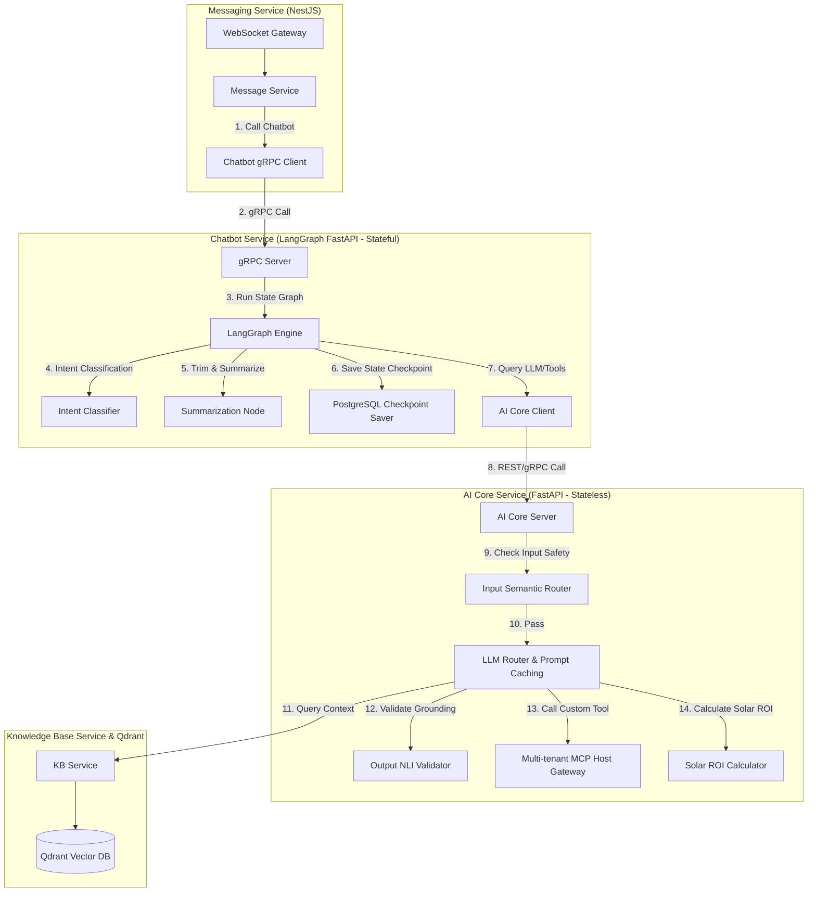

# TÀI LIỆU ĐẶC TẢ YÊU CẦU PHẦN MỀM (SRS)
## DỰ ÁN: NỀN TẢNG MARKETING ĐA KÊNH TÍCH HỢP AI (AI-POWERED MULTI-CHANNEL MARKETING PLATFORM)

---

## 1. GIỚI THIỆU CHUNG (INTRODUCTION)

### 1.1. Mục tiêu dự án
Nền tảng Marketing đa kênh (Facebook, Zalo, TikTok) tích hợp AI tự động hóa là một giải pháp SaaS (Software-as-a-Service) xây dựng trên kiến trúc Microservices. Dự án nhằm hỗ trợ các doanh nghiệp (Tenants) quản lý hộp thư tập trung, tự động hóa tương tác bằng Chatbot AI (sử dụng RAG + LangGraph), lập lịch và tối ưu hóa nội dung đăng tải bằng AI, phân tích hiệu quả chiến dịch và quản lý quan hệ khách hàng (CRM) trên một giao diện Dashboard duy nhất.

### 1.2. Phạm vi hệ thống
Hệ thống bao gồm **18 nghiệp vụ/microservices** và **6 thành phần hạ tầng cốt lõi** được thiết kế để vận hành độc lập, giao tiếp thông qua cơ chế hướng sự kiện (Event-Driven Architecture với Kafka) kết hợp các cuộc gọi đồng bộ hiệu năng cao (gRPC và REST API). Hệ thống hỗ trợ mô hình Multi-tenant cô lập dữ liệu tuyệt đối ở mọi tầng.

### 1.3. Thuật ngữ & Định nghĩa (Glossary)
*   **Tenant:** Một doanh nghiệp hoặc tổ chức đăng ký sử dụng dịch vụ của nền tảng.
*   **Human Agent:** Nhân viên tư vấn/chăm sóc khách hàng thuộc Tenant.
*   **Handoff:** Quy trình chuyển giao quyền kiểm soát cuộc hội thoại tự động từ Chatbot sang cho Human Agent xử lý khi bot không đủ độ tin cậy hoặc nhận diện khách hàng đang giận dữ.
*   **Escalate (Leo thang):** Đẩy một tác vụ, bình luận tiêu cực hoặc sự kiện cần xử lý từ hệ thống tự động lên hàng đợi duyệt của con người.
*   **Confidence Score (Điểm tin cậy):** Thang điểm từ 0.0 đến 1.0 đo lường độ tin cậy của câu trả lời do AI sinh ra hoặc các quyết định phân loại intent/comment.
*   **RAG (Retrieval-Augmented Generation):** Kỹ thuật truy xuất thông tin từ cơ sở tri thức cục bộ để cung cấp ngữ nghĩa bổ sung cho LLM sinh câu trả lời chính xác.
*   **MCP (Model Context Protocol):** Giao thức chuẩn hóa để LLM gọi các API/tools bên ngoài một cách có cấu trúc.
*   **Semantic Router:** Bộ định tuyến ngữ nghĩa — mô hình phân loại văn bản siêu nhẹ dùng làm rào chắn đầu vào để lọc câu hỏi lạc đề, đối thủ hoặc jailbreak.
*   **NLI (Natural Language Inference):** Suy luận ngôn ngữ tự nhiên — mô hình so khớp tiền đề (RAG context) và giả thuyết (câu trả lời LLM) để phân loại mức độ chứng thực (grounding), chống ảo giác.
*   **Prompt Caching:** Bộ đệm câu lệnh — kỹ thuật của LLM cho phép bỏ qua việc tính toán các token tĩnh (system prompt, schemas, docs) ở đầu prompt.
*   **Sliding Window Memory:** Bộ nhớ cửa sổ trượt — kỹ thuật quản lý lịch sử chat bằng cách duy trì tin nhắn gần nhất kết hợp tóm tắt tự động tin nhắn cũ.

---

## 2. KIẾN TRÚC HỆ THỐNG & TECH STACK (SYSTEM ARCHITECTURE)

### 2.1. Sơ đồ kiến trúc tổng thể

```mermaid
graph TB
    subgraph "Client Layer"
        Dashboard["Dashboard (Next.js 14 + TS)"]
    end

    subgraph "Gateway & Auth Layer"
        Kong["Kong API Gateway (Port 8000)"]
        Keycloak["Keycloak Auth (Port 8080)"]
    end

    subgraph "Node.js Core Services (NestJS / Fastify)"
        CC["Channel Connector (Port 3001)"]
        MSG["Messaging (Port 3002)"]
        CRM["CRM Service (Port 3003)"]
        NOTIF["Notification Service (Port 3004)"]
        COMMENT["Comment Manager (Port 3005)"]
        CONF["Tenant Config (Port 3006)"]
        DMS["DMS Service (Port 3007)"]
        SHORT["Link Shortener (Port 3009)"]
    end

    subgraph "Python AI & Helper Services (FastAPI)"
        CB["Chatbot LangGraph (Port 8001 / gRPC 50051)"]
        CONTENT["Content Service (Port 8002)"]
        KB["Knowledge Base (Port 8004)"]
        AI["AI Core Service (Port 8005 / gRPC 50052)"]
        MED["Media Processor (Port 8008)"]
    end

    subgraph "Java Reliability Services (Spring Boot)"
        SCHED["Scheduler Quartz (Port 8003)"]
        ANALYTICS["Analytics TimescaleDB (Port 8006)"]
        CAMPAIGN["Campaign Service (Port 8007)"]
    end

    subgraph "Infrastructure Layer"
        Kafka["Apache Kafka (Message Broker)"]
        Redis["Redis 7 (Caching, Pub/Sub & Sessions)"]
        PG["PostgreSQL (Per-service DB)"]
        Qdrant["Qdrant (Vector DB)"]
        MinIO["MinIO (S3 Object Storage)"]
    end

    subgraph "External Integration"
        FB["Facebook API"]
        ZALO["Zalo OA API"]
        TIKTOK["TikTok API"]
        LLM["LLM Providers (OpenAI/Anthropic)"]
    end

    Dashboard -->|HTTPS/WSS| Kong
    Kong -->|OIDC Plugin| Keycloak
    Kong --> CC & MSG & CRM & NOTIF & COMMENT & CONTENT & SCHED & ANALYTICS & CAMPAIGN & CONF & DMS & SHORT
    
    MSG -->|gRPC| CB
    CB -->|gRPC| AI
    CB & CONTENT -->|REST| KB
    AI -->|HTTPS| LLM
    CC -->|HTTPS| FB & ZALO & TIKTOK

    CC & DMS & SHORT & MED -->|Publish Event| Kafka
    MSG & CRM & ANALYTICS & NOTIF & COMMENT & CONF & DMS & SHORT & MED -->|Consume/Publish| Kafka
    SCHED & CONTENT & CAMPAIGN -->|Publish Event| Kafka

    AllServices[All Services] -->|REST/gRPC| PG
    KB -->|REST| Qdrant
    AllServices -->|TCP| Redis
    CONTENT & KB & DMS & MED -->|S3 API| MinIO
    
    CONF -->|Cache & Pub/Sub| Redis
    CB & MSG & CONTENT & CC & COMMENT & CRM & DMS & SHORT -->|Read Config Cache| Redis
```



### 2.2. Danh mục dịch vụ và phân bổ công nghệ

| # | Service | Language | Framework | Port | Database | Nhiệm vụ chính |
|---|---------|----------|-----------|------|----------|----------------|
| 1 | **Gateway** | - | Kong 3.7 | 8000/8001 | DB-less (kong.yml) | Định tuyến API, giới hạn tần suất, SSL termination, tích hợp xác thực JWT. |
| 2 | **Auth** | Java | Keycloak 24+ | 8080 | keycloak_db (Postgres) | Xác thực OIDC, quản lý Realm đa tenant, phân quyền RBAC. |
| 3 | **Channel Connector** | Node.js | NestJS | 3001 | channel_connector_db | Đăng ký webhook các kênh, normalize message, refresh token mạng xã hội. |
| 4 | **Messaging** | Node.js | NestJS | 3002 | messaging_db | Quản lý Unified Inbox, luồng hội thoại Bot/Human, WebSocket realtime. |
| 5 | **Chatbot** | Python | FastAPI + LangGraph | 8001/50051 | chatbot_db | Quản lý state đồ thị LangGraph (State/Memory), điều phối hội thoại, tự động tóm tắt tin nhắn, tạm dừng breakpoint duyệt bởi Agent. |
| 6 | **Content** | Python | FastAPI | 8002 | content_db | Tạo bài viết AI theo brand voice, platform adaptation, quy trình phê duyệt. |
| 7 | **Scheduler** | Java | Spring Boot 3 + Quartz | 8003 | scheduler_db | Đặt lịch đăng bài múi giờ động, quản lý lịch trực quan, xử lý hàng đợi automation. |
| 8 | **Knowledge Base** | Python | FastAPI | 8004 | knowledge_db | RAG pipeline, semantic chunking, embedding, hybrid search, rerank. |
| 9 | **AI Core** | Python | FastAPI | 8005/50052 | ai_core_db | LLM Gateway & Prompt Caching, rào chắn an toàn kép (Input Semantic Router & Output NLI), Cổng MCP Host Gateway đa tenant. |
| 10| **Analytics** | Java | Spring Boot 3 | 8006 | analytics_db (TimescaleDB) | Thu thập metrics, báo cáo hiệu suất, tính toán ROI và hành vi khách hàng. |
| 11| **CRM** | Node.js | NestJS | 3003 | crm_db | Quản lý contact đa kênh, phân loại lead score, gom nhóm khách hàng tự động. |
| 12| **Campaign** | Java | Spring Boot 3 | 8007 | campaign_db | Lên chiến dịch gửi tin nhắn hàng loạt, A/B testing hiệu quả content. |
| 13| **Notification** | Node.js | NestJS | 3004 | notification_db | Dispatch thông báo hệ thống qua email, push browser, SMS khi có handoff/error. |
| 14| **Comment Manager**| Node.js | NestJS | 3005 | comment_db | Lắng nghe comment, ẩn/xóa bình luận spam qua AI, tự động reply thắc mắc. |
| 15| **Tenant Config** | Node.js | NestJS | 3006 | config_db | Quản lý tập trung toàn bộ cấu hình hệ thống, đồng bộ hot reload qua Redis. |
| 16| **DMS**           | Node.js | NestJS | 3007 | dms_db | Quản lý tệp tin, thư mục ảo, kiểm soát phiên bản và quota lưu trữ của tenant. |
| 17| **Link Shortener** | Node.js | Fastify | 3009 | shortener_db | Rút gọn URL, theo dõi và ghi nhận lượt click của khách hàng phục vụ A/B Testing. |
| 18| **Media Processor**| Python  | FastAPI | 8008 | - | Chạy Celery worker nén ảnh, tạo thumbnail và transcode video chuẩn API mạng xã hội. |

### 2.3. Chiến lược Multi-tenancy & Cô lập dữ liệu (Data Isolation)
*   **Identity & Access:** Tận dụng tính năng Multi-realm của Keycloak để cung cấp mỗi Tenant một không gian định danh cô lập hoàn toàn. Token phát hành chứa `tenant_id` claim.
*   **Database Isolation:** Áp dụng mô hình **Shared Database, Shared Schema** nhưng bắt buộc áp dụng **PostgreSQL Row-Level Security (RLS)** trên cột `tenant_id` đối với tất cả các bảng. Mọi câu lệnh SQL từ backend bắt buộc phải filter theo `tenant_id` hiện tại lấy từ JWT.
*   **Event-Driven Routing:** Message payload truyền qua Kafka bắt buộc chứa trường `tenant_id` trong Kafka Headers để các consumer thực hiện xử lý tách biệt.
*   **Vector Database:** Qdrant cấu hình metadata filter `tenant_id` trên mọi Collection để ngăn chặn việc chatbot đọc chéo dữ liệu tri thức của Tenant khác.
*   **Object Storage (MinIO/S3):** Tổ chức lưu trữ tệp theo tiền tố đường dẫn (Path Prefix): `{tenant_id}/uploads/...` và truy cập thông qua Presigned URLs ngắn hạn (TTL 15 phút).
*   **In-Memory Cache (Redis):** Mọi Cache Key bắt buộc cấu trúc theo dạng: `{tenant_id}:{service_name}:{key}`.

### 2.4. Sơ đồ các thành phần trong Service (Component Diagram)

Dưới đây mô tả chi tiết sơ đồ thành phần cấu trúc nội bộ và luồng gọi dịch vụ giữa `Messaging Service`, `Chatbot Service` và `AI Core Service` tích hợp các lớp tối ưu hóa:




### 2.5. Cơ chế đồng bộ cấu hình (Configuration Sync Flow)
Để đảm bảo hiệu năng tối ưu trên hot-path gọi mô hình AI và tính tự trị (autonomy) của từng microservice, việc thay đổi cấu hình định tuyến (routing), các API keys và feature gates được đồng bộ qua cơ chế **Publish-Subscribe** bằng Redis Pub/Sub:

1. **Quản trị tập trung (Centralized Management)**: Admin thay đổi cấu hình model routing hoặc cập nhật API Keys (được mã hóa đối xứng AES-256) trên Dashboard, gửi yêu cầu tới `Tenant Config Service` (NestJS) và lưu vào `config_db`.
2. **Kích hoạt sự kiện (Event Trigger)**: `Tenant Config Service` ghi nhận thay đổi, cập nhật Redis cache key `{tenant_id}:config:ai_kb` và đồng thời publish một thông điệp cập nhật lên kênh Redis Pub/Sub `config.updates`.
3. **Nhận thông điệp (Event Consumption)**: `AI Core Service` (FastAPI) đang chạy một tiến trình con (Background Listener) lắng nghe kênh `config.updates`.
4. **Đồng bộ và Invalidate Cache**:
   - Khi phát hiện sự kiện thuộc category `ai_kb`, `AI Core Service` gọi gRPC `GetConfig` (hoặc REST fallback) sang `Tenant Config Service` để truy vấn cấu hình mới nhất.
   - `AI Core Service` lưu cấu hình này vào cơ sở dữ liệu cục bộ `ai_core_db` (các bảng `llm_route_configs` và `api_key_configs`) để làm backup dự phòng khi xảy ra sự cố network.
   - `AI Core Service` làm trống (invalidate) các cache keys cũ trong Redis gồm `{tenant_id}:config:llm_model_routing` và `{tenant_id}:config:api_keys` để buộc các yêu cầu gọi AI tiếp theo phải nạp lại dữ liệu cấu hình mới nhất.

---


## 3. YÊU CẦU CHỨC NĂNG CHI TIẾT (FUNCTIONAL REQUIREMENTS)

### 3.1. Phân hệ Identity & API Gateway

#### Gateway (Kong API Gateway)
1.  **Định tuyến API:** Tự động chuyển hướng requests từ client dựa trên URL prefix (ví dụ: `/api/v1/channels` -> `Channel Connector`).
2.  **Tích hợp OIDC:** Xác thực tự động các Request mang Authorization Header (Bearer JWT) thông qua kết nối với Keycloak. Trả về `401 Unauthorized` nếu token không hợp lệ hoặc hết hạn.
3.  **Request Transformation:** Trích xuất các claims từ JWT đã được xác minh (gồm `tenant_id`, `sub` làm `user_id`, `roles`) để inject thành các Header nội bộ: `X-Tenant-ID`, `X-User-ID`, `X-User-Roles` trước khi forward tới downstream microservices.
4.  **Rate Limiting:** Giới hạn tần suất gọi API ở tầng Gateway dựa trên giá trị của Header `X-Tenant-ID` và Redis lưu trữ trạng thái.

#### Auth Service (Keycloak)
1.  **Cấp phát Token:** Hỗ trợ luồng OAuth2 Authorization Code Flow đối với Dashboard và Client Credentials Flow đối với service-to-service.
2.  **Role-Based Access Control (RBAC):** Định nghĩa và phân phát các Roles sau trong JWT claims:
    *   `Admin`: Toàn quyền cấu hình Tenant, quản lý tích hợp, phân quyền user.
    *   `Manager`: Quản lý chiến dịch, phê duyệt nội dung AI, cấu hình chatbot, xem báo cáo.
    *   `Agent`: Truy cập hộp thư hợp nhất, tương tác chat, xử lý danh bạ khách hàng.
    *   `Viewer`: Chỉ xem báo cáo analytics và lịch đăng bài, không có quyền tương tác hay cấu hình.
3.  **Tenant Realm Management:** API cho phép tự động khởi tạo Realm mới độc lập cùng cấu hình bảo mật mặc định khi một Tenant mới onboard trên hệ thống.

### 3.2. Phân hệ Tương tác Khách hàng & Kênh

#### Channel Connector Service
1.  **Webhook Receiver:** Cung cấp endpoint nhận webhook từ Facebook Page API, Zalo OA API và TikTok Shop API. Verify signature từ các nền tảng để chống giả mạo.
2.  **Idempotency (Tránh trùng lặp):** Sử dụng Redis để kiểm tra ID tin nhắn ngoại vi. Nếu ID đã được xử lý trong vòng 24 giờ qua, bỏ qua sự kiện để tránh spam.
3.  **Message Normalization:** Chuẩn hóa mọi tin nhắn nhận được (văn bản, ảnh, video, tệp tin, sticker) thành một format JSON duy nhất gửi lên Kafka topic `channel.message.received`.
4.  **Outbound Message Delivery:** Lắng nghe yêu cầu gửi tin từ hệ thống, chuyển đổi từ unified format sang format của từng nền tảng xã hội và gọi API bên ngoài. Tự động retry tối đa 3 lần nếu API lỗi.
5.  **Quản lý Token Kênh:** Lưu trữ mã OAuth Access Token/Refresh Token của các Page/OA dưới dạng mã hóa (AES-256) ở rest. Tự động chạy tác vụ ngầm quét và làm mới token trước khi hết hạn 1 ngày.

#### Messaging Service (Hộp thư hợp nhất)
1.  **Hộp thư hợp nhất (Unified Inbox):** Gom toàn bộ các cuộc hội thoại từ tất cả các kênh tích hợp của Tenant vào một màn hình duy nhất. Hỗ trợ phân trang, lọc theo kênh, trạng thái hội thoại và Agent phụ trách.
2.  **Message Routing Logic:**
    *   Nếu cuộc hội thoại ở chế độ `auto` (Bot trả lời): Chuyển tin nhắn của khách hàng tới Chatbot Service qua gRPC.
    *   Nếu cuộc hội thoại ở chế độ `manual` (Người trả lời): Đẩy tin nhắn realtime lên Dashboard của Agent được gán qua WebSocket.
3.  **Handoff Execution:** Khi nhận được tín hiệu `HANDOFF` từ Chatbot, lập tức chuyển trạng thái hội thoại từ `auto` sang `manual`, gán cho Agent phù hợp hoặc đưa vào hàng đợi chờ xử lý, đồng thời gửi thông báo tới Notification Service.
4.  **Typing Indicator:** Chuyển tiếp trạng thái đang soạn tin (typing) của khách hàng và Agent lên Dashboard/Kênh xã hội theo thời gian thực.
5.  **Auto-Close Conversation:** Tự động chuyển trạng thái cuộc hội thoại sang `closed` nếu không có tương tác mới từ cả hai phía sau 24 giờ.
6.  **Gắn tag nguồn tin nhắn (Message Tagging):** Mọi tin nhắn lưu trữ trong DB và gửi lên Dashboard bắt buộc chứa thuộc tính `channel_source` (ví dụ: `facebook`, `zalo`). Giao diện Agent sẽ hiển thị tag nguồn tương ứng (ví dụ: `[Facebook]`) để Agent biết và phản hồi đúng kênh của khách.

#### Comment Manager Service
1.  **Quản lý bình luận:** Lắng nghe webhook bình luận trên bài viết của Facebook/TikTok qua Kafka topic `channel.comment.received`.
2.  **Spam & Negative Detection:** Gửi nội dung bình luận sang AI Core để kiểm tra mức độ tiêu cực hoặc spam.
    *   Nếu điểm spam >= 0.85 (Very High): Tự động gọi API ẩn hoặc xóa bình luận (destructive action).
    *   Nếu điểm tiêu cực (negative sentiment) >= 0.60: Đẩy sự kiện leo thang (`comment.escalation`) qua Kafka để Notification thông báo cho Agent vào xử lý khủng hoảng.
3.  **Auto-reply Bình luận:** Với các bình luận mang tính hỏi đáp (FAQ) có điểm tin cậy AI >= 0.70, tự động soạn nội dung phản hồi và đăng tải.

### 3.3. Phân hệ Chatbot AI & Tri thức

#### Chatbot Service (LangGraph)
1.  **Phân loại ý định (Intent Classification):** Phân loại mục đích tin nhắn khách hàng (hỏi đáp FAQ, mua hàng, khiếu nại, chào hỏi) trong vòng < 500ms.
2.  **RAG Retrieval Coordination:** Gọi Knowledge Base Service tìm tài liệu liên quan đến câu hỏi. Nếu điểm RAG Relevance Score < 0.5, thực hiện handoff ngay lập tức.
3.  **Sinh câu trả lời:** Gọi AI Core tạo câu trả lời tự nhiên theo đúng ngôn ngữ khách hàng đang chat, nén lịch sử chat cũ gửi kèm để duy trì ngữ cảnh.
4.  **Quản lý trạng thái LangGraph:** Lưu trữ trạng thái phiên chat (Graph State Checkpoint) vào PostgreSQL để đảm bảo tính nhất quán của luồng logic chatbot khi chạy đa luồng.
5.  **Xử lý ảnh hóa đơn bằng AI Vision:**
    *   Nếu cấu hình `ai_vision_invoice_reading = true`: Khi nhận được tin nhắn dạng ảnh từ khách, Chatbot gọi AI Core sử dụng Vision model để OCR trích xuất chỉ số điện (kWh) và số tiền, cập nhật thông tin này vào CRM của contact.
    *   Nếu cấu hình `ai_vision_invoice_reading = false`: Lập tức bỏ qua việc phân tích và kích hoạt sự kiện Handoff cho Agent xử lý thủ công.
6.  **Input Guardrail (Semantic Router):** Sử dụng bộ định tuyến ngữ nghĩa để phân tích tin nhắn của khách hàng. Nếu phát hiện tin nhắn thuộc danh mục cấm (đối thủ cạnh tranh, jailbreak), chặn ngay lập tức và trả về tin nhắn từ chối định nghĩa sẵn.
7.  **Output Guardrail (NLI Grounding Validator):** Đối với câu trả lời từ RAG, hệ thống kiểm tra tính xác thực (Grounding) thông qua mô hình NLI. Nếu phát hiện mâu thuẫn hoặc không có cơ sở trong tài liệu context (Grounding Score < 0.80), chặn câu trả lời và tự động sinh lại hoặc handoff sang Agent.
8.  **Tự động tóm tắt tin nhắn (Summarization Node):** Khi hội thoại vượt quá 10 tin nhắn hoặc 4000 tokens, tự động gọi LLM tóm tắt nội dung cũ và lưu vào trường `summary`, sau đó trim (cắt bỏ) tin nhắn cũ để duy trì cửa sổ trượt bộ nhớ tinh gọn.
9.  **Tạm dừng duyệt hành động (Breakpoints):** Tự động tạm dừng đồ thị LangGraph trước khi gọi các công cụ nhạy cảm nằm trong cấu hình `required_approvals` của tenant, đẩy sự kiện chờ duyệt lên Dashboard của nhân viên.

#### Knowledge Base Service (RAG Pipeline)
1.  **Tải lên tài liệu:** Hỗ trợ định dạng PDF, DOCX, TXT, Markdown. Tệp tin gốc lưu vào MinIO.
2.  **Semantic Chunking:** Chia nhỏ văn bản dựa trên logic câu (không cắt ngang câu), kích thước 256-512 tokens, gối đầu (overlap) 10-20%.
3.  **Vector Storage:** Embed các chunks bằng mô hình `text-embedding-3-small` (512 dimensions) và lưu vào Qdrant DB. Sử dụng kỹ thuật int8 quantization để tối ưu RAM.
4.  **Hybrid Search & Reranking:**
    *   Tìm kiếm song song: Dense Search (Qdrant Vector) + Sparse Search (BM25 trên PostgreSQL).
    *   Kết hợp kết quả bằng thuật toán Reciprocal Rank Fusion (RRF).
    *   Sắp xếp lại (Reranking) top-20 kết quả thông qua mô hình `bge-reranker-v2-m3` để chọn ra top-5 kết quả tốt nhất gửi lại Chatbot.

#### AI Core Service (Cổng kết nối AI)
1.  **Unified AI Gateway:** Cung cấp API chung gọi các LLM của OpenAI (GPT-4o, GPT-4o-mini), Anthropic (Claude 3.5 Sonnet), và local LLM engines (Ollama/vLLM như Qwen 3.7, Gemma 3) qua REST hoặc gRPC (hỗ trợ streaming).
2.  **Dynamic Model Routing (MỚI):** Tự động điều hướng model theo cấu hình động lưu trữ trong bảng cơ sở dữ liệu `llm_route_configs` per-tenant và use case. Admin có thể thay đổi cấu hình định tuyến trực tiếp từ Dashboard mà không cần deploy lại code.
3.  **Failover:** Tự động chuyển đổi sang provider dự phòng nếu provider chính gặp lỗi hoặc timeout > 10 giây dựa trên cấu hình dự phòng trong database.
4.  **Dynamic API Key Management (MỚI):** Quản lý và bảo mật các API Keys cùng Custom API Base URLs (cho vLLM/Ollama local) trong bảng `api_key_configs`, sử dụng thuật toán mã hóa đối xứng AES-256 để bảo vệ thông tin xác thực của các LLM providers.
5.  **Cost Analytics & Cost Simulator (MỚI):** 
    *   Tự động ghi nhận chi tiết số token và chi phí thực tế của mọi request vào bảng `llm_usage_logs`.
    *   Cung cấp API báo cáo tổng hợp chi tiêu (`GET /api/v1/analytics/usage-summary`) gom nhóm theo tenant, use case và model.
    *   Cung cấp bộ mô phỏng tài chính (`POST /api/v1/analytics/simulate-cost`) hỗ trợ Admin dự tính số tiền tiết kiệm và độ trễ thay đổi khi đổi cấu hình định tuyến (ví dụ: chuyển từ Cloud sang Local LLM) dựa trên lịch sử 30 ngày.
6.  **Multi-tenant MCP Host Gateway:** Đăng ký và quản lý kết nối MCP Server động theo Tenant ID trong `config_db` (dùng giao thức SSE và bảo vệ bằng mTLS/OAuth 2.1). Phân giải và khởi chạy phiên kết nối MCP Client Session độc lập khi có yêu cầu gọi công cụ của Tenant đó.
7.  **Roots Security Boundary:** Tự động truyền giới hạn thư mục ranh giới `Roots` dựa trên Tenant ID khi kết nối MCP Server để đảm bảo an toàn tập tin hệ thống.
8.  **Prompt Caching & Token Optimization:** Cấu hình AI Core tối ưu hóa prompt bằng cách đặt system prompt, schemas công cụ và context tĩnh lên đầu prompt; tự động chốt cache breakpoints cho các LLM hỗ trợ (Claude 3.5/3.7) để tăng tốc độ phản hồi và tiết kiệm 90% chi phí input token, sử dụng Redis cache (TTL 5 phút) cho cấu hình định tuyến động.
### 3.4. Phân hệ Lập lịch & Tạo nội dung

#### Content Service
1.  **Sinh nội dung AI:** Trích xuất thông tin sản phẩm và brand voice từ Knowledge Base để sinh bài viết marketing cá nhân hóa cho từng Tenant.
2.  **Platform Adaptation:** Tự động biến đổi bài viết phù hợp với từng nền tảng (Facebook: viết dài, nhiều emoji và hashtag; TikTok: ngắn gọn kèm trend; Zalo: văn phong trang trọng).
3.  **Kiểm tra chất lượng (Quality Check):** Chạy bộ lọc kiểm tra ngữ pháp, chính tả, sự nhất quán thương hiệu và các từ cấm của từng nền tảng. Chất lượng < 0.7 yêu cầu chỉnh sửa lại.
4.  **Quy trình phê duyệt (Approval Workflow):** Chuyển bài viết vào hàng đợi duyệt của Manager. Ghi nhận lịch sử chỉnh sửa (Content Versioning) và hỗ trợ rollback phiên bản.

#### Scheduler Service
1.  **Đặt lịch đăng bài:** Hỗ trợ đặt lịch đăng cho một hoặc nhiều kênh mạng xã hội, hỗ trợ chọn múi giờ (timezone-aware) tương ứng với từng chi nhánh Tenant.
2.  **Trực quan hóa Lịch (Calendar View):** Cung cấp API hiển thị lịch đăng bài theo tuần/tháng. Hỗ trợ thao tác kéo thả (drag-and-drop) để thay đổi thời gian đăng.
3.  **Quartz Integration:** Quản lý hàng triệu lịch đăng bài chính xác từng giây bằng Quartz Scheduler. Khi đến hạn, publish sự kiện đăng bài lên Kafka topic `scheduler.post.due`.
4.  **Logic phân luồng đăng tải:**
    *   Đối với Facebook và TikTok: Publish bài viết lên Feed của trang.
    *   Đối với Zalo OA: Do giới hạn kỹ thuật của Zalo OA API (không hỗ trợ đăng bài tự động lên bảng tin), Scheduler sẽ chuyển đổi article payload thành **Broadcast Message** gửi trực tiếp đến những người dùng đang theo dõi OA.
5.  **Retry logic:** Nếu việc đăng tải qua Channel Connector thất bại, Quartz lập tức lên lịch retry tối đa 3 lần bằng cơ chế exponential backoff.

### 3.5. Phân hệ CRM & Chiến dịch & Phân tích

#### CRM Service
1.  **Danh bạ khách hàng đa kênh:** Tự động tạo hồ sơ khách hàng khi có hội thoại mới phát sinh. Lưu thông tin tên, avatar, kênh liên hệ, email, số điện thoại.
2.  **Cơ chế Gộp hồ sơ tự động (Safe Contact Merging):**
    *   Khi có cập nhật SĐT cho một Contact (do chatbot trích xuất từ tin nhắn hoặc do Agent nhập thủ công), CRM Service sẽ tìm kiếm các Contact khác có trùng SĐT.
    *   **Auto-Merge Rules:** Nếu trùng khớp SĐT + Trùng khớp Họ tên (không phân biệt dấu) HOẶC trùng SĐT + Email -> Tự động chạy transaction gộp các thực thể trong database, chuyển đổi tất cả conversation history liên quan sang Contact chính mới.
    *   **Manual-Merge Alert:** Nếu trùng SĐT nhưng Họ tên khác biệt, CRM Service không tự động gộp mà tạo một bản ghi `MergeSuggestion` gửi lên Dashboard của Agent để xác nhận thủ công.
3.  **Phân nhóm khách hàng (Segmentation):** Hỗ trợ tạo tập khách hàng dựa trên bộ lọc động (ví dụ: khách từ kênh Facebook có tương tác trong 7 ngày qua).
4.  **Lead Scoring tự động:** Tự động tính điểm tiềm năng khách hàng dựa trên các tương tác (cung cấp SĐT, hỏi giá, sentiment tiêu cực) với trọng số động cấu hình từ Tenant Config. Tự động gắn tag và gửi cảnh báo khẩn cấp (Push Notification + âm thanh) khi điểm vượt ngưỡng Hot Lead.
5.  **Quản lý Deal Pipeline dạng Kanban (Solar):** Cung cấp giao diện Kanban Board để Sales Agent theo dõi và thay đổi trạng thái của các cơ hội bán hàng (Deal) qua 6 giai đoạn: `Lead` (Tiếp cận) -> `Consult` (Tư vấn) -> `Survey` (Khảo sát) -> `Proposal` (Đề xuất) -> `Negotiation` (Thương thảo) -> `Contract Signed` (Đã ký). Tự động chuyển giai đoạn Deal từ `Survey` sang `Proposal` ngay khi lưu biên bản khảo sát.
6.  **Lập lịch khảo sát và Ghi nhận dữ liệu thực địa (Solar):** Cho đặt lịch khảo sát mái nhà thực địa (Site Survey) cho Deal ở trạng thái `Survey`, phân công Kỹ thuật viên hiện trường và cho phép Kỹ thuật viên upload ảnh chụp hiện trường cùng các thông số thực tế (diện tích, độ dốc, loại kết cấu, hướng mái) lên MinIO.
7.  **Tự động tính toán công suất và ROI Solar (Solar):** Tự động tính toán phương án lắp đặt tối ưu dựa trên dữ liệu hóa đơn tiền điện và diện tích mái: công suất tối ưu (kWp), số lượng tấm pin, sản lượng điện hàng tháng dự kiến (kWh), số tiền tiết kiệm và thời gian hoàn vốn đầu tư (ROI). Cho phép kết nối API bên thứ ba (HelioScope/OpenSolar) qua AI Core.
8.  **Tự động biên soạn và xuất Solar Proposal PDF (Solar):** Biên dịch kết quả tính toán tài chính và hình ảnh khảo sát mái thực tế thành một file Proposal đề xuất đầu tư dạng PDF, lưu vào DMS dưới dạng tệp `Private` và tạo liên kết tải tạm thời (Presigned URL) có TTL 15 phút.
9.  **Tiếp nhận báo lỗi và Điều phối Ticket O&M (Solar):** Tạo vé hỗ trợ vận hành bảo trì (O&M Ticket) khi khách hàng báo lỗi qua chat hoặc hotline, thiết lập độ ưu tiên (Low, Medium, High, Critical) và phân công Kỹ thuật viên bảo dưỡng xử lý hiện trường. Khi Ticket được chuyển sang trạng thái đóng (Closed), hệ thống tự động gửi tin nhắn cảm ơn kèm khảo sát đánh giá dịch vụ (CSAT survey) qua Zalo OA hoặc kênh MXH nguồn gốc.

#### Campaign Service
1.  **Chiến dịch phát sóng (Broadcasting):** Cho phép thiết lập chiến dịch gửi tin nhắn hàng loạt đến một Segment khách hàng cụ thể theo lịch trình hoặc sự kiện kích hoạt.
2.  **A/B Testing:** Hỗ trợ gửi thử nghiệm 2 phiên bản nội dung (Content A và Content B) cho 2 nhóm mẫu khách hàng nhỏ để phân tích tỷ lệ click/phản hồi trước khi gửi hàng loạt.

#### Analytics Service
1.  **TimescaleDB Engine:** Lưu trữ dữ liệu chuỗi thời gian (time-series) cho tất cả các tương tác: lượt chat, lượt bình luận, số bài đăng thành công, chi phí token sử dụng, số ca handoff.
2.  **Dashboard Analytics:** Tạo các báo cáo thống kê trực quan về hiệu suất phản hồi của Agent, hiệu quả chuyển đổi của Chatbot, ROI chiến dịch marketing và tương tác trên mạng xã hội.

### 3.6. Phân hệ Bổ trợ & Giám sát

#### Notification Service
1.  **Thông báo đa kênh:** Hỗ trợ phân phối thông báo đến Agent/Admin qua 3 hình thức: Web Push Notification trên Dashboard, Email hệ thống, và SMS/Zalo Message khi có sự cố nghiêm trọng (ví dụ: kênh kết nối bị mất token, lỗi thanh toán).
2.  **Handoff Alert:** Gửi cảnh báo tức thời kèm link trực tiếp đến hội thoại cho Agent khi chatbot kích hoạt chế độ handoff khẩn cấp.

#### Observability Service
1.  **Thu thập Metrics:** Tích hợp Prometheus exporter tại tất cả 15 services để theo dõi tình trạng CPU, RAM, Network và số lượng request.
2.  **Distributed Tracing:** Sử dụng Jaeger (OpenTelemetry) để truyền trace_id qua các cuộc gọi REST/gRPC và Kafka headers, giúp giám sát trễ mạng và tìm điểm nghẽn (bottleneck).
3.  **Tập trung hóa Logs:** Sử dụng Loki để thu thập logs có cấu trúc (JSON format) từ tất cả container, hiển thị tập trung trên Grafana Dashboard.

### 3.7. Phân hệ Cấu hình tập trung (Tenant Config Service)
1.  **Centralized Configurations (REST API):** Cung cấp các REST endpoints để Dashboard thực hiện CRUD cấu hình cho từng Tenant.
2.  **Hot Reload qua Redis Pub/Sub:** Khi cấu hình thay đổi, lưu vào DB đồng thời ghi nhận vào Redis Cache với key `{tenant_id}:config:{category}` và publish một sự kiện tới Redis channel `config.updates`.
3.  **gRPC Config Reader:** Cung cấp dịch vụ gRPC cho các services nội bộ để truy vấn nhanh cấu hình trong trường hợp cache miss (chưa được nạp vào Redis).
4.  **Cấu trúc dữ liệu cấu hình Schema (Config Schema):**
    ```json
    {
      "ai_kb": {
        "chatbot_enabled": "boolean",
        "chatbot_system_prompt_override": "string",
        "confidence_threshold": "number (0.60 - 0.95)",
        "auto_handoff_on_negative": "boolean",
        "ai_vision_invoice_reading": "boolean",
        "llm_model_routing": "object (JSON map)",
        "ai_fallback_models": "array (strings)",
        "kb_chunk_size": "integer (128 - 1024)",
        "kb_chunk_overlap_percentage": "number (5 - 30)",
        "rag_relevance_threshold": "number (0.0 - 1.0)"
      },
      "chat_routing": {
        "working_hours": "object",
        "offline_mode_behavior": "string (lead_capture|ai_warning|offline_msg)",
        "handoff_routing_algorithm": "string (round_robin|least_busy|queue_claim|hybrid)",
        "manual_to_auto_trigger": "string (agent_close|timeout|both)",
        "manual_to_auto_timeout_hours": "number",
        "auto_close_timeout_hours": "number",
        "typing_indicator_enabled": "boolean",
        "agent_notification_sound": "boolean"
      },
      "content_scheduler": {
        "require_content_approval": "boolean",
        "auto_approve_quality_threshold": "number",
        "max_post_retry_attempts": "integer",
        "max_daily_posts_per_channel": "integer",
        "default_hashtags_per_channel": "object",
        "platform_tones": "object"
      },
      "crm_campaign": {
        "lead_scoring_rules": "object (JSON dynamic weights)",
        "hot_lead_threshold": "number",
        "contact_auto_merge_threshold": "number",
        "campaign_sending_rate": "integer (messages/min)",
        "campaign_fb_outside_24h_action": "string (skip|use_tag|paid)"
      },
      "security_comments_notif": {
        "data_masking_enabled": "boolean",
        "session_timeout_minutes": "integer",
        "audit_log_retention_days": "integer",
        "comment_auto_reply_scope": "string (all|selected)",
        "banned_keywords": "array (strings)",
        "handoff_alert_channels": "array (strings)"
      }
    }
    ```

### 3.8. Phân hệ Quản lý Tài liệu (DMS Service)
1.  **Tải lên tệp tin & Xác thực định dạng:** Cho phép tải lên tệp tin (PDF, DOCX, TXT, MD, hình ảnh, video) lên MinIO. Hệ thống **PHẢI** kiểm tra tính hợp lệ của định dạng và chặn tệp tin chứa mã độc.
2.  **Hạn mức lưu trữ (Quota Limit):** Kiểm tra dung lượng lưu trữ của Tenant trước khi tải lên. Nếu vượt quá giới hạn quota được cấp phát, hệ thống sẽ trả về thông báo lỗi và từ chối tải tệp.
3.  **Quản lý Thư mục ảo:** Cho phép Tenant Admin/Manager tạo lập cấu trúc thư mục ảo dạng cây để phân loại, quản lý tài liệu.
4.  **Cấu hình Quyền truy cập Hybrid:**
    *   `Public`: Link CDN/MinIO cố định, truy cập trực tiếp không cần token, phục vụ ảnh cho bài viết tiếp thị.
    *   `Private`: Bắt buộc xác thực JWT Token và sinh link có chữ ký thời gian ngắn (Presigned URL) để tải tệp.
5.  **Kiểm soát Phiên bản tệp (File Versioning):** Khi tải tệp trùng tên và path trong cùng thư mục ảo, hệ thống tự động lưu tệp cũ vào lịch sử phiên bản và tăng version lên `version + 1`. Tự động dọn dẹp các phiên bản cũ nhất nếu tổng số vượt quá giới hạn N cấu hình (mặc định N = 5).

### 3.9. Phân hệ Rút gọn liên kết (Link Shortener Service)
1.  **Rút gọn liên kết Campaign:** Campaign Service tự động gọi rút gọn liên kết cá nhân hóa thành dạng `https://mkt.co/t/{tracking_id}` khi bắt đầu gửi tin chiến dịch.
2.  **Chuyển hướng & Ghi nhận Click event:** Giải mã `tracking_id` từ Redis cache tốc độ cao (<50ms), publish sự kiện `campaign.link.clicked` sang Kafka phục vụ thống kê tỷ lệ click (CTR), và redirect trình duyệt bằng HTTP code `302 Found`.
3.  **Xử lý lỗi liên kết:** Trả về redirect trang lỗi 404 thân thiện hoặc trang chủ mặc định của Tenant nếu link hết hạn hoặc sai mã.

### 3.10. Phân hệ Xử lý đa phương tiện (Media Processor Service)
1.  **Nén dung lượng hình ảnh:** Tự động nén dung lượng hình ảnh gốc tải lên DMS để tối ưu hóa bộ nhớ MinIO nhưng vẫn giữ nguyên độ phân giải (chất lượng ảnh 80-85%).
2.  **Tạo ảnh thu nhỏ (Thumbnails):** Tự động sinh ảnh thu nhỏ (kích thước tối đa 200x200px) cho mọi hình ảnh, PDF, video tải lên để hiển thị nhanh trên Dashboard.
3.  **Chuyển mã video (Video Transcoding):** Chạy ngầm FFmpeg qua Celery Worker chuyển mã video về chuẩn `.mp4` (H.264 video codec + AAC audio codec) tương thích hoàn toàn với API Facebook/TikTok.

### 3.11. Phân hệ Dọn dẹp & Lưu trữ dữ liệu (Data Retention)
1.  **Lập lịch dọn dẹp (Quartz Archiver):** Quartz Job kích hoạt vào lúc 02:00 AM hàng ngày quét tin nhắn và logs cũ hơn 90 ngày, nén thành định dạng Apache Parquet theo từng Tenant.
2.  **Lưu trữ lạnh (Cold Storage):** Tải các tệp nén Parquet lên MinIO Cold Storage phục vụ việc tuân thủ lưu vết kiểm toán tối thiểu 1 năm.
3.  **Dọn dẹp DB hoạt động:** Sau khi kiểm tra SHA256 checksum tệp lưu trữ lạnh thành công, thực hiện câu lệnh xóa vĩnh viễn dữ liệu cũ khỏi database hoạt động chính và chạy `VACUUM ANALYZE` để giải phóng dung lượng đĩa.

### 3.12. Phân hệ Bảo mật & Tuân thủ pháp luật (Security & Compliance)
1.  **Thông báo điều khoản dữ liệu (Consent GDPR/Decree 13):** Khi khách hàng gửi tin nhắn đầu tiên trong phiên mới, hệ thống tự động gửi tin nhắn điều khoản xử lý thông tin cá nhân. Bắt buộc nhận phản hồi đồng ý trước khi cho phép Chatbot xử lý dữ liệu và lưu thông tin CRM.
2.  **Xóa dữ liệu theo yêu cầu (Right to Erasure):** Cung cấp chức năng cho nhân viên có quyền xóa vĩnh viễn dữ liệu khách hàng khỏi databases (`messaging_db`, `crm_contacts`), MinIO (file đính kèm), và Qdrant (vectors). Bắt buộc xác nhận 2 lần.

---

## 4. TIÊU CHUẨN CHUNG & KHẢ NĂNG PHỤC HỒI (STANDARDS & RESILIENCE)

### 4.1. Thang điểm tin cậy AI thống nhất (Unified Confidence Scale)

Tất cả quyết định của AI phải được chuẩn hóa về một thang điểm duy nhất từ 0.0 đến 1.0:

| Ngưỡng điểm | Đánh giá | Ý nghĩa | Hành động được phép của hệ thống |
|-------------|----------|---------|-----------------------------------|
| **0.85 - 1.0** | Rất cao | Chắc chắn chính xác | Cho phép hành động mang tính hủy hoại/công khai: Ẩn/xóa bình luận spam, tự động đăng bài viết, cập nhật trực tiếp dữ liệu khách hàng. |
| **0.70 - 0.85** | Cao | Đủ tin cậy | Cho phép các hành động tự động an toàn: Chatbot gửi tin nhắn trả lời trực tiếp cho khách hàng, tự động gắn nhãn (tag) khách hàng, phân loại segment. |
| **0.50 - 0.70** | Trung bình | Không chắc chắn | Cấm tự động trả lời/hành động. Bắt buộc đưa vào hàng đợi kiểm duyệt để con người review (Escalate cho Human Agent). |
| **0.0 - 0.50** | Thấp | Không tin cậy | Loại bỏ kết quả. Kích hoạt ngay lập tức quy trình chuyển giao cho người (Handoff) hoặc thông báo lỗi hệ thống. |

### 4.2. Chuẩn Handoff & Escalation
Hệ thống bắt buộc phải tự động chuyển từ Bot sang Human Agent (Handoff) trong các trường hợp sau:
1.  Điểm tin cậy (Confidence Score) của câu trả lời sinh ra bởi chatbot < 0.70.
2.  Phân tích cảm xúc (Sentiment Analysis) của khách hàng được định nghĩa là **angry** hoặc **strongly negative** (điểm tiêu cực >= 0.60).
3.  Mẫu câu trả lời của AI chứa các pattern thể hiện sự bế tắc: *"tôi không biết"*, *"tôi không hiểu câu hỏi"*, *"tôi không có thông tin này"*.
4.  Điểm tìm kiếm tài liệu RAG Relevance Score < 0.5 (không tìm thấy tài liệu phù hợp trong cơ sở tri thức).
5.  Cuộc gọi gRPC/REST tới AI Core để tạo câu trả lời bị quá thời gian (timeout > 5s).
6.  Khách hàng yêu cầu rõ ràng bằng chatbot command hoặc câu chat: *"gặp nhân viên"*, *"nói chuyện với người thật"*, *"ad đâu rồi"*.

### 4.3. Chuẩn Giới hạn Tần suất (Rate Limiting Standard)
Sử dụng thuật toán **Token Bucket** lưu trữ tại Redis tập trung. Giới hạn được cấu hình và kiểm soát theo các Tier đăng ký của Tenant:

| Resource API | Free Tier | Standard Tier | Enterprise Tier |
|--------------|-----------|---------------|-----------------|
| **API Requests** (lên Kong) | 60 req/phút | 200 req/phút | 1000 req/phút |
| **AI Core: Web Search Tool** | 20 lần/giờ | 50 lần/giờ | 200 lần/giờ |
| **AI Core: Content Generation** | 5 bài/giờ | 20 bài/giờ | 100 bài/giờ |
| **AI Core: Knowledge Search** | 100 lần/giờ | 500 lần/giờ | 5000 lần/giờ |
| **Channel Message Delivery** | 200 msg/giờ (cố định theo hạn mức nền tảng) | 200 msg/giờ | 200 msg/giờ |

*   Khi vượt hạn mức: Trả về HTTP Status `429 Too Many Requests` kèm Header `Retry-After: {seconds}`.
*   Đối với AI Core Agents: Khi nhận lỗi 429 từ một tool, agent phải nhận về một JSON error có cấu trúc để đưa ra quyết định thông báo cho người dùng hoặc bỏ qua tool đó, không được ném exception làm crash agent loop.

### 4.4. Định dạng Lỗi Hệ thống (Structured Error Standard)
Tất cả các Microservices bắt buộc phải trả về format JSON chung cho các lỗi giao tiếp nội bộ:

```json
{
  "status": "error",
  "code": 503,
  "error_type": "service_unavailable",
  "message": "Dịch vụ Knowledge Base không phản hồi trong thời gian quy định.",
  "retriable": true,
  "retry_after_ms": 1000,
  "trace_id": "req-98f5a6b7c2d1-094e"
}
```

### 4.5. Nhật ký Kiểm toán (Audit Logging Standard)
Mọi hành động mang tính hủy hoại, thay đổi cấu hình hoặc nhạy cảm bắt buộc phải ghi log tập trung vào Kafka topic `audit.events`. 
*   **Danh sách hành động bắt buộc ghi audit:** Ẩn/xóa comment, gộp contact khách hàng, xóa tài liệu tri thức, duyệt/hủy duyệt bài đăng, thay đổi chế độ hội thoại (bot/human), thay đổi API token của kênh mạng xã hội, thay đổi gói cước Tenant.
*   **Thời gian lưu trữ tối thiểu:** 1 năm (đáp ứng tiêu chuẩn tuân thủ bảo mật doanh nghiệp).

### 4.6. Cơ chế Distributed Transactions (Saga Pattern)
Do hệ thống phân tán không dùng chung database, các luồng nghiệp vụ phức tạp đi qua nhiều services bắt buộc phải áp dụng Saga Pattern thông qua Kafka Events:

#### Saga 1: Chatbot Reply Flow
1.  **Messaging:** Nhận tin nhắn từ Kafka -> Lưu tin nhắn vào DB -> Trạng thái: `Pending_Reply`.
2.  **Chatbot:** Nhận cuộc gọi gRPC -> Chạy LangGraph sinh câu trả lời -> Trả về gRPC thành công.
3.  **Channel Connector:** Nhận yêu cầu gửi tin -> Gọi API ngoại vi (Facebook/Zalo/TikTok).
    *   *Trường hợp thành công:* Publish event `channel.message.sent` -> Messaging cập nhật trạng thái tin nhắn thành `Delivered`.
    *   *Trường hợp thất bại sau 3 lần retry:* Publish event `channel.message.failed` -> Messaging thực hiện compensating action: cập nhật trạng thái tin nhắn thành `Failed`, đồng thời Notification đẩy cảnh báo cho Agent.

#### Saga 2: Content Publish Flow
1.  **Content:** Người dùng nhấn Duyệt bài -> Cập nhật trạng thái bài viết thành `Approved` -> Publish event `content.approved`.
2.  **Scheduler:** Lắng nghe event -> Tạo lịch hẹn giờ đăng trong Quartz DB.
3.  **Channel Connector:** Khi Quartz trigger đến giờ -> Gọi API đăng bài của nền tảng mạng xã hội.
    *   *Trường hợp thành công:* Cập nhật bài đăng thành `Published` -> Kích hoạt Analytics ghi nhận.
    *   *Trường hợp thất bại:* Hủy lịch đăng -> compensating action: Chuyển trạng thái bài đăng trong Content Service về `Draft_Failed`, gửi thông báo lỗi chi tiết cho Content Creator.

#### 4.6.3. Khả năng chống tải cao cho Link Shortener
Link Shortener Service là dịch vụ có lưu lượng truy cập cao nhất khi các chiến dịch broadcast được gửi đi (hàng vạn khách hàng nhấp link cùng lúc). Để đảm bảo tính sẵn sàng cao và không gây nghẽn database:
- **Redis Caching**: Mọi bản đồ ánh xạ link rút gọn (`tracking_id` -> `original_url`) **PHẢI** được ghi vào Redis Cache với TTL bằng thời hạn hiệu lực của chiến dịch (mặc định 7 ngày). Link Shortener Service sẽ đọc trực tiếp từ Redis thay vì PostgreSQL.
- **Circuit Breaker & Rate Limiting**: Cấu hình giới hạn tần suất click link từ cùng một địa chỉ IP (sử dụng thuật toán Token Bucket của Kong Gateway) để tránh tấn công từ chối dịch vụ (DDoS). Nếu Redis gặp sự cố, hệ thống tự động kích hoạt Circuit Breaker, chuyển hướng người dùng về link gốc mặc định (fallback) thay vì trả về lỗi 500.

#### 4.6.4. Xử lý Celery Worker bất đồng bộ cho Media Processor
Xử lý chuyển mã video và nén ảnh là tác vụ tiêu tốn cực kỳ nhiều tài nguyên CPU/RAM và có thời gian xử lý lâu:
- **Tác vụ bất đồng bộ qua Queue (Celery)**: DMS Service **KHÔNG ĐƯỢC CHỜ** kết quả xử lý ảnh/video. Nó chỉ lưu tệp gốc và đẩy job xử lý sang Kafka. Media Processor chạy dưới dạng một Celery Worker tiêu thụ job bất đồng bộ.
- **Giới hạn luồng chạy song song (Concurrency Limits)**: Cấu hình giới hạn số lượng tác vụ transcode video chạy song song trên mỗi container Media Processor (mặc định tối đa 2 tác vụ transcode song song trên mỗi CPU core) để tránh tràn bộ nhớ (Out of Memory - OOM).
- **Graceful Degradation (Suy thoái mềm)**: Trong trường hợp hàng đợi job quá tải (hơn 100 tác vụ đang chờ), Media Processor sẽ tự động chuyển sang chế độ ưu tiên nén ảnh và tạo thumbnail, tạm dừng transcode các video dung lượng > 100MB cho đến khi hàng đợi giảm tải.

#### 4.6.5. Tối ưu hóa kết nối Database và Tài nguyên khi chạy 18 Services độc lập
Khi chạy 18 microservices độc lập trên cùng một cụm máy chủ và chia sẻ chung một Docker Container PostgreSQL (để tối ưu hóa RAM vật lý), hệ thống **PHẢI** áp dụng các biện pháp kiểm soát tài nguyên sau:
- **PgBouncer Connection Pooling**: Triển khai PgBouncer làm proxy đứng trước PostgreSQL chính để quản lý và tái sử dụng kết nối (Connection Pooling), ngăn ngừa việc vượt quá giới hạn `max_connections` (mặc định là 100) của PostgreSQL Cluster.
- **Giới hạn kích thước Pool kết nối (Pool Size Limits)**:
  - Các service phụ trợ có tần suất ghi thấp (như `Comment Manager`, `Tenant Config`, `Notification`, `Shortener`) **PHẢI** cấu hình giới hạn pool kích thước nhỏ (tối đa 3 - 5 kết nối).
  - Chỉ các service giao dịch cốt lõi (như `Messaging`, `CRM`, `Campaign`) mới được phép mở pool kích thước lớn hơn (10 - 20 kết nối).
- **Giới hạn tài nguyên Docker (Memory Limits)**: Thiết lập tham số `mem_limit` (ví dụ: giới hạn RAM từ 250MB - 350MB cho các container Node.js/Python thông thường) và giới hạn CPU trong file cấu hình triển khai để tránh tình trạng rò rỉ bộ nhớ (memory leak) làm sập hệ điều hành.
- **GraalVM Native Image**: Đối với các service viết bằng Java (Spring Boot), khuyến nghị biên dịch sang Native Image ở giai đoạn phát hành thương mại để hạ dung lượng tiêu thụ RAM rảnh từ ~400MB xuống dưới 50MB mỗi container.

### 4.7. Đặc tả Tối ưu hóa LLM & Prompt Caching
Để giảm chi phí gọi API mô hình ngôn ngữ lớn (LLM) và tối ưu hóa tốc độ phản hồi (Time-to-First-Token) của chatbot, hệ thống áp dụng các tiêu chuẩn thiết kế Prompt như sau:
*   **Quy tắc Thiết kế Cấu trúc Prompt tĩnh ở đầu:** Tất cả các prompt gửi lên LLM qua AI Core **PHẢI** được cấu trúc sao cho phần tĩnh (ít thay đổi giữa các request) nằm ở đầu, và phần động (tin nhắn mới của khách hàng) nằm ở cuối cùng:
    1.  *System Prompt / Hướng dẫn thương hiệu:* Tĩnh (vị trí số 1).
    2.  *MCP Tool Schemas:* Tĩnh (vị trí số 2).
    3.  *Tài liệu tri thức trích xuất từ RAG (Context):* Ít biến động (vị trí số 3).
    4.  *Tóm tắt hội thoại lịch sử (Summary):* Ít biến động (vị trí số 4).
    5.  *n tin nhắn gần nhất trong phiên:* Động (vị trí số 5).
*   **Sử dụng Cache Breakpoints:** Đối với các API hỗ trợ khai báo cache (như Anthropic Claude API), AI Core **PHẢI** chèn nhãn `"cache_control": {"type": "ephemeral"}` tại cuối phần System Prompt + MCP Tool Schemas (Breakpoint 1) và tại cuối RAG Context + Summary (Breakpoint 2) để kích hoạt cơ chế bộ đệm.
*   **Sliding Window Memory:** LangGraph tự động nén lịch sử chat của state checkpoint khi vượt quá giới hạn (ví dụ: 10 tin nhắn hoặc 4000 tokens) thành một `summary` ngắn gọn, giúp giữ token đầu vào tối giản.

### 4.8. Rào chắn AI an toàn (Guardrails) & Xử lý lỗi
Hệ thống chạy song song 2 chốt chặn kiểm duyệt an toàn:
*   **Input Guardrail (Semantic Router):**
    *   Sử dụng thư viện `semantic-router` kết hợp một mô hình embedding nhẹ chạy tại local.
    *   Các nhóm lọc cấm: `competitors` (đối thủ cạnh tranh Solar), `jailbreaks` (tấn công prompt injection), và `off-topic` (chủ đề cấm hoặc ngoài lề).
    *   Hành động khi vi phạm (On-fail Action): Chặn chuyển tiếp đến LLM và trả về phản hồi từ chối chuẩn hóa.
*   **Output Guardrail (NLI Grounding Validator):**
    *   Đối chiếu câu trả lời từ RAG của LLM với tài liệu context thông qua mô hình NLI (ví dụ: `RoBERTa-large-MNLI`).
    *   Hành động khi vi phạm (On-fail Action): Nếu NLI phân loại là `Contradiction` hoặc `Neutral` (Grounding Score < 0.80), hệ thống sẽ chặn câu trả lời, tiến hành sinh lại (Regenerate) tối đa 2 lần. Nếu vẫn vi phạm, hệ thống tự động chặn và trả về tin nhắn chờ để gán cuộc chat sang cho con người xử lý.

### 4.9. Chính sách lưu trữ và dọn dẹp dữ liệu (Data Retention & Archiving Policy)

Để tối ưu hóa không gian lưu trữ và đảm bảo hiệu suất hoạt động lâu dài cho cơ sở dữ liệu chính:

#### 4.9.1. Phân loại và thời hạn lưu trữ dữ liệu
- **Dữ liệu hoạt động (Active Data)**: Lưu trữ trong cơ sở dữ liệu giao dịch chính (`messaging_db`, `crm_db`, `config_db`, `dms_db`).
  - Lịch sử tin nhắn chat 1-1: Giữ trong DB hoạt động **90 ngày**.
  - Dữ liệu logs phân tích, webhook events: Giữ trong DB hoạt động **30 ngày**.
  - Metadata tài liệu DMS: Giữ vĩnh viễn (hoặc cho đến khi người dùng xóa).
- **Dữ liệu lưu trữ lạnh (Cold Storage Data)**: Lưu trữ dưới dạng tệp nén **Apache Parquet** trên MinIO/S3.
  - Thời gian lưu giữ tối thiểu: **365 ngày** (theo yêu cầu tuân thủ bảo mật `C-15`).

#### 4.9.2. Quy trình nén và dọn dẹp tự động (Archiving Flow)
1. **Quét dữ liệu**: Vào lúc 02:00 AM hàng ngày, Quartz Job kích hoạt tiến trình trong Scheduler Service.
2. **Nén và đóng gói**: Quét các tin nhắn > 90 ngày và logs > 30 ngày. Đóng gói thành tệp Parquet dạng nén GZIP, đặt tên theo định dạng `archive_{tenant_id}_{domain}_{yyyy_mm_dd}.parquet`.
3. **Upload lên S3**: Đẩy tệp nén lên MinIO bucket `s3://archive/{tenant_id}/{yyyy}/{mm}/`.
4. **Xóa DB hoạt động**: Sau khi nhận được tín hiệu upload thành công từ S3 API, tiến trình thực thi câu lệnh SQL để xóa tin nhắn cũ và logs cũ, sau đó thực thi `VACUUM ANALYZE` định kỳ để thu hồi dung lượng đĩa trống.

---

## 5. GIAO TIẾP VÀ DÒNG DỮ LIỆU (SERVICE COMMUNICATION & DATA FLOW)

### 5.1. Bảng phân phối Giao thức (Protocol Matrix)

| Bên gửi (From) | Bên nhận (To) | Giao thức | Lý do sử dụng |
|----------------|---------------|-----------|---------------|
| **Dashboard** | **Kong Gateway** | HTTPS / WSS | Giao thức chuẩn bảo mật cho Web. WebSocket dùng cho luồng realtime chat. |
| **Kong Gateway** | **Các Services** | REST (HTTP/JSON) | Định dạng chuẩn OpenAPI dễ dàng tích hợp và tài liệu hóa. |
| **Messaging** | **Chatbot** | gRPC (HTTP/2) | Luồng gửi tin nhắn của chatbot yêu cầu tốc độ phản hồi cực nhanh (latency < 50ms). |
| **Chatbot** | **AI Core** | gRPC (HTTP/2) | Hỗ trợ truyền dữ liệu dạng stream (câu trả lời sinh đến đâu hiện đến đó). |
| **Channel Conn.** | **Messaging** | Kafka | Bất đồng bộ, đảm bảo không mất mát dữ liệu khi hệ thống bị quá tải đột ngột. |
| **Bất kỳ Service** | **Notification** | Kafka | Mô hình Fire-and-forget, không làm ảnh hưởng tới luồng xử lý chính. |
| **Scheduler** | **Channel Conn.** | Kafka | Trigger đăng bài tự động một cách bất đồng bộ. |
| **Tenant Config** | **Redis** | Redis Pub/Sub | Đồng bộ cấu hình thời gian thực (Hot Reload) tới tất cả các services khác. |
| **Các Services** | **Tenant Config** | gRPC / REST | Truy vấn trực tiếp cấu hình khi cache bị miss. |

---

## 5.2. Các Kafka Topics chính

| Tên Kafka Topic | Service tạo (Producer) | Service nhận (Consumer) | Dữ liệu truyền tải (Schema Payload) |
|-----------------|------------------------|-------------------------|------------------------------------|
| `channel.message.received` | Channel Connector | Messaging, CRM, Analytics | `tenant_id`, `channel`, `sender_id`, `message_content`, `media_url`, `timestamp` |
| `channel.message.sent` | Channel Connector | Analytics | `tenant_id`, `message_id`, `status` (delivered/failed), `timestamp` |
| `channel.comment.received` | Channel Connector | Comment Manager, Analytics | `tenant_id`, `comment_id`, `post_id`, `comment_content`, `user_name` |
| `messaging.handoff.requested` | Chatbot / Messaging | Notification | `tenant_id`, `conversation_id`, `reason`, `agent_assigned_id` |
| `content.approved` | Content Service | Scheduler | `tenant_id`, `post_id`, `adapted_content_json`, `scheduled_time` |
| `scheduler.post.due` | Scheduler | Channel Connector | `tenant_id`, `post_id`, `channel_target`, `payload_to_publish` |
| `scheduler.post.failed` | Scheduler | Notification | `tenant_id`, `post_id`, `error_detail`, `retry_count` |
| `audit.events` | Tất cả Services | Analytics / Archiver | `audit_id`, `tenant_id`, `actor_id`, `action`, `before_state`, `after_state` |

---

## 6. KẾ HOẠCH TRIỂN KHAI & PHÁT HÀNH (DEPLOYMENT PHASES)

Để giảm thiểu rủi ro tích hợp hệ thống lớn gồm 15 dịch vụ, việc triển khai sẽ được chia thành **5 pha tuần tự** từ hạ tầng cơ sở đến nghiệp vụ nâng cao:

```
┌─────────────────────────────────────────────────────────────────────────┐
│ PHA 1: HẠ TẦNG & LÕI AI (Base infra + Keycloak + Kong + AI Core + KB)     │
└────────────────────────────────────┬────────────────────────────────────┘
                                     ▼
┌─────────────────────────────────────────────────────────────────────────┐
│ PHA 2: KÊNH LIÊN LẠC & CHATBOT (Channel Connector + Messaging + Chatbot)│
└────────────────────────────────────┬────────────────────────────────────┘
                                     ▼
┌─────────────────────────────────────────────────────────────────────────┐
│ PHA 3: NỘI DUNG & ĐẶT LỊCH ĐĂNG (Content Service + Scheduler Service)   │
└────────────────────────────────────┬────────────────────────────────────┘
                                     ▼
┌─────────────────────────────────────────────────────────────────────────┐
│ PHA 4: CRM & CHIẾN DỊCH & PHÂN TÍCH (CRM + Campaign + Analytics)        │
└────────────────────────────────────┬────────────────────────────────────┘
                                     ▼
┌─────────────────────────────────────────────────────────────────────────┐
│ PHA 5: TƯƠNG TÁC PHỤ & BỔ TRỢ (Comment Manager + Notification)          │
└─────────────────────────────────────────────────────────────────────────┘
```

*   **Canary Deployment:** Đối với các service quan trọng như `Channel Connector` và `Chatbot`, khi nâng cấp phiên bản mới bắt buộc áp dụng Canary Routing (chuyển 10% traffic của các tenant nhỏ sang test trước, nếu không có lỗi trong 24h mới deploy 100%).
*   **Database Migration:** Các Microservices tự quản lý database schema thông qua công cụ Liquibase (đối với Java) hoặc Prisma/Knex migrations (đối với Node.js) và Alembic (đối với Python). Việc chạy migration phải đảm bảo tương thích ngược (backward compatible).

---

## 7. ĐÁNH GIÁ RỦI RO & PHƯƠNG ÁN GIẢM THIỂU CỦA PROJECT MANAGER

### 7.1. Rủi ro về Độ trễ phản hồi của Chatbot (Latency Risk)
*   **Mô tả:** Luồng đi từ Khách hàng -> Channel Webhook -> Kafka -> Messaging -> gRPC -> Chatbot LangGraph -> gRPC -> AI Core (LLM) -> Knowledge Base Search (Qdrant) -> Reranking -> LLM Generation -> Trả về... có thể vượt quá 5 giây nếu LLM phản hồi chậm hoặc mạng nghẽn. điều này làm giảm trải nghiệm người dùng và dễ bị ngắt kết nối webhook.
*   **Giải pháp:**
    1.  Tách luồng xử lý Webhook: Channel Connector nhận webhook chỉ verify signature và ghi log nhanh xuống Kafka rồi trả về HTTP 200 OK ngay lập tức cho Facebook/Zalo (trong vòng < 1s), không đợi kết quả xử lý từ AI.
    2.  Áp dụng gRPC streaming từ AI Core -> Chatbot -> Messaging để đẩy từng cụm từ (tokens) sinh ra về phía Dashboard qua WebSocket giúp Agent/Khách hàng thấy phản hồi tức thời.
    3.  Caching triệt để: Cache vector embeddings và các câu hỏi thường gặp FAQ trên Redis với TTL phù hợp.

### 7.2. Rủi ro vượt giới hạn API các Kênh mạng xã hội (Third-party Rate Limits)
*   **Mô tả:** Các nền tảng Facebook, TikTok, Zalo áp dụng giới hạn gọi API gửi tin nhắn nghiêm ngặt trên mỗi Fanpage/Zalo OA. Vào các khung giờ vàng chiến dịch, lượng tin nhắn gửi đi lớn có thể dẫn đến việc Tenant bị block API tạm thời.
*   **Giải pháp:**
    1.  Tách biệt hàng đợi gửi tin: Chia làm 2 hàng đợi gửi tin độc lập trong `Channel Connector`: Hàng đợi ưu tiên (Priority Queue - dành cho tin nhắn tương tác chat 1:1) và Hàng đợi chiến dịch (Campaign Queue - dành cho tin nhắn broadcast hàng loạt).
    2.  Khi API trả về lỗi Rate Limit hoặc Circuit Breaker mở, Campaign Queue sẽ tự động tạm dừng (pause) việc gửi tin nhắn của tenant đó, áp dụng thời gian chờ (Retry-After) tăng dần và thực hiện rải tin nhắn (throttling) để không vượt quá hạn mức của các kênh xã hội.

### 7.3. Rủi ro chi phí Token LLM tăng đột biến (LLM Token Cost Control)
*   **Mô tả:** Chatbot AI có thể rơi vào vòng lặp vô hạn (infinite loop) với câu hỏi phức tạp hoặc các Agent lạm dụng tính năng AI viết bài làm tăng chi phí token của hệ thống một cách không kiểm soát được.
*   **Giải pháp:**
    1.  Áp dụng **Prompt Caching** (như Claude Prompt Caching) để lưu trữ system prompts và cơ sở dữ liệu tri thức tĩnh của Tenant, giúp giảm tới 50% chi phí input tokens.
    2.  Giới hạn cứng: Cấu hình Max Iterations = 5 cho ReAct agent loop. Giới hạn tối đa 10,000 tokens cho mỗi phiên chat của khách hàng.
    3.  Tích hợp cơ chế cảnh báo ngân sách (Budget Alerting) trong AI Core: Mỗi Tenant sẽ có một hạn mức ngân sách AI định kỳ (ví dụ $10/tháng đối với gói Standard). Khi sử dụng đạt 80% hạn mức, hệ thống sẽ gửi email cảnh báo và tự động chuyển chatbot sang mô hình AI rẻ tiền hơn hoặc tắt chế độ tự động của bot.

### 7.4. Đảm bảo nhất quán dữ liệu trong kiến trúc phân tán (Distributed Consistency)
*   **Mô tả:** Khi một hành động bị lỗi ở service phía sau (ví dụ: đăng bài lỗi ở Facebook) nhưng service phía trước đã lưu trạng thái thành công, dẫn đến sự sai lệch dữ liệu giữa Dashboard của user và thực tế.
*   **Giải pháp:**
    1.  Áp dụng **Idempotency Keys** cho mọi thao tác ghi nhận giao dịch phân tán.
    2.  Bắt buộc triển khai đầy đủ các bước bù trừ (Compensating Actions) của **Saga Pattern** trên Kafka. Ví dụ: khi đăng bài thất bại, Scheduler bắt buộc phải gửi event bù trừ về Content Service để hoàn trả trạng thái bài đăng và ghi nhận lỗi vào log lịch sử để người dùng nắm được.

### 7.5. Rò rỉ dữ liệu giữa các Tenants (Data Isolation Leakage)
*   **Mô tả:** Do dùng chung database vật lý và vector collections, nếu lập trình viên quên filter `tenant_id` trong một câu query SQL hoặc Qdrant, khách hàng Tenant A có thể nhìn thấy danh sách khách hàng hoặc tri thức mật của Tenant B.
*   **Giải pháp:**
    1.  Triển khai **PostgreSQL RLS** ở mức hạ tầng (Database Level) làm lớp bảo vệ cuối cùng. Bất kỳ kết nối database nào khởi tạo từ service đều phải chạy câu lệnh gán context `SET app.current_tenant_id = '...'` trước khi truy vấn dữ liệu.
    2.  Viết bộ kiểm tra bảo mật tự động (Security Linting/Static Analysis) trong CI/CD để quét mã nguồn và ngăn chặn các truy vấn SQL không có điều kiện WHERE liên quan tới `tenant_id`.

---

## 8. CÁC ĐIỂM CẦN LÀM RÕ VỚI STAKEHOLDERS (OPEN QUESTIONS)

Để tài liệu SRS này được hoàn thiện và chuyển sang giai đoạn phát triển phần mềm chi tiết, Project Manager đề xuất làm rõ các vấn đề sau với Stakeholders:

1.  **Chính sách lưu trữ file vật lý:** Các file media (ảnh, video sản phẩm) do Tenant tải lên hoặc nhận được từ tin nhắn khách hàng qua webhook sẽ được lưu trữ vô thời hạn trên MinIO hay sẽ có chính sách tự động xóa (Retention Policy) sau một khoảng thời gian (ví dụ 6 tháng) để kiểm soát chi phí lưu trữ?
2.  **Cơ chế phân phối hội thoại (Routing Agents):** Khi chatbot thực hiện handoff sang human agent, thuật toán nào sẽ được áp dụng để gán Agent xử lý? (Ví dụ: Round-robin, gán cho Agent có ít task nhất, hay gán lại cho Agent đã từng tương tác với khách hàng đó trong quá khứ?).
3.  **Khả năng hoạt động ngoại tuyến (Offline Mode):** Khi các kênh liên lạc bên ngoài (ví dụ Facebook API) bị mất kết nối hoàn toàn, hệ thống có cần cung cấp tính năng gửi tin nhắn dạng SMS dự phòng thông qua Notification Service cho khách hàng hay không?
4.  **Bảo mật dữ liệu nhạy cảm của khách hàng:** Dữ liệu khách hàng từ CRM (như số điện thoại, email) có cần được mã hóa một phần trên giao diện Dashboard và trong Database (Data Masking) để bảo vệ quyền riêng tư và tuân thủ các quy định bảo vệ dữ liệu cá nhân hay không?

---

## 9. MA TRẬN TRUY VẾT YÊU CẦU (REQUIREMENTS TRACEABILITY MATRIX - RTM)

Dưới đây là ma trận truy vết yêu cầu (RTM) liên kết các yêu cầu chức năng (FR) với các Use Cases, User Stories và mục tương ứng trong tài liệu BRD:

| FR ID | Tóm tắt Yêu cầu Chức năng | Use Case | User Story | BRD Section | Test Case ID | Trạng thái |
|---|---|---|---|---|---|---|
| **FR-AUTH-001** | Xác thực Keycloak OIDC | UC-01 | US-001 | BRD §4 | TC-AUTH-001 | 🔴 Hoạt động |
| **FR-AUTH-002** | Tự động làm mới Token | UC-01 | US-001 | BRD §4 | TC-AUTH-002 | 🔴 Hoạt động |
| **FR-AUTH-003** | Đăng xuất khi hết hạn phiên rảnh | UC-01 | US-002 | BRD §4 | TC-AUTH-003 | 🟡 Đang dev |
| **FR-AUTH-004** | Kiểm tra quyền hạn Kong Gateway | UC-02 | US-003 | BRD §4 | TC-AUTH-004 | 🔴 Hoạt động |
| **FR-AUTH-005** | Giao diện CRUD Vai trò & Quyền | UC-02 | US-003 | BRD §4 | TC-AUTH-005 | 🔴 Hoạt động |
| **FR-AUTH-006** | Invalidate cache Redis tức thì | UC-02 | US-004 | BRD §4 | TC-AUTH-006 | 🔴 Hoạt động |
| **FR-AUTH-007** | Khởi tạo Realm & Admin Tenant mới | UC-03 | US-005 | BRD §1 | TC-AUTH-007 | 🔴 Hoạt động |
| **FR-AUTH-008** | Gửi email kích hoạt tài khoản | UC-03 | US-005 | BRD §1 | TC-AUTH-008 | 🔴 Hoạt động |
| **FR-CH-001** | Kết nối Facebook Page qua OAuth | UC-04 | US-006 | BRD §5 | TC-CH-001 | 🔴 Hoạt động |
| **FR-CH-002** | Đăng ký Webhook Page Facebook | UC-04 | US-006 | BRD §5 | TC-CH-002 | 🔴 Hoạt động |
| **FR-CH-003** | Kết nối Zalo OA qua OAuth | UC-04 | US-007 | BRD §5 | TC-CH-003 | 🔴 Hoạt động |
| **FR-CH-004** | Background job quét rotate token | UC-05 | US-008 | BRD §5 | TC-CH-004 | 🔴 Hoạt động |
| **FR-CH-005** | Đổi trạng thái và cảnh báo Token lỗi | UC-05 | US-008 | BRD §5 | TC-CH-005 | 🔴 Hoạt động |
| **FR-CH-006** | Kết nối TikTok Business qua OAuth | UC-04 | US-070 | BRD §5 | TC-CH-006 | 🟡 Đang dev |
| **FR-CH-007** | Đăng ký Webhook TikTok | UC-04 | US-070 | BRD §5 | TC-CH-007 | 🟡 Đang dev |
| **FR-CH-008** | Gia hạn Token TikTok tự động | UC-05 | US-071 | BRD §5 | TC-CH-008 | 🟡 Đang dev |
| **FR-MSG-001** | Hiển thị Hộp thư hợp nhất | UC-06 | US-009 | BRD §6 | TC-MSG-001 | 🔴 Hoạt động |
| **FR-MSG-002** | Bộ lọc hội thoại nâng cao | UC-06 | US-010 | BRD §6 | TC-MSG-002 | 🔴 Hoạt động |
| **FR-MSG-003** | Truyền tin nhắn qua WebSocket <1s | UC-06 | US-011 | BRD §6 | TC-MSG-003 | 🔴 Hoạt động |
| **FR-MSG-004** | Gửi tin nhắn phản hồi khách hàng | UC-07 | US-012 | BRD §6 | TC-MSG-004 | 🔴 Hoạt động |
| **FR-MSG-005** | Retry gửi tin & đánh dấu `Failed` | UC-07 | US-012 | BRD §6 | TC-MSG-005 | 🔴 Hoạt động |
| **FR-MSG-006** | Khóa ô chat & chọn Tag ngoài 24h | UC-07 | US-013 | BRD §5 | TC-MSG-006 | 🟡 Đang dev |
| **FR-MSG-007** | Đổi Auto sang Manual khi Handoff | UC-08 | US-014 | BRD §6 | TC-MSG-007 | 🔴 Hoạt động |
| **FR-MSG-008** | Nhận diện tức giận để handoff khẩn | UC-08 | US-015 | BRD §3 | TC-MSG-008 | 🔴 Hoạt động |
| **FR-MSG-009** | Thuật toán phân bổ Hybrid Routing | UC-08 | US-016 | BRD §6 | TC-MSG-009 | 🟡 Đang dev |
| **FR-MSG-010** | Đóng hội thoại chuyển về Auto | UC-09 | US-017 | BRD §6 | TC-MSG-010 | 🔴 Hoạt động |
| **FR-MSG-011** | Tự động chuyển Auto sau 2h rảnh | UC-09 | US-017 | BRD §6 | TC-MSG-011 | 🟡 Đang dev |
| **FR-MSG-012** | Đẩy sự kiện trạng thái typing | UC-06 | US-009 | BRD §6 | TC-MSG-012 | 🟡 Đang dev |
| **FR-MSG-013** | Agent từ chối Handoff → đưa lại Queue | UC-08 | US-072 | BRD §6 | TC-MSG-013 | 🟢 Lên kế hoạch |
| **FR-CB-001** | Phân loại ý định khách hàng <200ms | UC-10 | US-018 | BRD §3 | TC-CB-001 | 🔴 Hoạt động |
| **FR-CB-002** | Sinh câu trả lời tự động bằng RAG | UC-10 | US-018 | BRD §3 | TC-CB-002 | 🔴 Hoạt động |
| **FR-CB-003** | Lưu state checkpoint LangGraph | UC-10 | US-019 | BRD §3 | TC-CB-003 | 🔴 Hoạt động |
| **FR-CB-004** | Kích hoạt handoff khi điểm tin cậy <0.7 | UC-08 | US-014 | BRD §3 | TC-CB-004 | 🔴 Hoạt động |
| **FR-CB-005** | Trích xuất ảnh hóa đơn bằng Vision | UC-11 | US-020 | BRD §3 | TC-CB-005 | 🟡 Đang dev |
| **FR-CB-006** | Handoff khi tắt tính năng Vision | UC-11 | US-021 | BRD §3 | TC-CB-006 | 🟡 Đang dev |
| **FR-CB-007** | Script Lead Capture ngoài giờ | UC-12 | US-022 | BRD §3 | TC-CB-007 | 🟡 Đang dev |
| **FR-CB-008** | Validate định dạng số điện thoại | UC-12 | US-022 | BRD §3 | TC-CB-008 | 🟡 Đang dev |
| **FR-CB-009** | Rào chắn đầu vào Semantic Router | UC-10 | US-018 | BRD §3 | TC-CB-009 | 🟡 Đang dev |
| **FR-CB-010** | Xác thực câu trả lời NLI Validator | UC-10 | US-018 | BRD §3 | TC-CB-010 | 🟡 Đang dev |
| **FR-CB-011** | Tự động tóm tắt tin nhắn lịch sử | UC-10 | US-019 | BRD §3 | TC-CB-011 | 🟡 Đang dev |
| **FR-CB-012** | Khóa Chatbot sau Lead Capture | UC-12 | US-068 | BRD §3 | TC-CB-012 | 🟡 Đang dev |
| **FR-CB-013** | Chào khách bằng tên MXH | UC-10 | US-018 | BRD §3 | TC-CB-013 | 🟢 Lên kế hoạch |
| **FR-KB-001** | Upload tài liệu PDF/DOCX <50MB | UC-13 | US-023 | BRD §3 | TC-KB-001 | 🔴 Hoạt động |
| **FR-KB-002** | Phân đoạn Semantic Chunking | UC-13 | US-023 | BRD §3 | TC-KB-002 | 🔴 Hoạt động |
| **FR-KB-003** | Embed vector lưu vào Qdrant với RLS | UC-13 | US-023 | BRD §3 | TC-KB-003 | 🔴 Hoạt động |
| **FR-KB-004** | Tìm kiếm hỗn hợp Hybrid (Vector+BM25) | UC-14 | US-024 | BRD §3 | TC-KB-004 | 🔴 Hoạt động |
| **FR-KB-005** | Reranking bge-reranker-v2-m3 | UC-14 | US-024 | BRD §3 | TC-KB-005 | 🔴 Hoạt động |
| **FR-CNT-001** | Sinh nội dung tiếp thị đa phiên bản | UC-15 | US-025 | BRD §3 | TC-CNT-001 | 🔴 Hoạt động |
| **FR-CNT-002** | Tích hợp brand voice của Tenant | UC-15 | US-025 | BRD §3 | TC-CNT-002 | 🔴 Hoạt động |
| **FR-CNT-003** | Đánh giá Quality Score bài viết | UC-15 | US-026 | BRD §3 | TC-CNT-003 | 🟡 Đang dev |
| **FR-CNT-004** | Chặn đăng bài khi score <0.7 | UC-15 | US-026 | BRD §3 | TC-CNT-004 | 🟡 Đang dev |
| **FR-CNT-005** | Luồng phê duyệt bài viết của Manager | UC-16 | US-027 | BRD §3 | TC-CNT-005 | 🟡 Đang dev |
| **FR-CNT-006** | Tự động duyệt bài đạt điểm >0.85 | UC-16 | US-028 | BRD §3 | TC-CNT-006 | 🟢 Lên kế hoạch |
| **FR-SCH-001** | Lên lịch đăng bài Quartz dynamic timezone | UC-17 | US-029 | BRD §5 | TC-SCH-001 | 🔴 Hoạt động |
| **FR-SCH-002** | Đăng bài tự động lên FB/TikTok Feed | UC-17 | US-029 | BRD §5 | TC-SCH-002 | 🔴 Hoạt động |
| **FR-SCH-003** | Đăng Zalo OA bằng Broadcast Message | UC-17 | US-029 | BRD §5 | TC-SCH-003 | 🔴 Hoạt động |
| **FR-SCH-004** | Retry đăng bài và chuyển `Draft_Failed` | UC-17 | US-030 | BRD §5 | TC-SCH-004 | 🔴 Hoạt động |
| **FR-SCH-005** | Giao diện Calendar View | UC-18 | US-031 | BRD §5 | TC-SCH-005 | 🟡 Đang dev |
| **FR-SCH-006** | Cập nhật Quartz DB bằng kéo thả | UC-18 | US-031 | BRD §5 | TC-SCH-006 | 🟡 Đang dev |
| **FR-CRM-001** | Tạo contact tự động từ hội thoại | UC-19 | US-032 | BRD §7 | TC-CRM-001 | 🔴 Hoạt động |
| **FR-CRM-002** | Hiển thị Timeline 360 độ khách hàng | UC-19 | US-032 | BRD §7 | TC-CRM-002 | 🔴 Hoạt động |
| **FR-CRM-003** | Che dấu SĐT & Email (Data Masking) | UC-19 | US-033 | BRD §10 | TC-CRM-003 | 🟡 Đang dev |
| **FR-CRM-004** | Tự động gộp Contact trùng SĐT & Tên | UC-20 | US-034 | BRD §7 | TC-CRM-004 | 🔴 Hoạt động |
| **FR-CRM-005** | Ghi nhận Audit Log gộp dữ liệu khách hàng | UC-20 | US-034 | BRD §7 | TC-CRM-005 | 🔴 Hoạt động |
| **FR-CRM-006** | Tạo đề xuất gộp thủ công MergeSuggestion | UC-20 | US-035 | BRD §7 | TC-CRM-006 | 🔴 Hoạt động |
| **FR-CRM-007** | Giao diện Agent phê duyệt gộp thủ công | UC-20 | US-035 | BRD §7 | TC-CRM-007 | 🔴 Hoạt động |
| **FR-CRM-008** | Quản lý Deal Pipeline dạng Kanban | UC-33 | US-059, US-065 | BRD §2 | TC-CRM-008 | 🔴 Hoạt động |
| **FR-CRM-009** | Lập lịch khảo sát và Ghi nhận dữ liệu thực địa | UC-33 | US-060 | BRD §2 | TC-CRM-009 | 🔴 Hoạt động |
| **FR-CRM-010** | Tự động tính toán công suất và ROI Solar | UC-34 | US-061 | BRD §2 | TC-CRM-010 | 🔴 Hoạt động |
| **FR-CRM-011** | Tự động biên soạn và xuất Solar Proposal PDF | UC-34 | US-062 | BRD §2 | TC-CRM-011 | 🔴 Hoạt động |
| **FR-CRM-012** | Tiếp nhận báo lỗi và Điều phối Ticket O&M | UC-35 | US-063, US-064 | BRD §2 | TC-CRM-012 | 🟡 Đang dev |
| **FR-CRM-013** | Tích hợp API HelioScope/OpenSolar | UC-34 | US-066 | BRD §2 | TC-CRM-013 | 🟢 Lên kế hoạch |
| **FR-CRM-014** | Gửi CSAT survey khi đóng O&M Ticket | UC-35 | US-067 | BRD §2 | TC-CRM-014 | 🟡 Đang dev |
| **FR-CRM-015** | Lead Scoring Engine tự động | UC-36 | US-073 | BRD §8 | TC-CRM-015 | 🟡 Đang dev |
| **FR-CRM-016** | Cảnh báo Hot Lead vượt ngưỡng | UC-36 | US-074 | BRD §8 | TC-CRM-016 | 🟡 Đang dev |
| **FR-CRM-017** | Cấu hình trọng số Lead Scoring | UC-36 | US-075 | BRD §8 | TC-CRM-017 | 🟡 Đang dev |
| **FR-CAM-001** | Gửi tin nhắn Broadcast theo Segment | UC-21 | US-036 | BRD §8 | TC-CAM-001 | 🟡 Đang dev |
| **FR-CAM-002** | Giãn và pause gửi khi lỗi rate limit | UC-21 | US-036 | BRD §8 | TC-CAM-002 | 🟡 Đang dev |
| **FR-CAM-003** | Lọc bỏ/tag tin nhắn Facebook ngoài 24h | UC-21 | US-037 | BRD §8 | TC-CAM-003 | 🟡 Đang dev |
| **FR-CAM-004** | Gửi thử nghiệm A/B Testing chiến dịch | UC-22 | US-038 | BRD §8 | TC-CAM-004 | 🟢 Lên kế hoạch |
| **FR-CAM-005** | Tự động chọn nội dung chiến thắng Winner | UC-22 | US-038 | BRD §8 | TC-CAM-005 | 🟢 Lên kế hoạch |
| **FR-ANL-001** | Ghi nhận metrics chuỗi thời gian | UC-23 | US-039 | BRD §8 | TC-ANL-001 | 🟡 Đang dev |
| **FR-ANL-002** | Trực quan hóa biểu đồ Analytics | UC-23 | US-039 | BRD §8 | TC-ANL-002 | 🟡 Đang dev |
| **FR-ANL-003** | Xuất báo cáo CSV/PDF | UC-23 | US-040 | BRD §8 | TC-ANL-003 | 🟢 Lên kế hoạch |
| **FR-CFG-001** | Giao diện CRUD cấu hình Tenant | UC-24 | US-041 | BRD §8 | TC-CFG-001 | 🔴 Hoạt động |
| **FR-CFG-002** | Đồng bộ cấu hình nóng qua Redis Pub/Sub| UC-24 | US-041 | BRD §8 | TC-CFG-002 | 🔴 Hoạt động |
| **FR-CFG-003** | Thực hiện validate cấu hình đầu vào | UC-24 | US-042 | BRD §8 | TC-CFG-003 | 🔴 Hoạt động |
| **FR-CFG-004** | Giới hạn khoảng giá trị cấu hình | UC-24 | US-042 | BRD §8 | TC-CFG-004 | 🔴 Hoạt động |
| **FR-CFG-005** | Mã hóa khóa API và Bắn event đồng bộ | UC-24 | US-041 | BRD §8 | TC-CFG-005 | 🟡 Đang dev |
| **FR-CMT-001** | Lắng nghe comment qua webhook Kafka | UC-25 | US-043 | BRD §5 | TC-CMT-001 | 🟡 Đang dev |
| **FR-CMT-002** | Tự động ẩn/xóa bình luận spam AI | UC-25 | US-043 | BRD §5 | TC-CMT-002 | 🟡 Đang dev |
| **FR-CMT-003** | Escalate bình luận tiêu cực về UI Agent | UC-25 | US-044 | BRD §5 | TC-CMT-003 | 🟡 Đang dev |
| **FR-CMT-004** | Tự động reply bình luận FAQ | UC-25 | US-043 | BRD §5 | TC-CMT-004 | 🟡 Đang dev |
| **FR-NOT-001** | Thông báo đẩy Web Push trên Dashboard | UC-08 | US-014 | BRD §6 | TC-NOT-001 | 🔴 Hoạt động |
| **FR-NOT-002** | Gửi email cảnh báo sự cố | UC-05 | US-008 | BRD §5 | TC-NOT-002 | 🔴 Hoạt động |
| **FR-NOT-003** | Lọc gửi alert theo kênh cấu hình | UC-24 | US-041 | BRD §8 | TC-NOT-003 | 🟡 Đang dev |
| **FR-DMS-001** | Tải lên tệp và xác thực định dạng tệp | UC-26 | US-045 | BRD §8 | TC-DMS-001 | 🔴 Hoạt động |
| **FR-DMS-002** | Kiểm tra hạn mức dung lượng Tenant | UC-26 | US-048 | BRD §8 | TC-DMS-002 | 🔴 Hoạt động |
| **FR-DMS-003** | Quản lý cấu trúc thư mục ảo | UC-27 | US-046 | BRD §8 | TC-DMS-003 | 🟡 Đang dev |
| **FR-DMS-004** | Cập nhật di chuyển kéo thả folder/file | UC-27 | US-046 | BRD §8 | TC-DMS-004 | 🟡 Đang dev |
| **FR-DMS-005** | Phân quyền truy cập Public/Private | UC-28 | US-047 | BRD §8 | TC-DMS-005 | 🔴 Hoạt động |
| **FR-DMS-006** | Sinh Presigned URL tải file Private 15p | UC-28 | US-050 | BRD §8 | TC-DMS-006 | 🟡 Đang dev |
| **FR-DMS-007** | Tự động tạo phiên bản mới trùng tên | UC-29 | US-049 | BRD §8 | TC-DMS-007 | 🟡 Đang dev |
| **FR-DMS-008** | Dọn dẹp version cũ quá giới hạn N | UC-29 | US-049 | BRD §8 | TC-DMS-008 | 🟡 Đang dev |
| **FR-SHR-001** | Tự động rút gọn liên kết Campaign | UC-30 | US-051 | BRD §8 | TC-SHR-001 | 🔴 Hoạt động |
| **FR-SHR-002** | Chuyển hướng click và ghi nhận event | UC-30 | US-051, US-052 | BRD §8 | TC-SHR-002 | 🔴 Hoạt động |
| **FR-SHR-003** | Xử lý click sai mã hoặc hết hạn | UC-30 | US-052 | BRD §8 | TC-SHR-003 | 🟡 Đang dev |
| **FR-MED-001** | Tự động nén dung lượng hình ảnh | UC-31 | US-053 | BRD §8 | TC-MED-001 | 🟡 Đang dev |
| **FR-MED-002** | Tự động tạo ảnh thu nhỏ (Thumbnails) | UC-31 | US-054 | BRD §8 | TC-MED-002 | 🟡 Đang dev |
| **FR-MED-003** | Chuyển mã video tương thích MXH | UC-31 | US-055 | BRD §8 | TC-MED-003 | 🟡 Đang dev |
| **FR-RET-001** | Quét và đóng gói dữ liệu cũ sang Parquet | UC-32 | US-056 | BRD §8 | TC-RET-001 | 🟡 Đang dev |
| **FR-RET-002** | Xóa dữ liệu cũ khỏi DB hoạt động | UC-32 | US-057 | BRD §8 | TC-RET-002 | 🟡 Đang dev |
| **FR-RET-003** | Ghi nhận sự kiện dọn dẹp kiểm toán | UC-32 | US-058 | BRD §8 | TC-RET-003 | 🟡 Đang dev |
| **FR-AI-001** | Cổng kết nối MCP Gateway đa tenant | UC-10 | US-018 | BRD §3 | TC-AI-001 | 🟡 Đang dev |
| **FR-AI-002** | Roots Security Boundary cho MCP | UC-10 | US-018 | BRD §3 | TC-AI-002 | 🟡 Đang dev |
| **FR-AI-003** | Duyệt hành động nhạy cảm có cấu hình | UC-08, UC-33 | US-014, US-060 | BRD §3 | TC-AI-003 | 🟡 Đang dev |
| **FR-AI-004** | Prompt Caching tối ưu chi phí AI | UC-10 | US-069 | BRD §3 | TC-AI-004 | 🟡 Đang dev |
| **FR-AI-005** | Định tuyến mô hình động (Dynamic Model Routing) | UC-10 | US-018 | BRD §3 | TC-AI-005 | 🟡 Đang dev |
| **FR-AI-006** | Quản lý khóa API mã hóa và URL Custom | UC-10 | US-018 | BRD §3 | TC-AI-006 | 🟡 Đang dev |
| **FR-AI-007** | Báo cáo chi phí và Bộ giả lập chi phí (Cost Simulator) | UC-24 | US-041 | BRD §8 | TC-AI-007 | 🟡 Đang dev |
| **FR-AI-008** | Đồng bộ cấu hình thời gian thực qua Redis Pub/Sub | UC-10 | US-018 | BRD §3 | TC-AI-008 | 🟡 Đang dev |
| **FR-SEC-001** | Consent popup NĐ 13/2023 | UC-37 | US-076 | BRD §10 | TC-SEC-001 | 🟡 Đang dev |
| **FR-SEC-002** | Right to Erasure (xóa dữ liệu KH) | UC-38 | US-077 | BRD §10 | TC-SEC-002 | 🟡 Đang dev |

---

## 10. ÁNH XẠ BRD SECTION ↔ PHÂN HỆ SRS

| BRD § | Tiêu đề BRD | Phân hệ SRS liên quan | FR Modules |
|-------|-------------|----------------------|------------|
| §1 | Mục tiêu & Đặc thù nghiệp vụ | AUTH (Onboarding Tenant) | FR-AUTH-007~008 |
| §2 | 3 Quy trình Solar cốt lõi | CRM (Deal, Survey, ROI, O&M) | FR-CRM-008~014 |
| §3 | Trợ lý ảo AI (Chatbot) | CB, KB, AI, CNT | FR-CB-001~013, FR-KB-*, FR-AI-*, FR-CNT-* |
| §4 | Phân quyền RBAC | AUTH | FR-AUTH-001~006 |
| §5 | Tích hợp Kênh MXH | CH, SCH, CMT | FR-CH-001~008, FR-SCH-*, FR-CMT-* |
| §6 | Điều phối Tin nhắn & Ngoài giờ | MSG, NOT | FR-MSG-001~013, FR-NOT-* |
| §7 | Gộp Hồ sơ KH (Contact Merge) | CRM | FR-CRM-001~007 |
| §8 | Cấu hình Động Tenant Config | CFG, CAM, ANL, DMS, SHR, MED, RET | FR-CFG-*, FR-CAM-*, FR-ANL-*, FR-DMS-*, FR-SHR-*, FR-MED-*, FR-RET-*, FR-CRM-015~017 |
| §9 | Phần cứng & Chi phí | NFR (06_NonFunctional_Requirements.md) | — |
| §10 | Bảo mật & Pháp lý | SEC, CRM (Masking) | FR-SEC-001~002, FR-CRM-003 |
| §11 | Mẫu Duyệt tài liệu (Sign-off) | — (Quy trình ngoài phần mềm) | — |

