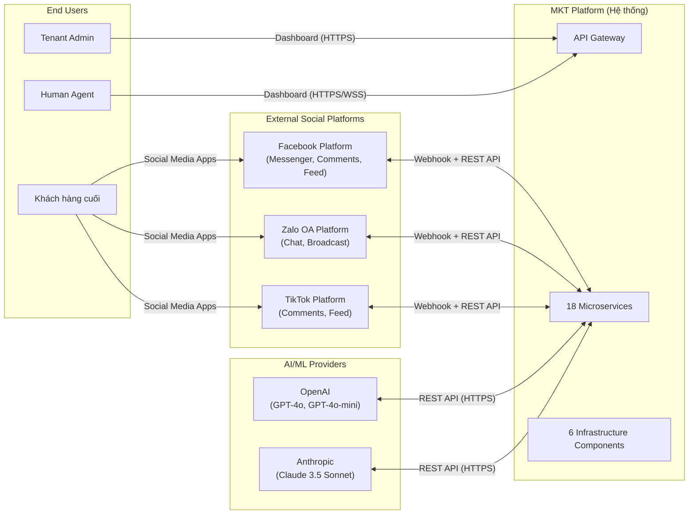
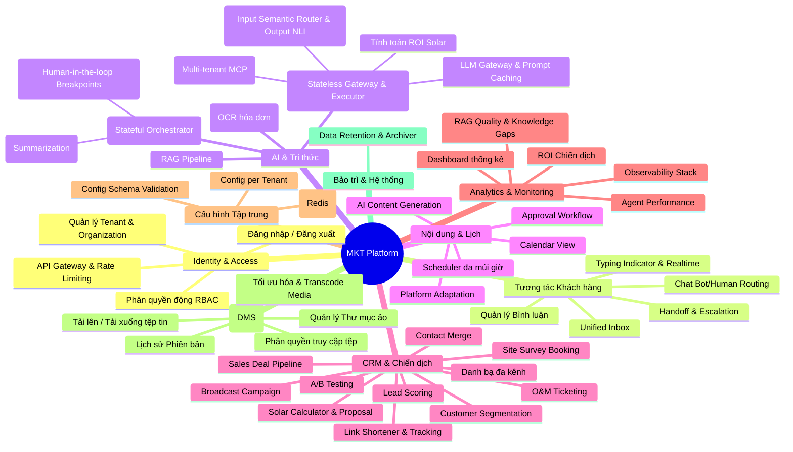

# 2. MÔ TẢ TỔNG QUAN (OVERALL DESCRIPTION)

> Phần này tuân thủ cấu trúc IEEE 830-1998 Section 2 và ISO/IEC/IEEE 29148:2018.

---

## 2.1. Bối cảnh sản phẩm (Product Perspective)

### 2.1.1. Vị trí hệ thống trong bức tranh tổng thể

Nền tảng MKT Platform là một hệ thống **độc lập (standalone)**, không phải module con của hệ thống ERP hay CRM hiện có. Tuy nhiên, nó tương tác với nhiều hệ thống bên ngoài thông qua các API chuẩn:

### 2.1.2. Mô hình kiến trúc tổng quan

Hệ thống được xây dựng trên kiến trúc **Microservices** với các đặc điểm:

| Đặc điểm | Mô tả |
|-----------|-------|
| **Mô hình triển khai** | Containerized (Docker) + Orchestration (Kubernetes-ready) |
| **Giao tiếp nội bộ** | REST API (CRUD), gRPC (low-latency), Kafka (async events), Redis Pub/Sub (config sync) |
| **Mô hình dữ liệu** | Database-per-Service (mỗi service có database riêng) |
| **Multi-tenancy** | Shared Database + Row-Level Security (RLS) trên `tenant_id` |
| **API Gateway** | Kong API Gateway với OIDC plugin kết nối Keycloak |
| **Xác thực** | OAuth2 / OpenID Connect thông qua Keycloak Organizations trong shared Realm 'solavie' kết hợp kiến trúc lai Hybrid User Architecture phân tách với User Service |

### 2.1.3. Phụ thuộc hệ thống bên ngoài

| Hệ thống bên ngoài | Loại tích hợp | Mục đích | Tần suất gọi |
|---------------------|--------------|---------|---------------|
| **Facebook Graph API v18+** | REST API + Webhook | Gửi/nhận tin nhắn, đăng bài, quản lý bình luận | Realtime (webhook) + On-demand |
| **Zalo OA API v3** | REST API + Webhook | Gửi/nhận tin nhắn, broadcast message | Realtime (webhook) + On-demand |
| **TikTok API** | REST API + Webhook | Đăng bài, quản lý bình luận | On-demand |
| **OpenAI API** | REST API | GPT-4o, GPT-4o-mini cho chatbot, content, vision | On-demand (per chat/content) |
| **Anthropic API** | REST API | Claude 3.5 Sonnet cho content generation | On-demand (per content) |
| **SMTP Server** | SMTP | Gửi email thông báo hệ thống | On-demand |

---
## 2.2. Chức năng chính của sản phẩm (Product Functions)

### 2.2.1. Sơ đồ phân hệ chức năng

### 2.2.2. Bảng tóm tắt chức năng theo phân hệ

| # | Phân hệ | Chức năng chính | Dịch vụ phụ trách |
|---|---------|----------------|-------------------|
| 1 | **Identity & Gateway** | Xác thực OIDC, phân quyền RBAC động, rate limiting, request routing | Kong Gateway, Keycloak |
| 2 | **Channel Management** | Kết nối kênh MXH, nhận/gửi tin nhắn, quản lý token, webhook verification | Channel Connector |
| 3 | **Messaging** | Unified Inbox, chat routing (Auto/Manual), handoff, auto-close, realtime | Messaging Service |
| 4 | **AI Chatbot** | Điều phối LangGraph (State/Memory), phân loại ý định, tự động tóm tắt tin nhắn, breakpoint duyệt bởi Agent có cấu hình | Chatbot Service |
| 5 | **Knowledge Base** | Upload tài liệu, chunking, embedding, hybrid search, reranking | Knowledge Base Service |
| 6 | **AI Core** | LLM Gateway & Prompt Caching, rào chắn kép (Semantic Router & NLI Validator), Multi-tenant MCP proxy, ROI Solar | AI Core Service |
| 7 | **Content** | AI content generation, platform adaptation, quality check, approval | Content Service |
| 8 | **Scheduler** | Đặt lịch đăng bài, Quartz integration, calendar view, retry logic | Scheduler Service |
| 9 | **CRM** | Contact management, merge, lead scoring, segmentation, Sales Deal Pipeline, Site Survey booking, O&M Ticketing | CRM Service |
| 10 | **Campaign** | Broadcast messaging, A/B testing, sending rate control | Campaign Service |
| 11 | **Analytics** | Time-series metrics, dashboard reports, ROI calculation | Analytics Service |
| 12 | **Notification** | Web push, email, SMS/Zalo alerts, handoff notifications | Notification Service |
| 13 | **Comment Manager** | Comment monitoring, spam detection, auto-reply, escalation | Comment Manager Service |
| 14 | **Tenant Config** | Centralized config CRUD, hot reload, config schema validation | Tenant Config Service |
| 15 | **Document Management** | Virtual folder structure, file upload, version control, presigned URLs | DMS Service |
| 16 | **Observability** | Prometheus metrics, Jaeger tracing, Loki logs, Grafana dashboards | Infrastructure Stack |
| 17 | **Link Shortener** | Rút gọn URL, theo dõi và ghi nhận click event thời gian thực phục vụ A/B Testing | Link Shortener Service |
| 18 | **Media Processing** | Nén ảnh, sinh thumbnail tự động, transcode video phù hợp API mạng xã hội | Media Processor Service |
| 19 | **Data Retention** | Quartz background job tự động nén log và tin nhắn cũ >90 ngày lên cold storage | Scheduler Service |

---

## 2.3. Phân loại và Đặc điểm người dùng (User Classes & Characteristics)

### 2.3.1. Người dùng nội bộ (Internal Users - Tenant Staff)

#### UC-ACTOR-01: Super Admin (Quản trị viên Hệ thống)

| Thuộc tính | Mô tả |
|-----------|-------|
| **Mô tả** | Quản trị viên cấp cao nhất của nền tảng SaaS, quản lý toàn bộ hệ thống đa tenant |
| **Trình độ kỹ thuật** | Cao — Hiểu biết về hạ tầng, API, database |
| **Số lượng dự kiến** | 1–3 người |
| **Phạm vi truy cập** | Quản lý tất cả Tenants, onboard/offboard Tenant, giám sát hệ thống, cấu hình hạ tầng |
| **Tần suất sử dụng** | Hàng ngày |

#### UC-ACTOR-02: Tenant Admin (Quản trị viên Tenant)

| Thuộc tính | Mô tả |
|-----------|-------|
| **Mô tả** | Chủ doanh nghiệp hoặc IT Admin của Tenant, toàn quyền cấu hình hệ thống trong phạm vi Tenant |
| **Trình độ kỹ thuật** | Trung bình — Quen thuộc với dashboard, cấu hình cơ bản |
| **Số lượng dự kiến** | 1–5 người / Tenant |
| **Phạm vi truy cập** | Kết nối kênh MXH, tạo/sửa Role & Permission, cấu hình chatbot/content/CRM, quản lý nhân viên |
| **Tần suất sử dụng** | Hàng ngày đến hàng tuần |

#### UC-ACTOR-03: Manager (Quản lý)

| Thuộc tính | Mô tả |
|-----------|-------|
| **Mô tả** | Trưởng nhóm Marketing / CSKH, giám sát hoạt động team, duyệt nội dung |
| **Trình độ kỹ thuật** | Trung bình |
| **Số lượng dự kiến** | 2–10 người / Tenant |
| **Phạm vi truy cập** | Duyệt bài viết AI, xem báo cáo analytics, quản lý chiến dịch, giám sát chat Agent |
| **Tần suất sử dụng** | Hàng ngày |

#### UC-ACTOR-04: Agent (Nhân viên tư vấn)

| Thuộc tính | Mô tả |
|-----------|-------|
| **Mô tả** | Nhân viên trực tiếp trả lời tin nhắn khách hàng, xử lý handoff từ chatbot |
| **Trình độ kỹ thuật** | Thấp đến Trung bình — Chỉ cần biết sử dụng Dashboard chat |
| **Số lượng dự kiến** | 5–50 người / Tenant |
| **Phạm vi truy cập** | Unified Inbox, trả lời chat, cập nhật CRM contact, xác nhận merge suggestion |
| **Tần suất sử dụng** | Liên tục trong ca trực (8–12 giờ/ngày) |

#### UC-ACTOR-05: Content Creator (Nhân viên nội dung)

| Thuộc tính | Mô tả |
|-----------|-------|
| **Mô tả** | Nhân viên tạo nội dung marketing, sử dụng AI để sinh bài viết |
| **Trình độ kỹ thuật** | Trung bình — Quen thuộc với content marketing |
| **Số lượng dự kiến** | 1–10 người / Tenant |
| **Phạm vi truy cập** | Tạo bài viết AI, lên lịch đăng bài, xem analytics nội dung |
| **Tần suất sử dụng** | Hàng ngày |

#### UC-ACTOR-06: Viewer (Người xem báo cáo)

| Thuộc tính | Mô tả |
|-----------|-------|
| **Mô tả** | Nhân viên chỉ có quyền xem báo cáo, không tương tác với hệ thống |
| **Trình độ kỹ thuật** | Thấp |
| **Số lượng dự kiến** | 1–20 người / Tenant |
| **Phạm vi truy cập** | Xem analytics dashboard, xem lịch đăng bài |
| **Tần suất sử dụng** | Hàng tuần |

### 2.3.2. Người dùng bên ngoài (External Users)

#### UC-ACTOR-07: Customer (Khách hàng cuối)

| Thuộc tính | Mô tả |
|-----------|-------|
| **Mô tả** | Người dùng cuối tương tác với Tenant thông qua các kênh mạng xã hội (Facebook Messenger, Zalo OA, TikTok) |
| **Trình độ kỹ thuật** | Không yêu cầu — Chỉ cần biết sử dụng ứng dụng MXH |
| **Tương tác** | Gửi tin nhắn, ảnh (hóa đơn), bình luận bài viết |
| **Lưu ý** | Khách hàng KHÔNG truy cập trực tiếp vào Dashboard. Mọi tương tác diễn ra qua ứng dụng MXH gốc. |

#### UC-ACTOR-08: OA Follower (Người theo dõi Zalo OA)

| Thuộc tính | Mô tả |
|-----------|-------|
| **Mô tả** | Người dùng Zalo đã "Quan tâm" (follow) Zalo OA của Tenant |
| **Tương tác** | Nhận Broadcast Message từ chiến dịch hoặc lịch đăng bài Zalo |

---

## 2.4. Môi trường vận hành (Operating Environment)

### 2.4.1. Môi trường Server

| Thành phần | Yêu cầu |
|-----------|---------|
| **Container Runtime** | Docker 24+ |
| **Orchestration** | Kubernetes 1.28+ (production) hoặc Docker Compose (development) |
| **OS** | Linux-based (Ubuntu 22.04 LTS hoặc Alpine) |
| **Cloud Provider** | Cloud-agnostic: hỗ trợ AWS, GCP, Azure hoặc On-premise |

### 2.4.2. Môi trường Client (Dashboard)

| Thành phần | Yêu cầu tối thiểu |
|-----------|-------------------|
| **Browser** | Chrome 100+, Firefox 100+, Safari 16+, Edge 100+ |
| **Độ phân giải** | Tối thiểu 1280×720 (HD), khuyến nghị 1920×1080 (Full HD) |
| **Responsive** | Hỗ trợ Desktop (≥1024px) và Tablet (≥768px) |
| **Kết nối** | HTTPS bắt buộc, WebSocket cho realtime chat |
| **JavaScript** | Bắt buộc bật (React SPA) |

### 2.4.3. Môi trường Infrastructure

| Thành phần | Phiên bản | Vai trò |
|-----------|-----------|---------|
| PostgreSQL | 15+ | Primary database cho tất cả services |
| TimescaleDB | 2.x (extension) | Time-series data cho Analytics |
| Redis | 7+ | Caching, session, pub/sub, rate limiting |
| Apache Kafka | 3.5+ | Message broker (Event-Driven Architecture) |
| Qdrant | 1.7+ | Vector database cho RAG |
| MinIO | Latest | S3-compatible object storage |

---

## 2.5. Ràng buộc thiết kế và triển khai (Design & Implementation Constraints)

### 2.5.1. Ràng buộc kiến trúc

| # | Ràng buộc | Lý do |
|---|----------|-------|
| C-01 | **PHẢI** sử dụng kiến trúc Microservices với Database-per-Service | Đảm bảo mỗi service có thể scale và deploy độc lập |
| C-02 | **PHẢI** áp dụng PostgreSQL RLS trên mọi bảng chứa dữ liệu tenant | Bảo vệ cô lập dữ liệu multi-tenant ở mức database |
| C-03 | **PHẢI** sử dụng Kafka cho tất cả giao tiếp bất đồng bộ giữa services | Đảm bảo không mất dữ liệu, hỗ trợ event replay |
| C-04 | **PHẢI** sử dụng gRPC cho đường dẫn latency-critical (Messaging ↔ Chatbot ↔ AI Core) | Yêu cầu phản hồi < 500ms cho chatbot |
| C-05 | **PHẢI** containerize tất cả services bằng Docker | Đồng nhất môi trường dev/staging/production |

### 2.5.2. Ràng buộc công nghệ

| # | Ràng buộc | Chi tiết |
|---|----------|---------|
| C-06 | Node.js services **PHẢI** sử dụng NestJS framework | Chuẩn hóa cấu trúc project, DI, decorators |
| C-07 | Python AI services **PHẢI** sử dụng FastAPI framework | Async support, auto OpenAPI docs, type hints |
| C-08 | Java services **PHẢI** sử dụng Spring Boot 3 | Mature ecosystem, Quartz integration |
| C-09 | Dashboard **PHẢI** sử dụng Next.js 14+ với TypeScript | SSR, App Router, type safety |
| C-10 | Chatbot **PHẢI** sử dụng LangGraph cho state management | Flexible AI agent workflow |

### 2.5.3. Ràng buộc tuân thủ

| # | Ràng buộc | Chi tiết |
|---|----------|---------|
| C-11 | **PHẢI** tuân thủ OWASP Top 10 cho web security | Chống XSS, SQL Injection, CSRF... |
| C-12 | **PHẢI** mã hóa dữ liệu nhạy cảm (tokens, mật khẩu) bằng AES-256 tại rest | Bảo vệ access token kênh MXH |
| C-13 | **PHẢI** sử dụng TLS 1.3 cho mọi giao tiếp bên ngoài | Bảo mật truyền tải dữ liệu |
| C-14 | **PHẢI** ghi Audit Log cho mọi hành động nhạy cảm | Yêu cầu tuân thủ doanh nghiệp |
| C-15 | **PHẢI** lưu trữ Audit Log tối thiểu 365 ngày | Yêu cầu kiểm toán |

### 2.5.4. Ràng buộc API bên ngoài

| # | Ràng buộc | Chi tiết |
|---|----------|---------|
| C-16 | Facebook Messenger: Quy tắc 24h Window — chỉ được gửi tin miễn phí trong 24h kể từ tin nhắn cuối của khách | Hạn chế bởi chính sách Facebook |
| C-17 | Zalo OA: **KHÔNG** hỗ trợ API đăng bài tự động lên Newsfeed | Hạn chế kỹ thuật của Zalo API |
| C-18 | Zalo OA: Broadcast Message bị giới hạn số lượng gửi/ngày theo quota OA | Hạn chế bởi chính sách Zalo |
| C-19 | LLM API: Chi phí tính theo token, cần kiểm soát budget | Ràng buộc tài chính |
| C-20 | Social Media API: Rate limit nghiêm ngặt trên mỗi Page/OA | Ràng buộc kỹ thuật |

---

## 2.6. Giả định và Phụ thuộc (Assumptions & Dependencies)

### 2.6.1. Giả định (Assumptions)

| # | Giả định | Tác động nếu sai |
|---|---------|------------------|
| A-01 | Tenant có ít nhất 1 Facebook Page hoặc Zalo OA đã xác thực | Không thể kết nối kênh, hệ thống chỉ có thể demo |
| A-02 | Đường truyền Internet của Server ổn định (uptime > 99.9%) | Webhook có thể bị miss, tin nhắn delay |
| A-03 | LLM Providers (OpenAI, Anthropic) duy trì API uptime > 99.5% | Chatbot và Content AI bị gián đoạn nếu provider down |
| A-04 | Nhân viên Agent biết sử dụng trình duyệt web cơ bản | Cần thêm đào tạo nếu Agent không quen công nghệ |
| A-05 | Solavie sẽ cung cấp tài liệu kỹ thuật sản phẩm (catalog, FAQ) cho Knowledge Base | Chatbot sẽ không có dữ liệu để trả lời nếu thiếu tài liệu |
| A-06 | Database PostgreSQL được backup tự động hàng ngày | Mất dữ liệu nếu backup không hoạt động |
| A-07 | Mỗi Tenant có tối đa 50 Agent đồng thời trong Phase 1 | Cần tối ưu WebSocket nếu vượt quá |

### 2.6.2. Phụ thuộc (Dependencies)

| # | Phụ thuộc | Loại | Mức độ rủi ro |
|---|----------|------|--------------|
| D-01 | Facebook Graph API v18+ availability | External Service | Trung bình |
| D-02 | Zalo OA API v3 availability | External Service | Trung bình |
| D-03 | TikTok API availability | External Service | Thấp |
| D-04 | OpenAI API availability & pricing stability | External Service | Cao |
| D-05 | Anthropic Claude API availability | External Service | Trung bình |
| D-06 | Keycloak 24+ compatibility với Kong OIDC plugin | Technical | Thấp |
| D-07 | LangGraph framework stability (đang phát triển nhanh) | Technical | Trung bình |
| D-08 | Qdrant vector DB performance at scale | Technical | Trung bình |

---

*← [Trước: Introduction](./01_Introduction.md) | [Về Mục lục](./00_SRS_Index.md) | [Tiếp: Use Cases →](./03_Use_Cases.md)*
