# 3. ĐẶC TẢ USE CASES (USE CASE SPECIFICATIONS)

> Phần này mô tả chi tiết các Use Cases của hệ thống theo chuẩn UML. Mỗi Use Case bao gồm: Actor, Preconditions, Main Flow, Alternative Flows, Exception Flows, Postconditions và Business Rules liên quan.

---

## 3.1. Sơ đồ Use Case tổng quan (Use Case Diagram)

```mermaid
graph TB
    subgraph "Actors"
        SA["🔑 Super Admin"]
        TA["👔 Tenant Admin"]
        MG["📋 Manager"]
        AG["💬 Agent"]
        CC["✍️ Content Creator"]
        VW["👁️ Viewer"]
        CU["🧑 Customer"]
    end

    subgraph "UC: Identity & Access"
        UC01["UC-01: Đăng nhập"]
        UC02["UC-02: Quản lý Role & Permission"]
        UC03["UC-03: Onboard Tenant mới"]
    end

    subgraph "UC: Channel Management"
        UC04["UC-04: Kết nối kênh MXH"]
        UC05["UC-05: Quản lý Token kênh"]
    end

    subgraph "UC: Messaging"
        UC06["UC-06: Xem Unified Inbox"]
        UC07["UC-07: Trả lời tin nhắn"]
        UC08["UC-08: Handoff Bot→Agent"]
        UC09["UC-09: Chuyển Manual→Auto"]
    end

    subgraph "UC: AI Chatbot"
        UC10["UC-10: Chatbot tự động trả lời"]
        UC11["UC-11: Đọc hóa đơn (Vision)"]
        UC12["UC-12: Lead Capture ngoài giờ"]
    end

    subgraph "UC: Knowledge Base"
        UC13["UC-13: Upload tài liệu"]
        UC14["UC-14: Tìm kiếm tri thức"]
    end

    subgraph "UC: Content & Schedule"
        UC15["UC-15: Tạo nội dung AI"]
        UC16["UC-16: Phê duyệt bài viết"]
        UC17["UC-17: Lên lịch đăng bài"]
        UC18["UC-18: Xem Calendar View"]
    end

    subgraph "UC: CRM"
        UC19["UC-19: Quản lý danh bạ"]
        UC20["UC-20: Merge Contact"]
        UC33["UC-33: Deal Pipeline & Khảo sát"]
        UC34["UC-34: Tính toán & Sinh báo giá"]
        UC35["UC-35: Tiếp nhận & Quản lý O&M"]
        UC36["UC-36: Lead Scoring"]
    end

    subgraph "UC: Campaign & Analytics"
        UC21["UC-21: Tạo chiến dịch"]
        UC22["UC-22: A/B Testing"]
        UC23["UC-23: Xem báo cáo"]
    end

    subgraph "UC: Config & Comments"
        UC24["UC-24: Cấu hình Tenant"]
        UC25["UC-25: Quản lý bình luận"]
    end

    subgraph "UC: Security & Compliance"
        UC37["UC-37: Consent popup NĐ 13/2023"]
        UC38["UC-38: Right to Erasure"]
    end

    SA --> UC03
    TA --> UC01 & UC02 & UC04 & UC05 & UC24 & UC38
    MG --> UC01 & UC06 & UC16 & UC23
    AG --> UC01 & UC06 & UC07 & UC09 & UC19 & UC20 & UC33 & UC34 & UC35 & UC38
    CC --> UC01 & UC13 & UC15 & UC17 & UC18
    VW --> UC01 & UC18 & UC23
    CU --> UC10 & UC11 & UC12 & UC37
```

---

## 3.2. Đặc tả Use Cases chi tiết

---

### UC-01: Đăng nhập hệ thống

| Thuộc tính | Chi tiết |
|-----------|---------|
| **ID** | UC-01 |
| **Tên** | Đăng nhập hệ thống (User Login) |
| **Actor chính** | Tenant Admin, Manager, Agent, Content Creator, Viewer |
| **Actor phụ** | Keycloak Auth Service |
| **Mô tả** | Người dùng đăng nhập vào Dashboard bằng email và mật khẩu để truy cập các chức năng được phân quyền |
| **Preconditions** | 1. Tài khoản người dùng đã được Admin tạo trong hệ thống 2. Realm của Tenant đã được khởi tạo trên Keycloak |
| **Trigger** | Người dùng truy cập URL Dashboard |
| **Frequency** | Nhiều lần/ngày |
| **Priority** | 🔴 Must Have |

**Main Flow:**

| Bước | Actor | Hệ thống |
|------|-------|---------|
| 1 | Người dùng mở trình duyệt, truy cập URL Dashboard | Hiển thị trang đăng nhập |
| 2 | Nhập email và mật khẩu, nhấn "Đăng nhập" | |
| 3 | | Gửi credentials tới Keycloak qua OAuth2 Authorization Code Flow |
| 4 | | Keycloak xác thực, trả về JWT Access Token + Refresh Token |
| 5 | | Trích xuất `tenant_id`, `user_id`, `roles`, `permissions` từ JWT |
| 6 | | Redirect tới Dashboard với menu/chức năng tương ứng với permissions |

**Alternative Flows:**

| ID | Điều kiện | Hành động |
|----|----------|----------|
| AF-01a | Người dùng đã đăng nhập (token chưa hết hạn) | Redirect thẳng tới Dashboard, bỏ qua trang login |
| AF-01b | Token hết hạn nhưng Refresh Token còn hợp lệ | Tự động refresh token ngầm, không yêu cầu đăng nhập lại |

**Exception Flows:**

| ID | Điều kiện | Hành động |
|----|----------|----------|
| EF-01a | Sai email hoặc mật khẩu | Hiển thị thông báo lỗi "Email hoặc mật khẩu không đúng". Không tiết lộ field nào sai. |
| EF-01b | Sai mật khẩu 5 lần liên tiếp | Khóa tài khoản 15 phút. Hiển thị thông báo "Tài khoản tạm khóa, vui lòng thử lại sau 15 phút". |
| EF-01c | Tài khoản bị vô hiệu hóa bởi Admin | Hiển thị thông báo "Tài khoản đã bị vô hiệu hóa. Liên hệ quản trị viên." |
| EF-01d | Keycloak service không khả dụng | Hiển thị thông báo lỗi hệ thống. Ghi log error. |

**Postconditions:**
- Người dùng được chuyển tới Dashboard với đúng quyền hạn
- Session được ghi nhận trên Redis
- Audit log ghi nhận sự kiện đăng nhập

**Business Rules:**
- BR-01: JWT Access Token có thời hạn 15 phút (configurable qua Tenant Config)
- BR-02: Refresh Token có thời hạn 7 ngày
- BR-03: Session timeout sau 30 phút không hoạt động (configurable)

**Liên kết:** FR-AUTH-001, FR-AUTH-002, FR-AUTH-003, US-001, US-002

---

### UC-02: Quản lý vai trò & phân quyền động (Dynamic RBAC Management)

| Thuộc tính | Chi tiết |
|-----------|---------|
| **ID** | UC-02 |
| **Tên** | Quản lý Role & Permission động |
| **Actor chính** | Tenant Admin |
| **Actor phụ** | Keycloak, Redis (permission cache) |
| **Mô tả** | Admin tạo/sửa/xóa Role, gán Permissions cho Role, gán Role cho User — tất cả qua Dashboard, có hiệu lực ngay lập tức |
| **Preconditions** | Admin đã đăng nhập với quyền `roles:manage` |
| **Priority** | 🔴 Must Have |

**Main Flow:**

| Bước | Actor | Hệ thống |
|------|-------|---------|
| 1 | Admin vào menu "Quản lý phân quyền" | Hiển thị danh sách Roles hiện có kèm số User được gán |
| 2 | Nhấn "Tạo Role mới" | Hiển thị form: Tên Role, Mô tả |
| 3 | Nhập tên Role (VD: "Trưởng nhóm KD miền Nam") | |
| 4 | Hệ thống hiển thị ma trận Permissions | Admin tick chọn các permissions cần gán (VD: `inbox:read`, `inbox:chat`, `contacts:view`) |
| 5 | Nhấn "Lưu" | Gọi Keycloak Admin API tạo Realm Role (chỉ lưu Role Name ở Keycloak) và lưu Role + Permissions vào PostgreSQL (config_db) của Tenant Config Service |
| 6 | | Lưu permissions dạng CSV vào Redis (key: `tenant:{tenant_id}:role:{role_name}:permissions`) và gửi tín hiệu invalidation lên kênh Redis Pub/Sub `config.updates` để Gateway xóa local worker cache |
| 7 | | Audit log ghi nhận hành động tạo Role |

**Alternative Flows:**

| ID | Điều kiện | Hành động |
|----|----------|----------|
| AF-02a | Admin chỉnh sửa Permissions của Role đã tồn tại | Cập nhật database PostgreSQL của Tenant Config, ghi đè Redis cache key `tenant:{tenant_id}:role:{role_name}:permissions` và publish event hủy cache qua Redis Pub/Sub `config.updates`. Gateway và downstream sẽ áp dụng quyền mới ngay lập tức |
| AF-02b | Admin gán Role cho User | Keycloak Admin API map Role với User. JWT token mới của User sẽ chứa Role claim mới; Gateway tự động phân giải thành các permissions tương ứng |
| AF-02c | Admin xóa Role | Kiểm tra không còn User nào gán Role này. Xóa Realm Role trên Keycloak, xóa Role & Permissions trong PostgreSQL, xóa cache Redis và publish event hủy cache. Chặn xóa các vai trò hệ thống mặc định |

**Exception Flows:**

| ID | Điều kiện | Hành động |
|----|----------|----------|
| EF-02a | Tên Role trùng với Role đã tồn tại | Hiển thị lỗi "Tên vai trò đã tồn tại" |
| EF-02b | Admin cố xóa Role đang có User | Hiển thị cảnh báo + danh sách User cần chuyển |

**Postconditions:**
- Role mới/cập nhật có hiệu lực ngay lập tức qua Redis cache
- Audit log ghi nhận thay đổi

**Liên kết:** FR-AUTH-004, FR-AUTH-005, FR-AUTH-006, US-003, US-004

---

### UC-03: Onboard Tenant mới

| Thuộc tính | Chi tiết |
|-----------|---------|
| **ID** | UC-03 |
| **Tên** | Onboard Tenant mới (Tenant Provisioning) |
| **Actor chính** | Super Admin |
| **Actor phụ** | Keycloak, PostgreSQL, Redis |
| **Mô tả** | Khởi tạo không gian hoạt động cho Tenant mới: tạo Realm, Admin account, database schema, default config |
| **Preconditions** | Super Admin đã đăng nhập |
| **Priority** | 🔴 Must Have |

**Main Flow:**

| Bước | Actor | Hệ thống |
|------|-------|---------|
| 1 | Super Admin vào "Quản lý Tenants" | Hiển thị danh sách Tenants hiện có |
| 2 | Nhấn "Tạo Tenant mới" | Form: Tên công ty, Email admin, Gói dịch vụ (Free/Standard/Enterprise) |
| 3 | Điền thông tin, nhấn "Tạo" | |
| 4 | | Tạo Realm mới trên Keycloak với cấu hình bảo mật mặc định |
| 5 | | Tạo tài khoản Admin đầu tiên cho Tenant, gán quyền Admin |
| 6 | | Khởi tạo RLS policies cho tenant_id mới trên tất cả database services |
| 7 | | Tạo default config trong Tenant Config Service (chatbot_enabled=true, confidence_threshold=0.70...) |
| 8 | | Gửi email chào mừng chứa link đăng nhập + mật khẩu tạm cho Admin |
| 9 | | Audit log ghi nhận onboarding |

**Exception Flows:**

| ID | Điều kiện | Hành động |
|----|----------|----------|
| EF-03a | Email admin đã tồn tại trong hệ thống | Hiển thị lỗi "Email đã được sử dụng" |
| EF-03b | Tạo Realm thất bại (Keycloak lỗi) | Rollback toàn bộ, hiển thị lỗi "Không thể khởi tạo Tenant" |

**Postconditions:**
- Tenant mới có Realm, Admin account, default config sẵn sàng
- Admin Tenant có thể đăng nhập và bắt đầu cấu hình

**Liên kết:** FR-AUTH-007, FR-AUTH-008, US-005

---

### UC-04: Kết nối kênh mạng xã hội

| Thuộc tính | Chi tiết |
|-----------|---------|
| **ID** | UC-04 |
| **Tên** | Kết nối kênh mạng xã hội (Channel Connection) |
| **Actor chính** | Tenant Admin |
| **Actor phụ** | Facebook API, Zalo OA API, TikTok API, Channel Connector Service |
| **Mô tả** | Admin kết nối Facebook Page, Zalo OA hoặc TikTok account vào hệ thống để nhận/gửi tin nhắn và quản lý nội dung |
| **Preconditions** | 1. Admin đã đăng nhập với quyền `channels:manage` 2. Admin có quyền quản trị Fanpage/OA trên nền tảng tương ứng |
| **Priority** | 🔴 Must Have |

**Main Flow (Facebook Page):**

| Bước | Actor | Hệ thống |
|------|-------|---------|
| 1 | Admin vào "Quản lý kênh" → "Kết nối Facebook" | Hiển thị nút "Đăng nhập Facebook" |
| 2 | Nhấn "Đăng nhập Facebook" | Redirect tới Facebook OAuth dialog |
| 3 | Đăng nhập Facebook, chọn Pages cần kết nối, cấp quyền | |
| 4 | | Nhận OAuth callback với Access Token |
| 5 | | Mã hóa Access Token (AES-256) và lưu vào DB |
| 6 | | Đăng ký Webhook endpoint với Facebook cho các sự kiện: messages, feed, comments |
| 7 | | Hiển thị danh sách Pages đã kết nối thành công với trạng thái `Active` |

**Alternative Flows:**

| ID | Điều kiện | Hành động |
|----|----------|----------|
| AF-04a | Kết nối Zalo OA | Redirect tới Zalo OAuth → Nhận OA Access Token → Đăng ký Webhook Zalo |
| AF-04b | Kết nối TikTok | Redirect tới TikTok OAuth → Nhận Access Token → Cấu hình webhook |
| AF-04c | Admin ngắt kết nối kênh | Revoke token, hủy webhook subscription, cập nhật trạng thái `Disconnected` |

**Exception Flows:**

| ID | Điều kiện | Hành động |
|----|----------|----------|
| EF-04a | User hủy bỏ OAuth dialog | Quay lại trang quản lý kênh, hiện thông báo "Đã hủy kết nối" |
| EF-04b | Facebook trả về lỗi permission | Hiển thị hướng dẫn cấp đủ quyền cần thiết |
| EF-04c | Webhook verification thất bại | Retry 3 lần, nếu vẫn lỗi → log error, thông báo Admin |

**Postconditions:**
- Kênh MXH được kết nối và hiện trạng thái `Active`
- Webhook đã đăng ký, sẵn sàng nhận sự kiện realtime
- Token được lưu trữ mã hóa

**Liên kết:** FR-CH-001, FR-CH-002, FR-CH-003, US-006, US-007

---

### UC-05: Quản lý Token kênh (Channel Token Management)

| Thuộc tính | Chi tiết |
|-----------|---------|
| **ID** | UC-05 |
| **Tên** | Quản lý Token kênh |
| **Actor chính** | Hệ thống (Background Job) |
| **Actor phụ** | Tenant Admin (nhận thông báo), Facebook/Zalo/TikTok API |
| **Mô tả** | Hệ thống tự động kiểm tra và làm mới Access Token của các kênh MXH trước khi hết hạn |
| **Preconditions** | Kênh đã được kết nối (UC-04) |
| **Priority** | 🔴 Must Have |

**Main Flow:**

| Bước | Hệ thống |
|------|---------|
| 1 | Background Job chạy mỗi 6 giờ, quét tất cả tokens |
| 2 | Xác định tokens sẽ hết hạn trong vòng 24 giờ tới |
| 3 | Gọi API refresh token của nền tảng tương ứng |
| 4 | Mã hóa token mới (AES-256) và cập nhật DB |
| 5 | Log kết quả refresh thành công |

**Exception Flows:**

| ID | Điều kiện | Hành động |
|----|----------|----------|
| EF-05a | Refresh token thất bại (token bị revoke) | Cập nhật trạng thái kênh → `Token Expired`, gửi Notification khẩn cấp cho Admin, yêu cầu kết nối lại |
| EF-05b | API nền tảng không phản hồi | Retry 3 lần (exponential backoff), nếu vẫn lỗi → gửi alert |

**Liên kết:** FR-CH-004, FR-CH-005, US-008

---

### UC-06: Xem Hộp thư Hợp nhất (Unified Inbox)

| Thuộc tính | Chi tiết |
|-----------|---------|
| **ID** | UC-06 |
| **Tên** | Xem Hộp thư Hợp nhất |
| **Actor chính** | Agent, Manager |
| **Mô tả** | Xem tất cả cuộc hội thoại từ mọi kênh MXH trong một màn hình duy nhất, lọc/tìm kiếm theo nhiều tiêu chí |
| **Preconditions** | Người dùng đã đăng nhập với quyền `inbox:read` |
| **Priority** | 🔴 Must Have |

**Main Flow:**

| Bước | Actor | Hệ thống |
|------|-------|---------|
| 1 | Agent nhấn menu "Hộp thư" | Hiển thị danh sách conversations phân trang, sắp xếp theo tin nhắn mới nhất |
| 2 | | Mỗi conversation hiển thị: Avatar, Tên khách, Kênh nguồn [Facebook]/[Zalo]/[TikTok], tin nhắn cuối, thời gian, trạng thái (Auto/Manual/Closed), Agent phụ trách |
| 3 | Agent click vào conversation | Hiển thị chi tiết: toàn bộ lịch sử chat, thông tin Contact CRM ở sidebar |
| 4 | | Kết nối WebSocket để nhận tin nhắn mới realtime |

**Alternative Flows:**

| ID | Điều kiện | Hành động |
|----|----------|----------|
| AF-06a | Agent lọc theo kênh (chỉ Facebook) | Hiển thị conversations chỉ từ Facebook |
| AF-06b | Agent lọc theo trạng thái (chỉ Manual) | Hiển thị conversations đang ở chế độ Manual |
| AF-06c | Agent lọc theo "Chưa gán" | Hiển thị conversations trong hàng đợi chưa có Agent |
| AF-06d | Agent tìm kiếm theo tên/SĐT khách | Tìm và hiển thị kết quả matching |
| AF-06e | Tin nhắn mới đến khi đang xem | Push notification âm thanh + badge count cập nhật realtime |

**Postconditions:**
- Agent thấy được toàn cảnh hộp thư với tag kênh nguồn rõ ràng

**Liên kết:** FR-MSG-001, FR-MSG-002, FR-MSG-003, US-009, US-010, US-011

---

### UC-07: Trả lời tin nhắn khách hàng

| Thuộc tính | Chi tiết |
|-----------|---------|
| **ID** | UC-07 |
| **Tên** | Trả lời tin nhắn khách hàng |
| **Actor chính** | Agent |
| **Actor phụ** | Channel Connector, CRM Service |
| **Mô tả** | Agent gõ và gửi tin nhắn phản hồi cho khách hàng. Hệ thống tự động forward qua đúng kênh MXH gốc |
| **Preconditions** | 1. Agent đã đăng nhập với quyền `inbox:chat` 2. Conversation đang ở chế độ Manual 3. Agent đã được gán (hoặc tự claim) conversation này |
| **Priority** | 🔴 Must Have |

**Main Flow:**

| Bước | Actor | Hệ thống |
|------|-------|---------|
| 1 | Agent mở conversation, gõ tin nhắn | Hiển thị typing indicator cho khách (nếu platform hỗ trợ) |
| 2 | Nhấn "Gửi" (hoặc Enter) | |
| 3 | | Xác định kênh nguồn từ `channel_source` của conversation |
| 4 | | Gửi yêu cầu tới Channel Connector → Gọi API gửi tin của kênh tương ứng |
| 5 | | Cập nhật trạng thái tin nhắn: `Sent` → `Delivered` (khi API xác nhận) |
| 6 | | Hiển thị tin nhắn đã gửi kèm checkmark trạng thái |

**Alternative Flows:**

| ID | Điều kiện | Hành động |
|----|----------|----------|
| AF-07a | Agent gửi ảnh/file đính kèm | Upload file → MinIO, gửi Presigned URL qua API kênh |
| AF-07b | Conversation nguồn Facebook, ngoài khung 24h | Khóa ô nhập tin. Hiện cảnh báo "Đã ngoài khung 24h. Chỉ cho phép gửi qua Message Tags hoặc Paid Message". Hiển thị dropdown chọn loại Message Tag |
| AF-07c | Agent sử dụng Quick Reply template | Chọn từ danh sách template → tự động điền nội dung |

**Exception Flows:**

| ID | Điều kiện | Hành động |
|----|----------|----------|
| EF-07a | API kênh trả lỗi (network/rate limit) | Retry 3 lần (exponential backoff). Nếu vẫn lỗi → đánh dấu tin nhắn `Failed`, hiện nút "Gửi lại" |
| EF-07b | Token kênh hết hạn | Hiển thị cảnh báo "Kênh mất kết nối", gửi notification cho Admin |

**Postconditions:**
- Khách hàng nhận được tin nhắn phản hồi trên ứng dụng MXH
- Tin nhắn được lưu vào DB messaging_db với tag `channel_source`

**Liên kết:** FR-MSG-004, FR-MSG-005, FR-MSG-006, US-012, US-013

---

### UC-08: Handoff từ Bot sang Agent

| Thuộc tính | Chi tiết |
|-----------|---------|
| **ID** | UC-08 |
| **Tên** | Handoff Chatbot → Human Agent |
| **Actor chính** | Customer (trigger gián tiếp), Chatbot Service (trigger trực tiếp) |
| **Actor phụ** | Messaging Service, Notification Service, Agent |
| **Mô tả** | Khi chatbot AI không đủ tin cậy hoặc phát hiện khách hàng tức giận, hệ thống tự động chuyển hội thoại sang Agent con người |
| **Preconditions** | 1. Conversation đang ở chế độ `Auto` (Bot trả lời) 2. Chatbot phát hiện điều kiện handoff |
| **Priority** | 🔴 Must Have |

**Main Flow:**

| Bước | Hệ thống |
|------|---------|
| 1 | Chatbot xử lý tin nhắn khách, tính Confidence Score |
| 2 | Phát hiện Confidence < 0.70 (hoặc sentiment = angry, hoặc RAG score < 0.50, hoặc khách yêu cầu "gặp nhân viên") |
| 3 | Chatbot trả về response `HANDOFF` qua gRPC kèm `reason` |
| 4 | Messaging Service chuyển trạng thái conversation: `auto` → `manual` |
| 5 | Kích hoạt **Hybrid Routing Algorithm** (xem BRD §4.2): |
| 5a | → Kiểm tra khách hàng cũ? → Agent cũ online & không quá tải? → Gán Agent cũ |
| 5b | → Nếu không → Đưa vào hàng đợi Queue & Claim (3 phút chờ) |
| 5c | → Nếu không ai claim → Auto-assign cho Agent online có tải thấp nhất |
| 6 | Gửi tin nhắn tự động cho khách: "Vui lòng chờ, nhân viên sẽ hỗ trợ bạn ngay" |
| 7 | Notification Service gửi alert cho Agent được gán: push notification + âm thanh |
| 8 | Agent nhận và bắt đầu trả lời khách |

**Alternative Flows:**

| ID | Điều kiện | Hành động |
|----|----------|----------|
| AF-08a | Không có Agent nào online | Chuyển sang Lead Capture mode (UC-12), ghi nhận thông tin khách, tạo ticket chờ |
| AF-08b | Agent từ chối (chuyển cho người khác) | Đưa lại hàng đợi, chạy lại routing (loại trừ Agent vừa từ chối) |

**Exception Flows:**

| ID | Điều kiện | Hành động |
|----|----------|----------|
| EF-08a | Messaging Service hoặc Notification Service lỗi | Fallback: Chatbot gửi tin "Hệ thống đang bận, vui lòng liên hệ hotline [xxx]". Log critical error. |

**Postconditions:**
- Conversation chuyển sang chế độ Manual
- Agent được gán và nhận thông báo
- Khách hàng nhận tin chờ

**Business Rules:**
- BR-08a: Các điều kiện handoff bắt buộc: Confidence < 0.70, Sentiment angry (>= 0.60), RAG score < 0.50, AI timeout > 5s, Khách yêu cầu trực tiếp
- BR-08b: Thời gian chờ Queue & Claim mặc định: 3 phút (configurable)

**Liên kết:** FR-MSG-007, FR-MSG-008, FR-MSG-009, FR-CB-004, US-014, US-015, US-016

---

### UC-09: Chuyển ngược từ Manual → Auto Mode

| Thuộc tính | Chi tiết |
|-----------|---------|
| **ID** | UC-09 |
| **Tên** | Chuyển ngược Manual → Auto Mode |
| **Actor chính** | Agent (thủ công) hoặc Hệ thống (tự động timeout) |
| **Mô tả** | Trả lại quyền kiểm soát conversation cho Chatbot AI sau khi Agent hoàn tất hỗ trợ |
| **Preconditions** | Conversation đang ở chế độ `Manual` |
| **Priority** | 🟡 Should Have |

**Main Flow (Agent Resolve):**

| Bước | Actor | Hệ thống |
|------|-------|---------|
| 1 | Agent hoàn tất hỗ trợ, nhấn nút "Đóng hội thoại" | |
| 2 | | Chuyển trạng thái conversation: `manual` → `auto` |
| 3 | | Hủy gán Agent khỏi conversation |
| 4 | | Nếu khách gửi tin nhắn mới → Chatbot AI tiếp tục xử lý |

**Alternative Flows:**

| ID | Điều kiện | Hành động |
|----|----------|----------|
| AF-09a | Config `manual_to_auto_trigger = timeout` | Hệ thống tự động chuyển về `auto` sau X giờ không có tương tác (X = `manual_to_auto_timeout_hours`, mặc định 2h) |
| AF-09b | Config `manual_to_auto_trigger = both` | Kích hoạt khi Agent đóng HOẶC khi timeout, tùy cái nào xảy ra trước |

**Postconditions:**
- Conversation trở lại chế độ Auto
- Chatbot sẵn sàng xử lý tin nhắn mới

**Liên kết:** FR-MSG-010, FR-MSG-011, US-017

---

### UC-10: Chatbot tự động trả lời khách hàng

| Thuộc tính | Chi tiết |
|-----------|---------|
| **ID** | UC-10 |
| **Tên** | Chatbot AI tự động trả lời |
| **Actor chính** | Customer (gửi tin nhắn) |
| **Actor phụ** | Channel Connector, Messaging, Chatbot, Knowledge Base, AI Core |
| **Mô tả** | Khi khách hàng gửi tin nhắn và conversation đang ở chế độ Auto, Chatbot AI sẽ tự động phân loại ý định, tìm kiếm tri thức và sinh câu trả lời |
| **Preconditions** | 1. Kênh MXH đã kết nối 2. Config `chatbot_enabled = true` 3. Conversation ở chế độ `Auto` |
| **Priority** | 🔴 Must Have |

**Main Flow:**

| Bước | Hệ thống |
|------|---------|
| 1 | Channel Connector nhận webhook tin nhắn từ MXH |
| 2 | Verify signature, kiểm tra idempotency (Redis) → Nếu đã xử lý → bỏ qua |
| 3 | Normalize message sang unified JSON format |
| 4 | Publish event `channel.message.received` lên Kafka |
| 5 | Messaging Service consume event → Lưu tin nhắn vào DB → Trạng thái `Pending_Reply` |
| 6 | Messaging gọi Chatbot Service qua gRPC |
| 7 | Chatbot phân loại Intent (FAQ, mua hàng, khiếu nại, chào hỏi) |
| 8 | Chatbot gọi Knowledge Base → Hybrid Search (Dense + Sparse) → Reranking → Top 5 results |
| 9 | Kiểm tra RAG Relevance Score ≥ 0.50 |
| 10 | Chatbot gọi AI Core → Sinh câu trả lời tự nhiên (kèm lịch sử chat nén) |
| 11 | Tính Confidence Score cho câu trả lời |
| 12 | Confidence ≥ 0.70 → Trả response về Messaging qua gRPC |
| 13 | Messaging gửi yêu cầu reply → Channel Connector → Gọi API MXH gửi tin |
| 14 | Cập nhật trạng thái: `Pending_Reply` → `Delivered` |

**Alternative Flows:**

| ID | Điều kiện | Hành động |
|----|----------|----------|
| AF-10a | Confidence < 0.70 | Kích hoạt UC-08 (Handoff) |
| AF-10b | RAG Score < 0.50 | Kích hoạt UC-08 (Handoff) ngay, không sinh câu trả lời |
| AF-10c | Sentiment = angry/negative (≥ 0.60) | Kích hoạt UC-08 (Handoff) |
| AF-10d | AI Core timeout > 5s | Kích hoạt UC-08 (Handoff) |
| AF-10e | Khách gửi "gặp nhân viên", "ad đâu rồi"... | Kích hoạt UC-08 (Handoff) |
| AF-10f | Ngoài Working Hours + config = Lead Capture | Kích hoạt UC-12 (Lead Capture) |
| AF-10g | Khách gửi ảnh + config `ai_vision_invoice_reading = true` | Kích hoạt UC-11 (AI Vision) |

**Postconditions:**
- Khách hàng nhận được câu trả lời tự động
- Conversation state checkpoint được lưu vào PostgreSQL
- Analytics ghi nhận metrics

**Liên kết:** FR-CB-001, FR-CB-002, FR-CB-003, FR-CB-004, US-018, US-019

---

### UC-11: Đọc hóa đơn tiền điện bằng AI Vision

| Thuộc tính | Chi tiết |
|-----------|---------|
| **ID** | UC-11 |
| **Tên** | AI Vision - OCR hóa đơn tiền điện |
| **Actor chính** | Customer (gửi ảnh), Chatbot Service |
| **Actor phụ** | AI Core (Vision LLM), CRM Service |
| **Mô tả** | Khi khách gửi ảnh hóa đơn tiền điện, chatbot sử dụng AI Vision để trích xuất chỉ số kWh, số tiền, tên khách hàng |
| **Preconditions** | 1. Config `ai_vision_invoice_reading = true` 2. Khách gửi tin nhắn dạng ảnh |
| **Priority** | 🟡 Should Have |

**Main Flow:**

| Bước | Hệ thống |
|------|---------|
| 1 | Chatbot nhận tin nhắn dạng ảnh từ khách |
| 2 | Gọi AI Core với Vision model (GPT-4o) để phân tích ảnh |
| 3 | AI trích xuất: Số tiền điện, kWh, Tên khách (nếu có) |
| 4 | Xác nhận lại với khách: "Tôi đã nhận được hóa đơn. Số tiền điện: X VNĐ, Sản lượng: Y kWh. Thông tin này đúng không?" |
| 5 | Khách xác nhận → Cập nhật thông tin vào CRM Contact |
| 6 | Chatbot tiếp tục luồng tư vấn/hẹn lịch khảo sát |

**Alternative Flows:**

| ID | Điều kiện | Hành động |
|----|----------|----------|
| AF-11a | Config `ai_vision_invoice_reading = false` | Bỏ qua phân tích → Kích hoạt Handoff (UC-08) để Agent xử lý thủ công |
| AF-11b | AI không đọc được ảnh (mờ, lệch, không phải hóa đơn) | Chatbot hỏi lại: "Xin lỗi, tôi không đọc được ảnh. Bạn có thể chụp lại rõ hơn không?" |
| AF-11c | Khách từ chối xác nhận thông tin | Kích hoạt Handoff để Agent kiểm tra thủ công |

**Postconditions:**
- Thông tin hóa đơn được lưu vào CRM Contact
- Chatbot tiếp tục luồng nghiệp vụ

**Liên kết:** FR-CB-005, FR-CB-006, US-020, US-021

---

### UC-12: Lead Capture ngoài giờ làm việc

| Thuộc tính | Chi tiết |
|-----------|---------|
| **ID** | UC-12 |
| **Tên** | Chatbot Lead Capture ngoài giờ |
| **Actor chính** | Customer |
| **Actor phụ** | Chatbot Service, CRM Service |
| **Mô tả** | Ngoài giờ làm việc, chatbot chạy kịch bản thu thập thông tin khách hàng thay vì tự do chat hoặc handoff |
| **Preconditions** | 1. Ngoài `working_hours` của Tenant 2. Config `offline_mode_behavior = lead_capture` |
| **Priority** | 🟡 Should Have |

**Main Flow:**

| Bước | Hệ thống |
|------|---------|
| 1 | Nhận diện thời điểm hiện tại ngoài working_hours |
| 2 | Chatbot gửi tin: "Cảm ơn bạn đã liên hệ [Tên Tenant]. Hiện nhân viên đang nghỉ. Bạn vui lòng cho tôi xin một số thông tin để nhân viên liên hệ lại sớm nhất nhé!" |
| 3 | Hỏi: "Số điện thoại của bạn?" → Khách trả lời → Validate format SĐT VN |
| 4 | Hỏi: "Địa chỉ lắp đặt?" → Khách trả lời |
| 5 | Hỏi: "Bạn muốn lắp cho hộ gia đình hay nhà xưởng/doanh nghiệp?" → Khách chọn |
| 6 | Lưu thông tin vào CRM dưới dạng Lead mới, gắn tag `Chờ khảo sát ngoài giờ` |
| 7 | Chatbot gửi: "Cảm ơn bạn! Nhân viên sẽ liên hệ bạn trong giờ làm việc tiếp theo." |
| 8 | Khóa chatbot (không cho phép tự do chat), chuyển conversation trạng thái `waiting_agent` |

**Alternative Flows:**

| ID | Điều kiện | Hành động |
|----|----------|----------|
| AF-12a | Config `offline_mode_behavior = ai_warning` | Chatbot vẫn chat AI bình thường nhưng kèm cảnh báo "Hiện ngoài giờ làm việc, phản hồi có thể chậm hơn" |
| AF-12b | Config `offline_mode_behavior = offline_msg` | Gửi 1 tin nhắn đóng: "Hiện ngoài giờ, vui lòng liên hệ lại trong giờ hành chính" |
| AF-12c | Khách nhập SĐT sai định dạng | Chatbot hỏi lại: "SĐT chưa đúng định dạng, vui lòng nhập lại (VD: 0912345678)" |

**Postconditions:**
- Lead mới được tạo trong CRM
- Conversation ở trạng thái chờ Agent xử lý

**Liên kết:** FR-CB-007, FR-CB-008, US-022

---

### UC-13: Upload tài liệu tri thức (Knowledge Base)

| Thuộc tính | Chi tiết |
|-----------|---------|
| **ID** | UC-13 |
| **Tên** | Upload tài liệu vào Knowledge Base |
| **Actor chính** | Tenant Admin, Content Creator |
| **Actor phụ** | Knowledge Base Service, MinIO, Qdrant |
| **Mô tả** | Upload tài liệu (PDF, DOCX, TXT, Markdown) để chatbot AI sử dụng làm nguồn tri thức trả lời khách hàng |
| **Preconditions** | Người dùng có quyền quản lý Knowledge Base |
| **Priority** | 🔴 Must Have |

**Main Flow:**

| Bước | Actor | Hệ thống |
|------|-------|---------|
| 1 | Vào "Quản lý Tri thức" → "Tải lên tài liệu" | Hiển thị form upload |
| 2 | Chọn file (PDF/DOCX/TXT/MD), nhập tiêu đề, chọn danh mục | |
| 3 | Nhấn "Tải lên" | |
| 4 | | Lưu file gốc vào MinIO (`{tenant_id}/knowledge/...`) |
| 5 | | Trích xuất text từ file |
| 6 | | Semantic Chunking: chia nhỏ 256-512 tokens, overlap 10-20% |
| 7 | | Embedding các chunks bằng `text-embedding-3-small` (512 dims) |
| 8 | | Lưu vectors vào Qdrant với metadata `tenant_id` |
| 9 | | Tạo BM25 index trên PostgreSQL cho Sparse Search |
| 10 | | Cập nhật trạng thái tài liệu: `Processing` → `Ready` |

**Exception Flows:**

| ID | Điều kiện | Hành động |
|----|----------|----------|
| EF-13a | File không đúng định dạng | Hiển thị lỗi "Chỉ hỗ trợ PDF, DOCX, TXT, MD" |
| EF-13b | File quá lớn (> 50MB) | Hiển thị lỗi "File vượt quá kích thước cho phép" |
| EF-13c | Embedding service lỗi | Trạng thái tài liệu → `Processing_Failed`, cho phép retry |

**Postconditions:**
- Tài liệu đã được chunked, embedded và sẵn sàng cho RAG search

**Liên kết:** FR-KB-001, FR-KB-002, FR-KB-003, US-023

---

### UC-14: Tìm kiếm tri thức (RAG Search)

| Thuộc tính | Chi tiết |
|-----------|---------|
| **ID** | UC-14 |
| **Tên** | Tìm kiếm tri thức bằng RAG Pipeline |
| **Actor chính** | Chatbot Service (gọi tự động) |
| **Actor phụ** | Knowledge Base Service, Qdrant, PostgreSQL |
| **Mô tả** | Chatbot tìm kiếm tài liệu liên quan từ Knowledge Base để bổ sung context cho LLM sinh câu trả lời |
| **Preconditions** | Knowledge Base đã có tài liệu (UC-13) |
| **Priority** | 🔴 Must Have |

**Main Flow:**

| Bước | Hệ thống |
|------|---------|
| 1 | Chatbot gửi câu hỏi khách hàng tới Knowledge Base Service |
| 2 | Embedding câu hỏi bằng `text-embedding-3-small` |
| 3 | Thực hiện song song: Dense Search (Qdrant vector) + Sparse Search (BM25 PostgreSQL) |
| 4 | Kết hợp kết quả bằng Reciprocal Rank Fusion (RRF) |
| 5 | Reranking top-20 bằng `bge-reranker-v2-m3` → Chọn top-5 |
| 6 | Trả về top-5 chunks kèm Relevance Score cho Chatbot |

**Liên kết:** FR-KB-004, FR-KB-005, US-024

---

### UC-15: Tạo nội dung Marketing bằng AI

| Thuộc tính | Chi tiết |
|-----------|---------|
| **ID** | UC-15 |
| **Tên** | AI Content Generation |
| **Actor chính** | Content Creator |
| **Actor phụ** | Content Service, Knowledge Base, AI Core |
| **Mô tả** | Sử dụng AI để sinh bài viết marketing dựa trên chủ đề, brand voice và tự động tối ưu cho từng nền tảng MXH |
| **Preconditions** | 1. Người dùng có quyền `content:generate` 2. Knowledge Base đã có tài liệu Brand Voice |
| **Priority** | 🔴 Must Have |

**Main Flow:**

| Bước | Actor | Hệ thống |
|------|-------|---------|
| 1 | Vào "Tạo bài viết" → Nhập chủ đề (VD: "Lợi ích điện mặt trời cho hộ gia đình") | |
| 2 | Chọn kênh đăng: Facebook, TikTok, Zalo OA (có thể chọn nhiều) | |
| 3 | Nhấn "Tạo bằng AI" | |
| 4 | | Content Service gọi Knowledge Base → Lấy Brand Voice + thông tin sản phẩm |
| 5 | | Gọi AI Core → Sinh nội dung cho từng platform |
| 6 | | Platform Adaptation: Facebook (dài, emoji, hashtag), TikTok (ngắn, trend), Zalo (trang trọng) |
| 7 | | Quality Check: ngữ pháp, chính tả, từ cấm, nhất quán thương hiệu |
| 8 | | Hiển thị preview bài viết cho từng platform với Quality Score |
| 9 | Creator chỉnh sửa nội dung (nếu cần) | |
| 10 | Nhấn "Lưu nháp" hoặc "Gửi duyệt" | Lưu bài viết version 1.0 vào DB |

**Alternative Flows:**

| ID | Điều kiện | Hành động |
|----|----------|----------|
| AF-15a | Quality Score < 0.70 | Hiển thị cảnh báo + danh sách vấn đề cần sửa |
| AF-15b | Creator yêu cầu tạo lại (Regenerate) | Gọi AI Core lại với prompt bổ sung yêu cầu chỉnh sửa |

**Postconditions:**
- Bài viết được lưu dưới dạng Draft hoặc chuyển vào hàng đợi duyệt

**Liên kết:** FR-CNT-001, FR-CNT-002, FR-CNT-003, FR-CNT-004, US-025, US-026

---

### UC-16: Phê duyệt bài viết

| Thuộc tính | Chi tiết |
|-----------|---------|
| **ID** | UC-16 |
| **Tên** | Content Approval Workflow |
| **Actor chính** | Manager |
| **Actor phụ** | Content Service |
| **Mô tả** | Manager xem xét và phê duyệt/từ chối bài viết AI trước khi đăng tải |
| **Preconditions** | 1. Config `require_content_approval = true` 2. Manager có quyền `content:approve` |
| **Priority** | 🟡 Should Have |

**Main Flow:**

| Bước | Actor | Hệ thống |
|------|-------|---------|
| 1 | Manager vào "Bài viết chờ duyệt" | Hiển thị danh sách bài viết pending approval |
| 2 | Chọn bài viết → Xem preview từng platform | |
| 3 | Nhấn "Phê duyệt" | |
| 4 | | Cập nhật trạng thái bài viết: `Pending_Approval` → `Approved` |
| 5 | | Publish event `content.approved` → Scheduler tạo lịch đăng |
| 6 | | Notification cho Creator: "Bài viết [X] đã được duyệt" |

**Alternative Flows:**

| ID | Điều kiện | Hành động |
|----|----------|----------|
| AF-16a | Manager từ chối | Nhập lý do từ chối → Trạng thái `Rejected` → Notification cho Creator |
| AF-16b | Manager yêu cầu chỉnh sửa | Ghi comment → Trạng thái `Revision_Requested` → Creator sửa → Gửi duyệt lại |
| AF-16c | Config `require_content_approval = false` + Quality Score ≥ auto_approve_threshold | Tự động duyệt, bỏ qua bước Manager |

**Postconditions:**
- Bài viết được duyệt và sẵn sàng đăng tải
- Content Versioning ghi nhận lịch sử

**Liên kết:** FR-CNT-005, FR-CNT-006, US-027, US-028

---

### UC-17: Lên lịch đăng bài đa kênh

| Thuộc tính | Chi tiết |
|-----------|---------|
| **ID** | UC-17 |
| **Tên** | Lên lịch đăng bài đa kênh (Multi-channel Scheduling) |
| **Actor chính** | Content Creator |
| **Actor phụ** | Scheduler Service, Channel Connector |
| **Mô tả** | Đặt lịch đăng bài viết đã được phê duyệt lên các kênh MXH tại thời điểm chỉ định, hỗ trợ múi giờ |
| **Preconditions** | 1. Bài viết đã ở trạng thái `Approved` 2. Kênh MXH đã kết nối |
| **Priority** | 🔴 Must Have |

**Main Flow:**

| Bước | Actor | Hệ thống |
|------|-------|---------|
| 1 | Vào bài viết đã duyệt → Nhấn "Lên lịch" | Hiển thị form: chọn ngày/giờ, múi giờ, kênh |
| 2 | Chọn thời gian đăng + kênh + múi giờ | |
| 3 | Nhấn "Xác nhận lên lịch" | |
| 4 | | Scheduler tạo Quartz Job với timezone-aware trigger |
| 5 | | Hiển thị bài đăng trên Calendar View |
| 6 | *Đến thời điểm đăng:* | |
| 7 | | Quartz trigger → Publish event `scheduler.post.due` |
| 8 | | Channel Connector nhận event → Gọi API đăng bài |
| 9a | | **Facebook/TikTok:** Đăng bài lên Feed |
| 9b | | **Zalo OA:** Chuyển đổi thành Broadcast Message gửi đến followers |
| 10 | | Cập nhật trạng thái: `Scheduled` → `Published` |

**Exception Flows:**

| ID | Điều kiện | Hành động |
|----|----------|----------|
| EF-17a | API đăng bài thất bại | Retry tối đa 3 lần (exponential backoff). Nếu vẫn lỗi → trạng thái `Draft_Failed`, Notification cho Creator |
| EF-17b | Token kênh hết hạn tại thời điểm đăng | Trạng thái `Failed`, Notification khẩn cấp cho Admin |

**Postconditions:**
- Bài viết được đăng thành công hoặc gửi Broadcast
- Analytics ghi nhận

**Liên kết:** FR-SCH-001, FR-SCH-002, FR-SCH-003, FR-SCH-004, US-029, US-030

---

### UC-18: Xem lịch Calendar View

| Thuộc tính | Chi tiết |
|-----------|---------|
| **ID** | UC-18 |
| **Tên** | Xem lịch đăng bài (Calendar View) |
| **Actor chính** | Content Creator, Manager, Viewer |
| **Mô tả** | Hiển thị lịch đăng bài theo tuần/tháng dạng Calendar, hỗ trợ drag-and-drop |
| **Preconditions** | Người dùng có quyền xem lịch |
| **Priority** | 🟡 Should Have |

**Main Flow:**

| Bước | Actor | Hệ thống |
|------|-------|---------|
| 1 | Vào menu "Lịch đăng bài" | Hiển thị Calendar View tuần hoặc tháng |
| 2 | | Mỗi slot hiển thị: tiêu đề bài viết, kênh (icon), trạng thái (Scheduled/Published/Failed) |
| 3 | Click vào bài viết | Hiển thị chi tiết: preview nội dung, kênh, thời gian, trạng thái |

**Alternative Flows:**

| ID | Điều kiện | Hành động |
|----|----------|----------|
| AF-18a | Creator kéo thả (drag-drop) bài viết sang slot khác | Cập nhật thời gian đăng trong Quartz Scheduler |
| AF-18b | Chuyển chế độ xem: Tuần ↔ Tháng | Hiển thị lại Calendar theo chế độ đã chọn |

**Liên kết:** FR-SCH-005, FR-SCH-006, US-031

---

### UC-19: Quản lý danh bạ khách hàng

| Thuộc tính | Chi tiết |
|-----------|---------|
| **ID** | UC-19 |
| **Tên** | Quản lý danh bạ khách hàng (Contact Management) |
| **Actor chính** | Agent, Manager |
| **Actor phụ** | CRM Service |
| **Mô tả** | Xem, tìm kiếm, chỉnh sửa hồ sơ khách hàng đa kênh. Hồ sơ được tự động tạo khi có hội thoại mới |
| **Preconditions** | Người dùng có quyền `contacts:view` hoặc `contacts:manage` |
| **Priority** | 🔴 Must Have |

**Main Flow:**

| Bước | Actor | Hệ thống |
|------|-------|---------|
| 1 | Vào "Danh bạ khách hàng" | Hiển thị danh sách contacts phân trang |
| 2 | | Mỗi contact: Tên, Avatar, Kênh liên kết (icons), SĐT, Email, Lead Score, Segment tags |
| 3 | Click vào contact | Hiển thị chi tiết: thông tin cá nhân, danh sách kênh liên kết, unified timeline (lịch sử chat từ mọi kênh với tag nguồn [Facebook]/[Zalo]) |
| 4 | Agent cập nhật thông tin (SĐT, Email, ghi chú) | Lưu vào DB. Nếu cập nhật SĐT → Trigger kiểm tra Merge (UC-20) |

**Alternative Flows:**

| ID | Điều kiện | Hành động |
|----|----------|----------|
| AF-19a | Tìm kiếm theo tên/SĐT/email | Hiển thị kết quả matching |
| AF-19b | Lọc theo Segment | Hiển thị contacts thuộc Segment đã chọn |
| AF-19c | Config `data_masking_enabled = true` + User không có quyền `contacts:mask_data` | SĐT, Email hiển thị dạng mask: `091****678`, `n***@gmail.com` |

**Postconditions:**
- Thông tin contact được cập nhật
- Nếu có SĐT mới → Merge check được kích hoạt

**Liên kết:** FR-CRM-001, FR-CRM-002, FR-CRM-003, US-032, US-033

---

### UC-20: Gộp hồ sơ trùng lặp (Contact Merge)

| Thuộc tính | Chi tiết |
|-----------|---------|
| **ID** | UC-20 |
| **Tên** | Safe Contact Merging |
| **Actor chính** | Hệ thống (tự động) hoặc Agent (xác nhận thủ công) |
| **Actor phụ** | CRM Service |
| **Mô tả** | Khi phát hiện contacts trùng lặp (cùng SĐT), hệ thống tự động merge hoặc tạo suggestion để Agent xác nhận |
| **Preconditions** | Một contact vừa được cập nhật SĐT |
| **Priority** | 🔴 Must Have |

**Main Flow (Auto-Merge):**

| Bước | Hệ thống |
|------|---------|
| 1 | Contact A được cập nhật SĐT "0912345678" |
| 2 | Background job tìm kiếm contacts khác có cùng SĐT → Tìm thấy Contact B |
| 3 | So sánh: SĐT trùng + Họ tên trùng (không phân biệt dấu) → Match Score ≥ threshold |
| 4 | **Auto-Merge:** Gộp Contact B vào Contact A |
| 5 | Chuyển toàn bộ conversation history của B sang A (giữ nguyên `channel_source` tags) |
| 6 | Chuyển toàn bộ channel links của B sang A |
| 7 | Tính lại Lead Score tổng hợp |
| 8 | Xóa Contact B, ghi Audit Log |

**Alternative Flows:**

| ID | Điều kiện | Hành động |
|----|----------|----------|
| AF-20a | SĐT trùng + Email trùng | Auto-Merge (tin cậy cao) |
| AF-20b | SĐT trùng + Họ tên khác biệt | **KHÔNG auto-merge.** Tạo `MergeSuggestion` gửi lên Dashboard Agent với thông tin so sánh 2 contacts → Agent quyết định Merge hoặc Bỏ qua |
| AF-20c | Agent xác nhận merge suggestion | Thực hiện merge như Main Flow bước 4-8 |
| AF-20d | Agent từ chối merge suggestion | Đánh dấu suggestion `Dismissed`, không merge |

**Postconditions:**
- Contacts trùng lặp được gộp thành 1 hồ sơ duy nhất
- Lịch sử chat được gộp với tag kênh nguồn đầy đủ

**Business Rules:**
- BR-20a: Auto-merge chỉ khi: (SĐT trùng + Tên trùng) HOẶC (SĐT trùng + Email trùng)
- BR-20b: Mọi trường hợp SĐT trùng nhưng tên khác → Manual confirmation
- BR-20c: Contact có nhiều conversation nhất được chọn làm "Primary Contact"

**Liên kết:** FR-CRM-004, FR-CRM-005, FR-CRM-006, FR-CRM-007, US-034, US-035

---

### UC-21: Tạo chiến dịch gửi tin nhắn hàng loạt

| Thuộc tính | Chi tiết |
|-----------|---------|
| **ID** | UC-21 |
| **Tên** | Tạo Broadcast Campaign |
| **Actor chính** | Manager |
| **Actor phụ** | Campaign Service, CRM Service (Segments), Channel Connector |
| **Mô tả** | Tạo chiến dịch gửi tin nhắn hàng loạt đến một Segment khách hàng, hỗ trợ lên lịch và kiểm soát tốc độ gửi |
| **Preconditions** | 1. Manager có quyền `campaign:manage` 2. Đã có ít nhất 1 Segment khách hàng |
| **Priority** | 🟡 Should Have |

**Main Flow:**

| Bước | Actor | Hệ thống |
|------|-------|---------|
| 1 | Vào "Chiến dịch" → "Tạo mới" | Form: Tên chiến dịch, chọn Segment, soạn nội dung, chọn kênh, lịch gửi |
| 2 | Chọn Segment (VD: "Khách Facebook tương tác 7 ngày") | Hiển thị preview số lượng contacts trong Segment |
| 3 | Soạn nội dung tin nhắn | |
| 4 | Chọn lịch gửi: Ngay lập tức / Đặt lịch | |
| 5 | Nhấn "Khởi chạy" | |
| 6 | | Tạo Campaign record, trạng thái `Running` |
| 7 | | Lấy danh sách contacts từ Segment |
| 8 | | Gửi tin nhắn lần lượt với tốc độ `campaign_sending_rate` (VD: 60 msg/phút) |
| 9 | | Theo dõi delivery status cho từng tin nhắn |
| 10 | | Khi hoàn tất: trạng thái `Completed`, hiển thị report (sent/delivered/failed) |

**Alternative Flows:**

| ID | Điều kiện | Hành động |
|----|----------|----------|
| AF-21a | Kênh Facebook + Contact ngoài 24h window | Áp dụng config `campaign_fb_outside_24h_action`: Skip / Use Tag / Paid Message |
| AF-21b | Rate limit API bị hit | Tạm dừng Campaign, chờ `Retry-After`, tiếp tục gửi |

**Postconditions:**
- Tin nhắn được gửi đến tất cả contacts trong Segment
- Report chiến dịch có thể xem trên Analytics

**Liên kết:** FR-CAM-001, FR-CAM-002, FR-CAM-003, US-036, US-037

---

### UC-22: A/B Testing nội dung

| Thuộc tính | Chi tiết |
|-----------|---------|
| **ID** | UC-22 |
| **Tên** | Campaign A/B Testing |
| **Actor chính** | Manager |
| **Mô tả** | Thử nghiệm 2 phiên bản nội dung tin nhắn cho 2 nhóm mẫu nhỏ trước khi gửi hàng loạt |
| **Preconditions** | Đang trong quá trình tạo Campaign (UC-21) |
| **Priority** | 🟢 Could Have |

**Main Flow:**

| Bước | Actor | Hệ thống |
|------|-------|---------|
| 1 | Trong form tạo Campaign, bật "A/B Testing" | Hiển thị 2 ô soạn nội dung: Variant A, Variant B |
| 2 | Soạn nội dung cho cả 2 Variant | |
| 3 | Chọn % mẫu thử (VD: 10% Segment cho mỗi Variant) | |
| 4 | Nhấn "Chạy thử nghiệm" | |
| 5 | | Chia ngẫu nhiên 20% Segment → 10% nhận A, 10% nhận B |
| 6 | | Gửi tin nhắn cho 2 nhóm, theo dõi metrics (click, reply rate) |
| 7 | | Sau X giờ → Hiển thị report so sánh A vs B |
| 8 | Manager chọn Variant chiến thắng → "Gửi cho toàn bộ" | Gửi Variant chiến thắng cho 80% còn lại |

**Liên kết:** FR-CAM-004, FR-CAM-005, US-038

---

### UC-23: Xem báo cáo hiệu suất (Analytics Dashboard)

| Thuộc tính | Chi tiết |
|-----------|---------|
| **ID** | UC-23 |
| **Tên** | Xem báo cáo Analytics |
| **Actor chính** | Manager, Viewer |
| **Actor phụ** | Analytics Service |
| **Mô tả** | Xem các báo cáo thống kê trực quan về hiệu suất Agent, Chatbot, Campaign, ROI |
| **Preconditions** | Người dùng có quyền `analytics:view` |
| **Priority** | 🟡 Should Have |

**Main Flow:**

| Bước | Actor | Hệ thống |
|------|-------|---------|
| 1 | Vào "Báo cáo" | Hiển thị Dashboard tổng quan |
| 2 | | Hiển thị các widgets: Tổng conversations (theo kênh), Tỷ lệ chatbot vs agent, Thời gian phản hồi trung bình, Lead conversion rate |
| 3 | Chọn khoảng thời gian (7 ngày / 30 ngày / Custom) | Cập nhật dữ liệu theo filter |
| 4 | Click vào widget để xem chi tiết | Hiển thị charts/tables chi tiết |

**Alternative Flows:**

| ID | Điều kiện | Hành động |
|----|----------|----------|
| AF-23a | Xem báo cáo Agent Performance | Hiển thị: số conversations/agent, thời gian phản hồi, CSAT score |
| AF-23b | Xem báo cáo Campaign ROI | Hiển thị: sent/delivered/click/reply rate, cost per message |
| AF-23c | Xuất báo cáo (Export) | Download CSV/PDF |

**Liên kết:** FR-ANL-001, FR-ANL-002, FR-ANL-003, US-039, US-040

---

### UC-24: Cấu hình hệ thống theo Tenant

| Thuộc tính | Chi tiết |
|-----------|---------|
| **ID** | UC-24 |
| **Tên** | Tenant Configuration Management |
| **Actor chính** | Tenant Admin |
| **Actor phụ** | Tenant Config Service, Redis |
| **Mô tả** | Admin cấu hình toàn bộ hành vi hệ thống qua Dashboard: chatbot, routing, content, CRM, security. Thay đổi có hiệu lực ngay lập tức (Hot Reload) |
| **Preconditions** | Admin đã đăng nhập |
| **Priority** | 🔴 Must Have |

**Main Flow:**

| Bước | Actor | Hệ thống |
|------|-------|---------|
| 1 | Vào "Cấu hình hệ thống" | Hiển thị 5 nhóm cấu hình (tabs): AI & KB, Chat Routing, Content & Schedule, CRM & Campaign, Security & Comments |
| 2 | Chọn tab (VD: "AI & Tri thức") | Hiển thị các trường cấu hình với giá trị hiện tại |
| 3 | Thay đổi giá trị (VD: `confidence_threshold` từ 0.70 → 0.80) | |
| 4 | Nhấn "Lưu" | |
| 5 | | Validate giá trị theo schema (range, type) |
| 6 | | Lưu vào PostgreSQL config_db |
| 7 | | Cập nhật Redis Cache: `{tenant_id}:config:ai_kb` |
| 8 | | Publish event qua Redis Pub/Sub channel `config.updates` |
| 9 | | Tất cả services lắng nghe → Hot reload config mới ngay lập tức |
| 10 | | Audit log ghi nhận thay đổi config (before/after state) |
| 11 | | Hiển thị thông báo "Cấu hình đã được cập nhật thành công" |

**Exception Flows:**

| ID | Điều kiện | Hành động |
|----|----------|----------|
| EF-24a | Giá trị không hợp lệ (VD: confidence = 2.0, ngoài range 0-1) | Hiển thị lỗi validation cụ thể |
| EF-24b | Redis Pub/Sub lỗi | Config vẫn được lưu DB. Services sẽ đọc từ DB khi cache miss (fallback) |

**Postconditions:**
- Config mới có hiệu lực ngay lập tức trên tất cả services
- Audit log ghi nhận thay đổi

**Liên kết:** FR-CFG-001, FR-CFG-002, FR-CFG-003, FR-CFG-004, US-041, US-042

---

### UC-25: Quản lý bình luận tự động

| Thuộc tính | Chi tiết |
|-----------|---------|
| **ID** | UC-25 |
| **Tên** | Automated Comment Management |
| **Actor chính** | Hệ thống (tự động), Agent (xử lý escalation) |
| **Actor phụ** | Comment Manager Service, AI Core, Channel Connector |
| **Mô tả** | Hệ thống tự động phân tích bình luận trên Facebook/TikTok, ẩn spam, reply FAQ, escalate bình luận tiêu cực |
| **Preconditions** | Kênh Facebook/TikTok đã kết nối |
| **Priority** | 🟡 Should Have |

**Main Flow:**

| Bước | Hệ thống |
|------|---------|
| 1 | Channel Connector nhận webhook bình luận mới → Publish `channel.comment.received` |
| 2 | Comment Manager consume event → Gửi nội dung bình luận sang AI Core |
| 3 | AI Core phân tích: Spam Score + Sentiment Score + FAQ matching |
| 4a | **Spam Score ≥ 0.85:** Tự động gọi API ẩn/xóa bình luận. Audit log. |
| 4b | **Negative Sentiment ≥ 0.60:** Publish `comment.escalation` → Notification cho Agent xử lý khủng hoảng |
| 4c | **FAQ matching + Confidence ≥ 0.70:** Tự động soạn và đăng reply |
| 4d | **Không match điều kiện nào:** Bỏ qua (passive monitoring) |

**Alternative Flows:**

| ID | Điều kiện | Hành động |
|----|----------|----------|
| AF-25a | Config `comment_auto_reply_scope = selected` | Chỉ auto-reply trên các bài viết được chọn cụ thể |
| AF-25b | Bình luận chứa `banned_keywords` | Tự động ẩn bất kể AI Score |

**Postconditions:**
- Bình luận spam được ẩn
- Bình luận tiêu cực được escalate
- FAQ được trả lời tự động

**Liên kết:** FR-CMT-001, FR-CMT-002, FR-CMT-003, FR-CMT-004, US-043, US-044

---

### UC-26: Tải lên và Quản lý tệp tin (DMS Upload)

| Thuộc tính | Chi tiết |
|-----------|---------|
| **ID** | UC-26 |
| **Tên** | Tải lên và Quản lý tệp tin |
| **Actor chính** | Admin, Content Creator, Agent |
| **Actor phụ** | DMS Service, MinIO |
| **Mô tả** | Người dùng tải tệp tin lên hệ thống, lưu trữ tập trung và quản lý metadata của tệp |
| **Preconditions** | Người dùng đã đăng nhập và có quyền `dms:write` |
| **Priority** | 🔴 Must Have |

**Main Flow:**

| Bước | Actor | Hệ thống |
|------|-------|---------|
| 1 | Người dùng nhấn "Tải tệp lên" trong thư mục chỉ định | Hiển thị hộp thoại chọn tệp tin |
| 2 | Chọn tệp tin và xác nhận | |
| 3 | | Xác thực kích thước, định dạng và scan virus (nếu có) |
| 4 | | Gửi tệp tin lên MinIO Object Storage theo path `{tenant_id}/dms/{folder_id}/file` |
| 5 | | Lưu metadata tệp (tên, size, mimetype, path) vào `dms_db` |
| 6 | | Trả về trạng thái tải lên thành công và hiển thị tệp trên UI |
| 7 | | Publish event `dms.file.created` lên Kafka |

**Exception Flows:**

| ID | Điều kiện | Hành động |
|----|----------|----------|
| EF-26a | Tệp quá dung lượng tối đa (100MB) | Hiển thị thông báo lỗi "Kích thước tệp vượt quá giới hạn cho phép" |
| EF-26b | Định dạng tệp nằm trong blacklist nguy hiểm (.exe, .sh...) | Chặn upload và hiển thị cảnh báo định dạng không hợp lệ |

**Postconditions:**
- Tệp tin được lưu vật lý trên MinIO và lưu metadata trên database.
- Kafka event được phát đi cho các service khác (như Knowledge Base) xử lý tiếp.

**Liên kết:** FR-DMS-001, FR-DMS-002, US-045

---

### UC-27: Tạo và Tổ chức thư mục (DMS Folder Management)

| Thuộc tính | Chi tiết |
|-----------|---------|
| **ID** | UC-27 |
| **Tên** | Tạo và Tổ chức thư mục ảo |
| **Actor chính** | Admin, Content Creator |
| **Actor phụ** | DMS Service |
| **Mô tả** | Người dùng tạo thư mục mới và tổ chức sắp xếp tệp tin theo cấu trúc hình cây |
| **Preconditions** | Người dùng đã đăng nhập và có quyền `dms:write` |
| **Priority** | 🟡 Should Have |

**Main Flow:**

| Bước | Actor | Hệ thống |
|------|-------|---------|
| 1 | Chọn "Tạo thư mục mới" | Hiển thị form nhập tên thư mục |
| 2 | Nhập tên thư mục và nhấn Lưu | |
| 3 | | Kiểm tra trùng tên trong cùng thư mục cha |
| 4 | | Lưu thư mục mới vào `dms_db` với cấu trúc cây phân cấp (hierarchy) |
| 5 | | Reload và hiển thị thư mục mới trên cây thư mục |

**Alternative Flows:**

| ID | Điều kiện | Hành động |
|----|----------|----------|
| AF-27a | Kéo thả tệp tin/thư mục để di chuyển | Thay đổi `parent_folder_id` của tệp/thư mục trong DB và reload giao diện |

**Liên kết:** FR-DMS-003, FR-DMS-004, US-046

---

### UC-28: Chia sẻ tệp và Phân quyền truy cập

| Thuộc tính | Chi tiết |
|-----------|---------|
| **ID** | UC-28 |
| **Tên** | Chia sẻ tệp và Phân quyền truy cập |
| **Actor chính** | Admin, Content Creator |
| **Actor phụ** | DMS Service, Kong Gateway |
| **Mô tả** | Thiết lập quyền truy cập cho tệp tin (Public link, Tenant Only, hoặc Role Restricted) và sinh link chia sẻ bảo mật |
| **Preconditions** | Tệp tin đã tồn tại trong DMS |
| **Priority** | 🟡 Should Have |

**Main Flow:**

| Bước | Actor | Hệ thống |
|------|-------|---------|
| 1 | Chọn tệp tin và nhấn "Chia sẻ" | Hiển thị modal thiết lập chia sẻ |
| 2 | Chọn chế độ chia sẻ (Tenant-Restricted) và nhấn Lưu | |
| 3 | | Lưu cấu hình phân quyền vào `dms_db` |
| 4 | | Sinh link tải tạm thời (Presigned URL) có kèm chữ ký số và TTL (15 phút) |
| 5 | Copy link chia sẻ | |

**Alternative Flows:**

| ID | Điều kiện | Hành động |
|----|----------|----------|
| AF-28a | Đặt chế độ Public | Sinh link không yêu cầu token xác thực qua Gateway |
| AF-28b | Hủy chia sẻ tệp | Revoke link cũ, đổi trạng thái chia sẻ về Private trong DB |

**Liên kết:** FR-DMS-005, FR-DMS-006, US-047, US-050

---

### UC-29: Quản lý phiên bản tệp tin (DMS File Versioning)

| Thuộc tính | Chi tiết |
|-----------|---------|
| **ID** | UC-29 |
| **Tên** | Quản lý phiên bản tệp tin |
| **Actor chính** | Admin, Content Creator |
| **Actor phụ** | DMS Service, MinIO |
| **Mô tả** | Theo dõi lịch sử cập nhật của tệp tin, cho phép xem lại các bản cũ hoặc khôi phục về phiên bản cũ |
| **Preconditions** | Tệp tin đã được upload thành công trước đó |
| **Priority** | 🟡 Should Have |

**Main Flow:**

| Bước | Actor | Hệ thống |
|------|-------|---------|
| 1 | Tải lên tệp mới trùng tên và đường dẫn thư mục | |
| 2 | | Nhận diện tệp trùng lặp |
| 3 | | Lưu tệp vật lý mới vào MinIO dưới dạng file version mới (`{file_id}_v{version}`) |
| 4 | | Tạo bản ghi mới trong bảng `dms_file_versions` |
| 5 | | Tăng số hiệu phiên bản hiện tại trong bảng `dms_files` lên `version + 1` |
| 6 | | Trả về thông báo cập nhật phiên bản mới thành công |

**Alternative Flows:**

| ID | Điều kiện | Hành động |
|----|----------|----------|
| AF-29a | Người dùng chọn xem lịch sử tệp | Hiển thị danh sách các phiên bản đã lưu (thời gian, người upload, size) |
| AF-29b | Người dùng nhấn "Khôi phục" một phiên bản cũ | Cập nhật con trỏ phiên bản hiện tại trong bảng `dms_files` trỏ về phiên bản cũ được chọn |

**Liên kết:** FR-DMS-007, FR-DMS-008, US-048, US-049

---

### UC-30: Rút gọn liên kết và Theo dõi click (Link Shortening & Redirection)

| Thuộc tính | Chi tiết |
|-----------|---------|
| **ID** | UC-30 |
| **Tên** | Rút gọn liên kết và Theo dõi click |
| **Actor chính** | System (Tự động thực hiện khi blast Campaign) |
| **Actor phụ** | Link Shortener Service, Redis, Kafka, Analytics Service |
| **Mô tả** | Tự động chuyển đổi các liên kết gốc trong chiến dịch thành liên kết rút gọn cá nhân hóa để theo dõi lượt nhấp chuột của khách hàng, phục vụ tính toán CTR và A/B Testing |
| **Preconditions** | Chiến dịch gửi tin nhắn hàng loạt được khởi chạy chứa liên kết |
| **Priority** | 🔴 Must Have (Khi bật A/B Testing hoặc đo lường CTR) |

**Main Flow:**

| Bước | Actor | Hệ thống |
|------|-------|---------|
| 1 | Campaign Service khởi chạy chiến dịch | |
| 2 | | Tự động sinh `tracking_id` duy nhất và ánh xạ tới liên kết gốc cùng metadata (Contact ID, Campaign ID, Variant ID) |
| 3 | | Lưu ánh xạ vào `shortener_db` và đồng bộ nhanh lên Redis Cache |
| 4 | | Thay thế liên kết gốc trong tin nhắn bằng link rút gọn `https://mkt.co/t/{tracking_id}` và chuyển qua Channel Connector để gửi cho khách hàng |
| 5 | Khách hàng nhấp vào link `https://mkt.co/t/{tracking_id}` | |
| 6 | | Gateway Kong định tuyến yêu cầu click tới Link Shortener Service |
| 7 | | Link Shortener Service đọc nhanh Redis để lấy liên kết gốc |
| 8 | | Ghi nhận lượt nhấp chuột, publish event `campaign.link.clicked` sang Kafka |
| 9 | | Trả về mã phản hồi HTTP `302 Found` kèm link gốc để điều hướng người dùng |

**Alternative Flows:**

| ID | Điều kiện | Hành động |
|----|----------|----------|
| AF-30a | Mã `tracking_id` không tồn tại hoặc hết hạn trong cache | Chuyển hướng người dùng về trang chủ của Tenant hoặc trang thông báo lỗi 404 thân thiện |

**Liên kết:** FR-SHR-001, FR-SHR-002, FR-SHR-003, US-051, US-052

---

### UC-31: Tự động tối ưu hóa và chuyển đổi định dạng Media (Media Transcoding & Compression)

| Thuộc tính | Chi tiết |
|-----------|---------|
| **ID** | UC-31 |
| **Tên** | Tự động tối ưu hóa và chuyển đổi định dạng Media |
| **Actor chính** | System (Chạy ngầm bất đồng bộ) |
| **Actor phụ** | Media Processor Service, DMS Service, MinIO, Kafka |
| **Mô tả** | Tự động nén ảnh, tạo thumbnail và chuyển mã video tải lên sang định dạng chuẩn `.mp4` (H.264/AAC) tương thích tốt nhất với API của Facebook, TikTok |
| **Preconditions** | Người dùng tải tệp tin media thành công thông qua DMS Service |
| **Priority** | 🟡 Should Have |

**Main Flow:**

| Bước | Actor | Hệ thống |
|------|-------|---------|
| 1 | Người dùng upload tệp tin hình ảnh/video | |
| 2 | | DMS Service lưu tệp gốc vào MinIO và publish sự kiện `dms.media.uploaded` sang Kafka |
| 3 | | Media Processor Service tiêu thụ sự kiện từ Kafka và bắt đầu tải file gốc từ MinIO về bộ nhớ tạm |
| 4 | | Tiến hành nén tệp hình ảnh để giảm dung lượng vật lý, hoặc chuyển mã (transcode) tệp video sang chuẩn MP4 với codec H.264 và âm thanh AAC |
| 5 | | Tự động sinh ảnh thu nhỏ (thumbnail) độ phân giải thấp cho tệp ảnh/video/PDF |
| 6 | | Lưu các tệp đã qua xử lý (optimized file, thumbnail) trở lại MinIO |
| 7 | | Gọi API DMS để cập nhật dung lượng tệp mới đã tối ưu và link thumbnail vào `dms_db` |

**Alternative Flows:**

| ID | Điều kiện | Hành động |
|----|----------|----------|
| AF-31a | Tệp tải lên bị lỗi hỏng (corrupted) | Hủy xử lý, ghi log lỗi chi tiết, cập nhật trạng thái tệp trong `dms_db` là `Error_Processing` và gửi thông báo lỗi cho người dùng qua Notification Service |

**Liên kết:** FR-MED-001, FR-MED-002, FR-MED-003, US-053, US-054, US-055

---

### UC-32: Tự động sao lưu và dọn dẹp dữ liệu định kỳ (Data Retention & Archiving)

| Thuộc tính | Chi tiết |
|-----------|---------|
| **ID** | UC-32 |
| **Tên** | Tự động sao lưu và dọn dẹp dữ liệu định kỳ |
| **Actor chính** | System (Scheduler Quartz) |
| **Actor phụ** | Scheduler Service, Messaging DB, Analytics DB, MinIO |
| **Mô tả** | Quét và chuyển dữ liệu logs, tin nhắn cũ hơn 90 ngày khỏi các hot database hoạt động, nén lại thành tệp Parquet và đẩy lên lưu trữ lạnh (Cold Storage) để giải phóng dung lượng đĩa và bảo vệ hiệu năng hệ thống |
| **Preconditions** | Đến khung giờ cấu hình chạy job dọn dẹp (Mặc định 02:00 AM hàng ngày) |
| **Priority** | 🟡 Should Have |

**Main Flow:**

| Bước | Actor | Hệ thống |
|------|-------|---------|
| 1 | Thời gian hệ thống đạt 02:00 AM | |
| 2 | | Quartz Scheduler kích hoạt Archiver Job trong Scheduler Service |
| 3 | | Kết nối tới `messaging_db` và `analytics_db` để truy vấn các dữ liệu logs/tin nhắn có thời gian tạo > 90 ngày |
| 4 | | Xuất và nén dữ liệu cũ thành các tệp định dạng nén Parquet phân tách theo từng `tenant_id` |
| 5 | | Upload tệp Parquet lên Cold Storage của MinIO/S3 theo path `s3://archive/{tenant_id}/yyyy/mm/...` |
| 6 | | Thực hiện câu lệnh DELETE hàng loạt để xóa dữ liệu cũ khỏi các bảng hoạt động |
| 7 | | Chạy lệnh hút chân không (VACUUM/ANALYZE) database để giải phóng đĩa cứng vật lý |
| 8 | | Ghi log thống kê số bản ghi đã dọn dẹp và dung lượng giải phóng vào `audit.events` |

**Alternative Flows:**

| ID | Điều kiện | Hành động |
|----|----------|----------|
| AF-32a | Lỗi kết nối DB hoặc ổ đĩa đích đầy khi đang lưu trữ | Rollback giao dịch xóa, giữ nguyên dữ liệu trong hot DB, ghi cảnh báo khẩn cấp lên Slack/Email của System Admin và Scheduler Service sẽ retry vào đêm hôm sau |

**Liên kết:** FR-RET-001, FR-RET-002, FR-RET-003, US-056, US-057, US-058

---

### UC-33: Quản lý Deal Pipeline và Khảo sát mái nhà (Deal Pipeline & Site Survey)

| Thuộc tính | Chi tiết |
|-----------|---------|
| **ID** | UC-33 |
| **Tên** | Quản lý Deal Pipeline và Khảo sát mái nhà |
| **Actor chính** | Sales Agent, Kỹ thuật viên khảo sát |
| **Actor phụ** | CRM Service, DMS Service, MinIO |
| **Mô tả** | Sales quản lý các Deal bán hàng qua các trạng thái phễu trước hợp đồng. Điều phối và lưu hồ sơ khảo sát mái thực địa (diện tích, hướng, ảnh hiện trường) |
| **Preconditions** | Contact đã được tạo trong CRM |
| **Priority** | 🔴 Must Have |

**Main Flow:**

| Bước | Actor | Hệ thống |
|------|-------|---------|
| 1 | Sales Agent tạo Deal mới từ Contact và gán trạng thái `Lead` hoặc `Consult` | |
| 2 | | Ghi nhận Deal vào `crm_db` |
| 3 | Sales chuyển trạng thái Deal sang `Survey` và đặt lịch khảo sát mái | |
| 4 | | Gửi thông báo nhiệm vụ cho Kỹ thuật viên hiện trường |
| 5 | Kỹ thuật viên thực hiện đo đạc tại nhà khách hàng và chụp ảnh | |
| 6 | Kỹ thuật viên nhập thông số mái (diện tích, độ dốc, loại mái) và upload ảnh | |
| 7 | | DMS lưu ảnh chụp vật lý vào MinIO và lưu thông tin khảo sát vào bảng `crm_surveys` |
| 8 | | Chuyển trạng thái Deal sang `Proposal` để sẵn sàng tính toán thiết kế |

**Alternative Flows:**

| ID | Điều kiện | Hành động |
|----|----------|----------|
| AF-33a | Khách hàng từ chối sau khi tư vấn | Sales chuyển Deal sang `Closed Lost`, ghi nhận lý do thất bại |

**Liên kết:** FR-CRM-008, FR-CRM-009, US-059, US-060

---

### UC-34: Tính toán sản lượng & Tự động sinh báo giá Solar Proposal

| Thuộc tính | Chi tiết |
|-----------|---------|
| **ID** | UC-34 |
| **Tên** | Tính toán sản lượng & Tự động sinh báo giá Solar Proposal |
| **Actor chính** | Sales Agent |
| **Actor phụ** | CRM Service, AI Core Service, DMS Service, MinIO |
| **Mô tả** | Nhập dữ liệu tiêu thụ điện và thông số khảo sát, hệ thống tự động tính toán sản lượng điện sản sinh (kWh), dòng tiền ROI và tự động tạo đề xuất đầu tư PDF (Solar Proposal) gửi khách hàng |
| **Preconditions** | Deal đã hoàn thành khảo sát mái (`crm_surveys`) |
| **Priority** | 🔴 Must Have |

**Main Flow:**

| Bước | Actor | Hệ thống |
|------|-------|---------|
| 1 | Sales nhập tiền điện trung bình hàng tháng của khách hàng | |
| 2 | | AI Core tính toán công suất hệ thống tối ưu (kWp), số lượng tấm pin, Inverter phù hợp diện tích mái |
| 3 | | Tính toán sản lượng điện hàng tháng, phần trăm tiết kiệm điện và thời gian hoàn vốn (ROI) |
| 4 | Sales nhấn "Tạo báo giá (Generate Proposal)" | |
| 5 | | Tự động biên dịch dữ liệu, chèn ảnh khảo sát và xuất ra file PDF báo giá hoàn chỉnh |
| 6 | | Lưu file PDF vào DMS ở chế độ Private và ghi bản ghi vào bảng `crm_proposals` |
| 7 | | Trả về link tải Proposal PDF cho Sales để gửi qua Zalo/Facebook |

**Alternative Flows:**

| ID | Điều kiện | Hành động |
|----|----------|----------|
| AF-34a | Lập trình viên thiết lập gọi API bên thứ ba (HelioScope/OpenSolar) | AI Core gọi API bên thứ ba để lấy sơ đồ thiết kế 3D và sản lượng thay vì tự tính toán nội bộ |

**Liên kết:** FR-CRM-010, FR-CRM-011, US-061, US-062

---

### UC-35: Tiếp nhận phản hồi bảo hành và Quản lý O&M Ticket

| Thuộc tính | Chi tiết |
|-----------|---------|
| **ID** | UC-35 |
| **Tên** | Tiếp nhận phản hồi bảo hành và Quản lý O&M Ticket |
| **Actor chính** | Agent trực chat, Điều phối viên bảo trì |
| **Actor phụ** | CRM Service, Notification Service |
| **Mô tả** | Tiếp nhận thông tin báo lỗi thiết bị từ khách hàng qua chat/hotline, khởi tạo và phân công kỹ thuật viên hiện trường đi xử lý sự cố hệ thống |
| **Preconditions** | Khách hàng đã lắp đặt hệ thống (Contact tồn tại) |
| **Priority** | 🟡 Should Have |

**Main Flow:**

| Bước | Actor | Hệ thống |
|------|-------|---------|
| 1 | Khách hàng chat báo lỗi hệ thống điện (ví dụ: Inverter báo đèn đỏ) | |
| 2 | Agent nhận chat, xác minh thiết bị và nhấn "Tạo ticket O&M" | |
| 3 | | Khởi tạo Ticket trong bảng `crm_tickets` ở trạng thái `Open` |
| 4 | Điều phối viên chỉ định Kỹ thuật viên và gán trạng thái `Assigned` | |
| 5 | | Notification Service gửi SMS/Email thông báo khẩn cho Kỹ thuật viên |
| 6 | Kỹ thuật viên đến sửa chữa xong, cập nhật kết quả và ảnh nghiệm thu | |
| 7 | Kỹ thuật viên đóng Ticket, chuyển trạng thái sang `Closed` | |
| 8 | | Lưu log kiểm toán và cập nhật lịch sử tương tác khách hàng |

**Alternative Flows:**

| ID | Điều kiện | Hành động |
|----|----------|----------|
| AF-35a | Lỗi khẩn cấp (Critical) | Hệ thống tự động đẩy độ ưu tiên lên `Critical` và gửi cảnh báo tức thì cho quản lý hiện trường |
| AF-35b | Khi Ticket O&M chuyển sang trạng thái `Closed` | Hệ thống tự động gửi tin nhắn cảm ơn và link khảo sát đánh giá chất lượng dịch vụ (CSAT) tới khách hàng qua kênh MXH nguồn gốc. |

**Liên kết:** FR-CRM-012, FR-CRM-014, US-063, US-064, US-067

---

### UC-36: Tự động chấm điểm tiềm năng và Cảnh báo Hot Lead

| Thuộc tính | Chi tiết |
|-----------|---------|
| **ID** | UC-36 |
| **Tên** | Tự động chấm điểm tiềm năng và Cảnh báo Hot Lead |
| **Actor chính** | Hệ thống (tự động) |
| **Actor phụ** | Tenant Admin (cấu hình), Sales Agent (nhận thông báo) |
| **Mô tả** | Hệ thống tự động tính điểm số tiềm năng của khách hàng dựa trên hành vi tương tác và gửi thông báo khẩn khi điểm số đạt ngưỡng Hot Lead |
| **Preconditions** | Contact đã được khởi tạo trong CRM |
| **Priority** | 🔴 Must Have |

**Main Flow:**

| Bước | Hệ thống |
|------|---------|
| 1 | Hệ thống nhận sự kiện tương tác của khách hàng từ Kafka (ví dụ: `contact.phone_provided`, `intent.pricing_inquiry`) |
| 2 | Truy vấn cấu hình trọng số của Tenant từ Redis Cache |
| 3 | Tính toán và cập nhật điểm số tiềm năng mới: `lead_score` = `lead_score` + `delta_score` |
| 4 | Lưu điểm số mới vào database `crm_contacts` |
| 5 | So sánh `lead_score` với cấu hình `hot_lead_threshold` (mặc định = 60 điểm) |
| 6 | Nếu `lead_score` < `hot_lead_threshold`, kết thúc luồng |
| 7 | Nếu `lead_score` ≥ `hot_lead_threshold` và Contact chưa có tag `Hot Lead`: |
| 8 | Tự động gắn tag `Hot Lead` vào Contact trong database |
| 9 | Gửi thông báo đẩy (Push Notification) kèm âm thanh cảnh báo tới tất cả Sales Agent đang online |
| 10 | Hiển thị biểu tượng Hot Lead trên Unified Inbox của cuộc hội thoại |

**Alternative Flows:**

| ID | Điều kiện | Hành động |
|----|----------|----------|
| AF-36a | Khách hàng có hành vi tiêu cực | Hệ thống trừ điểm (ví dụ: -10 điểm khi chatbot phát hiện sentiment negative) |
| AF-36b | Admin điều chỉnh cấu hình trọng số hoặc ngưỡng | Lưu cấu hình mới, cập nhật cache, hệ thống áp dụng điểm số mới từ sự kiện tiếp theo |

**Liên kết:** FR-CRM-015, FR-CRM-016, FR-CRM-017, US-073, US-074, US-075

---

### UC-37: Hiển thị thông báo xử lý thông tin cá nhân (Consent Popup)

| Thuộc tính | Chi tiết |
|-----------|---------|
| **ID** | UC-37 |
| **Tên** | Yêu cầu chấp thuận điều khoản xử lý thông tin cá nhân (Consent Popup) |
| **Actor chính** | Khách hàng (Customer) |
| **Actor phụ** | Chatbot Service, CRM Service |
| **Mô tả** | Khi khách hàng tương tác lần đầu trong phiên hội thoại mới, Chatbot hiển thị thông báo tuân thủ Nghị định 13/2023/NĐ-CP và yêu cầu khách hàng bấm đồng ý trước khi xử lý thông tin |
| **Preconditions** | Khách hàng bắt đầu phiên hội thoại mới hoàn toàn |
| **Priority** | 🔴 Must Have |

**Main Flow:**

| Bước | Actor | Hệ thống |
|------|-------|---------|
| 1 | Khách hàng gửi tin nhắn đầu tiên | Nhận webhook tin nhắn từ MXH |
| 2 | | Kiểm tra trong CRM: Contact này đã được ghi nhận consent chưa (`consent_given = true`) |
| 3 | | Nếu chưa có consent: Tự động gửi tin nhắn điều khoản xử lý dữ liệu cá nhân kèm 2 nút Quick Reply: "Tôi đồng ý" và "Tôi từ chối" |
| 4 | Khách hàng bấm nút "Tôi đồng ý" (hoặc chat "Dong y") | |
| 5 | | Nhận phản hồi đồng ý của khách hàng |
| 6 | | Cập nhật trạng thái `consent_given = true` vào bảng CRM Contacts |
| 7 | | Chatbot kích hoạt luồng trả lời FAQ/tư vấn bình thường (UC-10) |

**Alternative Flows:**

| ID | Điều kiện | Hành động |
|----|----------|----------|
| AF-37a | Khách hàng chọn "Tôi từ chối" | Chatbot gửi tin nhắn: "Cảm ơn bạn. Do bạn từ chối điều khoản xử lý thông tin cá nhân, hệ thống sẽ ẩn danh hóa cuộc trò chuyện và không ghi nhận thông tin CRM." -> Chuyển sang chế độ ẩn danh, xóa thông tin cá nhân tạm thời, khóa chatbot sau tin nhắn. |

**Liên kết:** FR-SEC-001, US-076

---

### UC-38: Thực hiện quyền xóa thông tin khách hàng (Right to Erasure)

| Thuộc tính | Chi tiết |
|-----------|---------|
| **ID** | UC-38 |
| **Tên** | Thực hiện quyền yêu cầu xóa thông tin (Right to Erasure) |
| **Actor chính** | Agent (Nhân viên có quyền `contacts:delete`), Tenant Admin |
| **Actor phụ** | CRM Service, DMS Service, Knowledge Base Service, MinIO, Qdrant |
| **Mô tả** | Nhân viên thực hiện xóa hoàn toàn thông tin liên hệ, lịch sử chat và các tài liệu đính kèm của khách hàng ra khỏi hệ thống theo yêu cầu của họ |
| **Preconditions** | 1. Nhân viên đã đăng nhập và được phân quyền `contacts:delete` 2. Khách hàng gửi yêu cầu xóa dữ liệu cá nhân |
| **Priority** | 🔴 Must Have |

**Main Flow:**

| Bước | Actor | Hệ thống |
|------|-------|---------|
| 1 | Nhân viên vào chi tiết Contact CRM của khách hàng | Hiển thị hồ sơ Contact |
| 2 | Nhấn nút "Xóa thông tin khách hàng (Right to Erasure)" | Hiển thị hộp thoại cảnh báo: "Hành động này sẽ xóa vĩnh viễn mọi lịch sử chat, file đính kèm, CRM profile và không thể hoàn tác. Nhập 'CONFIRM' để xác nhận" |
| 3 | Nhập "CONFIRM" và nhấn nút "Xác nhận xóa" | |
| 4 | | Hệ thống thu hồi và xóa toàn bộ link kênh liên kết của Contact đó |
| 5 | | Xóa lịch sử chat trong `messaging_db` |
| 6 | | Gọi API DMS Service xóa các tệp tin đính kèm liên quan trên MinIO |
| 7 | | Gọi API Knowledge Base Service xóa các vector embedding liên quan đến khách hàng trong Qdrant |
| 8 | | Xóa bản ghi Contact trong `crm_contacts` |
| 9 | | Ghi nhận Audit Log sự kiện xóa dữ liệu (chỉ ghi nhận thời gian, Tenant, ID Contact đã xóa và tên nhân viên thực hiện; KHÔNG lưu trữ dữ liệu cá nhân đã xóa) |
| 10 | | Trả về thông báo "Xóa dữ liệu khách hàng thành công" |

**Liên kết:** FR-SEC-002, US-077

---

## 3.3. Tổng hợp Use Cases

| UC ID | Tên | Actor chính | Priority | FR liên kết |
|-------|-----|-------------|----------|-------------|
| UC-01 | Đăng nhập hệ thống | All Users | 🔴 Must | FR-AUTH-001~003 |
| UC-02 | Quản lý Role & Permission | Tenant Admin | 🔴 Must | FR-AUTH-004~006 |
| UC-03 | Onboard Tenant mới | Super Admin | 🔴 Must | FR-AUTH-007~008 |
| UC-04 | Kết nối kênh MXH | Tenant Admin | 🔴 Must | FR-CH-001~003, FR-CH-006~007 |
| UC-05 | Quản lý Token kênh | System | 🔴 Must | FR-CH-004~005, FR-CH-008 |
| UC-06 | Xem Unified Inbox | Agent, Manager | 🔴 Must | FR-MSG-001~003 |
| UC-07 | Trả lời tin nhắn | Agent | 🔴 Must | FR-MSG-004~006 |
| UC-08 | Handoff Bot→Agent | System | 🔴 Must | FR-MSG-007~009, FR-CB-004, FR-MSG-013 |
| UC-09 | Chuyển Manual→Auto | Agent/System | 🟡 Should | FR-MSG-010~011 |
| UC-10 | Chatbot tự động trả lời | Customer | 🔴 Must | FR-CB-001~004, FR-CB-013, FR-AI-004 |
| UC-11 | Đọc hóa đơn (Vision) | Customer | 🟡 Should | FR-CB-005~006 |
| UC-12 | Lead Capture ngoài giờ | Customer | 🟡 Should | FR-CB-007~008, FR-CB-012 |
| UC-13 | Upload tài liệu KB | Admin, Creator | 🔴 Must | FR-KB-001~003 |
| UC-14 | Tìm kiếm tri thức (RAG) | Chatbot | 🔴 Must | FR-KB-004~005 |
| UC-15 | Tạo nội dung AI | Content Creator | 🔴 Must | FR-CNT-001~004 |
| UC-16 | Phê duyệt bài viết | Manager | 🟡 Should | FR-CNT-005~006 |
| UC-17 | Lên lịch đăng bài | Content Creator | 🔴 Must | FR-SCH-001~004 |
| UC-18 | Xem Calendar View | Creator, Manager | 🟡 Should | FR-SCH-005~006 |
| UC-19 | Quản lý danh bạ | Agent, Manager | 🔴 Must | FR-CRM-001~003 |
| UC-20 | Merge Contact | System/Agent | 🔴 Must | FR-CRM-004~007 |
| UC-21 | Tạo chiến dịch broadcast | Manager | 🟡 Should | FR-CAM-001~003 |
| UC-22 | A/B Testing | Manager | 🟢 Could | FR-CAM-004~005 |
| UC-23 | Xem báo cáo Analytics | Manager, Viewer | 🟡 Should | FR-ANL-001~003 |
| UC-24 | Cấu hình Tenant | Tenant Admin | 🔴 Must | FR-CFG-001~004 |
| UC-25 | Quản lý bình luận | System/Agent | 🟡 Should | FR-CMT-001~004 |
| UC-26 | Tải lên & Quản lý tệp tin | Admin, Creator | 🔴 Must | FR-DMS-001~002 |
| UC-27 | Tạo & Tổ chức thư mục | Admin, Creator | 🟡 Should | FR-DMS-003~004 |
| UC-28 | Chia sẻ tệp & Phân quyền | Admin, Creator | 🟡 Should | FR-DMS-005~006 |
| UC-29 | Quản lý phiên bản tệp tin | Admin, Creator | 🟡 Should | FR-DMS-007~008 |
| UC-30 | Rút gọn liên kết và Theo dõi click | System | 🔴 Must | FR-SHR-001~003 |
| UC-31 | Tối ưu hóa & Chuyển mã Media | System | 🟡 Should | FR-MED-001~003 |
| UC-32 | Tự động dọn dẹp và sao lưu | System | 🟡 Should | FR-RET-001~003 |
| UC-33 | Quản lý Deal Pipeline và Khảo sát mái | Sales, Tech | 🔴 Must | FR-CRM-008~009 |
| UC-34 | Tính toán & Sinh báo giá Solar | Sales, System | 🔴 Must | FR-CRM-010~011, FR-CRM-013 |
| UC-35 | Tiếp nhận & Quản lý O&M Ticket | Agent, Tech | 🟡 Should | FR-CRM-012, FR-CRM-014 |
| UC-36 | Lead Scoring | System | 🔴 Must | FR-CRM-015~017 |
| UC-37 | Consent popup NĐ 13/2023 | Customer | 🔴 Must | FR-SEC-001 |
| UC-38 | Right to Erasure | Agent/Admin | 🔴 Must | FR-SEC-002 |

---

*← [Trước: Overall Description](./02_Overall_Description.md) | [Về Mục lục](./00_SRS_Index.md) | [Tiếp: User Stories →](./04_User_Stories.md)*

