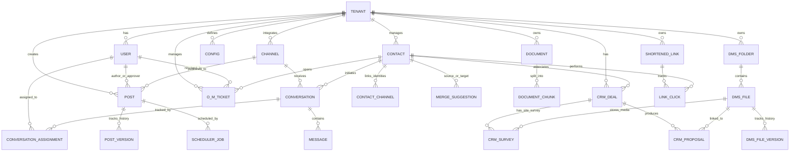
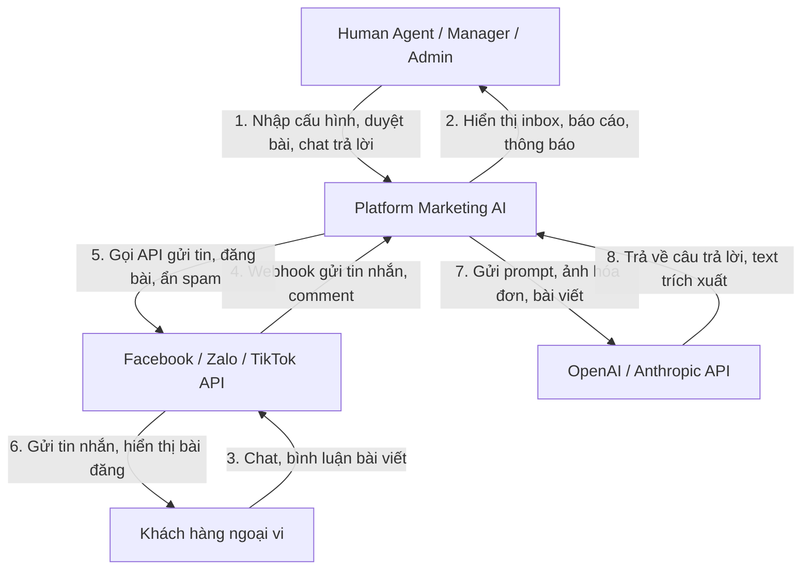
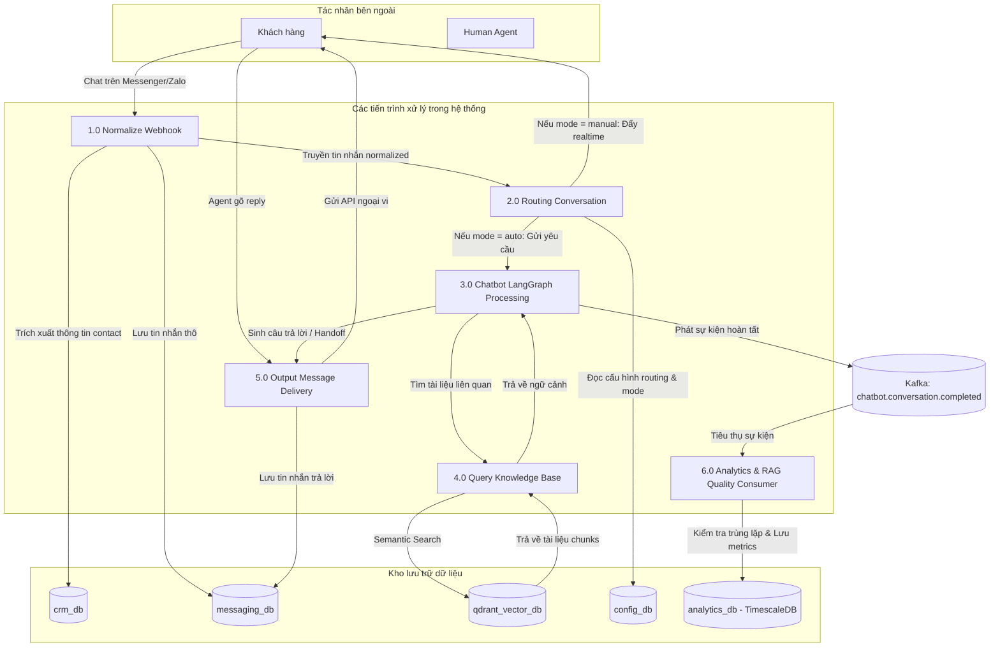

# 8. MÔ HÌNH DỮ LIỆU (DATA MODELS)

> Phần này tuân thủ cấu trúc ISO/IEC/IEEE 29148:2018. Tài liệu hóa toàn bộ cấu trúc dữ liệu của hệ thống, bao gồm Mô hình quan hệ thực thể (ERD), Cấu trúc chi tiết của các cơ sở dữ liệu dịch vụ (Logical Schema), Từ điển dữ liệu (Data Dictionary) và Sơ đồ luồng dữ liệu (DFD).

---

## 8.1. Sơ đồ quan hệ thực thể tổng quan (Conceptual ERD)

Dưới đây là sơ đồ quan hệ giữa các thực thể cốt lõi của hệ thống Marketing đa kênh tích hợp AI. Sơ đồ này mô tả cách dữ liệu liên kết chéo qua các phân hệ thông qua cơ chế định danh duy nhất.



---

## 8.2. Cấu trúc chi tiết các Cơ sở dữ liệu (Logical Schema)

Hệ thống sử dụng mô hình Database-per-service (Mỗi dịch vụ một Database riêng). Dưới đây là lược đồ cơ sở dữ liệu vật lý chi tiết của các dịch vụ cốt lõi, áp dụng PostgreSQL RLS (`tenant_id` là khóa ngoại bắt buộc).

### 8.2.1. Dịch vụ Tin nhắn (messaging_db)

#### 1. Bảng `conversations` (Quản lý các cuộc hội thoại)
| Column Name | Data Type | Constraints | Description |
|-------------|-----------|-------------|-------------|
| `id` | UUID | PRIMARY KEY | Định danh duy nhất cuộc hội thoại |
| `tenant_id` | VARCHAR(50) | NOT NULL, INDEX | Định danh Tenant (Dùng cho RLS) |
| `channel_id` | UUID | NOT NULL, FK | Liên kết tới kênh nhận tin nhắn |
| `contact_id` | UUID | NOT NULL | Liên kết tới Contact trong CRM |
| `status` | VARCHAR(20) | NOT NULL | `open`, `pending`, `closed` |
| `mode` | VARCHAR(10) | NOT NULL | `auto` (Bot), `manual` (Agent) |
| `last_message_at` | TIMESTAMP | NOT NULL | Thời gian tin nhắn cuối cùng |
| `created_at` | TIMESTAMP | DEFAULT NOW() | Thời gian khởi tạo cuộc hội thoại |

#### 2. Bảng `messages` (Chi tiết các tin nhắn trong hội thoại)
| Column Name | Data Type | Constraints | Description |
|-------------|-----------|-------------|-------------|
| `id` | UUID | PRIMARY KEY | Định danh duy nhất tin nhắn |
| `tenant_id` | VARCHAR(50) | NOT NULL | Định danh Tenant |
| `conversation_id`| UUID | NOT NULL, FK | Liên kết tới `conversations(id)` |
| `sender_type` | VARCHAR(10) | NOT NULL | `customer`, `agent`, `bot` |
| `sender_id` | VARCHAR(100) | NOT NULL | ID của người gửi (có thể là Agent ID hoặc Customer ID) |
| `message_type` | VARCHAR(15) | NOT NULL | `text`, `image`, `file`, `sticker` |
| `content` | TEXT | NULL | Nội dung tin nhắn dạng văn bản |
| `media_url` | TEXT | NULL | Đường dẫn tệp tin đính kèm (MinIO URL) |
| `status` | VARCHAR(15) | NOT NULL | `pending`, `delivered`, `failed` |
| `channel_msg_id` | VARCHAR(255) | UNIQUE, INDEX | ID tin nhắn gốc của Facebook/Zalo |
| `created_at` | TIMESTAMP | DEFAULT NOW() | Thời gian gửi tin nhắn |

---

### 8.2.2. Dịch vụ Khách hàng (crm_db)

#### 1. Bảng `contacts` (Danh bạ khách hàng)
| Column Name | Data Type | Constraints | Description |
|-------------|-----------|-------------|-------------|
| `id` | UUID | PRIMARY KEY | Định danh duy nhất khách hàng |
| `tenant_id` | VARCHAR(50) | NOT NULL, INDEX | Định danh Tenant |
| `name` | VARCHAR(100) | NOT NULL | Tên hiển thị của khách hàng |
| `phone` | VARCHAR(20) | NULL, INDEX | Số điện thoại (Che dấu nếu masked) |
| `email` | VARCHAR(100) | NULL | Địa chỉ email |
| `lead_score` | INTEGER | DEFAULT 0 | Điểm tiềm năng của khách hàng |
| `created_at` | TIMESTAMP | DEFAULT NOW() | Ngày tạo liên hệ |

#### 2. Bảng `contact_channels` (Lưu thông tin liên hệ đa kênh của một Contact)
| Column Name | Data Type | Constraints | Description |
|-------------|-----------|-------------|-------------|
| `id` | UUID | PRIMARY KEY | Định danh duy nhất |
| `tenant_id` | VARCHAR(50) | NOT NULL | Định danh Tenant |
| `contact_id` | UUID | NOT NULL, FK | Liên kết tới `contacts(id)` |
| `channel_type` | VARCHAR(20) | NOT NULL | `facebook`, `zalo`, `tiktok` |
| `external_user_id`| VARCHAR(255)| NOT NULL, INDEX | ID định danh khách hàng trên FB/Zalo |
| `linked_at` | TIMESTAMP | DEFAULT NOW() | Thời gian liên kết kênh |

#### 3. Bảng `merge_suggestions` (Đề xuất gộp Contact trùng lặp)
| Column Name | Data Type | Constraints | Description |
|-------------|-----------|-------------|-------------|
| `id` | UUID | PRIMARY KEY | Định danh đề xuất |
| `tenant_id` | VARCHAR(50) | NOT NULL | Định danh Tenant |
| `primary_contact_id`| UUID | NOT NULL, FK | Liên kết contact chính đề xuất giữ |
| `secondary_contact_id`| UUID | NOT NULL, FK | Liên kết contact phụ đề xuất gộp vào |
| `similarity_score` | NUMERIC(3,2) | NOT NULL | Độ tương đồng thông tin (0.00 - 1.00) |
| `status` | VARCHAR(15) | NOT NULL | `pending`, `merged`, `dismissed` |
| `created_at` | TIMESTAMP | DEFAULT NOW() | Thời gian tạo đề xuất |

#### 4. Bảng `crm_deals` (Quản lý các Deal bán hàng / cơ hội Solar)
| Column Name | Data Type | Constraints | Description |
|-------------|-----------|-------------|-------------|
| `id` | UUID | PRIMARY KEY | Định danh duy nhất Deal |
| `tenant_id` | VARCHAR(50) | NOT NULL, INDEX | Định danh Tenant (Dùng cho RLS) |
| `contact_id` | UUID | NOT NULL, FK | Liên kết tới `contacts(id)` |
| `title` | VARCHAR(255) | NOT NULL | Tiêu đề Deal (ví dụ: "Hệ Solar 10kWp - Nhà Anh A") |
| `status` | VARCHAR(30) | NOT NULL | Giai đoạn: `lead`, `consult`, `survey`, `proposal`, `negotiation`, `contract_signed`, `closed_lost` |
| `lost_reason` | TEXT | NULL | Lý do thất bại nếu status là `closed_lost` |
| `assigned_to` | UUID | NULL | ID nhân viên phụ trách Deal |
| `created_at` | TIMESTAMP | DEFAULT NOW() | Thời gian tạo Deal |
| `updated_at` | TIMESTAMP | DEFAULT NOW() | Thời gian cập nhật gần nhất |

#### 5. Bảng `crm_surveys` (Lưu thông tin khảo sát mái thực địa)
| Column Name | Data Type | Constraints | Description |
|-------------|-----------|-------------|-------------|
| `id` | UUID | PRIMARY KEY | Định danh duy nhất khảo sát |
| `tenant_id` | VARCHAR(50) | NOT NULL | Định danh Tenant |
| `deal_id` | UUID | UNIQUE NOT NULL, FK | Liên kết tới `crm_deals(id)` |
| `surveyor_id` | UUID | NOT NULL | ID Kỹ thuật viên đi khảo sát |
| `scheduled_at` | TIMESTAMP | NOT NULL | Thời gian hẹn khảo sát |
| `roof_area_sqm`| NUMERIC(6,2)| NULL | Diện tích mái đo đạc thực tế (m²) |
| `roof_slope_deg`| NUMERIC(4,1)| NULL | Độ dốc mái (độ) |
| `roof_type` | VARCHAR(100) | NULL | Loại vật liệu mái (ví dụ: ngói, tôn, bê tông) |
| `roof_direction`| VARCHAR(50) | NULL | Hướng mái (ví dụ: Nam, Đông Nam, Tây Nam) |
| `media_folder_id`| UUID | NULL | Thư mục DMS chứa hình ảnh hiện trường |
| `notes` | TEXT | NULL | Ghi chú khảo sát của Kỹ thuật viên |
| `created_at` | TIMESTAMP | DEFAULT NOW() | Thời gian hoàn tất phiếu khảo sát |

#### 6. Bảng `crm_proposals` (Đề xuất Solar & Tính toán ROI hoàn vốn)
| Column Name | Data Type | Constraints | Description |
|-------------|-----------|-------------|-------------|
| `id` | UUID | PRIMARY KEY | Định danh duy nhất Proposal |
| `tenant_id` | VARCHAR(50) | NOT NULL | Định danh Tenant |
| `deal_id` | UUID | NOT NULL, FK | Liên kết tới `crm_deals(id)` |
| `monthly_bill` | NUMERIC(15,2)| NOT NULL | Hóa đơn tiền điện trung bình của khách (VND) |
| `system_size_kwp`| NUMERIC(6,2)| NOT NULL | Công suất hệ thống đề xuất (kWp) |
| `panel_quantity`| INTEGER | NOT NULL | Số lượng tấm pin khuyến nghị |
| `estimated_kwh_month`| NUMERIC(8,2)| NOT NULL| Sản lượng điện dự kiến trung bình tháng (kWh) |
| `savings_percentage`| NUMERIC(5,2)| NOT NULL| Tỷ lệ tiết kiệm điện so với tiền điện cũ (%) |
| `payback_years` | NUMERIC(4,2)| NOT NULL | Thời gian hoàn vốn đầu tư dự kiến (năm) |
| `dms_file_id` | UUID | NULL, FK | ID file Proposal PDF được xuất và lưu trong DMS |
| `pdf_presigned_url` | TEXT | NULL | Đường dẫn tải xuống tạm thời (Presigned URL) có TTL 15 phút |
| `pdf_generated_at` | TIMESTAMP | NULL | Thời điểm xuất file PDF đề xuất đầu tư |
| `created_at` | TIMESTAMP | DEFAULT NOW() | Thời gian tạo báo giá |

#### 7. Bảng `crm_tickets` (Quản lý các Ticket bảo trì & vận hành O&M sau bán hàng)
| Column Name | Data Type | Constraints | Description |
|-------------|-----------|-------------|-------------|
| `id` | UUID | PRIMARY KEY | Định danh duy nhất Ticket |
| `tenant_id` | VARCHAR(50) | NOT NULL, INDEX | Định danh Tenant (RLS) |
| `contact_id` | UUID | NOT NULL, FK | Liên kết tới `contacts(id)` |
| `title` | VARCHAR(255) | NOT NULL | Tiêu đề sự cố / yêu cầu hỗ trợ |
| `description` | TEXT | NOT NULL | Chi tiết sự cố do khách báo |
| `priority` | VARCHAR(15) | NOT NULL | Độ ưu tiên: `low`, `medium`, `high`, `critical` |
| `status` | VARCHAR(20) | NOT NULL | Trạng thái: `open`, `assigned`, `in_progress`, `closed` |
| `assigned_to` | UUID | NULL | ID Kỹ thuật viên bảo trì phụ trách sửa chữa |
| `resolution_notes`| TEXT | NULL | Ghi chú kết quả khắc phục sự cố |
| `media_folder_id`| UUID | NULL | Thư mục DMS chứa hình ảnh nghiệm thu |
| `created_at` | TIMESTAMP | DEFAULT NOW() | Thời gian tạo ticket |
| `closed_at` | TIMESTAMP | NULL | Thời gian đóng ticket |

---

### 8.2.3. Dịch vụ Nội dung (content_db)

#### 1. Bảng `posts` (Danh sách bài viết tiếp thị)
| Column Name | Data Type | Constraints | Description |
|-------------|-----------|-------------|-------------|
| `id` | UUID | PRIMARY KEY | Định danh bài viết |
| `tenant_id` | VARCHAR(50) | NOT NULL | Định danh Tenant |
| `title` | VARCHAR(255) | NOT NULL | Tiêu đề nội dung |
| `status` | VARCHAR(20) | NOT NULL | `draft`, `pending_approval`, `approved`, `published`, `draft_failed` |
| `quality_score` | NUMERIC(3,2) | NULL | Điểm chất lượng AI đánh giá |
| `creator_id` | UUID | NOT NULL | ID nhân viên tạo bài viết |
| `created_at` | TIMESTAMP | DEFAULT NOW() | Ngày tạo |

#### 2. Bảng `post_versions` (Lưu lịch sử thay đổi phiên bản bài viết)
| Column Name | Data Type | Constraints | Description |
|-------------|-----------|-------------|-------------|
| `id` | UUID | PRIMARY KEY | Định danh phiên bản |
| `post_id` | UUID | NOT NULL, FK | Liên kết tới `posts(id)` |
| `version` | INTEGER | NOT NULL | Số thứ tự phiên bản (1, 2, 3...) |
| `content_fb` | TEXT | NULL | Nội dung tối ưu cho Facebook |
| `content_zalo` | TEXT | NULL | Nội dung tối ưu cho Zalo |
| `content_tiktok`| TEXT | NULL | Nội dung tối ưu cho TikTok |
| `updated_by` | UUID | NOT NULL | ID người thực hiện cập nhật |
| `updated_at` | TIMESTAMP | DEFAULT NOW() | Thời gian cập nhật phiên bản |

---

### 8.2.4. Dịch vụ Cấu hình Tenant (config_db)

#### 1. Bảng `tenant_configs` (Lưu cấu hình hệ thống)
| Column Name | Data Type | Constraints | Description |
|-------------|-----------|-------------|-------------|
| `tenant_id` | VARCHAR(50) | PRIMARY KEY | Định danh duy nhất Tenant |
| `ai_kb_config` | JSONB | NOT NULL | Cấu hình Chatbot & RAG (Confidence, Vision) |
| `routing_config`| JSONB | NOT NULL | Cấu hình luồng Chat & Giờ hoạt động |
| `content_config`| JSONB | NOT NULL | Cấu hình phê duyệt, từ cấm bài viết |
| `crm_config` | JSONB | NOT NULL | Cấu hình lead score, gộp contact |
| `security_config`| JSONB | NOT NULL | Cấu hình bảo mật, rate limit, CORS, password policy |
| `updated_at` | TIMESTAMP | DEFAULT NOW() | Thời gian cập nhật cấu hình gần nhất |

#### 2. Bảng `system_tier_limits` (Quản lý hạn mức tài nguyên của các gói cước hệ thống)
| Column Name | Data Type | Constraints | Description |
|-------------|-----------|-------------|-------------|
| `tier` | VARCHAR(50) | PRIMARY KEY | Tên gói cước (`free`, `standard`, `enterprise`) |
| `api_requests_per_min` | INTEGER | DEFAULT 200 | Hạn mức cuộc gọi API tối đa mỗi phút |
| `ai_web_search_per_hour` | INTEGER | DEFAULT 50 | Hạn mức tìm kiếm web AI tối đa mỗi giờ |
| `ai_generate_content_per_hour`| INTEGER | DEFAULT 20 | Hạn mức tạo nội dung AI tối đa mỗi giờ |
| `ai_kb_search_per_hour` | INTEGER | DEFAULT 500 | Hạn mức tìm kiếm tri thức tối đa mỗi giờ |
| `channel_send_per_hour` | INTEGER | DEFAULT 200 | Hạn mức gửi tin nhắn kênh tối đa mỗi giờ |
| `updated_at` | TIMESTAMP | DEFAULT NOW() | Thời gian cập nhật gần nhất |

#### 3. Bảng `roles` (Quản lý các vai trò người dùng trong hệ thống)
| Column Name | Data Type | Constraints | Description |
|-------------|-----------|-------------|-------------|
| `id` | UUID | PRIMARY KEY | Định danh duy nhất vai trò |
| `tenant_id` | VARCHAR(50) | NOT NULL, INDEX | Định danh Tenant (Dùng cho RLS) |
| `name` | VARCHAR(100) | NOT NULL | Tên vai trò (ví dụ: `admin`, `custom_agent`) |
| `is_system` | BOOLEAN | DEFAULT FALSE | Đánh dấu vai trò hệ thống mặc định, không cho phép xóa |
| `description` | VARCHAR(255) | NULL | Mô tả chức năng vai trò |
| `created_at` | TIMESTAMP | DEFAULT NOW() | Thời điểm khởi tạo vai trò |
| `updated_at` | TIMESTAMP | DEFAULT NOW() | Thời điểm cập nhật gần nhất |

*Constraint:* UNIQUE(`tenant_id`, `name`) để tránh trùng vai trò trong cùng một Tenant.

#### 4. Bảng `role_permissions` (Danh sách các quyền hạn được gán cho vai trò)
| Column Name | Data Type | Constraints | Description |
|-------------|-----------|-------------|-------------|
| `id` | UUID | PRIMARY KEY | Định danh duy nhất bản ghi |
| `role_id` | UUID | NOT NULL, FK | Liên kết tới bảng `roles(id)` (ON DELETE CASCADE) |
| `resource` | VARCHAR(100) | NOT NULL | Tài nguyên (ví dụ: `chatbot`, `crm`, `campaign`) |
| `action` | VARCHAR(50) | NOT NULL | Hành động cho phép (`read`, `write`, `*`) |
| `created_at` | TIMESTAMP | DEFAULT NOW() | Thời điểm gán quyền |

*Constraint:* UNIQUE(`role_id`, `resource`, `action`) để tránh trùng lặp quyền gán.

#### 5. Bảng `config_audit_logs` (Lịch sử kiểm toán thay đổi cấu hình)
| Column Name | Data Type | Constraints | Description |
|-------------|-----------|-------------|-------------|
| `id` | UUID | PRIMARY KEY | Định danh duy nhất bản ghi log |
| `tenant_id` | VARCHAR(50) | NOT NULL, INDEX | Định danh Tenant |
| `changed_by` | UUID | NOT NULL | ID người thực hiện thay đổi |
| `category` | VARCHAR(50) | NOT NULL | Nhóm cấu hình bị thay đổi |
| `field_name` | VARCHAR(100) | NOT NULL | Tên thuộc tính bị thay đổi |
| `old_value` | JSONB | NULL | Giá trị trước khi thay đổi (Đã ẩn nếu nhạy cảm) |
| `new_value` | JSONB | NULL | Giá trị sau khi thay đổi (Đã ẩn nếu nhạy cảm) |
| `changed_at` | TIMESTAMP | DEFAULT NOW() | Thời điểm thay đổi |


---

### 8.2.5. Dịch vụ Quản lý tài liệu (dms_db)

#### 1. Bảng `dms_folders` (Thư mục ảo quản lý tệp tin)
| Column Name | Data Type | Constraints | Description |
|-------------|-----------|-------------|-------------|
| `id` | UUID | PRIMARY KEY | Định danh thư mục |
| `tenant_id` | VARCHAR(50) | NOT NULL, INDEX | Định danh Tenant (Dùng cho RLS) |
| `name` | VARCHAR(255) | NOT NULL | Tên thư mục |
| `parent_folder_id`| UUID | NULL, FK | Thư mục cha (Đệ quy tự tham chiếu) |
| `access_mode` | VARCHAR(15) | NOT NULL | Quyền truy cập: `public` hoặc `private` |
| `created_at` | TIMESTAMP | DEFAULT NOW() | Ngày tạo thư mục |

#### 2. Bảng `dms_files` (Thông tin tệp tin)
| Column Name | Data Type | Constraints | Description |
|-------------|-----------|-------------|-------------|
| `id` | UUID | PRIMARY KEY | Định danh tệp tin |
| `tenant_id` | VARCHAR(50) | NOT NULL, INDEX | Định danh Tenant (Dùng cho RLS) |
| `folder_id` | UUID | NULL, FK | Liên kết tới `dms_folders(id)` |
| `name` | VARCHAR(255) | NOT NULL | Tên tệp tin |
| `current_version` | INTEGER | DEFAULT 1 | Số hiệu phiên bản hiện tại |
| `created_by` | UUID | NOT NULL | ID người upload |
| `created_at` | TIMESTAMP | DEFAULT NOW() | Ngày tạo |

#### 3. Bảng `dms_file_versions` (Lịch sử các phiên bản tệp tin)
| Column Name | Data Type | Constraints | Description |
|-------------|-----------|-------------|-------------|
| `id` | UUID | PRIMARY KEY | Định danh phiên bản |
| `file_id` | UUID | NOT NULL, FK | Liên kết tới `dms_files(id)` |
| `version` | INTEGER | NOT NULL | Số hiệu phiên bản (1, 2, 3...) |
| `file_size` | BIGINT | NOT NULL | Dung lượng tệp tin (bytes) |
| `mime_type` | VARCHAR(100) | NOT NULL | Định dạng tệp (ví dụ: `application/pdf`) |
| `storage_path` | VARCHAR(512) | NOT NULL | Đường dẫn lưu vật lý trên MinIO/S3 |
| `uploaded_by` | UUID | NOT NULL | ID người tải phiên bản này lên |
| `uploaded_at` | TIMESTAMP | DEFAULT NOW() | Ngày upload |

---

### 8.2.6. Dịch vụ Theo dõi liên kết (shortener_db)

#### 1. Bảng `shortened_links` (Quản lý các liên kết rút gọn)
| Column Name | Data Type | Constraints | Description |
|-------------|-----------|-------------|-------------|
| `short_code` | VARCHAR(15) | PRIMARY KEY | Mã rút gọn duy nhất (ví dụ: `abc123xyz`) |
| `tenant_id` | VARCHAR(50) | NOT NULL, INDEX | Định danh Tenant (Dùng cho RLS) |
| `original_url`| VARCHAR(2048)| NOT NULL | Đường dẫn gốc cần chuyển hướng |
| `campaign_id` | UUID | NULL | Liên kết tới chiến dịch Marketing gửi tin |
| `contact_id` | UUID | NOT NULL | Khách hàng nhận tin nhắn chứa link này |
| `variant_label`| VARCHAR(10) | NULL | Nhãn nhóm A/B Testing (`A` hoặc `B`) |
| `created_at` | TIMESTAMP | DEFAULT NOW() | Thời gian tạo link |

#### 2. Bảng `link_clicks` (Theo dõi lượt click của khách hàng)
| Column Name | Data Type | Constraints | Description |
|-------------|-----------|-------------|-------------|
| `id` | UUID | PRIMARY KEY | Định danh duy nhất sự kiện click |
| `tenant_id` | VARCHAR(50) | NOT NULL | Định danh Tenant |
| `short_code` | VARCHAR(15) | NOT NULL, FK | Liên kết tới `shortened_links(short_code)` |
| `clicked_at` | TIMESTAMP | DEFAULT NOW() | Thời điểm khách hàng click link |
| `ip_address` | VARCHAR(45) | NULL | Địa chỉ IP của khách hàng |
| `user_agent` | VARCHAR(512) | NULL | Thông tin trình duyệt/thiết bị sử dụng |
| `country` | VARCHAR(50) | NULL | Quốc gia được phân tích từ IP |


---

### 8.2.7. Dịch vụ AI Core (ai_core_db)

#### 1. Bảng `llm_usage_logs` (Ghi nhật ký sử dụng LLM phục vụ thống kê chi phí và hiệu suất)
| Column Name | Data Type | Constraints | Description |
|-------------|-----------|-------------|-------------|
| `id` | UUID | PRIMARY KEY | Định danh duy nhất bản ghi log |
| `tenant_id` | VARCHAR(50) | NOT NULL, INDEX | Định danh Tenant (Dùng cho RLS) |
| `use_case` | VARCHAR(50) | NOT NULL | Trường hợp sử dụng (ví dụ: chatbot, content, crm) |
| `model` | VARCHAR(100) | NOT NULL | Tên model thực tế đã sử dụng (ví dụ: gpt-4o-mini) |
| `provider` | VARCHAR(50) | NOT NULL | Nhà cung cấp LLM (openai, anthropic, deepseek, local) |
| `prompt_tokens` | INTEGER | NOT NULL | Số lượng token đầu vào (input tokens) |
| `completion_tokens` | INTEGER | NOT NULL | Số lượng token đầu ra (output tokens) |
| `cost_usd` | DECIMAL(10, 6) | NOT NULL | Chi phí thực tế bằng USD |
| `latency_ms` | INTEGER | NOT NULL | Thời gian phản hồi tính bằng mili-giây |
| `cache_hit` | BOOLEAN | DEFAULT FALSE | Trạng thái trúng prompt cache |
| `is_fallback` | BOOLEAN | DEFAULT FALSE | Xác định yêu cầu này có phải là fallback không |
| `metadata` | JSONB | DEFAULT '{}' | Thông tin bổ sung dạng JSON |
| `created_at` | TIMESTAMPTZ | DEFAULT NOW() | Thời gian ghi log |

#### 2. Bảng `prompt_templates` (Quản lý các mẫu prompt hệ thống theo phiên bản)
| Column Name | Data Type | Constraints | Description |
|-------------|-----------|-------------|-------------|
| `id` | UUID | PRIMARY KEY | Định danh duy nhất mẫu prompt |
| `tenant_id` | VARCHAR(50) | NOT NULL, INDEX | Định danh Tenant |
| `name` | VARCHAR(255) | NOT NULL | Tên gợi nhớ của prompt template |
| `use_case` | VARCHAR(50) | NOT NULL | Phân loại trường hợp sử dụng |
| `version` | INTEGER | NOT NULL DEFAULT 1 | Phiên bản của prompt template |
| `system_prompt` | TEXT | NOT NULL | Nội dung prompt hệ thống |
| `is_active` | BOOLEAN | DEFAULT TRUE | Trạng thái kích hoạt của prompt |
| `created_at` | TIMESTAMPTZ | DEFAULT NOW() | Thời gian khởi tạo |

#### 3. Bảng `llm_route_configs` (Cấu hình định tuyến mô hình động)
| Column Name | Data Type | Constraints | Description |
|-------------|-----------|-------------|-------------|
| `id` | UUID | PRIMARY KEY | Định danh duy nhất cấu hình định tuyến |
| `use_case` | VARCHAR(50) | NOT NULL | Use case định tuyến (ví dụ: chatbot, content) |
| `tenant_id` | VARCHAR(50) | NOT NULL, INDEX | Định danh Tenant |
| `primary_model` | VARCHAR(100) | NOT NULL | Mô hình chạy chính (ví dụ: gpt-4o-mini) |
| `fallback_model` | VARCHAR(100) | NOT NULL | Mô hình dự phòng khi lỗi (ví dụ: claude-3-haiku-20240307) |
| `provider` | VARCHAR(50) | NOT NULL | Nhà cung cấp chính |
| `fallback_provider` | VARCHAR(50) | NOT NULL | Nhà cung cấp dự phòng |
| `temperature` | NUMERIC(3, 2) | DEFAULT 0.3 | Tham số sáng tạo của mô hình |
| `max_tokens` | INTEGER | DEFAULT 300 | Giới hạn số token tối đa cho câu trả lời |
| `is_active` | BOOLEAN | DEFAULT TRUE | Trạng thái kích hoạt của cấu hình định tuyến |
| `created_at` | TIMESTAMPTZ | DEFAULT NOW() | Thời gian tạo |
| `updated_at` | TIMESTAMPTZ | DEFAULT NOW() | Thời gian cập nhật |

#### 4. Bảng `api_key_configs` (Quản lý các khóa API LLM được mã hóa và endpoint custom)
| Column Name | Data Type | Constraints | Description |
|-------------|-----------|-------------|-------------|
| `id` | UUID | PRIMARY KEY | Định danh cấu hình API key |
| `provider` | VARCHAR(50) | NOT NULL, UNIQUE | Nhà cung cấp LLM (openai, anthropic, deepseek, v.v.) |
| `api_key_encrypted` | TEXT | NOT NULL | API Key đã được mã hóa đối xứng AES-256 ở mức ứng dụng |
| `api_base` | TEXT | NULL | Endpoint URL tùy chỉnh (phục vụ Ollama/vLLM/Local hosting) |
| `is_active` | BOOLEAN | DEFAULT TRUE | Trạng thái kích hoạt |
| `created_at` | TIMESTAMPTZ | DEFAULT NOW() | Thời gian tạo |
| `updated_at` | TIMESTAMPTZ | DEFAULT NOW() | Thời gian cập nhật |

### 8.2.8. Dịch vụ Thống kê & Phân tích (analytics_db)

Dịch vụ sử dụng cơ sở dữ liệu chuỗi thời gian TimescaleDB để lưu trữ hiệu năng chatbot và phân tích các khoảng trống tri thức RAG. Bảng chính là hypertable `rag_metrics`.

#### 1. Bảng `rag_metrics` (Lưu thông số hiệu năng và chất lượng RAG)
| Column Name | Data Type | Constraints | Description |
|-------------|-----------|-------------|-------------|
| `time` | TIMESTAMPTZ | PRIMARY KEY (tổ hợp) | Thời điểm ghi nhận sự kiện (Mốc thời gian TimescaleDB) |
| `event_id` | UUID | PRIMARY KEY (tổ hợp), UNIQUE | Định danh duy nhất sự kiện |
| `tenant_id` | VARCHAR(50) | NOT NULL, INDEX | Định danh Tenant (RLS) |
| `conversation_id`| UUID | NOT NULL | Định danh cuộc hội thoại |
| `user_query` | TEXT | NOT NULL | Câu hỏi gốc của người dùng |
| `standalone_query`| TEXT | NOT NULL | Câu hỏi sau khi đã viết lại |
| `query_rewritten`| BOOLEAN | NOT NULL | Trạng thái có viết lại hay không |
| `rag_similarity` | NUMERIC(3,2) | NOT NULL | Điểm tương đồng RAG lớn nhất |
| `rag_docs_count` | INTEGER | NOT NULL | Số lượng chunks tài liệu tham chiếu |
| `nli_grounding` | NUMERIC(3,2) | NOT NULL | Điểm Grounding xác thực NLI |
| `confidence_score`| NUMERIC(3,2) | NOT NULL | Điểm tin cậy ý định chatbot |
| `chatbot_action` | VARCHAR(20) | NOT NULL | Hành động gắn tag: `reply`, `handoff`, `clarify`, `lead_capture` |
| `handoff_reason` | VARCHAR(50) | NULL | Lý do chuyển giao nếu action là `handoff` |
| `cache_hit` | BOOLEAN | NOT NULL | Trạng thái trúng semantic cache |
| `model_used` | VARCHAR(100) | NOT NULL | Mô hình LLM được sử dụng |
| `latency_ms` | INTEGER | NOT NULL | Độ trễ xử lý (mili-giây) |

*Chỉ mục bổ sung:*
- Thiết lập Hypertable trên cột `time`: `SELECT create_hypertable('rag_metrics', 'time');`
- Index `idx_rag_tenant` trên `(tenant_id, time DESC)`
- Index `idx_rag_action` trên `(tenant_id, chatbot_action, time DESC)`
- Index lọc `idx_rag_low_sim` trên `(tenant_id, rag_similarity)` WHERE `rag_similarity < 0.50`

#### 2. Cấu trúc JSON Payload sự kiện `chatbot.conversation.completed`
```json
{
  "event_id": "8fa53272-96b3-4f9e-a89c-c90ad73105ff",
  "tenant_id": "tenant-solavie-99a",
  "conversation_id": "e93fca10-1845-42bf-be45-b46198f12111",
  "user_query": "Bảo hành pin thế nào?",
  "standalone_query": "Chính sách bảo hành pin lithium Solavie thế nào?",
  "query_rewritten": true,
  "rag_similarity_score": 0.48,
  "rag_docs_count": 3,
  "nli_grounding_score": 0.0,
  "confidence_score": 0.85,
  "chatbot_action": "handoff",
  "handoff_reason": "low_similarity",
  "cache_hit": false,
  "model_used": "gpt-4o-mini",
  "latency_ms": 1250,
  "timestamp": "2026-06-12T14:30:00Z"
}
```

---

### 8.2.9. Redis Stack (Semantic Cache DB)

Hệ thống sử dụng Redis Stack làm cơ sở dữ liệu vector để lưu trữ và truy vấn ngữ nghĩa cho chatbot. Mỗi bản ghi cache được lưu trữ dưới dạng một Hash trên Redis DB 0.

#### Lược đồ Redis Hash: `semantic_cache:{tenant_id}:{md5_hash_question}`
| Field Name | Data Type | Description |
|------------|-----------|-------------|
| `tenant_id` | TAG | UUID/Định danh Tenant để cô lập đa thuê và lọc dữ liệu |
| `use_case` | TAG | Phân nhóm cache (ví dụ: `chatbot`) |
| `question` | TEXT | Nội dung câu hỏi thô của khách hàng |
| `response` | TEXT | Nội dung câu trả lời tương ứng do LLM sinh ra |
| `vector` | VECTOR | Vector embedding 384 chiều, kiểu FLOAT32 (HNSW Cosine) |
| `created_at`| TEXT | Thời gian lưu cache (ISO8601) |

---
## 8.3. Từ điển dữ liệu chi tiết (Data Dictionary Sample)

Dưới đây là mô tả chi tiết kiểu dữ liệu và ràng buộc của các trường dữ liệu quan trọng trong bảng cấu hình `tenant_configs` thuộc trường `ai_kb_config` (JSONB):

| Field Path | Type | Constraints | Description | Default |
|------------|------|-------------|-------------|---------|
| `chatbot_enabled` | Boolean | NOT NULL | Trạng thái kích hoạt phản hồi tự động của Bot | `true` |
| `confidence_threshold`| Numeric | Range: `[0.60, 0.95]` | Ngưỡng điểm tin cậy tối thiểu để bot tự động phản hồi khách hàng | `0.70` |
| `auto_handoff_on_negative` | Boolean | NOT NULL | Tự động chuyển Agent khi khách giận dữ | `true` |
| `ai_vision_invoice_reading` | Boolean | NOT NULL | Bật tính năng OCR đọc ảnh hóa đơn tự động | `true` |
| `rag_relevance_threshold` | Numeric | Range: `[0.0, 1.0]` | Ngưỡng điểm tìm kiếm tri thức RAG để bot phản hồi | `0.50` |
| `cost_limit_usd` | Numeric | Range: `[0.0, 100000.0]`, NULL | Hạn mức chi phí LLM tối đa của Tenant trong 30 ngày (USD). Mặc định null là không giới hạn | `null` |
| `cost_alert_threshold_percent` | Integer | Range: `[50, 100]` | Ngưỡng phần trăm chi phí tích lũy để kích hoạt cảnh báo ngân sách | `80` |
| `cost_limit_policy` | String | Enum: `['notify_only', 'auto_downgrade', 'block']` | Chính sách xử lý khi chi phí tích lũy vượt quá 100% hạn mức cost_limit_usd | `'notify_only'` |
| `security_comments_notif.dms_max_storage_mb` | Integer | Range: `[100, 100000]` | Hạn mức dung lượng lưu trữ tối đa của Tenant (Megabytes) | `5000` |
| `security_comments_notif.dms_max_file_versions` | Integer | Range: `[1, 20]` | Số lượng phiên bản lưu trữ tối đa của một tệp | `5` |

---

## 8.4. Sơ đồ luồng dữ liệu (Data Flow Diagrams - DFD)

### 8.4.1. DFD Cấp 0 (Context Diagram)

Sơ đồ ngữ cảnh mô tả luồng giao tiếp dữ liệu chính giữa hệ thống Platform Marketing đa kênh với các tác nhân và hệ thống bên ngoài:



### 8.4.2. DFD Cấp 1 (Phân rã luồng tin nhắn và Chatbot xử lý)

Sơ đồ chi tiết luồng luân chuyển dữ liệu khi một tin nhắn mới từ khách hàng được gửi tới hệ thống:



---

*← [Trước: External Interfaces](./07_External_Interfaces.md) | [Về Mục lục](./00_SRS_Index.md) | [Tiếp: System Architecture →](./09_System_Architecture.md)*
