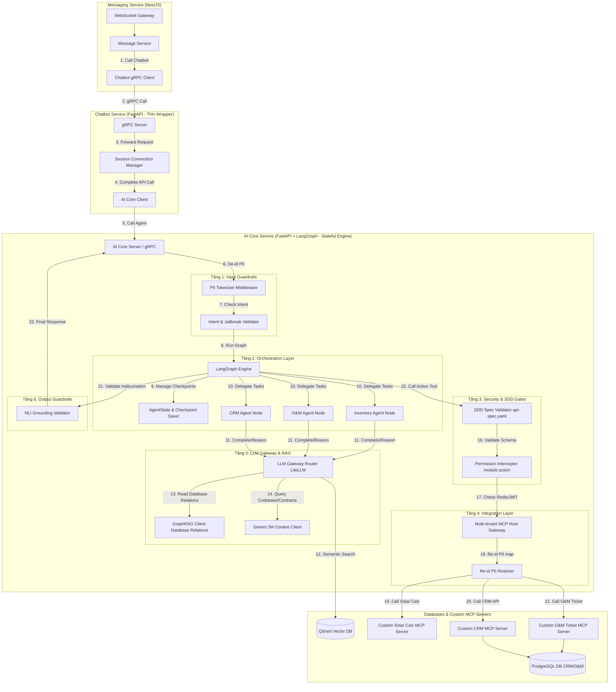
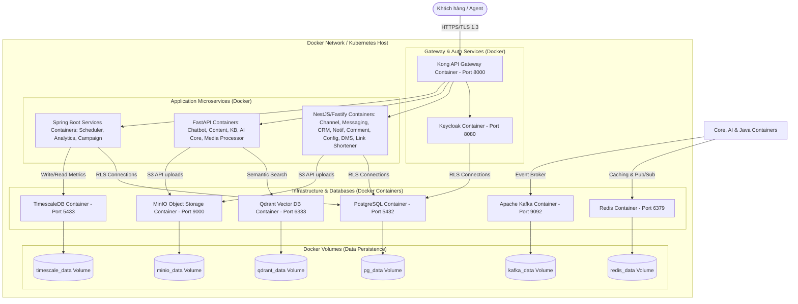

# 9. KIẾN TRÚC HỆ THỐNG (SYSTEM ARCHITECTURE)

> Phần này tuân thủ cấu trúc ISO/IEC/IEEE 29148:2018. Mô tả chi tiết kiến trúc hạ tầng kỹ thuật, sơ đồ phân rã dịch vụ, cơ chế giao tiếp liên dịch vụ, chiến lược multi-tenancy và mô hình triển khai hệ thống.

---

## 9.1. Sơ đồ kiến trúc tổng thể (System Architecture Diagram)

Hệ thống được thiết kế theo kiến trúc Microservices hướng sự kiện (Event-Driven Architecture), phân bổ thành 3 lớp dịch vụ chính chạy trên nền tảng Docker/Kubernetes và giao tiếp thông qua Apache Kafka, REST API và gRPC.

```mermaid
graph TB
    subgraph "Client Layer"
        Dashboard["Dashboard (Next.js 14 + TS)"]
    end

    subgraph "Gateway & Auth Layer"
        Kong["Kong API Gateway (Port 8000)"]
        Keycloak["Keycloak Auth (Port 8080)"]
    end

    subgraph "Node.js Core Services (NestJS / Fastify)"
        CC["Channel Connector (Port 3001)"]
        MSG["Messaging (Port 3002)"]
        CRM["CRM Service (Port 3003)"]
        NOTIF["Notification Service (Port 3004)"]
        COMMENT["Comment Manager (Port 3005)"]
        CONF["Tenant Config (Port 3006)"]
        DMS["DMS Service (Port 3007)"]
        SHORT["Link Shortener (Port 3009)"]
    end

    subgraph "Python AI & Helper Services (FastAPI)"
        CB["Chatbot LangGraph (Port 8001 / gRPC 50051)"]
        CONTENT["Content Service (Port 8002)"]
        KB["Knowledge Base (Port 8004)"]
        AI["AI Core Service (Port 8005 / gRPC 50052)"]
        MED["Media Processor (Port 8008)"]
    end

    subgraph "Java Reliability Services (Spring Boot)"
        SCHED["Scheduler Quartz (Port 8003)"]
        ANALYTICS["Analytics TimescaleDB (Port 8006)"]
        CAMPAIGN["Campaign Service (Port 8007)"]
    end

    subgraph "Infrastructure Layer"
        Kafka["Apache Kafka (Message Broker)"]
        Redis["Redis 7 (Caching, Pub/Sub & Sessions)"]
        PG["PostgreSQL (Per-service DB)"]
        Qdrant["Qdrant (Vector DB)"]
        MinIO["MinIO (S3 Object Storage)"]
    end

    subgraph "External Integration"
        FB["Facebook API"]
        ZALO["Zalo OA API"]
        TIKTOK["TikTok API"]
        LLM["LLM Providers (OpenAI/Anthropic)"]
    end

    Dashboard -->|HTTPS/WSS| Kong
    Kong -->|OIDC Plugin| Keycloak
    Kong --> CC & MSG & CRM & NOTIF & COMMENT & CONTENT & SCHED & ANALYTICS & CAMPAIGN & CONF & DMS & SHORT
    
    MSG -->|gRPC| CB
    CB -->|gRPC| AI
    CB & CONTENT -->|REST| KB
    AI -->|HTTPS| LLM
    CC -->|HTTPS| FB & ZALO & TIKTOK

    CC & DMS & SHORT & MED -->|Publish Event| Kafka
    MSG & CRM & ANALYTICS & NOTIF & COMMENT & CONF & DMS & SHORT & MED -->|Consume/Publish| Kafka
    SCHED & CONTENT & CAMPAIGN -->|Publish Event| Kafka

    AllServices[All Services] -->|REST/gRPC| PG
    KB -->|REST| Qdrant
    AllServices -->|TCP| Redis
    CONTENT & KB & DMS & MED -->|S3 API| MinIO
    
    CONF -->|Cache & Pub/Sub| Redis
    CB & MSG & CONTENT & CC & COMMENT & CRM & DMS & SHORT -->|Read Config Cache| Redis
```

---

## 9.2. Danh mục dịch vụ và phân bổ công nghệ (Service Catalog)

| # | Service | Language | Framework | Port | Database | Nhiệm vụ chính |
|---|---------|----------|-----------|------|----------|----------------|
| 1 | **Gateway** | - | Kong 3.7 | 8000/8001 | DB-less (kong.yml) | Định tuyến API, giới hạn tần suất, SSL termination, tích hợp xác thực JWT. |
| 2 | **Auth** | Java | Keycloak 24+ | 8080 | keycloak_db (Postgres) | Xác thực OIDC, quản lý Realm đa tenant, phân quyền RBAC. |
| 3 | **Channel Connector** | Node.js | NestJS | 3001 | channel_connector_db | Đăng ký webhook các kênh, normalize message, refresh token mạng xã hội. |
| 4 | **Messaging** | Node.js | NestJS | 3002 | messaging_db | Quản lý Unified Inbox, luồng hội thoại Bot/Human, WebSocket realtime. |
| 5 | **Chatbot** | Python | FastAPI + LangGraph | 8001/50051 | chatbot_db | Quản lý state đồ thị LangGraph (State/Memory), điều phối hội thoại, tự động tóm tắt tin nhắn, tạm dừng breakpoint duyệt bởi Agent. |
| 6 | **Content** | Python | FastAPI | 8002 | content_db | Tạo bài viết AI theo brand voice, platform adaptation, quy trình phê duyệt. |
| 7 | **Scheduler** | Java | Spring Boot 3 + Quartz | 8003 | scheduler_db | Đặt lịch đăng bài múi giờ động, quản lý lịch trực quan, xử lý hàng đợi automation. |
| 8 | **Knowledge Base** | Python | FastAPI | 8004 | knowledge_db | RAG pipeline (Celery/ARQ async ingestion, FastEmbed local sparse, Parent-Child hierarchical indexing, Cache Versioning). |
| 9 | **AI Core** | Python | FastAPI | 8005/50052 | ai_core_db | LLM Gateway & Prompt Caching, định tuyến mô hình động (Dynamic Model Routing), quản lý khóa API mã hóa, bộ giả lập chi phí (Cost Simulator), rào chắn an toàn kép (Input Semantic Router & Output NLI), Cổng MCP Host Gateway đa tenant. |
| 9 | **AI Core** | Python | FastAPI + LangGraph | 8005/50052 | ai_core_db | **AI Core Enterprise (Lõi AI Tác nhân):** Lập luận có trạng thái (LangGraph Stateful Multi-Agent), Tích hợp Hybrid RAG (GraphRAG + Qdrant + Gemini 2M Context), Cổng MCP Host Gateway, Triple-Layer Guardrails (PII Tokenizer/Re-id, SDD Spec Validator, Permission Enforcement) và Tối ưu 12 LLM Providers. |
| 10| **Analytics** | Java | Spring Boot 3 | 8006 | analytics_db (TimescaleDB) | Thu thập metrics, báo cáo hiệu suất, tính toán ROI và hành vi khách hàng. |
| 11| **CRM** | Node.js | NestJS | 3003 | crm_db | Quản lý contact đa kênh, phân loại lead score, gom nhóm khách hàng tự động, quản lý Kanban Deal Pipeline, Site Survey và O&M Tickets. |
| 12| **Campaign** | Java | Spring Boot 3 | 8007 | campaign_db | Lên chiến dịch gửi tin nhắn hàng loạt, A/B testing hiệu quả content. |
| 13| **Notification** | Node.js | NestJS | 3004 | notification_db | Dispatch thông báo hệ thống qua email, push browser, SMS khi có handoff/error. |
| 14| **Comment Manager**| Node.js | NestJS | 3005 | comment_db | Lắng nghe comment, ẩn/xóa bình luận spam qua AI, tự động reply thắc mắc. |
| 15| **Tenant Config** | Node.js | NestJS | 3006 | config_db | Quản lý tập trung toàn bộ cấu hình hệ thống, đồng bộ hot reload qua Redis. |
| 16| **DMS**           | Node.js | NestJS | 3007 | dms_db | Quản lý tệp tin, thư mục ảo, kiểm soát phiên bản và quota lưu trữ của tenant. |
| 17| **Link Shortener** | Node.js | Fastify | 3009 | shortener_db | Rút gọn URL, theo dõi và ghi nhận lượt click của khách hàng phục vụ A/B Testing. |
| 18| **Media Processor**| Python  | FastAPI | 8008 | - | Chạy Celery worker nén ảnh, tạo thumbnail và transcode video chuẩn API mạng xã hội. |

---

## 9.3. Sơ đồ các thành phần trong Service (Component Diagram)

Dưới đây mô tả chi tiết sơ đồ thành phần cấu trúc nội bộ và luồng gọi dịch vụ giữa `Messaging Service`, `Chatbot Service` và `AI Core Service` sau khi tái cấu trúc chuyển toàn bộ lõi tác nhân thông minh về AI Core:

---

## 9.4. Cơ chế đồng bộ cấu hình (Configuration Sync Flow)

Để đảm bảo hiệu năng tối ưu trên hot-path gọi mô hình AI và tính tự trị (autonomy) của từng microservice, hệ thống phân tách cấu hình thành 2 cấp độ và thực hiện cơ chế đồng bộ qua **Publish-Subscribe** bằng Redis Pub/Sub:

### 9.4.1. Phân cấp & Vai trò Quản lý Cấu hình:
1.  **Cấu hình do System Admin quản lý (Gói cước):**
    *   **Phân hạng gói (Tiers):** Gán gói cước cho Tenant (`free`, `standard`, `enterprise`) được quản lý bởi System Admin và lưu tại Redis dưới key `tenant:{tenant_id}:tier`.
2.  **Cấu hình do Tenant Admin quản lý (BYOK & Custom Routing):**
    *   Tenant tự cấu hình khóa API riêng (BYOK), custom prompts, confidence thresholds qua Dashboard của Tenant. Thông tin lưu tại bảng `tenant_configs` của `config_db` (Tenant Config Service) dưới dạng mã hóa AES-256.

### 9.4.2. Xác thực khóa API (Strict Tenant API Key Verification - BYOK):
Khi thực hiện gọi LLM, `AI Core Service` bắt buộc phải sử dụng khóa API riêng của Tenant (BYOK model) để thực hiện cuộc gọi:
1.  **Tenant Custom API Key (BYOK):** Khóa API được Tenant cấu hình riêng trong DB cục bộ `api_key_configs` với `tenant_id == tenant_uuid`.
2.  **Từ chối và báo lỗi:** Nếu Tenant không thiết lập khóa API riêng (BYOK), hệ thống không sử dụng bất kỳ khóa dùng chung hay biến môi trường fallback nào mà lập tức trả về lỗi HTTP 400 yêu cầu bổ sung API Key cấu hình.

### 9.4.3. Quy trình Đồng bộ và Invalidate Cache:
1. **Thay đổi cấu hình**: Tenant Admin sửa đổi cấu hình model routing hoặc API Keys trên Dashboard, gửi yêu cầu tới `Tenant Config Service` (NestJS) và lưu vào `config_db`.
2. **Kích hoạt sự kiện**: `Tenant Config Service` ghi nhận, cập nhật Redis cache key `{tenant_id}:config:ai_kb` và publish một thông điệp lên kênh Redis Pub/Sub `config.updates`.
3. **Nhận thông điệp**: `AI Core Service` (FastAPI) lắng nghe kênh `config.updates` thông qua một tiến trình con (Background Listener).
4. **Đồng bộ cục bộ**:
   * Khi phát hiện sự kiện thuộc category `ai_kb`, `AI Core Service` gọi REST API/gRPC sang `Tenant Config Service` để truy vấn cấu hình mới nhất của tenant đó (đính kèm `X-Tenant-ID` header).
   * `AI Core Service` lưu cấu hình này vào cơ sở dữ liệu cục bộ `ai_core_db` (các bảng `llm_route_configs` và `api_key_configs`) để làm backup dự phòng.
   * `AI Core Service` làm trống (invalidate) các cache keys cũ trong Redis gồm `{tenant_id}:config:llm_model_routing` và `{tenant_id}:config:api_keys` để buộc các cuộc gọi tiếp theo phải nạp lại cấu hình mới.

### 9.4.4. Tự động Khởi tạo Cấu hình Định tuyến mặc định (Auto-configuration on First Key):
Để đơn giản hóa trải nghiệm Onboarding của Tenant, hệ thống tích hợp cơ chế tự động cấu hình định tuyến mô hình thông minh:
1. Khi Tenant thực hiện đăng ký khóa API đầu tiên của họ thông qua REST API (`POST /configs/keys`) hoặc qua tiến trình Background Sync Listener:
2. Hệ thống kiểm tra số lượng khóa API hiện hoạt trong DB. Nếu trước đó Tenant chưa có khóa hoạt động nào và đây là khóa hoạt động đầu tiên:
3. Hệ thống sẽ tự động truy vấn bảng mặc định hệ thống `system_default_route_configs` của nhà cung cấp tương ứng (ví dụ: OpenAI) để tìm các mô hình chat rẻ nhất hiện tại cho 5 usecases.
4. Tự động tạo và lưu trữ 5 bản ghi định tuyến (`LLMRouteConfig`) tương ứng cho Tenant, đồng thời xóa cache Redis để có thể sử dụng định tuyến ngay lập tức.

---

## 9.5. Chiến lược Multi-tenancy & Cô lập dữ liệu (Data Isolation)

Hệ thống được thiết kế theo mô hình **SaaS Multi-tenant** với mức độ cô lập dữ liệu cao nhằm đảm bảo tính bảo mật và tuân thủ dữ liệu doanh nghiệp:

1. **Identity & Access Isolation:** Sử dụng tính năng Multi-realm của Keycloak. Mỗi Tenant khi đăng ký sẽ được khởi tạo một Realm riêng biệt chứa danh sách User, Roles và Client Credentials độc lập. Token JWT phát hành sẽ chứa thuộc tính `tenant_id` và `roles` trong payload claim. Đồng thời, hệ thống áp dụng cơ chế **Client Scopes** để phân tách quyền hạn truy cập của từng client (Dashboard, API Gateway) đối với các microservices nghiệp vụ (ví dụ: scope `campaign` cho Campaign Service, `crm` cho CRM Service) theo nguyên lý Least Privilege. API Gateway sẽ thực thi việc kiểm tra (Scope Validation) trước khi định tuyến API request.
   * **Hybrid User Architecture:** Hệ thống tách rời hoàn toàn giữa **Xác thực danh tính (Identity) tại Keycloak** và **Hồ sơ nghiệp vụ (Business Profile) tại User Service (Backend)**. Keycloak chỉ quản lý tài khoản xác thực cơ bản, trong khi User Service lưu trữ thông tin nghiệp vụ phong phú của User (SĐT, avatar, phòng ban) trong database nghiệp vụ riêng biệt, liên kết 1:1 thông qua User UUID (`sub` claim của JWT Token).

2. **Database Isolation:** Áp dụng mô hình **Shared Database, Shared Schema** để tối ưu hóa chi phí hạ tầng ở giai đoạn đầu. Tuy nhiên, tính bảo mật được đảm bảo bằng cách thiết lập chính sách **PostgreSQL Row-Level Security (RLS)** trên cột `tenant_id` của tất cả các bảng. Mọi kết nối database từ microservices bắt buộc phải set context `tenant_id` và hệ thống DB sẽ tự động filter dữ liệu.
3. **Event-Driven Isolation:** Mọi tin nhắn truyền qua Apache Kafka bắt buộc chứa thuộc tính `tenant_id` trong Header của Kafka Message. Các Consumer Service khi nhận tin nhắn phải lọc và xử lý theo đúng phân vùng của tenant đó.
4. **Vector Database Isolation:** Qdrant Vector DB cấu hình metadata filter `tenant_id` trên tất cả các collections và các truy vấn search để đảm bảo Chatbot của Tenant A không thể đọc nhầm tri thức của Tenant B.
5. **Object Storage Isolation:** Lưu trữ tệp vật lý trên MinIO theo cấu trúc phân thư mục với tiền tố là ID của Tenant: `s3://bucket-name/{tenant_id}/uploads/...` và kiểm soát quyền truy cập bằng Presigned URLs có thời gian hết hạn ngắn (15 phút).

---

## 9.6. Mô hình triển khai hạ tầng (Deployment Diagram)

Hệ thống được thiết kế để chạy hoàn toàn dưới dạng các container **Docker** (Dockerized Architecture). Điều này đảm bảo tính di động tối đa: toàn bộ mã nguồn ứng dụng, các dịch vụ hạ tầng, hàng đợi và tất cả cơ sở dữ liệu đều được đóng gói thành các Docker Image và chạy trong môi trường container (triển khai thông qua **Docker Compose** trên máy chủ đơn lẻ/VPS hoặc **Kubernetes** cho cụm máy chủ, sử dụng **Docker Volumes** để duy trì dữ liệu):

---

## 9.7. Kế hoạch triển khai và phát hành (Deployment Phases)

Để kiểm soát rủi ro tích hợp hệ thống lớn gồm 15 dịch vụ độc lập, việc phát hành sản phẩm được chia thành **5 pha tuần tự**:

### Pha 1: Hạ tầng cơ sở & Lõi AI (Base & AI Core Foundation)
- Cài đặt Kubernetes cluster, cấu hình Kong API Gateway và cài đặt Realm Keycloak.
- Triển khai `AI Core Service` (LLM gateway), `DMS Service` (quản lý tệp tin) và `Knowledge Base Service` (RAG Pipeline với Qdrant).
- *Mục tiêu:* Đảm bảo hạ tầng xác thực thông suốt, lưu trữ tệp tin an toàn và Chatbot có khả năng tìm kiếm tri thức cơ bản.

### Pha 2: Kênh liên lạc và Chatbot AI (Channel & Chatbot Core)
- Triển khai `Channel Connector Service` để kết nối và nhận webhook từ Facebook Page/Zalo OA.
- Triển khai `Messaging Service` (Hộp thư hợp nhất & WebSocket) và `Chatbot Service` (LangGraph).
- *Mục tiêu:* Thiết lập luồng chat 2 chiều tự động và thủ công hoàn chỉnh giữa khách hàng với Agent.

### Pha 3: Nội dung & Lập lịch đăng bài (Content & Scheduler)
- Triển khai `Content Service` để sinh và phê duyệt nội dung AI.
- Triển khai `Scheduler Service` kết hợp Quartz để lên lịch hẹn giờ đăng bài.
- *Mục tiêu:* Hỗ trợ marketing đăng bài tự động đa kênh theo thời gian thực.

### Pha 4: CRM & Chiến dịch & Báo cáo (CRM & Analytics)
- Triển khai `CRM Service` với cơ chế tự động gộp Contact và Lead Scoring.
- Triển khai `Campaign Service` để chạy chiến dịch broadcast hàng loạt và A/B Testing.
- Triển khai `Analytics Service` kết hợp TimescaleDB để trực quan hóa biểu đồ hiệu suất.
- *Mục tiêu:* Tối ưu hóa dữ liệu khách hàng, mở rộng quy mô tiếp cận và theo dõi hiệu suất ROI chiến dịch.

### Pha 5: Phụ trợ và Giám sát (Add-ons & Observability)
- Triển khai `Comment Manager Service` (ẩn/xóa spam tự động) và `Notification Service` (email/push/SMS).
- Thiết lập hệ thống giám sát tập trung Prometheus, Grafana, Jaeger, Loki.
- *Mục tiêu:* Đảm bảo tính ổn định, tự động bảo vệ fanpage khỏi spam và hỗ trợ bảo trì hệ thống.

---

*← [Trước: Data Models](./08_Data_Models.md) | [Về Mục lục](./00_SRS_Index.md) | [Tiếp: Standards & Resilience →](./10_Standards_Resilience.md)*
