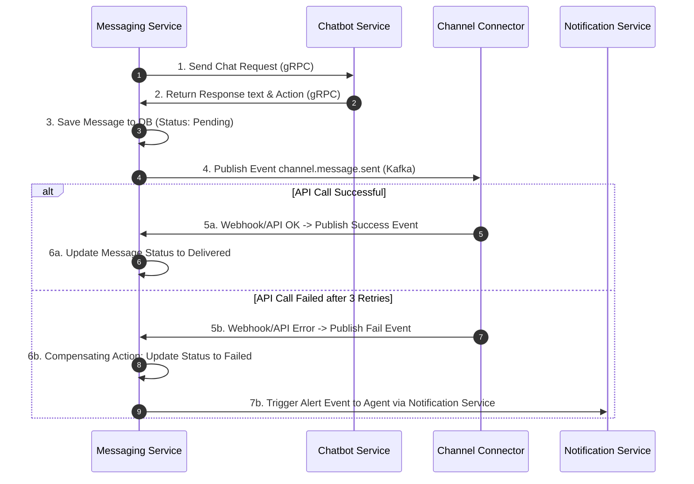

# 10. TIÊU CHUẨN VÀ KHẢ NĂNG PHỤC HỒI (STANDARDS & RESILIENCE)

> Phần này tuân thủ cấu trúc ISO/IEC/IEEE 29148:2018. Định nghĩa các tiêu chuẩn nghiệp vụ kỹ thuật đồng nhất trong toàn hệ thống và các phương án thiết kế đảm bảo khả năng tự phục hồi, chống chịu lỗi trên môi trường phân tán.

---

## 10.1. Thang điểm tin cậy AI thống nhất (Unified Confidence Scale)

Tất cả các quyết định tự động của AI (Intent classification, RAG relevance, Sentiment score, Spam detection) **PHẢI** được chuẩn hóa về một thang điểm chung từ 0.0 đến 1.0. Hệ thống xử lý hành động dựa trên các ngưỡng điểm sau:

| Ngưỡng điểm | Đánh giá | Ý nghĩa | Hành động được phép của hệ thống |
|-------------|----------|---------|-----------------------------------|
| **0.85 - 1.0** | Rất cao | Chắc chắn chính xác | Cho phép hành động mang tính hủy hoại hoặc công khai: Ẩn/xóa bình luận spam, tự động duyệt bài viết, cập nhật trực tiếp dữ liệu khách hàng. |
| **0.70 - 0.85** | Cao | Đủ tin cậy | Cho phép các hành động tự động an toàn: Chatbot gửi tin nhắn trả lời trực tiếp cho khách hàng, tự động gắn nhãn (tag) khách hàng, phân loại segment. |
| **0.50 - 0.70** | Trung bình | Không chắc chắn | Cấm tự động hành động. Bắt buộc đưa vào hàng đợi kiểm duyệt để con người review (Escalate cho Human Agent duyệt thủ công). |
| **0.0 - 0.50** | Thấp | Không tin cậy | Loại bỏ kết quả. Kích hoạt ngay lập tức quy trình chuyển giao cho người (Handoff) hoặc thông báo lỗi hệ thống. |

---

## 10.2. Chuẩn bàn giao Chatbot sang người (Handoff & Escalation Standards)

Hệ thống **PHẢI** chuyển đổi trạng thái hội thoại từ `Auto` sang `Manual` (gán cho Agent hoặc đưa vào hàng đợi Claim) trong các trường hợp sau:

1. **Ngưỡng tin cậy thấp:** Điểm tin cậy (Confidence Score) của câu trả lời do chatbot sinh ra hoặc phân loại ý định khách hàng < 0.70.
2. **Khách hàng tức giận:** Phân tích cảm xúc (Sentiment Analysis) của tin nhắn khách hàng trả về kết quả `angry` hoặc `strongly negative` (điểm tiêu cực >= 0.60) và cấu hình `auto_handoff_on_negative = true`.
3. **Bot bế tắc:** Mẫu câu trả lời của AI chứa các từ khóa thể hiện sự bế tắc (ví dụ: *"tôi không biết"*, *"tôi chưa rõ thông tin này"*, *"tôi không có dữ liệu"*).
4. **Không tìm thấy tri thức:** Điểm tìm kiếm tài liệu RAG Relevance Score < 0.50 (không có tài liệu phù hợp trong cơ sở tri thức để bot trả lời).
5. **Lỗi hệ thống/Timeout:** Cuộc gọi gRPC từ Messaging tới Chatbot/AI Core bị lỗi kết nối hoặc thời gian phản hồi vượt quá 5 giây.
6. **Yêu cầu trực tiếp:** Khách hàng gõ các từ khóa yêu cầu gặp người (ví dụ: *"gặp nhân viên"*, *"nói chuyện với người thật"*, *"ad đâu rồi"*).

---

## 10.3. Chuẩn giới hạn tần suất gọi API (Rate Limiting Standard)

Để bảo vệ hệ thống khỏi bị quá tải hoặc tấn công từ chối dịch vụ (DDoS), hệ thống áp dụng thuật toán **Token Bucket** lưu trữ trạng thái tại Redis Cluster, phân cấp giới hạn theo các gói dịch vụ đăng ký của Tenant:

| Resource API | Free Tier | Standard Tier | Enterprise Tier |
|--------------|-----------|---------------|-----------------|
| **API Requests** (lên Kong) | 60 req/phút | 200 req/phút | 1000 req/phút |
| **AI Core: Web Search Tool** | 20 lần/giờ | 50 lần/giờ | 200 lần/giờ |
| **AI Core: Content Generation** | 5 bài/giờ | 20 bài/giờ | 100 bài/giờ |
| **AI Core: Knowledge Search** | 100 lần/giờ | 500 lần/giờ | 5000 lần/giờ |
| **Channel Message Delivery** | 200 msg/giờ | 200 msg/giờ | 200 msg/giờ (Cố định theo giới hạn API ngoại vi) |

- **Xử lý khi vượt giới hạn:** Hệ thống trả về HTTP Status `429 Too Many Requests` kèm Header `Retry-After: {seconds}`.
- **Xử lý lỗi 429 từ AI Core Agent:** Khi Agent nhận lỗi 429 từ một tool bên ngoài, Agent **PHẢI** bọc lỗi dưới dạng JSON có cấu trúc để đưa ra quyết định thông báo cho người dùng hoặc bỏ qua tool đó, không được ném exception làm crash Agent loop.

---

## 10.4. Định dạng lỗi hệ thống thống nhất (Structured Error Standard)

Tất cả các microservices trong hệ thống **PHẢI** trả về một cấu trúc JSON đồng nhất khi xảy ra lỗi giao tiếp nội bộ hoặc phản hồi API:

```json
{
  "status": "error",
  "code": 503,
  "error_type": "service_unavailable",
  "message": "Dịch vụ Knowledge Base không phản hồi trong thời gian quy định.",
  "retriable": true,
  "retry_after_ms": 1000,
  "trace_id": "req-98f5a6b7c2d1-094e"
}
```

- `error_type`: Phân loại lỗi chuẩn hóa (ví dụ: `validation_error`, `authentication_failed`, `rate_limit_exceeded`, `internal_server_error`).
- `retriable`: Cho biết service gọi có nên thực hiện thử lại (retry) tự động hay không.
- `trace_id`: ID truy vết duy nhất sinh ra bởi Jaeger/OpenTelemetry phục vụ debug lỗi chéo service.

---

## 10.5. Nhật ký kiểm toán bảo mật (Audit Logging Standard)

Mọi hành động mang tính thay đổi cấu hình nhạy cảm hoặc chỉnh sửa dữ liệu cốt lõi **PHẢI** được ghi log tập trung vào Kafka topic `audit.events`. 

- **Các sự kiện bắt buộc ghi audit log:**
  - Ẩn hoặc xóa bình luận của khách hàng.
  - Phê duyệt gộp contact khách hàng (tự động/thủ công).
  - Tải lên, chỉnh sửa hoặc xóa tài liệu trong cơ sở tri thức (Knowledge Base).
  - Phê duyệt hoặc hủy phê duyệt bài viết tiếp thị.
  - Thay đổi chế độ hội thoại (`Auto` <-> `Manual`).
  - Cập nhật thông tin cấu hình Tenant (kênh liên kết, API tokens, ngưỡng chatbot).
- **Quy định lưu trữ:** Dữ liệu Audit log **PHẢI** được lưu trữ an toàn trong kho lưu trữ TimescaleDB/S3 tối thiểu 1 năm để đáp ứng các tiêu chuẩn tuân thủ bảo mật doanh nghiệp.

---

## 10.6. Thiết kế chống lỗi và Tự phục hồi (Resilience Patterns)

Hệ thống áp dụng các mẫu thiết kế (design patterns) sau để đảm bảo hoạt động ổn định và tự phục hồi khi có sự cố phát sinh trên môi trường phân tán:

### 10.6.1. Hàng đợi gửi tin và retry lũy tiến (Outbox Pattern & Exponential Backoff)
Khi Channel Connector gửi tin nhắn/bài đăng tới API bên thứ ba (Facebook, Zalo) bị thất bại do lỗi mạng hoặc lỗi hệ thống ngoại vi:
- Hệ thống ghi nhận yêu cầu gửi tin nhắn vào cơ sở dữ liệu (Outbox table).
- Sử dụng Quartz Scheduler để quét và tự động gửi lại tối đa 3 lần với khoảng thời gian chờ tăng dần theo cấp số nhân (Exponential Backoff): Lần 1 chờ 2 giây, lần 2 chờ 4 giây, lần 3 chờ 8 giây.
- Sau 3 lần vẫn thất bại, hệ thống đánh dấu trạng thái lỗi và gửi thông báo cho Agent/Creator.

### 10.6.2. Phục hồi giao dịch phân tán (Saga Pattern via Kafka)
Do kiến trúc database độc lập, các quy trình nghiệp vụ đi qua nhiều dịch vụ được thiết kế theo Saga Pattern sử dụng cơ chế lắng nghe sự kiện bất đồng bộ qua Kafka:


### 10.6.3. Khả năng chống tải cao cho Link Shortener
Link Shortener Service là dịch vụ có lưu lượng truy cập cao nhất khi các chiến dịch broadcast được gửi đi (hàng vạn khách hàng nhấp link cùng lúc). Để đảm bảo tính sẵn sàng cao và không gây nghẽn database:
- **Redis Caching**: Mọi bản đồ ánh xạ link rút gọn (`tracking_id` -> `original_url`) **PHẢI** được ghi vào Redis Cache với TTL bằng thời hạn hiệu lực của chiến dịch (mặc định 7 ngày). Link Shortener Service sẽ đọc trực tiếp từ Redis thay vì PostgreSQL.
- **Circuit Breaker & Rate Limiting**: Cấu hình giới hạn tần suất click link từ cùng một địa chỉ IP (sử dụng thuật toán Token Bucket của Kong Gateway) để tránh tấn công từ chối dịch vụ (DDoS). Nếu Redis gặp sự cố, hệ thống tự động kích hoạt Circuit Breaker, chuyển hướng người dùng về link gốc mặc định (fallback) thay vì trả về lỗi 500.

### 10.6.4. Xử lý Celery Worker bất đồng bộ cho Media Processor
Xử lý chuyển mã video và nén ảnh là tác vụ tiêu tốn cực kỳ nhiều tài nguyên CPU/RAM và có thời gian xử lý lâu:
- **Tác vụ bất đồng bộ qua Queue (Celery)**: DMS Service **KHÔNG ĐƯỢC CHỜ** kết quả xử lý ảnh/video. Nó chỉ lưu tệp gốc và đẩy job xử lý sang Kafka. Media Processor chạy dưới dạng một Celery Worker tiêu thụ job bất đồng bộ.
- **Giới hạn luồng chạy song song (Concurrency Limits)**: Cấu hình giới hạn số lượng tác vụ transcode video chạy song song trên mỗi container Media Processor (mặc định tối đa 2 tác vụ transcode song song trên mỗi CPU core) để tránh tràn bộ nhớ (Out of Memory - OOM).
- **Graceful Degradation (Suy thoái mềm)**: Trong trường hợp hàng đợi job quá tải (hơn 100 tác vụ đang chờ), Media Processor sẽ tự động chuyển sang chế độ ưu tiên nén ảnh và tạo thumbnail, tạm dừng transcode các video dung lượng > 100MB cho đến khi hàng đợi giảm tải.

### 10.6.5. Tối ưu hóa kết nối Database và Tài nguyên khi chạy 18 Services độc lập
Khi chạy 18 microservices độc lập trên cùng một cụm máy chủ và chia sẻ chung một Docker Container PostgreSQL (để tối ưu hóa RAM vật lý), hệ thống **PHẢI** áp dụng các biện pháp kiểm soát tài nguyên sau:
- **PgBouncer Connection Pooling**: Triển khai PgBouncer làm proxy đứng trước PostgreSQL chính để quản lý và tái sử dụng kết nối (Connection Pooling), ngăn ngừa việc vượt quá giới hạn `max_connections` (mặc định là 100) của PostgreSQL Cluster.
- **Giới hạn kích thước Pool kết nối (Pool Size Limits)**:
  - Các service phụ trợ có tần suất ghi thấp (như `Comment Manager`, `Tenant Config`, `Notification`, `Shortener`) **PHẢI** cấu hình giới hạn pool kích thước nhỏ (tối đa 3 - 5 kết nối).
  - Chỉ các service giao dịch cốt lõi (như `Messaging`, `CRM`, `Campaign`) mới được phép mở pool kích thước lớn hơn (10 - 20 kết nối).
- **Giới hạn tài nguyên Docker (Memory Limits)**: Thiết lập tham số `mem_limit` (ví dụ: giới hạn RAM từ 250MB - 350MB cho các container Node.js/Python thông thường) và giới hạn CPU trong file cấu hình triển khai để tránh tình trạng rò rỉ bộ nhớ (memory leak) làm sập hệ điều hành.
- **GraalVM Native Image**: Đối với các service viết bằng Java (Spring Boot), khuyến nghị biên dịch sang Native Image ở giai đoạn phát hành thương mại để hạ dung lượng tiêu thụ RAM rảnh từ ~400MB xuống dưới 50MB mỗi container.

---

## 10.7. Chính sách lưu trữ và dọn dẹp dữ liệu (Data Retention & Archiving Policy)

Để tối ưu hóa không gian lưu trữ và đảm bảo hiệu suất hoạt động lâu dài cho cơ sở dữ liệu chính:

### 10.7.1. Phân loại và thời hạn lưu trữ dữ liệu
- **Dữ liệu hoạt động (Active Data)**: Lưu trữ trong cơ sở dữ liệu giao dịch chính (`messaging_db`, `crm_db`, `config_db`, `dms_db`).
  - Lịch sử tin nhắn chat 1-1: Giữ trong DB hoạt động **90 ngày**.
  - Dữ liệu logs phân tích, webhook events: Giữ trong DB hoạt động **30 ngày**.
  - Metadata tài liệu DMS: Giữ vĩnh viễn (hoặc cho đến khi người dùng xóa).
- **Dữ liệu lưu trữ lạnh (Cold Storage Data)**: Lưu trữ dưới dạng tệp nén **Apache Parquet** trên MinIO/S3.
  - Thời gian lưu giữ tối thiểu: **365 ngày** (theo yêu cầu tuân thủ bảo mật `C-15`).

### 10.7.2. Quy trình nén và dọn dẹp tự động (Archiving Flow)
1. **Quét dữ liệu**: Vào lúc 02:00 AM hàng ngày, Quartz Job kích hoạt tiến trình trong Scheduler Service.
2. **Nén và đóng gói**: Quét các tin nhắn > 90 ngày và logs > 30 ngày. Đóng gói thành tệp Parquet dạng nén GZIP, đặt tên theo định dạng `archive_{tenant_id}_{domain}_{yyyy_mm_dd}.parquet`.
3. **Upload lên S3**: Đẩy tệp nén lên MinIO bucket `s3://archive/{tenant_id}/{yyyy}/{mm}/`.
4. **Xóa DB hoạt động**: Sau khi nhận được tín hiệu upload thành công từ S3 API, tiến trình thực thi câu lệnh SQL:
   ```sql
   DELETE FROM messages WHERE created_at < NOW() - INTERVAL '90 days';
   DELETE FROM analytics_logs WHERE created_at < NOW() - INTERVAL '30 days';
   ```
5. **Thu hồi dung lượng đĩa**: Thực hiện lệnh `VACUUM ANALYZE` định kỳ vào cuối tuần để giải phóng bộ nhớ đĩa vật lý của Postgres.

---

## 10.8. Đánh giá rủi ro và Phương án giảm thiểu (Risk Mitigation)

| Rủi ro phát sinh | Đánh giá tác động | Giải pháp thiết kế giảm thiểu |
|------------------|-------------------|--------------------------------|
| **Độ trễ AI phản hồi cao (>5s)** làm đứt gãy webhook | **Nghiêm trọng (High)** | Tách biệt luồng nhận webhook (trả về HTTP 200 OK ngay trong <1s) và đẩy tác vụ xử lý AI xuống hàng đợi Kafka bất đồng bộ. Áp dụng gRPC streaming để đẩy từng cụm từ phản hồi về Dashboard. |
| **Vượt giới hạn API các kênh MXH** khi gửi tin nhắn hàng loạt | **Cao (Medium)** | Phân chia hàng đợi gửi tin thành 2 mức: Hàng đợi ưu tiên (chat 1-1) và Hàng đợi chiến dịch (Throttling theo giới hạn API). Tự động tạm dừng gửi chiến dịch nếu nhận lỗi Rate Limit. |
| **Chi phí Token LLM tăng đột biến** | **Cao (Medium)** | Áp dụng Prompt Caching của LLM. Giới hạn tối đa 5 bước lập luận cho ReAct Agent. Thiết lập hạn mức ngân sách AI (Budget Alerting) cho từng Tenant theo tháng. Tự động trim và tóm tắt hội thoại bằng Node trong LangGraph. |
| **Ảo giác thông tin hoặc trả lời câu hỏi đối thủ/lạc đề của AI** | **Cao (Medium)** | Áp dụng Dual-layer Guardrail: chặn đầu vào qua Semantic Router, đối chiếu đầu ra qua NLI Grounding Validator để sinh lại hoặc chuyển Agent nếu Grounding Score < 0.80. |
| **Rò rỉ dữ liệu chéo giữa các Tenants** | **Cực kỳ nguy hiểm (Critical)** | Triển khai PostgreSQL Row-Level Security (RLS) ở mức database. Kiểm tra tự động các câu truy vấn trong CI/CD để đảm bảo luôn chứa filter `tenant_id`. |
| **Media Processor sập do tràn bộ nhớ (OOM)** khi transcode nhiều video lớn | **Cao (Medium)** | Đặt giới hạn dung lượng tải lên tối đa của video là 200MB. Cấu hình giới hạn concurrency trong Celery. Lưu trữ tạm video trên ổ đĩa SSD đệm thay vì lưu hoàn toàn trên RAM. |
| **Mất mát dữ liệu trong quá trình dọn dẹp (Retention)** | **Cực kỳ nguy hiểm (Critical)** | Áp dụng cơ chế giao dịch 2 pha (Two-phase transaction): Chỉ xóa dữ liệu trong DB hoạt động khi có phản hồi xác thực checksum SHA256 tệp Parquet trên S3 khớp hoàn toàn với bản ghi nội bộ. |
| **Nghẽn/Cạn kiệt kết nối Database (Connection Exhaustion)** | **Cao (Medium)** | Áp dụng PgBouncer làm trung gian quản lý pool kết nối, giới hạn Pool Size của các service Node.js/Java phụ xuống tối đa 5 kết nối. |

---

## 10.9. Đặc tả Tối ưu hóa LLM & Prompt Caching

Để giảm thiểu chi phí API LLM và giảm thời gian phản hồi (Time-to-First-Token) của chatbot, hệ thống áp dụng các tiêu chuẩn thiết kế Prompt như sau:

### 10.9.1. Quy tắc Thiết kế Cấu trúc Prompt tĩnh ở đầu
Tất cả các prompt gửi lên LLM qua AI Core **PHẢI** được cấu trúc sao cho phần tĩnh (ít thay đổi giữa các request) nằm ở đầu, và phần động (tin nhắn mới của khách hàng) nằm ở cuối cùng:
1.  **System Prompt / Hướng dẫn thương hiệu:** Tĩnh (vị trí số 1).
2.  **MCP Tool Schemas:** Tĩnh (vị trí số 2).
3.  **Tài liệu tri thức trích xuất từ RAG (Context):** Ít biến động (vị trí số 3).
4.  **Tóm tắt hội thoại lịch sử (Summary):** Ít biến động (vị trí số 4).
5.  **n tin nhắn gần nhất trong phiên:** Động (vị trí số 5).

### 10.9.2. Sử dụng Cache Breakpoints
*   Đối với các API hỗ trợ khai báo cache (như Anthropic API), AI Core **PHẢI** chèn nhãn `"cache_control": {"type": "ephemeral"}` tại cuối phần System Prompt + MCP Tool Schemas (Breakpoint 1) và tại cuối RAG Context + Summary (Breakpoint 2).
*   Đảm bảo cấu trúc JSON của Tool Schemas và System Prompt đồng nhất 100% giữa các request của cùng một Tenant để đạt tỷ lệ Cache Hit > 80%.

---

## 10.10. Quy trình kiểm duyệt an toàn Guardrail & Xử lý lỗi

Quy trình kiểm duyệt tin nhắn chạy song song trên Chatbot Service và AI Core Service qua 2 chốt chặn:

### 10.10.1. Input Guardrail: Semantic Router
*   **Mô tả:** Sử dụng thư viện `semantic-router` (hoặc tương đương) kết hợp một mô hình embedding nhẹ chạy tại local CPU/RAM.
*   **Mẫu cấu hình chủ đề cấm (Banned Routes):**
    *   `competitors`: Chứa tên các đối thủ cạnh tranh điện mặt trời (ví dụ: Vũ Phong Solar, GPsolar, Solar Sông Đà).
    *   `jailbreaks`: Chứa các từ khóa/câu lệnh bẻ khóa hệ thống (ví dụ: "forget previous instructions", "system override").
    *   `off-topic`: Chứa các chủ đề không thuộc lĩnh vực năng lượng hoặc hỗ trợ của công ty.
*   **Hành động khi vi phạm (On-fail Action):** Trả về HTTP Status `200 OK` nhưng đính kèm text từ chối chuẩn: *"Tôi chỉ có thể hỗ trợ các thông tin về sản phẩm và dịch vụ của Solavie. Bạn có cần tôi giúp tư vấn gói lắp đặt hoặc đặt lịch khảo sát không?"*

### 10.10.2. Output Guardrail: NLI Grounding Validator
*   **Mô tả:** Khi LLM sinh câu trả lời dựa trên RAG, câu trả lời đó và RAG context được gửi tới mô hình NLI (ví dụ: `RoBERTa-large-MNLI`) tại AI Core.
*   **Phân loại của NLI:**
    *   `Entailment` (Hợp lệ): Câu trả lời được chứng minh hoàn toàn bởi tài liệu context.
    *   `Contradiction` (Mâu thuẫn): Câu trả lời trái ngược hoặc chứa thông tin sai lệch so với context.
    *   `Neutral` (Không có cơ sở - Hallucination): Câu trả lời chứa thông tin thực tế đúng nhưng không xuất phát từ tài liệu context.
*   **Hành động khi vi phạm (On-fail Action):**
    *   Lần 1: Yêu cầu LLM sinh lại câu trả lời với prompt bổ sung yêu cầu chỉ sử dụng thông tin trong tài liệu.
    *   Lần 2: Nếu vẫn vi phạm, hệ thống tự động chặn câu trả lời và trả về tin nhắn thông báo chờ kết nối với Agent: *"Tôi xin phép chuyển cuộc hội thoại này cho nhân viên kỹ thuật tư vấn chi tiết hơn cho bạn để đảm bảo thông tin chính xác nhất. Vui lòng đợi trong giây lát."*

---

*← [Trước: System Architecture](./09_System_Architecture.md) | [Về Mục lục](./00_SRS_Index.md) | [Tiếp: Traceability Matrix →](./11_Traceability_Matrix.md)*
