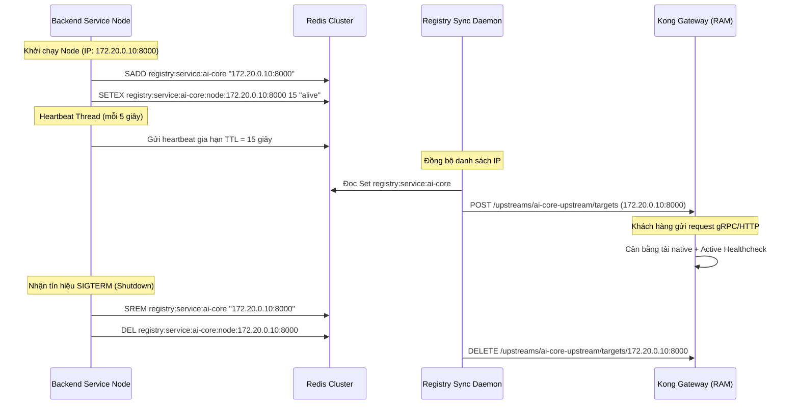

# Kiến Trúc Phát Hiện Dịch Vụ Động Độc Lập Hạ Tầng (Redis-backed Service Registry)

Tài liệu này đặc tả chi tiết kiến trúc và cơ chế phát hiện dịch vụ (Service Discovery) & đăng ký dịch vụ (Service Registration) chạy ở tầng ứng dụng của Solavie Marketing Platform.

---

## 1. Đặt Vấn Đề & Động Lực Thiết Kế

Trong các hệ thống microservices hiện đại chạy trong container (Docker/Kubernetes/ECS), địa chỉ IP của các service là động và thay đổi sau mỗi lần deploy release mới hoặc auto-scaling.
Nếu Gateway chỉ sử dụng phân giải DNS thông thường:
1. **Lệch IP do DNS Cache:** API Gateway (Kong) sẽ cache IP cũ và gửi request vào IP đã chết, trả về lỗi `502 Bad Gateway`.
2. **Lệch tải gRPC (gRPC Load Balancing):** gRPC chạy trên HTTP/2 duy trì kết nối TCP lâu dài. Nếu dùng DNS thông thường hoặc Load Balancer cấp hạ tầng (ClusterIP), gRPC client sẽ bị ghim chặt vào một instance duy nhất mãi mãi, gây mất cân bằng tải nghiêm trọng.

**Giải pháp:** Tự xây dựng cơ chế Service Discovery qua **Redis Cluster** (có sẵn) để tự động cập nhật danh sách IP còn sống của service trực tiếp vào bộ nhớ RAM của Gateway dưới dạng các Upstream Targets.

---

## 2. Mô Hình Kiến Trúc & Luồng Dữ Liệu

Kiến trúc bao gồm 3 thành phần chính:
1.  **Service Registration Client:** Chạy tích hợp bên trong các backend service nghiệp vụ (ví dụ: `ai-core`).
2.  **Shared Registry Storage:** Redis Cluster làm cơ sở dữ liệu phân tán lưu trữ trạng thái.
3.  **Registry Sync Daemon:** Chạy ngầm tại Gateway để lắng nghe Redis và đồng bộ Target vào Kong Upstream.



---

## 3. Cấu Trúc Dữ Liệu Trên Redis

*   **Danh sách Node hoạt động (Redis Set):**
    *   *Key:* `registry:service:{service_name}`
    *   *Members:* Danh sách các chuỗi định dạng `{ip}:{port}` (ví dụ: `172.20.0.10:8000`).
*   **Trạng thái kiểm tra sự sống (Redis String):**
    *   *Key:* `registry:service:{service_name}:node:{ip}:{port}`
    *   *Value:* `"alive"`
    *   *TTL:* `15` giây.

---

## 4. Hướng Dẫn Tích Hợp Cho Service Mới

Khi tạo một microservice mới trong Solavie Platform, để kích hoạt tính năng dynamic routing:

### Phía Backend Service:
1.  Nhúng module `ServiceRegistryClient` vào file khởi động chính của ứng dụng.
2.  Sử dụng socket kết nối UDP ảo để tự phát hiện IP nội bộ của container:
    ```python
    import socket
    s = socket.socket(socket.AF_INET, socket.SOCK_DGRAM)
    s.connect(("8.8.8.8", 80))
    ip = s.getsockname()[0]
    ```
3.  Tích hợp các hàm `register()` và `deregister()` vào lifespan hook của framework (FastAPI lifespan, Spring Boot `@PreDestroy`, NestJS `onModuleDestroy`).

### Phía Gateway:
1.  Khai báo Upstream ảo `http://{service_name}-upstream` trong file `kong.yml`.
2.  Bổ sung tên service tương ứng vào danh sách cần quét của `Registry Sync Daemon`.
