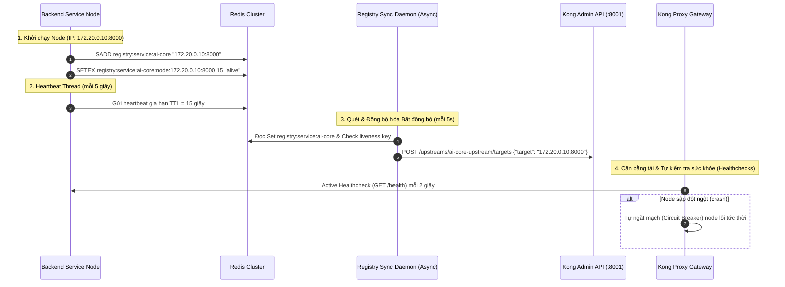

# Kiến Trúc Phát Hiện Dịch Vụ Động Độc Lập Hạ Tầng (Redis-backed Service Registry & Kong DB-Mode)

Tài liệu này đặc tả chi tiết kiến trúc và cơ chế phát hiện dịch vụ (Service Discovery) & đăng ký dịch vụ (Service Registration) chạy ở tầng ứng dụng của Solavie Marketing Platform.

---

## 1. Đặt Vấn Đề & Động Lực Thiết Kế

Trong các hệ thống microservices hiện đại chạy trong container (Docker/Kubernetes/ECS), địa chỉ IP của các service là động và thay đổi sau mỗi lần deploy release mới hoặc auto-scaling.
Nếu Gateway chỉ sử dụng phân giải DNS thông thường:
1. **Lệch IP do DNS Cache:** API Gateway (Kong) sẽ cache IP cũ và gửi request vào IP đã chết, trả về lỗi `502 Bad Gateway`.
2. **Lệch tải gRPC (gRPC Load Balancing):** gRPC chạy trên HTTP/2 duy trì kết nối TCP lâu dài. Nếu dùng DNS thông thường hoặc Load Balancer cấp hạ tầng (ClusterIP), gRPC client sẽ bị ghim chặt vào một instance duy nhất mãi mãi, gây mất cân bằng tải nghiêm trọng.

**Giải pháp tối ưu:** Tự xây dựng cơ chế Service Discovery qua **Redis Cluster** (có sẵn) kết hợp đồng bộ hóa động lên **Kong API Gateway (chạy DB Mode)**.

> [!NOTE]
> Các dịch vụ tĩnh hoặc đóng gói sẵn bên thứ ba như **Auth Service (Keycloak)** và **Observability Service** (Prometheus, Grafana, Loki, Jaeger) được định tuyến trực tiếp bằng DNS/Hostname tĩnh trong cấu hình Gateway Kong và **không áp dụng** cơ chế Service Discovery động này để đảm bảo tính ổn định và tránh lãng phí tài nguyên.

---

## 2. Mô Hiện Kiến Trúc & Luồng Dữ Liệu

Kiến trúc bao gồm 3 thành phần chính:
1.  **Service Registration Client:** Chạy tích hợp bên trong các backend service nghiệp vụ (ví dụ: `ai-core`, `user-service`).
2.  **Shared Registry Storage:** Redis Cluster làm cơ sở dữ liệu phân tán lưu trữ trạng thái.
3.  **Registry Sync Daemon:** Chạy ngầm tại Gateway để quét Redis và đồng bộ Target trực tiếp vào Kong Upstream qua REST Admin API (DB Mode).
4.  **Kong Native Healthchecks:** Kong tự gửi request `/health` hoặc tự ngắt mạch (Circuit Breaker) khi phát hiện request lỗi để loại bỏ node lỗi tức thời (dưới 1s).



---

## 3. Cấu Trúc Dữ Liệu Trên Redis

*   **Danh sách Node hoạt động (Redis Set):**
    *   *Key:* `registry:service:{service_name}`
    *   *Members:* Danh sách các chuỗi định dạng `{ip}:{port}` (ví dụ: `172.20.0.10:8000`).
*   **Trạng thái kiểm tra sự sống (Redis String):**
    *   *Key:* `registry:service:{service_name}:node:{ip}:{port}`
    *   *Value:* `"alive"`
    *   *TTL:* `15` giây.

---

## 4. Đặc tả Client IP Discovery & Endpoint Health Check

Mỗi microservice khi tích hợp Service Registry Client bắt buộc phải triển khai thuật toán tự phát hiện IP nội bộ theo độ ưu tiên:

1.  **Độ ưu tiên 1 (Môi trường/Deploy):** Đọc từ biến môi trường `CONTAINER_IP` (nếu được inject bởi Docker Compose/K8s/Cloud).
2.  **Độ ưu tiên 2 (OS Card Mạng):** Quét các interface card mạng vật lý của OS để tìm IP IPv4 hợp lệ (không phải là loopback `127.0.0.1` hay interface ảo của Docker).
3.  **Độ ưu tiên 3 (Fallback kết nối ngoài):** Tạo kết nối UDP fake đến DNS `8.8.8.8` để lấy socket IP.

Đồng thời, mỗi service phải cung cấp endpoint **`/health`** (HTTP 200 OK) để phục vụ Kong Active Healthcheck.

---

## 5. Mã mẫu Tích hợp NestJS Client (Node.js)

```typescript
import { Injectable, OnApplicationBootstrap, BeforeApplicationShutdown, Logger } from '@nestjs/common';
import { RedisService } from '../../redis/redis.service';
import * as dgram from 'dgram';
import * as os from 'os';

@Injectable()
export class ServiceRegistryClient implements OnApplicationBootstrap, BeforeApplicationShutdown {
  private readonly logger = new Logger('ServiceRegistryClient');
  private heartbeatInterval: NodeJS.Timeout | null = null;
  private nodeIp = '127.0.0.1';
  private nodePort = 3008;
  private readonly redisKey = 'registry:service:user';

  constructor(private readonly redisService: RedisService) {
    this.nodePort = parseInt(process.env.PORT || '3008', 10);
  }

  private async getInternalIp(): Promise<string> {
    // 1. Check env
    if (process.env.CONTAINER_IP) return process.env.CONTAINER_IP;

    // 2. Scan OS Network Interfaces
    const interfaces = os.networkInterfaces();
    for (const name of Object.keys(interfaces)) {
      for (const iface of interfaces[name] || []) {
        if (iface.family === 'IPv4' && !iface.internal) {
          return iface.address;
        }
      }
    }

    // 3. Fallback to UDP fake connection
    try {
      return await new Promise<string>((resolve, reject) => {
        const socket = dgram.createSocket('udp4');
        socket.connect(53, '8.8.8.8', () => {
          const ip = socket.address().address;
          socket.close();
          resolve(ip);
        });
        socket.on('error', (err) => reject(err));
      });
    } catch {
      return '127.0.0.1';
    }
  }

  async onApplicationBootstrap() {
    this.nodeIp = await this.getInternalIp();
    const nodeValue = `${this.nodeIp}:${this.nodePort}`;
    const nodeKey = `${this.redisKey}:node:${nodeValue}`;
    const client = this.redisService.getClient();

    await client.sAdd(this.redisKey, nodeValue);
    await client.setEx(nodeKey, 15, 'alive');

    this.logger.log({
      message: 'Service node registration completed',
      action: 'register',
      node_ip: this.nodeIp,
      node_port: this.nodePort,
      status: 'success',
    });

    this.heartbeatInterval = setInterval(async () => {
      try {
        await client.setEx(nodeKey, 15, 'alive');
        await client.sAdd(this.redisKey, nodeValue);
      } catch (err: any) {
        this.logger.error(`Heartbeat failed: ${err.message}`);
      }
    }, 5000);
  }

  async beforeApplicationShutdown() {
    if (this.heartbeatInterval) clearInterval(this.heartbeatInterval);
    const nodeValue = `${this.nodeIp}:${this.nodePort}`;
    const nodeKey = `${this.redisKey}:node:${nodeValue}`;
    const client = this.redisService.getClient();
    try {
      await client.sRem(this.redisKey, nodeValue);
      await client.del(nodeKey);
    } catch (err: any) {
      this.logger.error(`Deregister failed: ${err.message}`);
    }
  }
}
```
