# BÁO CÁO PHÂN TÍCH HỆ THỐNG & TỐI ƯU KIẾN TRÚC
## DỰ ÁN: PLATFORM MARKETING & CHĂM SÓC KHÁCH HÀNG ĐA KÊNH TÍCH HỢP AI
### ĐỐI TƯỢNG PHÂN TÍCH: DOANH NGHIỆP NĂNG LƯỢNG MẶT TRỜI SOLAVIE

---

## 1. ĐẶC THÙ NGHIỆP VỤ DOANH NGHIỆP ĐIỆN MẶT TRỜI (SOLAVIE)

Điện năng lượng mặt trời là ngành hàng có giá trị cao (High-Ticket) và chu kỳ bán hàng dài (Long Sales Cycle). Quyết định mua hàng của khách hàng đi qua nhiều giai đoạn phức tạp:

```mermaid
graph LR
    Lead[1. Tiếp nhận Lead] --> Consult[2. Tư vấn giải pháp]
    Consult --> Survey[3. Khảo sát mái nhà]
    Survey --> Design[4. Thiết kế 3D/Bản vẽ]
    Design --> Proposal[5. Báo giá & Tính ROI]
    Proposal --> Contract[6. Ký hợp đồng]
    Contract --> Install[7. Thi công & Đấu nối]
    Install --> OM[8. Bảo trì & Vận hành O&M]
```

Để đáp ứng chu kỳ này, hệ thống phần mềm hỗ trợ Solavie không chỉ đơn thuần là gửi tin nhắn và chatbot trả lời tự động (FAQ), mà phải hỗ trợ đắc lực cho đội ngũ sales hiện trường, kỹ sư thiết kế và đội bảo trì sau bán hàng.

---

## 2. KIỂM TRA & ĐÁNH GIÁ KIẾN TRÚC HỆ THỐNG HIỆN TẠI (18 SERVICES)

Hệ thống được thiết kế theo mô hình Microservices hướng sự kiện (Event-Driven) với các công nghệ hiện đại (NestJS, FastAPI, Spring Boot, Kafka, PostgreSQL RLS, Redis, Qdrant, MinIO).

### 2.1. Ưu điểm nổi bật (Strengths)
1. **Multi-tenant Cô lập cao (Enterprise-Grade Security)**: Việc thiết kế Row-Level Security (RLS) ở mức database kết hợp với Multi-realm Keycloak và Tenant-Header trên Kafka là cực kỳ chính xác. Điều này cho phép Solavie sau khi vận hành ổn định có thể dễ dàng đóng gói phần mềm để bán lại dưới dạng SaaS cho các đơn vị lắp đặt điện mặt trời khác.
2. **Khả năng tự phục hồi và chịu tải tốt**: Tách biệt luồng nhận tin nhắn thô (Channel Connector) với luồng xử lý AI (Chatbot LangGraph) qua hàng đợi Kafka giúp hệ thống không bị mất mát tin nhắn (drop webhook) khi bị quá tải.
3. **Quản lý tài nguyên thông minh**: DMS Service tích hợp kiểm tra hạn mức lưu trữ, kết hợp tiến trình dọn dẹp logs tự động (Data Retention) nén lên Cold Storage giúp tiết kiệm tối đa chi phí ổ đĩa cứng hoạt động.

### 2.2. Khoảng trống nghiệp vụ điện mặt trời (Architectural & Domain Gaps)

Sau khi đối chiếu với mô hình vận hành của Solavie, kiến trúc hiện tại có 3 khoảng trống lớn:

#### ❌ Khoảng trống 1: CRM thiếu Sales Pipeline / Deal Pipeline để chốt hợp đồng
*   **Vấn đề**: CRM hiện tại chỉ quản lý danh bạ (`contacts`) và phân nhóm khách hàng (`segmentation`).
*   **Phân biệt rõ Ranh giới CRM vs PMS**:
    *   **Project Pipeline (Thi công & Lắp đặt) - PMS/ERP (Out of Scope)**: Đúng như bạn đã nhận định, toàn bộ khâu thi công thực tế, mua sắm thiết bị (Pin, Inverter), đấu nối lưới điện lực, nghiệm thu và xin cấp phép vận hành (PTO) thuộc về **Hệ thống Quản lý Dự án (PMS - Project Management System)** hoặc ERP. Phần này nằm ngoài phạm vi phần mềm Marketing/CRM hiện tại.
    *   **Sales Pipeline / Deal Pipeline (Trước bán hàng) - CRM (In Scope)**: Tuy nhiên, đối với doanh nghiệp điện mặt trời, hai khâu **Khảo sát mái nhà (Site Survey)** và **Thiết kế báo giá sơ bộ (Preliminary Proposal)** bắt buộc phải thực hiện **trước khi ký hợp đồng** để có số liệu tính toán báo giá. Do đó, CRM của Solavie vẫn cần có một **Sales/Deal Pipeline** để sales theo dõi cơ hội bán hàng: *Tư vấn → Đặt lịch khảo sát → Đã gửi báo giá → Thương thảo hợp đồng → Thành công (Closed Won)*. Kỹ thuật viên đi khảo sát mái sẽ upload ảnh hiện trường vào hồ sơ Deal này trong CRM.

#### ❌ Khoảng trống 2: Thiếu Module tính toán sản lượng điện và tự động sinh đề xuất (Solar ROI Proposal Generator)
*   **Vấn đề**: Khách hàng cần biết lắp bao nhiêu kWp, tạo ra bao nhiêu kWh điện, tiết kiệm bao nhiêu tiền điện mỗi tháng và bao lâu hoàn vốn (ROI).
*   **Thiếu sót**: Hệ thống hiện tại chưa có module biên soạn báo giá. Cần có một module cho phép nhập: hóa đơn tiền điện trung bình, diện tích mái, hướng nhà, sau đó tự động tính toán sản lượng và tự động sinh bản báo giá dạng PDF (Proposal PDF) lưu vào DMS để gửi trực tiếp cho khách hàng qua Zalo/Facebook.

#### ❌ Khoảng trống 3: Thiếu hệ thống quản lý vé hỗ trợ vận hành & bảo trì (O&M Ticketing System)
*   **Vấn đề**: Hệ thống điện mặt trời hoạt động liên tục 20-25 năm. Khách hàng sẽ liên hệ bảo hành khi Inverter báo lỗi hoặc sản lượng sụt giảm.
*   **Thiếu sót**: Chưa có phân hệ quản lý Tickets. Khi khách hàng báo lỗi qua fanpage/Zalo OA, nhân viên trực chat cần tạo được một Ticket bảo dưỡng, phân công kỹ thuật viên đi xử lý và cập nhật tiến độ cho khách hàng theo dõi.

---

## 3. TÍNH TOÁN CẤU HÌNH MÁY CHỦ CHO HỆ THỐNG ĐỘC LẬP (18 SERVICES)

Để vận hành an toàn và ổn định hệ thống gồm **18 dịch vụ độc lập** chạy bằng các container riêng biệt (không gộp), cùng với các cơ sở dữ liệu và middleware đi kèm, chúng ta cần tính toán chi tiết tài nguyên RAM, CPU và bộ nhớ lưu trữ cần thiết.

### 3.1. Phân tích tài nguyên RAM tiêu thụ ở trạng thái hoạt động (Idle & Moderate Load)

| Nhóm Dịch vụ / Hạ tầng | Số lượng container | RAM trung bình / Container | Tổng dung lượng RAM |
|-----------------------|--------------------|----------------------------|---------------------|
| **Node.js Services** (Channel, Messaging, CRM, Notif, Comment, Config, DMS, Shortener) | 8 | 200 MB | 1.6 GB |
| **Python Services** (Chatbot, Content, AI Core, Media Processor) | 4 | 300 MB | 1.2 GB |
| **Python Knowledge Base** (Nạp model embeddings, reranking nhẹ) | 1 | 800 MB | 0.8 GB |
| **Java Services** (Scheduler Quartz, Campaign Svc, Analytics Svc) | 3 | 400 MB | 1.2 GB |
| **Auth Service** (Keycloak chạy nền Java JVM) | 1 | 600 MB | 0.6 GB |
| **PostgreSQL Database** (Multi-tenant transactions) | 1 | 1.5 GB | 1.5 GB |
| **TimescaleDB Database** (Lưu trữ metrics & logs time-series) | 1 | 1.5 GB | 1.5 GB |
| **Qdrant Vector Database** (Chứa và index dữ liệu tri thức) | 1 | 800 MB | 0.8 GB |
| **Apache Kafka + KRaft** (JVM broker điều phối event-driven) | 1 | 1.5 GB | 1.5 GB |
| **Redis Cache** (Lưu session, config hot-reload) | 1 | 400 MB | 0.4 GB |
| **MinIO Storage** (S3 compatible server) | 1 | 300 MB | 0.3 GB |
| **Hệ điều hành & OS agents** (Docker daemon, Logging, Monitoring) | - | 1.6 GB | 1.6 GB |
| **TỔNG CỘNG TIÊU THỤ (DỰ KIẾN)** | **24 Containers** | - | **≈ 13.0 GB** |

*   **Khuyến nghị về RAM**:
    *   **Cấu hình tối thiểu (Minimum)**: **16 GB RAM** (đủ để chạy hệ thống ở mức tải thấp, môi trường staging/dev).
    *   **Cấu hình khuyến nghị (Recommended)**: **32 GB RAM** (đảm bảo hệ thống vận hành êm ái, có đủ dung lượng buffer khi có traffic spike hoặc khi chạy chiến dịch broadcast tin nhắn hàng loạt).

### 3.2. Yêu cầu về CPU (vCPU Cores)
- **Tối thiểu**: **4 Cores vCPU**.
- **Khuyến nghị**: **8 Cores vCPU** (giúp xử lý song song mượt mà các tác vụ đa luồng của Java Spring Boot, các vòng lặp ReAct Agent của Python và tác vụ transcode video của Media Processor).

### 3.3. Yêu cầu về Dung lượng Lưu trữ (Storage)
- **SSD / NVMe (Hot Data)**: **150 GB - 200 GB** (cho hệ điều hành, docker images, và dữ liệu truy vấn nhanh của PostgreSQL, TimescaleDB, Qdrant vectors index).
- **HDD hoặc Object Storage (Cold/File Storage)**: **500 GB - 1 TB** (để chứa tệp tài liệu gốc, video, ảnh sản phẩm của DMS tải lên MinIO và các tệp nén Parquet sao lưu dài hạn).

---

### 3.4. Phương án cấu hình Server cụ thể cho Solavie

#### 🚀 Phương án 1: Máy chủ đơn lẻ (Single VPS / Dedicated Cloud) - Phù hợp cho Dev/Staging & MVP chạy thật giai đoạn đầu
Triển khai toàn bộ 24 containers trên một máy chủ duy nhất để dễ quản lý và tiết kiệm chi phí:
- **Cấu hình**: **8 Cores vCPU, 32 GB RAM, 160 GB NVMe SSD** (Đĩa chính) + Gắn thêm **500 GB Block Storage** làm S3 Storage cho MinIO.
- **Nhà cung cấp**: Có thể thuê từ các bên quốc tế (Hetzner, DigitalOcean, AWS EC2) hoặc các đơn vị trong nước (VNG Cloud, Viettel IDC, Bizfly Cloud).
- **Chi phí dự kiến**: **$60 - $120/tháng** (khoảng 1.5 - 3.0 triệu VNĐ/tháng).

#### 🚀 Phương án 2: Tách biệt máy chủ ứng dụng & dữ liệu (Production-Grade Clustering) - Cho giai đoạn scale thương mại
Tách biệt để tăng tính bảo mật, tránh trường hợp container ứng dụng crash làm ảnh hưởng đến database:
1.  **Server 1 (App Host)**: Chạy 18 microservices + Kong Gateway + Keycloak.
    - *Cấu hình*: **8 Cores vCPU, 16 GB RAM, 80 GB SSD**.
2.  **Server 2 (Database Host)**: Chạy PostgreSQL, TimescaleDB, Qdrant và Redis.
    - *Cấu hình*: **4 Cores vCPU, 16 GB RAM, 100 GB NVMe SSD**.
3.  **Server 3 (Broker & Storage)**: Chạy Apache Kafka và MinIO.
    - *Cấu hình*: **4 Cores vCPU, 8 GB RAM, 500 GB HDD**.

---

### Đề xuất 2: Tích hợp APIs thiết kế điện mặt trời thay vì tự xây dựng
Để giải quyết bài toán vẽ thiết kế 3D mái nhà và tính sản lượng điện, Solavie không nên tự code vì thuật toán tính bóng râm và bản đồ bức xạ mặt trời cực kỳ phức tạp.
- **Giải pháp**: Tích hợp API của các phần mềm thiết kế chuyên dụng như **HelioScope API** hoặc **OpenSolar API**.
- **Luồng hoạt động**: Sales nhập thông tin địa chỉ khách hàng → Hệ thống gọi API HelioScope để lấy sơ đồ thiết kế tấm pin và sản lượng điện ước tính → Trả dữ liệu về CRM để tự động tính toán dòng tiền ROI và hoàn vốn.

---

### Đề xuất 3: Tối ưu hóa chi phí và nâng cấp hệ thống AI (AI-Core & Knowledge Base)
Để chuẩn bị cho hệ thống vận hành thương mại ở quy mô lớn (SaaS) mà không bị bùng nổ chi phí API, Solavie đã thực hiện thiết kế và tích hợp trực tiếp các giải pháp tối ưu hóa AI tiên tiến ngay trong giai đoạn hiện tại:
1.  **Tối ưu hóa đa nhà cung cấp (12 LLM Providers) & Kiểm soát chi phí:** Tích hợp bộ thư viện LiteLLM hỗ trợ định tuyến động cho 12+ providers (OpenAI, Anthropic, Google, DeepSeek, Local, vLLM, Groq, Together AI, OpenRouter, Cohere, Perplexity, Mistral) kết hợp prompt caching, context caching dài hạn của Gemini, trích xuất citations và thinking tokens để tối ưu hóa chi phí và độ trễ. Thiết lập cơ chế **strict BYOK** (Tenant bắt buộc cấu hình khóa API riêng) và trả về lỗi 400 rõ ràng khi thiếu key để bảo vệ tài chính cho nhà phát triển hệ thống; cơ chế **nén lịch sử cuộc hội thoại hai cấp độ** (Baseline cắt chuỗi và Production-ready LLM Summarization) để tiết kiệm token; và chốt chặn **Cost Alert tự động kích hoạt ở mức 80% hạn mức** cấu hình của Tenant.
2.  **Hệ thống Rào chắn Nội dung Nhiều Lớp (Content Guardrails):** Tích hợp bộ lọc Custom Regex Middleware để phát hiện và ẩn danh PII (email, phone, credit card) cục bộ dưới 10ms, cấu hình Safety Filters tầng API, và kiểm soát chủ đề kinh doanh thông qua System Prompt Templates kết hợp độ tin cậy RAG.
3.  **Structured Outputs (Đầu ra có cấu trúc ép buộc):** Áp dụng tính năng JSON Schema (qua cấu hình `response_format` của LLM APIs) để bắt buộc câu trả lời của Agent luôn tuân thủ cấu trúc dữ liệu mong muốn, giúp chatbot và CRM dễ dàng xử lý.
4.  **Agent Tracing & Observability (Phase 2):** Dự kiến tích hợp OpenTelemetry với LangSmith hoặc Arize Phoenix để trực quan hóa sơ đồ suy luận (Thought -> Action -> Observation) dưới dạng cây quyết định phục vụ giám sát chất lượng.
4.  **Kiến trúc RAG nâng cao tối ưu (Hybrid Modular RAG + Parent-Child Retrieval):** 
    *   *Ingestion tách biệt:* Chạy ngầm việc parse, chunk, embed tài liệu thông qua **Celery/ARQ Worker** để bảo vệ hiệu năng CPU của API thread.
    *   *Sinh Sparse Vector cục bộ:* Sử dụng thư viện **FastEmbed** tại local worker để tạo nhanh các Sparse Vectors (BM25/SPLADE), tối ưu hoá chi phí và tránh phụ thuộc vào Cloud APIs.
    *   *Parent-Child Retriever (Hierarchical Indexing):* Chia nhỏ tài liệu thành các child chunks để vector search chính xác, nhưng ánh xạ và trả về parent chunks rộng hơn làm context đầu vào cho LLM để đảm bảo tính toàn vẹn ngữ cảnh.
    *   *Cache Versioning:* Sử dụng khoá phiên bản `{tenant_id}:kb_version` trên Redis để invalidate toàn bộ cache cũ của tenant ngay lập tức thông qua phép tăng giá trị (`INCR`), loại bỏ nguy cơ làm nghẽn Redis của lệnh `SCAN + DEL`.

---

## 4. MA TRẬN PHÂN TÍCH RỦI RO KIẾN TRÚC TRONG THỰC TẾ

| Rủi ro kiến trúc | Tác động | Giải pháp phòng ngừa & Tối ưu |
|------------------|----------|-------------------------------|
| **Tấn công Leo thang Đặc quyền (Privilege Escalation) do thiếu check Realm Master (W1)** | **Nghiêm trọng (Critical)** | Cấu hình `KONG_MASTER_REALM_TENANT_ID` và cập nhật `handler.lua` kiểm tra nghiêm ngặt `tenant_id` của Master Realm trước khi cấp quyền wildcard `*` cho các role `system`/`system_admin`. (Đã triển khai vá lỗi ở Gateway). |
| **Nghẽn cổng IO do tệp tin video nặng** | **Cao (Medium)** | Media Processor giới hạn tệp video khảo sát tối đa 100MB. Cấu hình luồng ghi đệm SSD thay vì ghi RAM để tránh crash container do OOM. |
| **Keycloak sập hiệu năng khi số lượng Realms tăng vượt quá 100 (W5)** | **Nghiêm trọng (High)** | Lập kế hoạch di trú kiến trúc từ Multi-realm sang Keycloak Organizations (v26+) khi số tenant vượt ngưỡng 100 để gom về 1 realm chia sẻ clients, cô lập theo org_id. |
| **Circuit Breaker của Link Shortener bị mở** khi gửi tin hàng loạt | **Nghiêm trọng (High)** | Redis cache lưu trữ trước 100% ánh xạ link chiến dịch. Kong Gateway áp dụng Rate Limiting chặn bot cào link. |
| **Database chính bị chậm do phình to dữ liệu** | **Cao (Medium)** | Thực thi triệt để Data Retention Policy: logs cũ hơn 30 ngày và tin nhắn cũ hơn 90 ngày bắt buộc phải dọn dẹp sạch khỏi database hoạt động để đưa sang file Parquet trên S3. |
| **Độ trễ đồng nhất thông tin phân quyền giữa các Kong Workers (W3)** | **Trung bình (Medium)** | Thiết lập cơ chế Cache Versioning trên Redis kết hợp Pub/Sub để phát tín hiệu xóa L1 local cache của từng Worker ngay khi phân quyền thay đổi, giảm trễ xuống < 5s. |
| **Sập đổ dây chuyền (Cascade Failure) khi Config Service offline (W6)** | **Trung bình (Medium)** | Áp dụng Circuit Breaker cho API Fallback của Gateway, tự động chuyển sang degraded mode (dùng L1 local cache cũ) thay vì trả về 503 Fail-Secure ngay lập tức. |

---

## 5. KẾT LUẬN & KHUYẾN NGHỊ CHO SOLAVIE

1.  **Về kiến trúc**: Hệ thống 18 dịch vụ hiện tại rất đầy đủ và bảo mật tốt, sẵn sàng cho mô hình SaaS sau này.
2.  **Khuyến nghị về hạ tầng (Phase 1)**: Dựa trên quyết định giữ nguyên các microservices độc lập nhằm triệt tiêu rủi ro quản lý modular monolith chéo, Solavie **PHẢI** chuẩn bị hạ tầng máy chủ tối thiểu **16 GB RAM (Khuyến nghị 32 GB RAM)**, **8 vCPUs** và **150 GB NVMe SSD** để vận hành ổn định 24 containers ở môi trường thực tế (Tham khảo cấu hình chi tiết tại Mục 3).
3.  **Khuyến nghị tính năng ưu tiên**: Bổ sung đặc tả các trường dữ liệu khảo sát (Site Survey) vào CRM và thiết lập API tích hợp với HelioScope/OpenSolar để tự động hóa khâu tạo Proposal gửi khách hàng ngay trong giai đoạn tiếp theo.
