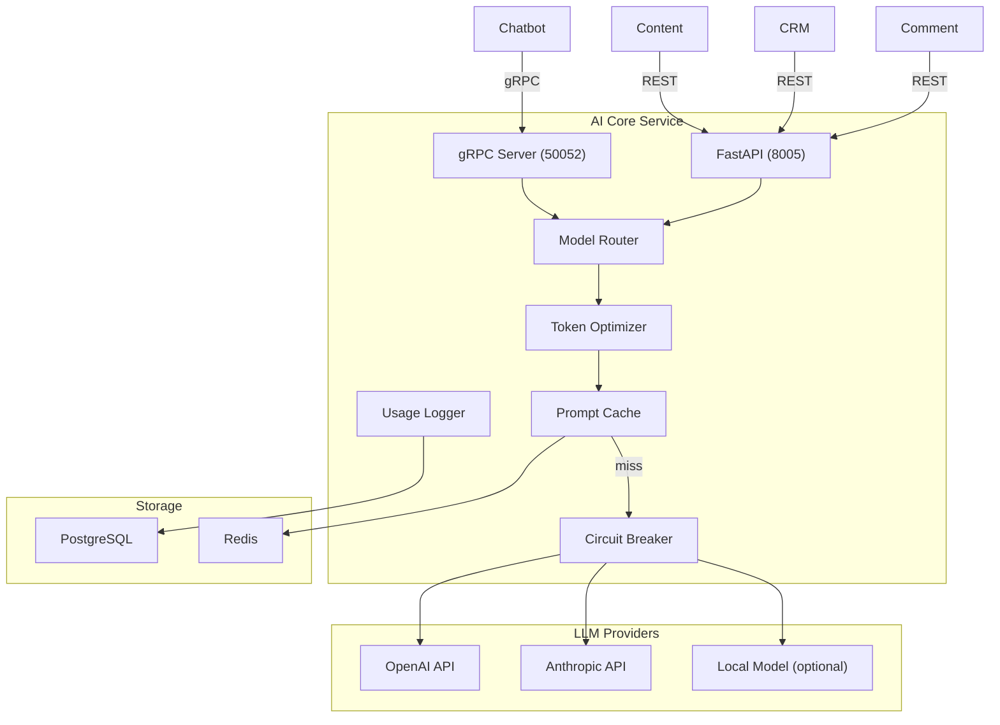

# Design — AI Core Service

## Overview

Dịch vụ AI trung tâm — Python 3.12, FastAPI + gRPC, Port 8005/50052, PostgreSQL (ai_core_db). LLM Gateway (OpenAI GPT-4o/mini + Anthropic Claude), model routing theo use case, prompt caching (giảm 90% input token cost), token optimization, provider failover (circuit breaker), Multi-tenant MCP Host Gateway (SSE + mTLS/OAuth 2.1), ReAct Agent (max 5 iterations), Input Semantic Router, Output NLI Validator.

## Components and Interfaces

Xem **Architecture**, **gRPC Interface**, **REST API**, và **Model Routing Config** bên dưới.
| Component | Technology |
|-----------|-----------|
| Runtime | Python 3.12 |
| Framework | FastAPI + gRPC |
| LLM SDK | openai, anthropic |
| gRPC | grpcio + grpcio-tools |
| Database | PostgreSQL 16 |
| ORM | SQLAlchemy 2 + asyncpg |
| Cache | Redis (prompt cache) |
| Circuit Breaker | pybreaker |
| Testing | pytest + pytest-asyncio |

## Architecture



## gRPC Interface (Server)

```protobuf
syntax = "proto3";
package ai_core;

service AICore {
  rpc Complete(CompletionRequest) returns (CompletionResponse);
  rpc StreamComplete(CompletionRequest) returns (stream CompletionChunk);
  rpc Embed(EmbedRequest) returns (EmbedResponse);
  rpc Summarize(SummarizeRequest) returns (SummarizeResponse);
}

message CompletionRequest {
  string tenant_id = 1;
  string use_case = 2;
  repeated ChatMessage messages = 3;
  string system_prompt = 4;
  int32 max_tokens = 5;
  float temperature = 6;
  string model_override = 7; // optional
  map<string, string> metadata = 8;
}

message CompletionResponse {
  string content = 1;
  string model_used = 2;
  TokenUsage usage = 3;
  float latency_ms = 4;
  float confidence = 5;
}

message TokenUsage {
  int32 prompt_tokens = 1;
  int32 completion_tokens = 2;
  float cost_usd = 3;
  bool cache_hit = 4;
}

message CompletionChunk {
  string text = 1;
  bool is_final = 2;
  TokenUsage usage = 3; // only on final chunk
}

message EmbedRequest {
  string tenant_id = 1;
  repeated string texts = 2;
  string model = 3; // default: text-embedding-3-small
  int32 dimensions = 4; // default: 512
}

message EmbedResponse {
  repeated Embedding embeddings = 1;
  TokenUsage usage = 2;
}

message Embedding {
  repeated float values = 1;
}

message SummarizeRequest {
  string tenant_id = 1;
  string text = 2;
  int32 max_length = 3;
}

message SummarizeResponse {
  string summary = 1;
  TokenUsage usage = 2;
}
```

## REST API (non-hot-path)

```
POST   /api/v1/completions             - LLM completion
POST   /api/v1/embeddings              - Generate embeddings
POST   /api/v1/summarize               - Summarize text
GET    /api/v1/models                  - List available models
GET    /api/v1/usage                   - Token usage stats (per tenant)
GET    /api/v1/usage/breakdown         - Breakdown by use case
GET    /api/v1/prompts                 - List prompt templates
POST   /api/v1/prompts                 - Create prompt template
PUT    /api/v1/prompts/:id             - Update prompt template

# Dynamic Routing and API Key Management (MỚI)
GET    /api/v1/configs/routes          - List dynamic model routing configurations
POST   /api/v1/configs/routes          - Create/Update dynamic model routing configuration
GET    /api/v1/configs/keys            - List active LLM API keys configuration
POST   /api/v1/configs/keys            - Create/Update API key configuration (encrypted storage)

# Cost Analytics and Cost Simulator (MỚI)
GET    /api/v1/analytics/usage-summary - Retrieve aggregated cost, latency, and token metrics
POST   /api/v1/analytics/simulate-cost - Simulate financial impact of switching routing configs
```

## Model Routing Config & API Key Caching (Dynamic DB-Backed & Sync)

The `LLMGateway` dynamically queries model routing configurations and API keys from PostgreSQL instead of hardcoded maps, with Redis caching (TTL 5 minutes) to ensure hot-path performance. All API keys stored in database are encrypted using Fernet (AES-256) where the key is derived from the SHA-256 hash of the `ENCRYPTION_SECRET_KEY` environment variable. Decryption is performed dynamically in-memory when making provider completions calls.

### Configuration Sync Mechanism (Hot Reload)

To ensure database isolation and local autonomy while maintaining centralized control:
1. All routing configurations and provider API keys (encrypted via AES-256) are modified at the **Tenant Config Service** (port 3006).
2. Upon saving to `config_db`, Tenant Config Service publishes a sync event payload to the Redis Pub/Sub channel `config.updates`.
3. AI Core Service runs a background subscriber loop listening to `config.updates`. When a change in category `ai_kb` is captured:
   - AI Core queries the Tenant Config Service via gRPC `GetConfig` (or REST fallback) to fetch the updated routing configurations and encrypted keys.
   - AI Core stores the configs locally in `llm_route_configs` and `api_key_configs`.
   - AI Core invalidates the local Redis cache for keys `{tenant_id}:config:llm_model_routing` and `{tenant_id}:config:api_keys`, forcing a refresh on the next request.

```python
# Cached dynamic routing struct format:
# Cached in Redis key "{tenant_id}:config:llm_model_routing"
MODEL_ROUTING = {
    "chatbot": {
        "primary": "gpt-4o-mini",
        "fallback": "claude-3-haiku-20240307",
        "max_tokens": 300,
        "temperature": 0.3,
        "provider": "openai",
        "fallback_provider": "anthropic"
    },
    ...
}
```

## Token Optimization Pipeline

To optimize context inputs and avoid token blowup, the system compresses chat history and truncates document context. The URL Fetch tool proxy integrates Jina Reader API (`https://r.jina.ai/`) to scrape and convert webpages to clean Markdown text before context injection.

```python
class TokenOptimizer:

    async def optimize(self, request: CompletionRequest, route_config: dict) -> CompletionRequest:
        # 1. Prompt caching check
        cached_system = await self.check_prompt_cache(request.system_prompt)
        
        # 2. Context compression (only relevant sentences)
        if request.use_case == "chatbot":
            request.messages = await self.compress_history(
                request.messages, keep_recent=5
            )
        
        # 3. Truncate context documents
        for msg in request.messages:
            if msg.role == "context":
                msg.content = self.extract_relevant(
                    msg.content, query=request.messages[-1].content,
                    max_tokens=800
                )
        
        # 4. Response length control
        request.max_tokens = min(
            request.max_tokens,
            route_config.get("max_tokens", 300)
        )
        
        return request
```

## Data Models

```sql
-- Usage Logging
CREATE TABLE llm_usage_logs (
    id UUID PRIMARY KEY DEFAULT gen_random_uuid(),
    tenant_id UUID NOT NULL,
    use_case VARCHAR(50) NOT NULL,
    model VARCHAR(100) NOT NULL,
    provider VARCHAR(50) NOT NULL,
    prompt_tokens INT NOT NULL,
    completion_tokens INT NOT NULL,
    cost_usd DECIMAL(10, 6) NOT NULL,
    latency_ms INT NOT NULL,
    cache_hit BOOLEAN DEFAULT FALSE,
    is_fallback BOOLEAN DEFAULT FALSE,
    metadata JSONB DEFAULT '{}',
    created_at TIMESTAMPTZ DEFAULT NOW()
);

-- Prompt Templates
CREATE TABLE prompt_templates (
    id UUID PRIMARY KEY DEFAULT gen_random_uuid(),
    tenant_id UUID NOT NULL,
    name VARCHAR(255) NOT NULL,
    use_case VARCHAR(50) NOT NULL,
    version INT NOT NULL DEFAULT 1,
    system_prompt TEXT NOT NULL,
    is_active BOOLEAN DEFAULT TRUE,
    created_at TIMESTAMPTZ DEFAULT NOW()
);

-- Dynamic Routing Configurations (MỚI)
CREATE TABLE llm_route_configs (
    id UUID PRIMARY KEY DEFAULT gen_random_uuid(),
    use_case VARCHAR(50) NOT NULL,
    tenant_id UUID NOT NULL,
    primary_model VARCHAR(100) NOT NULL,
    fallback_model VARCHAR(100) NOT NULL,
    provider VARCHAR(50) NOT NULL,
    fallback_provider VARCHAR(50) NOT NULL,
    temperature NUMERIC(3, 2) DEFAULT 0.3,
    max_tokens INTEGER DEFAULT 300,
    is_active BOOLEAN DEFAULT TRUE,
    created_at TIMESTAMPTZ DEFAULT NOW(),
    updated_at TIMESTAMPTZ DEFAULT NOW(),
    UNIQUE(use_case, tenant_id)
);

-- Encrypted API Keys Configuration (MỚI)
CREATE TABLE api_key_configs (
    id UUID PRIMARY KEY DEFAULT gen_random_uuid(),
    provider VARCHAR(50) NOT NULL UNIQUE,
    api_key_encrypted TEXT NOT NULL,
    api_base TEXT,
    is_active BOOLEAN DEFAULT TRUE,
    created_at TIMESTAMPTZ DEFAULT NOW(),
    updated_at TIMESTAMPTZ DEFAULT NOW()
);

CREATE INDEX idx_usage_tenant ON llm_usage_logs(tenant_id, created_at DESC);
CREATE INDEX idx_usage_cost ON llm_usage_logs(tenant_id, use_case, created_at);
CREATE INDEX idx_prompts_tenant ON prompt_templates(tenant_id, use_case, is_active);
CREATE INDEX idx_routes_tenant ON llm_route_configs(tenant_id, use_case);
```

## Cost Tracking & Simulator (MỚI)

```python
# Pricing per 1M tokens (updated dynamically or using fallback mapping)
PRICING_REGISTRY = {
    "openai": {
        "gpt-4o-mini": {"input": 0.15, "output": 0.60},
        "gpt-4o": {"input": 2.50, "output": 10.00},
    },
    "anthropic": {
        "claude-3-5-sonnet-20241022": {"input": 3.00, "output": 15.00},
        "claude-3-haiku-20240307": {"input": 0.25, "output": 1.25},
    },
    "deepseek": {
        "deepseek-chat": {"input": 0.14, "output": 0.28},
    }
}

# Cost Simulation Logic:
# Estimated_Cost = Sum(Usage_Logs.prompt_tokens) * New_Input_Price + Sum(Usage_Logs.completion_tokens) * New_Output_Price
# Savings = Historical_Cost - Estimated_Cost
```

## Correctness Properties

### Property 1: Tenant Isolation
**Validates: Requirements 4.1**
Moi query va operation phai filter theo tenant_id tu JWT claims. Khong co cross-tenant data leakage o bat ky tang nao (DB, Kafka, Redis, Qdrant, MinIO).

### Property 2: Idempotency
**Validates: Requirements 3.1**
Moi write operation phai co idempotency key de tranh duplicate processing khi retry. Kafka consumer phai idempotent.

### Property 3: At-least-once Delivery
**Validates: Requirements 3.1**
Kafka events phai duoc xu ly it nhat mot lan. Sau 3 retries voi exponential backoff (1s, 2s, 4s), event chuyen vao dead-letter queue.

### Property 4: Circuit Breaker Correctness
**Validates: Requirements 5.1 & Requirement 7 AC 4**
Mọi cuộc gọi đồng bộ (HTTP/gRPC) từ Tool Executor của AI Core đến các internal services hoặc external APIs bắt buộc phải đi qua một Circuit Breaker (sử dụng pybreaker). Trạng thái chuyển sang Open sau 5 lỗi liên tiếp trong 30s (tự động báo lỗi tức thì trong 1ms), và chuyển sang Half-Open để thử nghiệm lại sau 60s. Thời gian chờ (Timeout) được cấu hình động: các công cụ tương tác trực tiếp/hot-path (như `knowledge_base_search`, `contact_lookup`) có timeout tối đa 2.0s; các công cụ nền nặng (như `web_search`, `generate_content`) có timeout tối đa 10.0s.

### Property 5: Data Consistency
**Validates: Requirements 3.1**
Distributed transactions dung Saga pattern voi compensating actions khi rollback. Moi destructive action ghi audit.events Kafka topic.
## Error Handling

| Scenario | Strategy |
|----------|----------|
| External API timeout | Retry tối đa 3 lần với exponential backoff (1s, 2s, 4s); sau đó trả về lỗi có cấu trúc |
| Database connection error | Circuit breaker + fallback response; alert qua Alertmanager |
| Kafka publish failure | Retry 3 lần; nếu vẫn thất bại ghi vào dead-letter queue |
| Invalid tenant_id | Reject ngay với HTTP 403 + ghi security warning vào audit log |
| Validation error | Trở về HTTP 422 với danh sách field errors chi tiết |
| Unhandled exception | Log structured JSON với trace_id; trả về HTTP 500 với error_id để debug |

## Testing Strategy

| Layer | Tool | Coverage Target |
|-------|------|----------------|
| Unit Tests | Jest (Node.js) / pytest (Python) / JUnit 5 (Java) | > 80% business logic |
| Integration Tests | Testcontainers (PostgreSQL, Redis, Kafka) | Happy path + error paths |
| Contract Tests | Pact (consumer-driven) cho gRPC interfaces | Chatbot?AI Core, Messaging?Chatbot |
| Property-Based Tests | fast-check (JS) / Hypothesis (Python) | Tenant isolation, idempotency |
| Load Tests | k6 | Chatbot E2E < 2s t?i 100 concurrent users |

## Security & Gateway Integration
- Dịch vụ được triển khai stateless phía sau Kong API Gateway.
- Gateway chịu trách nhiệm validate JWT token từ Keycloak, xác thực client scope `ai-core`, và inject header `X-Tenant-ID` vào request.
- Dịch vụ tin tưởng hoàn toàn vào các header được Gateway inject để thực hiện logic nghiệp vụ và cô lập dữ liệu.

---

## Future Architecture Design (Phase 2)

### 1. Semantic Cache Architecture (Redis Vector)
Để tối ưu hóa chi phí LLM, hệ thống trong tương lai sẽ định cấu hình Redis làm bộ lưu trữ Semantic Cache:
*   **Database:** Sử dụng Redis Stack với module RediSearch hỗ trợ Vector Indexing.
*   **Embedding Generator:** Mỗi câu hỏi của user được chuyển đổi thành vector embedding qua API local của AI-Core trước khi kiểm tra cache.
*   **Truy vấn:** Sử dụng Vector Similarity Search (K-Nearest Neighbors) để truy vấn với khoảng cách Cosine Distance. Nếu khoảng cách tương đồng > 0.90, trả kết quả đã cache.

### 2. Trực quan hóa suy luận Agent (OpenTelemetry + LangSmith)
*   **Tracing:** Tích hợp `opentelemetry-sdk` và `opentelemetry-instrumentation-langchain`.
*   **Exporter:** Các trace span của LangGraph sẽ được export sang OTLP endpoint của LangSmith hoặc OpenTelemetry Collector để trực quan hóa toàn bộ chu trình suy luận của Agent một cách thời gian thực.

