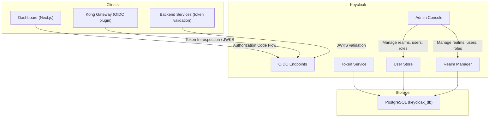
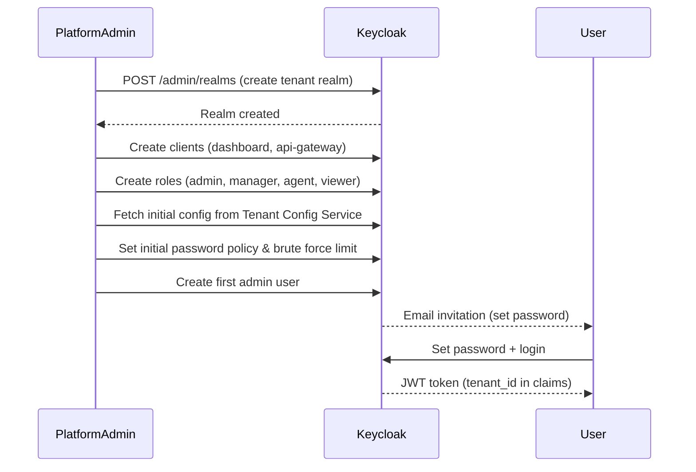
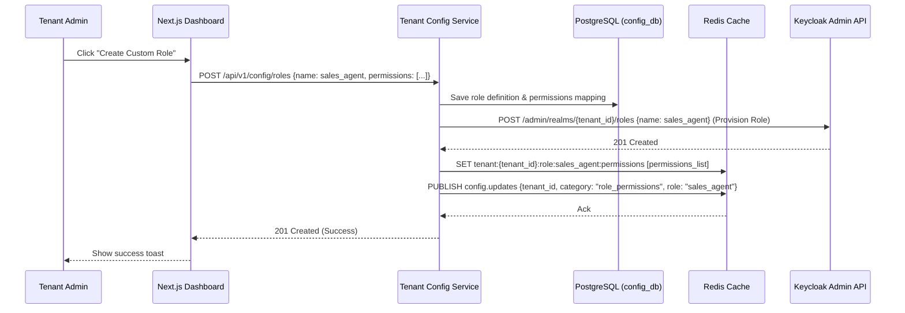
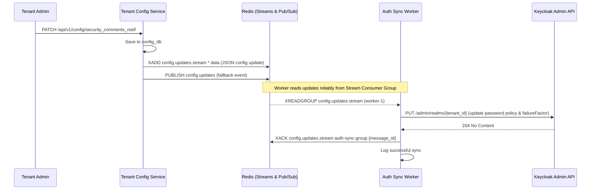
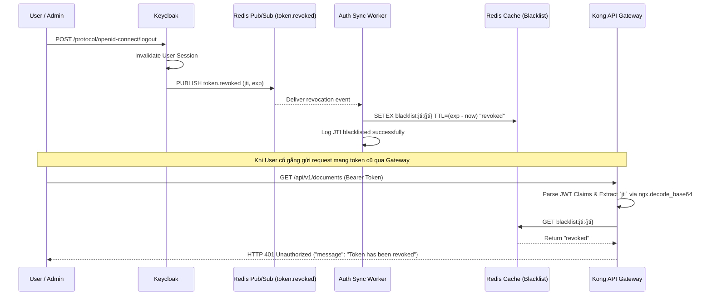
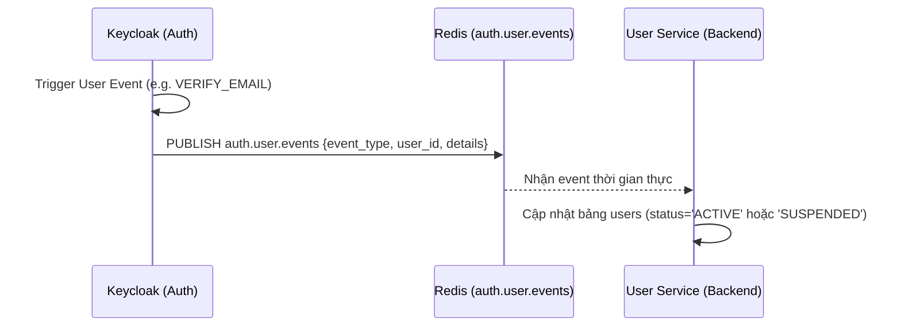

# Design — Auth Service (Keycloak)

## Overview

Dịch vụ xác thực và phân quyền tập trung — Keycloak 24+, Java (Quarkus), Port 8080, PostgreSQL (keycloak_db). Cung cấp OAuth2 Authorization Code Flow cho Dashboard, Client Credentials cho service-to-service, Multi-realm per tenant, Dynamic RBAC, Automated Tenant Provisioning, và JWT token với claims tenant_id/user_id/roles.

## Components and Interfaces

Xem **Architecture**, **Realm Structure**, và **Key Endpoints** bên dưới.

## Data Models

### 🛡️ Identity Authentication (Keycloak)
Keycloak quản lý dữ liệu xác thực nội bộ trong `keycloak_db` (PostgreSQL). Không có custom tables — tất cả user, role, realm data được quản lý bởi Keycloak schema. Xem **Realm Structure** và **JWT Token Structure** bên dưới.

### 👤 Business User Profile (User Service DB)
Để phục vụ thông tin nghiệp vụ đa dạng mà không làm phình to hoặc ảnh hưởng hiệu năng của Identity Provider, hệ thống áp dụng kiến trúc tách rời (Decoupled Hybrid Architecture). Thông tin nghiệp vụ của người dùng hệ thống (User) được lưu tại cơ sở dữ liệu nghiệp vụ riêng của **User Service** (`solavie_user_db`):

#### Bảng `users` (Hồ sơ User nghiệp vụ)
| Tên trường (Column) | Kiểu dữ liệu | Ràng buộc | Ý nghĩa nghiệp vụ |
|:---|:---|:---|:---|
| `id` | UUID | PRIMARY KEY | Khóa chính (Trùng khớp 100% với `User UUID` - claim `sub` trong Keycloak JWT) |
| `tenant_id` | UUID | NOT NULL | Định danh doanh nghiệp sở hữu nhân viên này (Multi-tenant) |
| `phone_number` | VARCHAR(20) | NULL | Số điện thoại liên hệ nội bộ |
| `avatar_url` | VARCHAR(255) | NULL | Đường dẫn ảnh đại diện nhân viên |
| `department` | VARCHAR(50) | NULL | Phòng ban làm việc (Marketing, Sales, IT...) |
| `status` | VARCHAR(20) | DEFAULT 'PENDING' | Trạng thái: `PENDING` (chờ kích hoạt), `ACTIVE`, `SUSPENDED` |
| `created_at` | TIMESTAMP | DEFAULT NOW() | Thời gian tạo tài khoản |

### 🛠️ Database Management (pgAdmin 4)
Để phục vụ quản trị dữ liệu cơ sở dữ liệu PostgreSQL (`solavie-postgres`) trực quan, hệ thống tích hợp container `pgadmin` (port `5050` trên host) kết nối chung mạng Docker nội bộ.
* **Tự động nạp cấu hình (Auto-provisioning):** Danh sách server kết nối (ví dụ: `Solavie DB`) được tự động nạp từ file `./scripts/pgadmin-servers.json` vào container tại `/pgadmin4/servers.json` khi container khởi dựng.
* **Đăng nhập mặc định:**
  * Email: `admin@solavie.com`
  * Password: `admin_secret_pass`

| Component | Technology |
|-----------|-----------|
| Platform | Keycloak 24+ |
| Runtime | Java (Quarkus-based) |
| Database | PostgreSQL 16 (keycloak_db) |
| Port | 8080 (HTTP), 8443 (HTTPS) |
| Admin Console | /admin |
| Mode | Production (optimized, metrics enabled) |

## Architecture



## Realm Structure

```
Keycloak Instance
├── master realm (platform admin only)
│   └── Users: [platform-admin]
│
├── tenant-{uuid} realm
│   ├── Clients:
│   │   ├── dashboard (public, Authorization Code + PKCE)
│   │   ├── api-gateway (confidential, for Kong OIDC)
│   │   └── user-service-client (confidential, Client Credentials, roles: realm-management/manage-users)
│   │
│   ├── Client Scopes (Optional):
│   │   ├── campaign (for Campaign Service APIs)
│   │   ├── crm (for CRM Service APIs)
│   │   ├── chatbot (for Chatbot Service APIs)
│   │   ├── content (for Content Service APIs)
│   │   ├── messaging (for Messaging Service APIs)
│   │   ├── analytics (for Analytics Service APIs)
│   │   ├── ai-core (for AI Core Service APIs)
│   │   └── tenant-config (for Tenant Config Service APIs)
│   │
│   ├── Realm Roles:
│   │   ├── admin
│   │   ├── manager
│   │   ├── agent
│   │   ├── viewer
│   │   └── (custom roles - dynamic creation)
│   │
│   ├── Users:
│   │   ├── user-1 (roles: [admin])
│   │   ├── user-2 (roles: [manager])
│   │   └── user-3 (roles: [agent, custom_role])
│   │
│   ├── Token Settings:
│   │   ├── Access Token Lifespan: 15 minutes
│   │   ├── Refresh Token Lifespan: 30 days
│   │   └── SSO Session Idle: 30 minutes
│   │
│   └── Security:
│       ├── Brute Force Detection: enabled (Dynamic: auth_max_login_attempts failures → 5 min lockout)
│       ├── Password Policy: minLength(auth_password_min_length), upperCase(1), digit(1), specialChars(1) (Dynamic from Tenant Config)
│       └── Required Actions: [VERIFY_EMAIL, UPDATE_PASSWORD]
│
└── tenant-{uuid-2} realm
    └── ... (same structure)
```

## JWT Token Structure

```json
{
  "iss": "http://keycloak:8080/realms/tenant-abc",
  "sub": "user-uuid-123",
  "aud": "dashboard",
  "exp": 1700000900,
  "iat": 1700000000,
  "azp": "dashboard",
  "realm_access": {
    "roles": ["manager", "sales_agent"]
  },
  "tenant_id": "tenant-abc-uuid",
  "email": "user@company.com",
  "name": "Nguyen Van A",
  "preferred_username": "nguyenvana",
  "scope": "openid email profile campaign crm chatbot"
}
```

## Key Endpoints (per realm)

```
# OIDC Discovery
GET  /realms/{realm}/.well-known/openid-configuration

# Token
POST /realms/{realm}/protocol/openid-connect/token
     - grant_type=authorization_code (login)
     - grant_type=refresh_token (refresh)

# User Info
GET  /realms/{realm}/protocol/openid-connect/userinfo

# JWKS (for token verification)
GET  /realms/{realm}/protocol/openid-connect/certs

# Logout
POST /realms/{realm}/protocol/openid-connect/logout

# Admin API (master realm admin only)
GET    /admin/realms                    — List realms
POST   /admin/realms                    — Create realm
GET    /admin/realms/{realm}/users      — List users
POST   /admin/realms/{realm}/users      — Create user
PUT    /admin/realms/{realm}/users/{id} — Update user
DELETE /admin/realms/{realm}/users/{id} — Delete user
```

## Tenant Onboarding Flow



## Custom Role Creation & Synchronization Flow



## Docker Compose

```yaml
keycloak:
  image: quay.io/keycloak/keycloak:24.0
  command: start --optimized
  environment:
    KC_DB: postgres
    KC_DB_URL: jdbc:postgresql://postgres-keycloak:5432/keycloak_db
    KC_DB_USERNAME: keycloak
    KC_DB_PASSWORD: ${KC_DB_PASSWORD}
    KC_HOSTNAME: auth.yourdomain.com
    KC_PROXY: edge  # behind Kong/Nginx
    KC_METRICS_ENABLED: true
    KC_HEALTH_ENABLED: true
    KEYCLOAK_ADMIN: admin
    KEYCLOAK_ADMIN_PASSWORD: ${KC_ADMIN_PASSWORD}
  ports:
    - "8080:8080"
  depends_on:
    - postgres-keycloak

postgres-keycloak:
  image: postgres:16
  environment:
    POSTGRES_DB: keycloak_db
    POSTGRES_USER: keycloak
    POSTGRES_PASSWORD: ${KC_DB_PASSWORD}
  volumes:
    - keycloak_data:/var/lib/postgresql/data
```

## Security Hardening

| Setting | Value | Reason |
|---------|-------|--------|
| Token signing | RS256 | Asymmetric, services verify without secret |
| Access token TTL | 15 min | Minimize exposure window |
| Refresh token TTL | 30 days | UX balance |
| Brute force | Dynamic: auth_max_login_attempts failures | Prevent credential stuffing (Sync from Tenant Config) |
| Password policy | Dynamic: auth_password_min_length+ chars, complexity | Industry standard (Sync from Tenant Config) |
| CORS | Restricted to dashboard domain | Prevent CSRF |
| Admin console | IP-restricted in production | Prevent unauthorized access |
| PKCE | Enforced `S256` for client `dashboard` | Prevent Authorization Code interception on public clients |
| Refresh Token Rotation | Enabled (`revokeRefreshToken=true`, `refreshTokenMaxReuse=0`) | Prevent replay attacks of compromised refresh tokens |
| OTP Policy | Default TOTP (HmacSHA1, 6 digits, 30s period) | Enforce multi-factor authentication (MFA) |
| JTI Blacklisting | Gateway-level verification check via Redis | Immediate token revocation capability (< 1ms lookup) |
| Sync Reliability | Redis Streams with Consumer Groups | Ensure 100% delivery of security config changes |
| Client Scopes | 18 scopes: `campaign`, `crm`, `chatbot`, `content`, `messaging`, `analytics`, `ai-core`, `tenant-config`, `dms`, `link-shortener`, `scheduler`, `comment-manager`, `notification`, `channel-connector`, `media-processor`, `knowledge-base`, `observability` | Enforce Least Privilege for OIDC Clients, limiting access scope to specific backend microservices |


## Dynamic Security Config Synchronization Flow

Khi Tenant thay đổi cấu hình bảo mật (`auth_password_min_length`, `auth_max_login_attempts`) tại Tenant Config Service, quá trình đồng bộ qua **Dual-Publishing** (Redis Pub/Sub & Redis Streams) diễn ra như sau:



## Token Revocation & JTI Blacklisting Flow

Khi người dùng thực hiện đăng xuất (logout) hoặc token bị thu hồi, hệ thống chặn đứng request tại Gateway qua cơ chế:



Chi tiết gọi Keycloak Admin API để đồng bộ:
- **Endpoint:** `PUT /admin/realms/{realm_name}`
- **Headers:** `Authorization: Bearer <admin_token>`
- **Payload:**
```json
{
  "passwordPolicy": "length(auth_password_min_length) and upperCase(1) and digits(1) and specialChars(1)",
  "bruteForceProtected": true,
  "permanentLockout": false,
  "failureFactor": auth_max_login_attempts
}
```

## User Events & Backend Synchronization (Keycloak Events)

Để đảm bảo thông tin nghiệp vụ tại **User Service** luôn đồng bộ với trạng thái danh tính tại Keycloak, hệ thống cấu hình **Keycloak Event Listener (HTTP Webhook / Redis Event Publisher)** để tự động đẩy sự kiện khi có thay đổi liên quan đến User:

### 🔄 Quy trình đồng bộ:
1. Khi xảy ra các sự kiện User nhạy cảm trên Keycloak, một Custom Event Listener SPI sẽ bắn sự kiện sang Redis channel `auth.user.events` (hoặc Kafka topic `auth.user.events`).
2. **User Service** lắng nghe channel/topic này để cập nhật trạng thái tương ứng trong cơ sở dữ liệu `solavie_user_db`.



### 📋 Danh sách sự kiện và Hành động đồng bộ:

| Sự kiện trên Keycloak (Event Type) | Payload gửi đi | Hành động tại User Service |
|:---|:---|:---|
| **`VERIFY_EMAIL`** / **`REGISTER`** | `{"event": "user.verified", "user_id": "uuid", "email": "..."}` | Cập nhật `status = 'ACTIVE'` |
| **`UPDATE_EMAIL`** | `{"event": "user.email_updated", "user_id": "uuid", "new_email": "..."}` | Cập nhật email trong hồ sơ |
| **`DISABLE_USER`** | `{"event": "user.disabled", "user_id": "uuid"}` | Cập nhật `status = 'SUSPENDED'` |
| **`DELETE_USER`** | `{"event": "user.deleted", "user_id": "uuid"}` | Xóa mềm (Soft Delete) hồ sơ User |


## Monitoring

- `GET /health/ready` — Readiness probe
- `GET /health/live` — Liveness probe
- `GET /metrics` — Prometheus metrics (login count, token issued, failures)


## Correctness Properties

### Property 1: Tenant Isolation
**Validates: Requirements 4.1**
Moi query va operation phai filter theo tenant_id tu JWT claims. Khong co cross-tenant data leakage o bat ky tang nao (DB, Kafka, Redis, Qdrant, MinIO).

### Property 2: Idempotency
**Validates: Requirements 3.1**
Moi write operation phai co idempotency key de tranh duplicate processing khi retry. Kafka consumer phai idempotent.

### Property 3: At-least-once Delivery
**Validates: Requirements 3.1**
Kafka events phai duoc xu ly it nhat mot lan. Sau 3 retries voi exponential backoff (1s, 2s, 4s), event chuyen vao dead-letter queue.

### Property 4: Circuit Breaker Correctness
**Validates: Requirements 5.1**
Sync calls toi external services phai qua circuit breaker. Open sau 5 failures trong 30s, Half-Open probe sau 60s.

### Property 5: Data Consistency
**Validates: Requirements 3.1**
Distributed transactions dung Saga pattern voi compensating actions khi rollback. Moi destructive action ghi audit.events Kafka topic.
## Error Handling

| Scenario | Strategy |
|----------|----------|
| External API timeout | Retry t?i da 3 l?n v?i exponential backoff (1s, 2s, 4s); sau d� tr? v? l?i c� c?u tr�c |
| Database connection error | Circuit breaker + fallback response; alert qua Alertmanager |
| Kafka publish failure | Retry 3 l?n; n?u v?n th?t b?i ghi v�o dead-letter queue |
| Invalid tenant_id | Reject ngay v?i HTTP 403 + ghi security warning v�o audit log |
| Validation error | Tr? v? HTTP 422 v?i danh s�ch field errors chi ti?t |
| Unhandled exception | Log structured JSON v?i trace_id; tr? v? HTTP 500 v?i error_id d? debug |

## Testing Strategy

| Layer | Tool | Coverage Target |
|-------|------|----------------|
| Unit Tests | Jest (Node.js) / pytest (Python) / JUnit 5 (Java) | > 80% business logic |
| Integration Tests | Testcontainers (PostgreSQL, Redis, Kafka) | Happy path + error paths |
| Contract Tests | Pact (consumer-driven) cho gRPC interfaces | Chatbot?AI Core, Messaging?Chatbot |
| Property-Based Tests | fast-check (JS) / Hypothesis (Python) | Tenant isolation, idempotency |
| Load Tests | k6 | Chatbot E2E < 2s t?i 100 concurrent users |


## Zero-Trust HMAC Guard & Permission Manifest

### 1. Permission Manifest API
`GET /api/v1/permissions/manifest`
Trả về JSON chứa danh sách các tài nguyên và hành động được định nghĩa cho service này:
```json
{
    "service": "auth",
    "resources": [
        {
            "name": "roles",
            "description": "Roles management",
            "actions": [
                "read",
                "write"
            ]
        },
        {
            "name": "permissions",
            "description": "Permissions mapping",
            "actions": [
                "read",
                "write"
            ]
        }
    ]
}
```

### 2. Zero-Trust HMAC Signature Verification
Dịch vụ kiểm tra và xác thực chữ ký signature trên mỗi request tại lớp Guard/Interceptor của Next.js / Node.js:
1. Trích xuất `X-Tenant-ID`, `X-User-ID`, `X-User-Permissions` và `X-Permissions-Signature` từ headers.
2. Tính toán signature mong đợi:
   `expected_sig = HMAC_SHA256(GATEWAY_SIGNING_SECRET, X-Tenant-ID + ":" + X-User-ID + ":" + X-User-Permissions)`
3. So sánh `X-Permissions-Signature` với `expected_sig`. Nếu không khớp, trả về ngay lập tức mã lỗi `403 Forbidden` (Signature Mismatch).
4. So khớp in-memory O(1): parse `X-User-Permissions` thành một Set và đối chiếu với quyền yêu cầu của endpoint (ví dụ: `auth:roles:read`).
   - Hỗ trợ wildcard: `*` (Super Admin bypass), `auth:*` (Service bypass), và `auth:roles:*` (Resource bypass).
