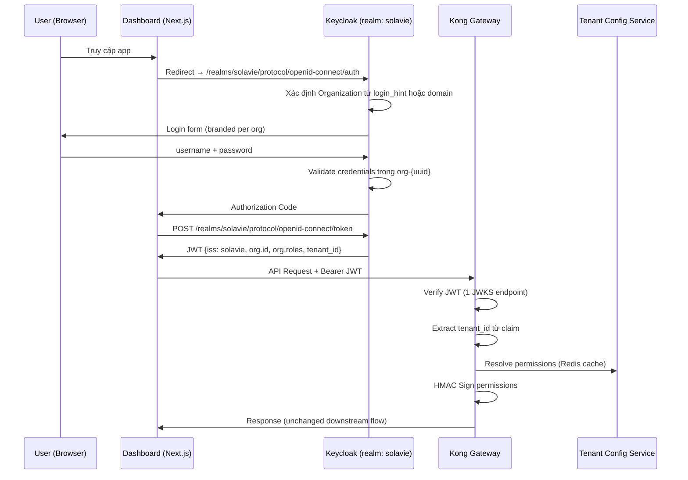

# Migration Plan — Auth Service: Multi-Realm → Enterprise SaaS

## Document Info

| Field | Value |
|:---|:---|
| **Tên tài liệu** | Auth Service Migration: Multi-Realm → Keycloak Organizations |
| **Phiên bản** | 1.0.0 |
| **Trạng thái** | DRAFT — Chờ phê duyệt |
| **Tác giả** | Architecture Team |
| **Ngày tạo** | 2026-06-08 |
| **Phụ thuộc** | `specs/services/auth/design.md`, `specs/services/gateway/design.md`, `specs/services/tenant-config/design.md` |

---

## 1. Bối cảnh & Động lực (Context & Motivation)

### 1.1. Kiến trúc hiện tại

Hệ thống Solavie hiện tại sử dụng mô hình **1 Keycloak Realm per Tenant**:

```
Keycloak Instance
├── master realm             → Platform Admin
├── tenant-{uuid-1} realm   → Tenant A (users, roles, clients)
├── tenant-{uuid-2} realm   → Tenant B
└── tenant-{uuid-N} realm   → Tenant N  ← tạo realm mới khi onboard
```

Mỗi realm có cấu trúc độc lập hoàn toàn: clients (`dashboard`, `api-gateway`, `user-service-client`), roles (`admin`, `manager`, `agent`, `viewer`, custom roles), token settings và security policy.

### 1.2. Giới hạn Scale-Out

Mô hình multi-realm hoạt động tốt ở giai đoạn MVP nhưng gặp bottleneck nghiêm trọng khi số tenant tăng lên:

| Ngưỡng Tenant | Hiện tượng | Hậu quả Nghiệp vụ |
|:---:|:---|:---|
| < 100 | Hoạt động bình thường | OK |
| 100–400 | Admin API chậm, GC pressure tăng | Onboarding tenant mới trễ >10s |
| 400–1000 | Admin Console timeout, memory spike | Hệ thống auth bất ổn, SLA bị vi phạm |
| > 1000 | OOM crash, Admin API không phản hồi | **Toàn bộ nền tảng không thể xác thực** |

**Nguyên nhân kỹ thuật:**
- Keycloak cache toàn bộ realm metadata trong heap JVM → linear memory growth theo số realm.
- Admin API của Keycloak duyệt composite roles qua tất cả realms → O(N) complexity.
- Mỗi realm có JWKS endpoint riêng → Kong phải maintain N bộ public keys.
- Background job của Keycloak (token cleanup, session cleanup) chạy per-realm → N lần context switch.

### 1.3. Mục tiêu Migration

- **Mục tiêu chính:** Hỗ trợ scale tới **10,000+ tenant** trên một Keycloak cluster mà không mất đi tính cô lập dữ liệu và bảo mật.
- **Mục tiêu phụ:** Giảm operational overhead, unified JWKS endpoint, giảm Keycloak JVM memory footprint.
- **Ràng buộc:** Không thay đổi Kong Gateway Lua plugin `dynamic-policy` và cơ chế HMAC Signing. Không thay đổi cấu trúc Redis permissions cache.

---

## 2. Phân tích So sánh Mô hình (Architecture Comparison)

### 2.1. Multi-Realm (Hiện tại) vs. Organizations (Đề xuất)

| Tiêu chí | Multi-Realm (MVP) | Keycloak Organizations (v26+) |
|:---|:---|:---|
| **Số thực thể Keycloak** | N realm × (clients + roles + users) | 1 realm + N organizations |
| **Giới hạn scale** | ~400 realms trước khi degraded | 100,000+ organizations (tested) |
| **JVM Memory footprint** | O(N × realm_metadata) | O(1 realm + N × org_metadata) nhỏ hơn nhiều |
| **JWKS endpoint** | N endpoints (`/realms/{tenant}/certs`) | 1 endpoint (`/realms/solavie/certs`) |
| **Tenant isolation** | Full realm isolation | Organization-scoped isolation + claim `org_id` |
| **Custom roles** | Realm Roles per tenant | Organization Roles per organization |
| **SSO Cross-tenant** | Không hỗ trợ | Hỗ trợ nếu cần |
| **Admin API complexity** | O(N) duyệt composite roles | O(1) per organization |
| **Kong OIDC config** | N issuer URLs | 1 issuer URL |
| **Effort migration** | — | Medium (3–4 sprints) |

### 2.2. Thay đổi JWT Claims

**JWT hiện tại (Multi-Realm):**
```json
{
  "iss": "http://keycloak:8080/realms/tenant-abc-uuid",
  "sub": "user-uuid-123",
  "realm_access": {
    "roles": ["manager", "sales_agent"]
  },
  "tenant_id": "tenant-abc-uuid",
  "scope": "openid email campaign crm"
}
```

**JWT mới (Organizations):**
```json
{
  "iss": "http://keycloak:8080/realms/solavie",
  "sub": "user-uuid-123",
  "organization": {
    "id": "org-tenant-abc-uuid",
    "name": "Company ABC",
    "roles": ["manager", "sales_agent"]
  },
  "tenant_id": "tenant-abc-uuid",
  "scope": "openid email campaign crm"
}
```

> **Lưu ý quan trọng:** Trường `tenant_id` vẫn được giữ nguyên. Kong Gateway và tất cả downstream services **không cần thay đổi logic** — chỉ cần update mapper extract `tenant_id` từ claim `organization.id` thay vì từ realm URL.

---

## 3. Kiến trúc Đích (Target Architecture)

### 3.1. Cấu trúc Keycloak Organizations

```
Keycloak Instance (v26+)
└── realm: solavie                          ← Một realm duy nhất
    ├── Clients (shared, realm-level):
    │   ├── dashboard         (public, PKCE)
    │   ├── api-gateway       (confidential, Client Credentials)
    │   └── user-service-client (confidential, Client Credentials)
    │
    ├── Organizations:
    │   ├── org-{uuid-1}                    ← Tenant A
    │   │   ├── Members: [user-1, user-2]
    │   │   ├── Roles: [admin, manager, agent, viewer, custom_role_x]
    │   │   ├── Identity Providers: (optional, per org SSO)
    │   │   └── Attributes: { tenant_id: "uuid-1", plan: "enterprise" }
    │   │
    │   ├── org-{uuid-2}                    ← Tenant B
    │   │   └── ...
    │   └── org-{uuid-N}                    ← Tenant N
    │
    ├── Realm Roles (hệ thống):
    │   ├── system              (Platform Operator)
    │   └── system_admin        (Platform Admin)
    │
    └── Token Settings (global):
        ├── Access Token Lifespan: 15 minutes
        ├── Refresh Token Lifespan: 30 days
        └── RSA signing key (1 JWKS endpoint cho tất cả)
```

### 3.2. Luồng Xác thực Mới



### 3.3. Component Impact Map

| Component | Thay đổi cần thiết | Mức độ |
|:---|:---|:---:|
| **Keycloak** | Upgrade v26+, tạo realm `solavie`, migrate tenants sang Organizations | 🔴 Cao |
| **Kong OIDC Plugin** | Đổi `issuer` từ per-realm → 1 URL | 🟢 Thấp |
| **Kong `dynamic-policy` Lua** | Đổi `claims.tenant_id` extraction path | 🟢 Thấp |
| **`provision_realm.py`** | Viết lại → `provision_organization.py` | 🟡 Trung bình |
| **`sync_worker.py`** | Đổi Admin API calls từ realm-scoped → org-scoped | 🟡 Trung bình |
| **`tenant-realm-template.json`** | Thay bằng `org-template.json` | 🟡 Trung bình |
| **Tenant Config Service** | Không thay đổi (dùng tenant_id như cũ) | ✅ Không đổi |
| **Redis permissions cache** | Không thay đổi (key schema giữ nguyên) | ✅ Không đổi |
| **Downstream microservices** | Không thay đổi (đọc `X-Tenant-ID` header từ Gateway) | ✅ Không đổi |
| **Dashboard (Next.js)** | Đổi OIDC issuer URL trong config | 🟢 Thấp |
| **`handler.lua` (Security Fix)** | Bổ sung Realm Master check (W1 bug) | 🔴 **Bắt buộc, ưu tiên 1** |

---

## 4. Kế hoạch Migration Phân Giai đoạn

### Giai đoạn 0 — Pre-Migration Security Fix (Ngay lập tức)

> **Không liên quan đến Organizations migration, nhưng BẮT BUỘC làm trước.**

**Mục tiêu:** Vá lỗ hổng bảo mật W1 trong `handler.lua` trước khi bắt đầu bất kỳ migration nào.

```lua
-- File: services/gateway/plugins/dynamic-policy/handler.lua
-- Thay thế đoạn code dòng 213-219

local MASTER_REALM_TENANT_ID = os.getenv("KONG_MASTER_REALM_TENANT_ID") or "solavie-system-master"

for _, role in ipairs(roles) do
    if role == "admin" then
        has_wildcard = true
        resolved_any = true
    elseif role == "system" or role == "system_admin" then
        if tenant_id == MASTER_REALM_TENANT_ID then
            has_wildcard = true
            resolved_any = true
        else
            kong.log.warn("[SECURITY] Privilege Escalation Blocked: role='",
                role, "' tenant_id='", tenant_id, "'")
            close_redis(red, ok)
            return kong.response.exit(403,
                { message = "Forbidden: System roles not allowed in tenant realm" })
        end
    end
end
```

**Checklist Giai đoạn 0:**
- [ ] Cập nhật `handler.lua` với Realm Master check
- [ ] Thêm `KONG_MASTER_REALM_TENANT_ID` vào `docker-compose.yml` và `.env.example`
- [ ] Viết test case: tenant thường không thể dùng role `system` để leo quyền
- [ ] Deploy và verify trên môi trường dev

---

### Giai đoạn 1 — Foundation (Sprint 1-2)

**Mục tiêu:** Chuẩn bị môi trường Keycloak Organizations song song với multi-realm hiện tại (Blue-Green approach).

**1.1. Upgrade & Setup Keycloak v26+**
- [ ] Upgrade Keycloak từ v24 → v26+ trong `docker-compose.yml`
- [ ] Verify backward compatibility với realm hiện tại
- [ ] Enable Organizations feature: `KC_FEATURES=organization`
- [ ] Tạo realm `solavie` (production realm mới)
- [ ] Cấu hình shared clients: `dashboard`, `api-gateway`, `user-service-client`
- [ ] Cấu hình Token Claims Mapper để inject `tenant_id` từ `organization.attributes.tenant_id`

**1.2. Viết `provision_organization.py`**

Script thay thế `provision_realm.py`, có interface tương tự nhưng gọi Organizations API:

```python
# services/auth/scripts/provision_organization.py
# Thay thế provision_realm.py

def provision_organization(tenant_id: str, company_name: str, admin_email: str):
    """
    Tạo Organization mới trong realm 'solavie' thay vì tạo realm mới.
    
    Keycloak Admin API:
    POST /admin/realms/solavie/organizations
    {
        "name": "org-{tenant_id}",
        "alias": tenant_id,
        "attributes": {
            "tenant_id": [tenant_id],
            "plan": ["free"]
        }
    }
    """
    ...

def provision_default_roles(org_id: str):
    """
    Tạo Org Roles: admin, manager, agent, viewer
    POST /admin/realms/solavie/organizations/{org_id}/roles
    """
    ...

def create_org_admin_user(org_id: str, email: str, temp_password: str):
    """
    Tạo user + gán vào organization + gán role admin
    """
    ...
```

**1.3. Chuẩn bị Migration Data Script**
- [ ] Script `migrate_realm_to_org.py`: đọc user data từ realm cũ, tạo users trong realm `solavie` và gán vào đúng organization
- [ ] Script chỉ migrate metadata — password hash không thể migrate được → user phải reset password lần đầu sau migration

**Deliverable Giai đoạn 1:**
- Keycloak v26+ chạy song song với realm cũ
- `provision_organization.py` hoàn chỉnh và được test
- Script migration data sẵn sàng

---

### Giai đoạn 2 — Core Integration (Sprint 3-4)

**Mục tiêu:** Kết nối Kong Gateway và Backend Services với realm `solavie` mới.

**2.1. Cập nhật Kong Configuration**

```yaml
# kong.yml — Thay đổi OIDC plugin issuer
plugins:
  - name: openid-connect
    config:
      # TRƯỚC:
      # issuer: "http://keycloak:8080/realms/master/.well-known/openid-configuration"
      # SAU:
      issuer: "http://keycloak:8080/realms/solavie/.well-known/openid-configuration"
      client_id: "kong-gateway"
      client_secret: "${KONG_OIDC_SECRET}"
      auth_methods: ["bearer"]
      consumer_claim: ["sub"]
```

**2.2. Cập nhật JWT Claims Extraction trong `handler.lua`**

```lua
-- handler.lua — Đổi cách extract tenant_id từ JWT
-- Hỗ trợ cả 2 format trong giai đoạn chuyển đổi (backward compatible)

local tenant_id = nil

-- Format mới: Organization claim
if claims.organization and claims.organization.id then
    tenant_id = claims.organization.id

-- Format cũ: realm-level tenant_id claim
elseif claims.tenant_id then
    tenant_id = claims.tenant_id
end

-- Fallback: extract từ issuer URL (legacy support)
if not tenant_id and claims.iss then
    tenant_id = claims.iss:match("/realms/([^/]+)$")
end
```

**2.3. Cập nhật `sync_worker.py`**

```python
# services/auth/scripts/sync_worker.py
# Đổi Admin API calls từ realm-scoped → organization-scoped

# TRƯỚC:
# PUT /admin/realms/{tenant_id} (update realm settings)

# SAU:
# PUT /admin/realms/solavie/organizations/{org_id} (update org attributes)

def update_org_security_config(org_id: str, config: dict):
    """
    Cập nhật cấu hình bảo mật cho Organization.
    Password policy và brute force vẫn ở realm-level nhưng
    có thể override per-org thông qua org attributes.
    """
    keycloak_admin.update_organization(
        realm="solavie",
        org_id=org_id,
        payload={
            "attributes": {
                "password_min_length": [str(config.get("auth_password_min_length", 8))],
                "max_login_attempts": [str(config.get("auth_max_login_attempts", 5))]
            }
        }
    )
```

**2.4. Cập nhật Dashboard OIDC Config**

```typescript
// dashboard/src/lib/auth.ts
const keycloakConfig = {
  // TRƯỚC:
  // url: process.env.KEYCLOAK_URL,
  // realm: `tenant-${tenantId}`,

  // SAU:
  url: process.env.KEYCLOAK_URL,
  realm: "solavie",                          // ← Realm cố định
  clientId: "dashboard",
  // Organization xác định qua login_hint hoặc domain-based routing
}
```

**Deliverable Giai đoạn 2:**
- Kong Gateway kết nối thành công với realm `solavie`
- `sync_worker.py` hoạt động đúng với Organizations API
- Dashboard đăng nhập được qua realm mới
- Tất cả integration tests pass

---

### Giai đoạn 3 — Data Migration (Sprint 5-6)

**Mục tiêu:** Migrate toàn bộ tenant data từ multi-realm sang Organizations. **Zero downtime.**

**3.1. Chiến lược Migration Zero-Downtime**

```
Thời điểm T:    Realm cũ (tenant-{id})   ACTIVE
                Realm mới (solavie/org)   ACTIVE (read-only shadow)

Thời điểm T+1:  Chạy migrate_realm_to_org.py
                - Copy users sang org (users phải reset password)
                - Copy custom roles
                - Copy role assignments

Thời điểm T+2:  Flip Kong OIDC issuer → realm solavie
                - Tenant được thông báo reset password

Thời điểm T+3:  Monitor 7 ngày
                Realm cũ ở chế độ read-only

Thời điểm T+4:  Xóa realm cũ
```

**3.2. Migration Script Core Logic**

```python
# services/auth/scripts/migrate_realm_to_org.py

def migrate_tenant(old_realm_name: str, new_org_id: str):
    """
    Migrate một tenant từ realm sang organization.
    """
    kc_admin = KeycloakAdmin(server_url=KC_URL, realm_name="master", ...)

    # 1. Lấy danh sách users từ realm cũ
    old_users = kc_admin.get_users(realm_name=old_realm_name)

    for user in old_users:
        # 2. Tạo user mới trong realm solavie
        new_user_id = kc_admin.create_user(realm_name="solavie", payload={
            "username": user["username"],
            "email": user["email"],
            "firstName": user.get("firstName"),
            "lastName": user.get("lastName"),
            "attributes": {
                "migrated_from": [old_realm_name],
                "original_id": [user["id"]]
            },
            # Bắt buộc reset password sau migration
            "requiredActions": ["UPDATE_PASSWORD"]
        })

        # 3. Gán user vào organization
        kc_admin.add_user_to_organization(
            realm="solavie",
            org_id=new_org_id,
            user_id=new_user_id
        )

        # 4. Gán lại roles trong organization
        old_roles = kc_admin.get_realm_roles_of_user(old_realm_name, user["id"])
        for role in old_roles:
            kc_admin.assign_org_role(
                realm="solavie",
                org_id=new_org_id,
                user_id=new_user_id,
                role_name=role["name"]
            )

    # 5. Migrate custom roles
    custom_roles = kc_admin.get_realm_roles(old_realm_name, only_custom=True)
    for role in custom_roles:
        kc_admin.create_org_role(
            realm="solavie",
            org_id=new_org_id,
            role_name=role["name"],
            description=role.get("description")
        )
```

**3.3. Rollback Plan**

Nếu migration gặp sự cố:
1. Flip Kong OIDC issuer về realm cũ (< 30 giây)
2. Realm cũ vẫn giữ nguyên và hoạt động trong suốt quá trình migration
3. Không có data loss vì migration là additive (tạo user mới, không xóa user cũ)

**Deliverable Giai đoạn 3:**
- 100% tenant được migrate sang Organizations
- Tất cả users có thể đăng nhập qua realm `solavie`
- Realm cũ decommissioned sau 7 ngày monitoring

---

### Giai đoạn 4 — Hardening & Optimization (Sprint 7)

**Mục tiêu:** Tối ưu hóa kiến trúc sau migration.

**4.1. Redis Cluster Mode**

Khi đạt 500+ tenant, migrate Redis từ standalone → cluster:

```yaml
# docker-compose.yml (production)
redis-master-1:
  image: redis:7-alpine
  command: redis-server --cluster-enabled yes --cluster-config-file nodes.conf
redis-master-2: ...  # shard 2
redis-master-3: ...  # shard 3
redis-replica-1: ... # replica cho master-1
redis-replica-2: ... # replica cho master-2
redis-replica-3: ... # replica cho master-3
```

**4.2. Kong `ngx.shared.DICT` Cache (Fix W2)**

```lua
-- Trong kong.conf: lua_shared_dict perm_cache 50m
-- Trong handler.lua:
local perm_cache = ngx.shared.perm_cache

local function get_from_shared_cache(key)
    local value, flags = perm_cache:get(key)
    return value
end

local function set_to_shared_cache(key, value, ttl)
    perm_cache:set(key, value, ttl)
end
```

**4.3. Circuit Breaker cho API Fallback (Fix W6)**

```lua
-- Circuit breaker state per tenant-config service
local circuit_key = "circuit:tenant-config"
local circuit_state = ngx.shared.circuit_cache:get(circuit_key)

if circuit_state == "OPEN" then
    -- Dùng stale L1 cache thay vì fail-secure
    kong.log.warn("Circuit OPEN: using stale cache for tenant ", tenant_id)
    -- Không gọi API fallback
else
    -- Gọi API fallback bình thường
    -- Nếu fail: increment failure counter
    -- Nếu counter > 5 trong 60s: set circuit OPEN (TTL 30s)
end
```

---

## 5. Yêu cầu Phi Chức năng (NFR) Sau Migration

| NFR | Hiện tại | Mục tiêu sau Migration |
|:---|:---|:---|
| **Số tenant hỗ trợ** | ~400 (giới hạn Keycloak realm) | 10,000+ (Organizations) |
| **Keycloak startup time** | Tăng tuyến tính theo N realm | Ổn định (1 realm) |
| **JVM Heap Keycloak** | ~50MB/realm × N | ~2GB cố định (1 realm + Organizations) |
| **JWKS endpoint** | N endpoints (per realm) | 1 endpoint |
| **Token validation latency** | <10ms (Kong JWKS cache) | <5ms (1 key set) |
| **Tenant onboarding time** | ~3-5s (create realm) | ~200ms (create organization) |
| **Admin API latency** | O(N) tăng theo tenant | O(1) ổn định |

---

## 6. Testing Strategy

### 6.1. Unit Tests

```python
# services/auth/tests/test_migration.py

def test_provision_organization_creates_org():
    """Tạo organization mới với đầy đủ attributes"""
    ...

def test_provision_organization_creates_default_roles():
    """Organization có đủ roles: admin, manager, agent, viewer"""
    ...

def test_jwt_contains_org_id_as_tenant_id():
    """JWT từ realm solavie chứa tenant_id từ org attributes"""
    ...

def test_privilege_escalation_blocked_in_single_realm():
    """User với role 'system' trong org thường bị block ở Gateway"""
    ...
```

### 6.2. Migration Integration Tests

```python
def test_migrate_realm_to_org_preserves_users():
    """Tất cả users từ realm cũ tồn tại trong org mới"""
    ...

def test_migrate_realm_to_org_preserves_roles():
    """Custom roles từ realm cũ được tạo lại trong org"""
    ...

def test_old_tokens_rejected_after_cutover():
    """Token từ realm cũ bị từ chối sau khi flip issuer"""
    ...

def test_new_tokens_accepted_by_gateway():
    """Token từ realm solavie được Kong chấp nhận và phân giải quyền đúng"""
    ...
```

### 6.3. Performance Tests (k6)

```javascript
// tests/load/keycloak_org_scale.js
// Test: 1000 concurrent logins trên 500 organizations

export const options = {
  stages: [
    { duration: '2m', target: 100 },
    { duration: '5m', target: 1000 },
    { duration: '2m', target: 0 },
  ],
  thresholds: {
    http_req_duration: ['p(95)<500'],   // 95% requests < 500ms
    http_req_failed: ['rate<0.01'],      // Error rate < 1%
  },
};
```

---

## 7. Rủi ro & Giảm thiểu (Risk Matrix)

| Rủi ro | Xác suất | Tác động | Biện pháp Giảm thiểu |
|:---|:---:|:---:|:---|
| Users không reset password → bị lock out | Cao | Cao | Gửi email thông báo trước 7 ngày, cung cấp self-service reset |
| Keycloak v26 breaking changes | Trung bình | Trung bình | Test trên môi trường staging trước khi production |
| Kong OIDC cache stale public key | Thấp | Cao | Flush OIDC plugin cache sau cutover |
| Custom role name conflict giữa tenants | Trung bình | Thấp | Org-scoped roles cô lập theo design của Keycloak Organizations |
| Migration script timeout với tenant lớn | Thấp | Trung bình | Chạy migration theo batch, có resume mechanism |
| Rollback phức tạp sau cutover | Thấp | Cao | Giữ realm cũ active thêm 7 ngày sau cutover |

---

## 8. Phụ lục — Biến Môi trường Mới

```bash
# .env (thêm mới cho Organizations mode)

# Keycloak realm tập trung
KEYCLOAK_REALM=solavie

# Thay thế KEYCLOAK_TENANT_REALM_PREFIX
# KEYCLOAK_TENANT_REALM_PREFIX=tenant-  # deprecated

# Master Realm Tenant ID cho system roles (security critical)
KONG_MASTER_REALM_TENANT_ID=solavie-system-master

# Organizations feature flag
KEYCLOAK_ORGANIZATIONS_ENABLED=true
KC_FEATURES=organization

# Migration mode (true = chạy song song cả 2 model)
AUTH_MIGRATION_MODE=false
```

---

## 9. Điều kiện Hoàn thành (Definition of Done)

- [ ] Giai đoạn 0: Security fix W1 deployed và verified
- [ ] Giai đoạn 1: Keycloak v26+ hoạt động ổn định với Organizations
- [ ] Giai đoạn 2: Kong Gateway, Dashboard, `sync_worker.py` kết nối realm `solavie`
- [ ] Giai đoạn 3: 100% tenant migrated, realm cũ decommissioned
- [ ] Giai đoạn 4: Redis Cluster, Kong shared dict cache, Circuit Breaker deployed
- [ ] NFR đạt: 1000 concurrent login p95 < 500ms
- [ ] Test coverage > 80% cho migration logic
- [ ] Không có downtime trong quá trình cutover

---

*Tài liệu được tạo bởi Architecture Team — Solavie Platform Engineering*
*Phiên bản tiếp theo: v2.0 sau khi hoàn thành Giai đoạn 3*
