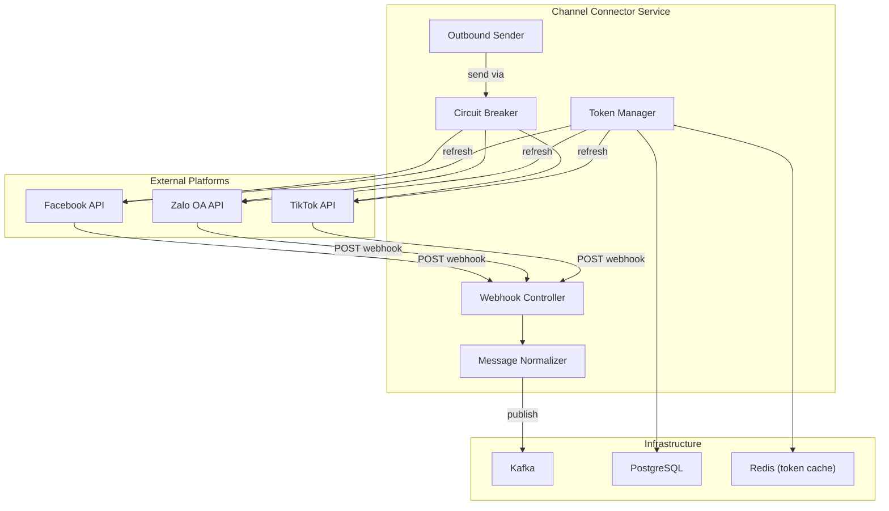

# Design — Channel Connector Service

## Overview

Dịch vụ kết nối các kênh mạng xã hội — Node.js 20, NestJS, Port 3001, PostgreSQL (channel_connector_db). Nhận webhook từ Facebook/Zalo OA/TikTok, normalize message sang unified format, gửi tin outbound, quản lý OAuth tokens (AES-256 encrypted), circuit breaker cho external API calls, idempotency check qua Redis.

## Components and Interfaces

Xem **Architecture**, **Webhook Endpoints**, **Internal APIs**, và **Circuit Breaker Config** bên dưới.
| Component | Technology |
|-----------|-----------|
| Runtime | Node.js 20 |
| Framework | NestJS 10 |
| Language | TypeScript 5 |
| Database | PostgreSQL 16 |
| ORM | Prisma |
| Queue | KafkaJS |
| HTTP Client | Axios + axios-retry |
| Circuit Breaker | opossum |
| Validation | class-validator + class-transformer |
| Testing | Jest + Supertest |

## Architecture



## API Design

### Webhook Endpoints (Public)
```
GET    /api/v1/permissions/manifest     — Expose permissions manifest for this service
POST /webhooks/facebook     — Facebook webhook receiver
GET  /webhooks/facebook     — Facebook webhook verification
POST /webhooks/zalo         — Zalo webhook receiver
POST /webhooks/tiktok       — TikTok webhook receiver
```

### Internal APIs (via Gateway, authenticated)
```
POST   /api/v1/channels              — Connect new channel
DELETE /api/v1/channels/:id          — Disconnect channel
GET    /api/v1/channels              — List channels (per tenant)
POST   /api/v1/channels/:id/send     — Send message outbound
GET    /api/v1/channels/:id/status   — Channel health status
```

## Data Models

```sql
CREATE TABLE channels (
    id UUID PRIMARY KEY DEFAULT gen_random_uuid(),
    tenant_id UUID NOT NULL,
    platform VARCHAR(20) NOT NULL, -- 'facebook', 'zalo', 'tiktok'
    platform_id VARCHAR(255) NOT NULL, -- page_id, oa_id, etc.
    name VARCHAR(255) NOT NULL,
    access_token TEXT NOT NULL, -- encrypted
    refresh_token TEXT,
    token_expires_at TIMESTAMPTZ,
    status VARCHAR(20) DEFAULT 'active', -- 'active', 'disconnected', 'error'
    config JSONB DEFAULT '{}',
    created_at TIMESTAMPTZ DEFAULT NOW(),
    updated_at TIMESTAMPTZ DEFAULT NOW()
);

CREATE TABLE webhook_logs (
    id UUID PRIMARY KEY DEFAULT gen_random_uuid(),
    tenant_id UUID,
    platform VARCHAR(20) NOT NULL,
    idempotency_key VARCHAR(255) NOT NULL,
    payload JSONB NOT NULL,
    status VARCHAR(20) DEFAULT 'processed',
    created_at TIMESTAMPTZ DEFAULT NOW()
);

CREATE UNIQUE INDEX idx_webhook_idempotency ON webhook_logs(platform, idempotency_key);
CREATE INDEX idx_channels_tenant ON channels(tenant_id, platform);
```

## Kafka Events

### Published: `channel.message.received`
```typescript
interface MessageReceivedEvent {
  event_id: string;
  event_type: 'message.received';
  tenant_id: string;
  channel_id: string;
  channel: 'facebook' | 'zalo' | 'tiktok';
  conversation_id: string;
  message: {
    id: string;
    sender_id: string;
    content: string;
    content_type: 'text' | 'image' | 'video' | 'file' | 'sticker';
    attachments?: Array<{ type: string; url: string }>;
    timestamp: string; // ISO8601
    metadata: Record<string, any>;
  };
}
```

### Published: `channel.message.sent`
```typescript
interface MessageSentEvent {
  event_id: string;
  event_type: 'message.sent';
  tenant_id: string;
  channel_id: string;
  message_id: string;
  platform_message_id: string;
  status: 'delivered' | 'failed';
  error?: string;
}
```

## Circuit Breaker Config
```typescript
{
  timeout: 10000,        // 10s timeout per request
  errorThresholdPercentage: 50,
  resetTimeout: 60000,   // 60s before half-open
  volumeThreshold: 5     // min 5 requests before tripping
}
```

## Token Refresh Strategy
- Facebook: Long-lived token (60 days), refresh 7 days before expiry
- Zalo: Access token (1 hour), refresh token (3 months). Background job refresh every 50 minutes
- TikTok: Access token (24 hours), refresh before expiry

Background cron job chạy mỗi 10 phút kiểm tra tokens sắp hết hạn.


## Correctness Properties

### Property 1: Tenant Isolation
**Validates: Requirements 4.1**
Moi query va operation phai filter theo tenant_id tu JWT claims. Khong co cross-tenant data leakage o bat ky tang nao (DB, Kafka, Redis, Qdrant, MinIO).

### Property 2: Idempotency
**Validates: Requirements 3.1**
Moi write operation phai co idempotency key de tranh duplicate processing khi retry. Kafka consumer phai idempotent.

### Property 3: At-least-once Delivery
**Validates: Requirements 3.1**
Kafka events phai duoc xu ly it nhat mot lan. Sau 3 retries voi exponential backoff (1s, 2s, 4s), event chuyen vao dead-letter queue.

### Property 4: Circuit Breaker Correctness
**Validates: Requirements 5.1**
Sync calls toi external services phai qua circuit breaker. Open sau 5 failures trong 30s, Half-Open probe sau 60s.

### Property 5: Data Consistency
**Validates: Requirements 3.1**
Distributed transactions dung Saga pattern voi compensating actions khi rollback. Moi destructive action ghi audit.events Kafka topic.
## Error Handling

| Scenario | Strategy |
|----------|----------|
| External API timeout | Retry t?i da 3 l?n v?i exponential backoff (1s, 2s, 4s); sau d� tr? v? l?i c� c?u tr�c |
| Database connection error | Circuit breaker + fallback response; alert qua Alertmanager |
| Kafka publish failure | Retry 3 l?n; n?u v?n th?t b?i ghi v�o dead-letter queue |
| Invalid tenant_id | Reject ngay v?i HTTP 403 + ghi security warning v�o audit log |
| Validation error | Tr? v? HTTP 422 v?i danh s�ch field errors chi ti?t |
| Unhandled exception | Log structured JSON v?i trace_id; tr? v? HTTP 500 v?i error_id d? debug |

## Testing Strategy

| Layer | Tool | Coverage Target |
|-------|------|----------------|
| Unit Tests | Jest (Node.js) / pytest (Python) / JUnit 5 (Java) | > 80% business logic |
| Integration Tests | Testcontainers (PostgreSQL, Redis, Kafka) | Happy path + error paths |
| Contract Tests | Pact (consumer-driven) cho gRPC interfaces | Chatbot?AI Core, Messaging?Chatbot |
| Property-Based Tests | fast-check (JS) / Hypothesis (Python) | Tenant isolation, idempotency |
| Load Tests | k6 | Chatbot E2E < 2s t?i 100 concurrent users |


## Zero-Trust HMAC Guard & Permission Manifest

### 1. Permission Manifest API
`GET /api/v1/permissions/manifest`
Trả về JSON chứa danh sách các tài nguyên và hành động được định nghĩa cho service này:
```json
{
    "service": "channel-connector",
    "resources": [
        {
            "name": "channels",
            "description": "Social media channels connection",
            "actions": [
                "create",
                "read",
                "delete"
            ]
        }
    ]
}
```

### 2. Zero-Trust HMAC Signature Verification
Dịch vụ kiểm tra và xác thực chữ ký signature trên mỗi request tại lớp Guard/Interceptor của Node.js / Express:
1. Trích xuất `X-Tenant-ID`, `X-User-ID`, `X-User-Permissions` và `X-Permissions-Signature` từ headers.
2. Tính toán signature mong đợi:
   `expected_sig = HMAC_SHA256(GATEWAY_SIGNING_SECRET, X-Tenant-ID + ":" + X-User-ID + ":" + X-User-Permissions)`
3. So sánh `X-Permissions-Signature` với `expected_sig`. Nếu không khớp, trả về ngay lập tức mã lỗi `403 Forbidden` (Signature Mismatch).
4. So khớp in-memory O(1): parse `X-User-Permissions` thành một Set và đối chiếu với quyền yêu cầu của endpoint (ví dụ: `channel-connector:channels:create`).
   - Hỗ trợ wildcard: `*` (Super Admin bypass), `channel-connector:*` (Service bypass), và `channel-connector:channels:*` (Resource bypass).

## Security & Gateway Integration
- Dịch vụ được triển khai stateless phía sau Kong API Gateway.
- Gateway chịu trách nhiệm validate JWT token từ Keycloak, xác thực client scope `channel-connector`, và inject header `X-Tenant-ID` vào request.
- Dịch vụ tin tưởng hoàn toàn vào các header được Gateway inject để thực hiện logic nghiệp vụ và cô lập dữ liệu.
