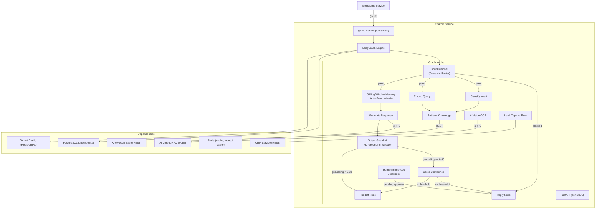
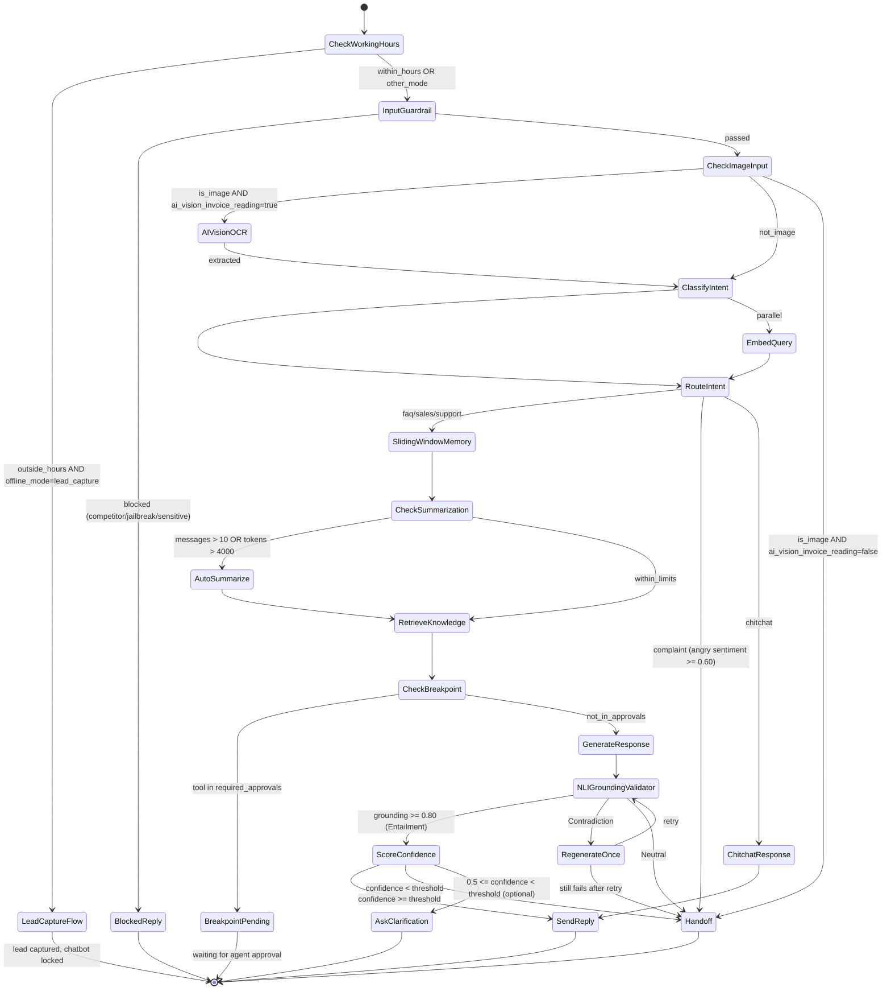

# Design — Chatbot Service

## Overview

Dịch vụ chatbot AI "nhân sự số" 24/7 của Solavie — Python 3.12, FastAPI + LangGraph + gRPC. Quản lý state đồ thị hội thoại, phân loại intent, RAG retrieval, confidence scoring, auto-handoff, AI Vision OCR (đọc hóa đơn điện), Input/Output Guardrails (Semantic Router + NLI), Sliding Window Memory + Auto-Summarization, Lead Capture Flow ngoài giờ, Human-in-the-loop Breakpoints, và Prompt Caching.

## Components and Interfaces

Xem **Architecture**, **LangGraph Workflow**, và **gRPC Interface** bên dưới.

## Tech Stack
| Component | Technology |
|-----------|-----------|
| Runtime | Python 3.12 |
| Framework | FastAPI |
| AI Orchestration | LangGraph 0.2+ |
| gRPC | grpcio + grpcio-tools |
| Database | PostgreSQL 16 (chatbot_db) |
| ORM | SQLAlchemy 2 + asyncpg |
| Testing | pytest + pytest-asyncio |
| Linting | ruff |
| Port | 8001 (REST) / 50051 (gRPC) |

## Architecture



## LangGraph Workflow



## gRPC Interface (Server)

```protobuf
syntax = "proto3";
package chatbot;

service ChatbotService {
  rpc ProcessMessage(ChatRequest) returns (ChatResponse);
  rpc StreamResponse(ChatRequest) returns (stream ChatChunk);
  rpc ApproveBreakpoint(BreakpointApproval) returns (BreakpointResult);
}

message ChatRequest {
  string tenant_id = 1;
  string conversation_id = 2;
  string message_content = 3;
  string language = 4;
  repeated ChatMessage history = 5;
  map<string, string> metadata = 6;
  MessageType message_type = 7;  // TEXT, IMAGE, FILE
  string media_url = 8;          // for IMAGE type
}

message ChatMessage {
  string role = 1;    // 'customer', 'bot', 'agent'
  string content = 2;
  string timestamp = 3;
}

message ChatResponse {
  string response_text = 1;
  float confidence_score = 2;
  string intent = 3;
  string sentiment = 4;
  Action action = 5;
  string language_detected = 6;
  bool guardrail_blocked = 7;
  string block_reason = 8;
  bool breakpoint_pending = 9;
  string breakpoint_id = 10;
}

enum Action {
  REPLY = 0;
  HANDOFF = 1;
  CLARIFY = 2;
  LEAD_CAPTURE = 3;
  BREAKPOINT = 4;
}

enum MessageType {
  TEXT = 0;
  IMAGE = 1;
  FILE = 2;
}

message ChatChunk {
  string text_chunk = 1;
  bool is_final = 2;
  ChatResponse final_response = 3; // only when is_final=true
}

message BreakpointApproval {
  string breakpoint_id = 1;
  string tenant_id = 2;
  string conversation_id = 3;
  bool approved = 4;
  string agent_id = 5;
}

message BreakpointResult {
  bool success = 1;
  string message = 2;
}
```

## State Schema

```python
from typing import TypedDict, Annotated, Literal, Optional
import operator

class LeadCaptureState(TypedDict):
    step: Literal["name", "phone", "address", "complete"]
    name: Optional[str]
    phone: Optional[str]
    address: Optional[str]
    attempts: int  # retry count for invalid phone

class ChatState(TypedDict):
    # Core conversation
    messages: Annotated[list, operator.add]
    tenant_id: str
    conversation_id: str
    intent: str
    language: str
    context_docs: list
    confidence: float
    sentiment: str
    response: str
    action: Literal["reply", "handoff", "clarify", "lead_capture", "breakpoint"]
    
    # Sliding Window Memory
    summary: Optional[str]          # Auto-summarization of old messages
    message_count: int              # Total messages in conversation
    token_count: int                # Estimated token count
    
    # Guardrails
    guardrail_blocked: bool         # True if input guardrail blocked the message
    guardrail_block_reason: Optional[str]  # 'competitor', 'jailbreak', 'sensitive'
    grounding_score: Optional[float]       # NLI grounding score (0.0-1.0)
    regenerate_count: int           # Number of regeneration attempts
    
    # Lead Capture
    lead_capture_state: Optional[LeadCaptureState]
    is_outside_hours: bool
    
    # Human-in-the-loop
    breakpoint_pending: bool        # True if waiting for agent approval
    breakpoint_id: Optional[str]    # UUID of pending ActionApproval
    breakpoint_tool: Optional[str]  # Tool name that triggered breakpoint
    
    # Vision OCR
    invoice_data: Optional[dict]    # Extracted: kwh, amount, evn_code, owner_name
```

## Input Guardrail — Semantic Router

```python
# Danh mục bị chặn (cấu hình từ Tenant Config)
BLOCKED_CATEGORIES = {
    "competitor": [
        "đối thủ", "công ty khác", "so sánh với", "bên kia rẻ hơn",
        # Tên đối thủ cụ thể trong ngành solar VN
    ],
    "jailbreak": [
        "ignore previous instructions", "forget your instructions",
        "act as", "pretend you are", "DAN", "jailbreak",
        "bỏ qua hướng dẫn", "giả vờ là",
    ],
    "sensitive": [
        # Chính trị, tôn giáo, xã hội nhạy cảm
    ]
}

# Logic: Semantic similarity check (embedding-based) + keyword matching
# Threshold: cosine_similarity > 0.75 với blocked category embeddings → block
# Response: Predefined polite refusal + redirect to solar topic
```

## Output Guardrail — NLI Grounding Validator

```
Flow:
  1. Generate response from LLM (with RAG context)
  2. Call AI Core NLI endpoint:
     premise = RAG context documents (concatenated)
     hypothesis = generated response
  3. NLI returns: label (Entailment/Neutral/Contradiction), score (0.0-1.0)
  
  Decision:
    Entailment AND score >= 0.80 → PASS → send to confidence scoring
    Contradiction → BLOCK → regenerate once (max 1 retry)
    Neutral → BLOCK → handoff immediately
    After 1 regeneration still fails → handoff
```

## Sliding Window Memory + Auto-Summarization

```python
WINDOW_SIZE = 10          # Max messages to keep in full
TOKEN_LIMIT = 4000        # Max tokens before summarization

async def check_and_summarize(state: ChatState) -> ChatState:
    if state["message_count"] > WINDOW_SIZE or state["token_count"] > TOKEN_LIMIT:
        # Summarize messages older than last 5
        old_messages = state["messages"][:-5]
        recent_messages = state["messages"][-5:]
        
        summary_prompt = f"""
        Tóm tắt ngắn gọn cuộc trò chuyện sau (giữ thông tin quan trọng):
        {format_messages(old_messages)}
        Tóm tắt hiện có: {state.get('summary', '')}
        """
        new_summary = await ai_core.summarize(summary_prompt)
        
        return {
            **state,
            "messages": recent_messages,
            "summary": new_summary,
            "message_count": len(recent_messages),
        }
    return state

# Summary được inject vào system prompt khi generate:
# "Tóm tắt cuộc trò chuyện trước: {state['summary']}"
```

## Lead Capture Flow

```
Trigger: is_outside_hours AND offline_mode_behavior == 'lead_capture'

Steps:
  1. Send greeting: "Hiện tại đã ngoài giờ làm việc của Solavie..."
  2. Collect name → validate non-empty
  3. Collect phone → validate: 10 digits, starts with 03/05/07/08/09
     - If invalid: polite retry message, max 3 attempts
  4. Collect address → validate non-empty
  5. On complete:
     - POST /api/v1/contacts (CRM) → create Contact
     - POST /api/v1/deals (CRM) → create Deal at 'lead' stage
     - Set lead_capture_state.step = 'complete'
     - Lock chatbot (no free conversation until next business day)
  
Phone validation regex: ^(03|05|07|08|09)\d{8}$
```

## Human-in-the-loop Breakpoints

```
Trigger: LangGraph about to call tool in required_approvals config

Flow:
  1. Pause LangGraph graph execution at interrupt_before=[tool_name]
  2. Create ActionApproval record:
     {
       id: UUID,
       tenant_id,
       conversation_id,
       tool_name,
       tool_args,
       status: 'pending',
       created_at,
       expires_at: now + 30min
     }
  3. Push ActionApproval to Dashboard via Kafka/WebSocket
  4. Send waiting message to customer: "Yêu cầu đang được nhân viên xem xét..."
  5. Set state.breakpoint_pending = true, state.breakpoint_id = approval.id
  
On Approve (gRPC ApproveBreakpoint):
  - Resume graph from checkpoint with approved=true
  - Execute tool
  
On Reject (gRPC ApproveBreakpoint):
  - Resume graph with approved=false
  - Execute compensating action (rollback)
  - Notify customer of rejection
  
On Timeout (30 min):
  - Background job marks approval as 'expired'
  - Trigger handoff
```

## Prompt Caching Strategy

```
Cached sections (placed at top of prompt, before dynamic content):
  1. System prompt (persona, rules, brand guidelines)
  2. MCP tool schemas (static JSON)
  3. Static knowledge documents (product specs, pricing tables)
  4. Tenant-specific configuration (refreshed on config.updates event)

Cache key: {tenant_id}:prompt_cache:{hash(system_prompt + tool_schemas)}
Cache TTL: 24 hours (or until config changes)

Expected savings:
  - Input tokens reduced by ~90% for cached sections
  - Cost reduction: ~$0.003 → ~$0.0003 per cached section
  - Latency reduction: ~80% for first-token generation
```

## Data Models
```sql
-- LangGraph checkpoints (managed by langgraph-checkpoint-postgres)
-- Auto-created by LangGraph

-- Custom tables
CREATE TABLE chatbot_configs (
    id UUID PRIMARY KEY DEFAULT gen_random_uuid(),
    tenant_id UUID NOT NULL UNIQUE,
    confidence_threshold FLOAT DEFAULT 0.7,
    max_history_messages INT DEFAULT 10,
    enabled_languages TEXT[] DEFAULT '{vi,en}',
    system_prompt TEXT,
    created_at TIMESTAMPTZ DEFAULT NOW(),
    updated_at TIMESTAMPTZ DEFAULT NOW()
);

CREATE TABLE chatbot_logs (
    id UUID PRIMARY KEY DEFAULT gen_random_uuid(),
    tenant_id UUID NOT NULL,
    conversation_id UUID NOT NULL,
    message_content TEXT NOT NULL,
    intent VARCHAR(50),
    sentiment VARCHAR(20),
    confidence_score FLOAT,
    grounding_score FLOAT,
    action VARCHAR(20),
    response_text TEXT,
    guardrail_blocked BOOLEAN DEFAULT FALSE,
    guardrail_reason VARCHAR(50),
    latency_ms INT,
    model_used VARCHAR(100),
    tokens_used INT,
    tokens_cached INT,
    created_at TIMESTAMPTZ DEFAULT NOW()
);

CREATE TABLE action_approvals (
    id UUID PRIMARY KEY DEFAULT gen_random_uuid(),
    tenant_id UUID NOT NULL,
    conversation_id UUID NOT NULL,
    tool_name VARCHAR(100) NOT NULL,
    tool_args JSONB NOT NULL,
    status VARCHAR(20) NOT NULL DEFAULT 'pending', -- 'pending', 'approved', 'rejected', 'expired'
    agent_id UUID,
    created_at TIMESTAMPTZ DEFAULT NOW(),
    expires_at TIMESTAMPTZ NOT NULL,
    resolved_at TIMESTAMPTZ
);

CREATE INDEX idx_logs_tenant ON chatbot_logs(tenant_id, created_at DESC);
CREATE INDEX idx_logs_confidence ON chatbot_logs(confidence_score) WHERE action = 'handoff';
CREATE INDEX idx_approvals_pending ON action_approvals(tenant_id, status) WHERE status = 'pending';
```

## Performance Optimization

| Technique | Impact |
|-----------|--------|
| Parallel: intent classification + embedding | -40% latency |
| gRPC (not REST) for AI Core | -50ms per call |
| Sliding Window + Auto-Summarization | -60% tokens for long conversations |
| Prompt Caching (system prompt + schemas) | -90% input token cost for cached sections |
| Redis cache for repeated queries | -100ms (cache hit) |
| Streaming response | Perceived latency < 500ms |
| Input Guardrail before LLM call | Blocks invalid requests early, saves tokens |

## End-to-End Latency Budget (< 2000ms)

| Step | Budget | Technique |
|------|--------|-----------|
| gRPC receive + parse | 10ms | - |
| Input Guardrail (Semantic Router) | 50ms | Embedding similarity, cached |
| Intent classify (parallel) | 300ms | GPT-4o-mini, cached prompt |
| Embed query (parallel) | 100ms | text-embedding-3-small |
| Sliding Window check | 10ms | In-memory |
| Knowledge Base search | 50ms | Hybrid + rerank |
| Generate response | 1000ms | Streaming, context optimized, prompt cached |
| NLI Grounding Validator | 150ms | Lightweight NLI model |
| Confidence scoring | 20ms | Included in generation |
| gRPC respond | 10ms | - |
| **Total** | **~1700ms** | Under 2s budget |


## Correctness Properties

### Property 1: Tenant Isolation
**Validates: Requirements 4.1**
Moi query va operation phai filter theo tenant_id tu JWT claims. Khong co cross-tenant data leakage o bat ky tang nao (DB, Kafka, Redis, Qdrant, MinIO).

### Property 2: Idempotency
**Validates: Requirements 3.1**
Moi write operation phai co idempotency key de tranh duplicate processing khi retry. Kafka consumer phai idempotent.

### Property 3: At-least-once Delivery
**Validates: Requirements 3.1**
Kafka events phai duoc xu ly it nhat mot lan. Sau 3 retries voi exponential backoff (1s, 2s, 4s), event chuyen vao dead-letter queue.

### Property 4: Circuit Breaker Correctness
**Validates: Requirements 5.1**
Sync calls toi external services phai qua circuit breaker. Open sau 5 failures trong 30s, Half-Open probe sau 60s.

### Property 5: Data Consistency
**Validates: Requirements 3.1**
Distributed transactions dung Saga pattern voi compensating actions khi rollback. Moi destructive action ghi audit.events Kafka topic.
## Error Handling

| Scenario | Strategy |
|----------|----------|
| External API timeout | Retry t?i da 3 l?n v?i exponential backoff (1s, 2s, 4s); sau d� tr? v? l?i c� c?u tr�c |
| Database connection error | Circuit breaker + fallback response; alert qua Alertmanager |
| Kafka publish failure | Retry 3 l?n; n?u v?n th?t b?i ghi v�o dead-letter queue |
| Invalid tenant_id | Reject ngay v?i HTTP 403 + ghi security warning v�o audit log |
| Validation error | Tr? v? HTTP 422 v?i danh s�ch field errors chi ti?t |
| Unhandled exception | Log structured JSON v?i trace_id; tr? v? HTTP 500 v?i error_id d? debug |

## Testing Strategy

| Layer | Tool | Coverage Target |
|-------|------|----------------|
| Unit Tests | Jest (Node.js) / pytest (Python) / JUnit 5 (Java) | > 80% business logic |
| Integration Tests | Testcontainers (PostgreSQL, Redis, Kafka) | Happy path + error paths |
| Contract Tests | Pact (consumer-driven) cho gRPC interfaces | Chatbot?AI Core, Messaging?Chatbot |
| Property-Based Tests | fast-check (JS) / Hypothesis (Python) | Tenant isolation, idempotency |
| Load Tests | k6 | Chatbot E2E < 2s t?i 100 concurrent users |


## Zero-Trust HMAC Guard & Permission Manifest

### 1. Permission Manifest API
`GET /api/v1/permissions/manifest`
Trả về JSON chứa danh sách các tài nguyên và hành động được định nghĩa cho service này:
```json
{
    "service": "chatbot",
    "resources": [
        {
            "name": "scenarios",
            "description": "Chatbot conversation scenarios",
            "actions": [
                "read",
                "write"
            ]
        }
    ]
}
```

### 2. Zero-Trust HMAC Signature Verification
Dịch vụ kiểm tra và xác thực chữ ký signature trên mỗi request tại lớp Guard/Interceptor của Python / FastAPI:
1. Trích xuất `X-Tenant-ID`, `X-User-ID`, `X-User-Permissions` và `X-Permissions-Signature` từ headers.
2. Tính toán signature mong đợi:
   `expected_sig = HMAC_SHA256(GATEWAY_SIGNING_SECRET, X-Tenant-ID + ":" + X-User-ID + ":" + X-User-Permissions)`
3. So sánh `X-Permissions-Signature` với `expected_sig`. Nếu không khớp, trả về ngay lập tức mã lỗi `403 Forbidden` (Signature Mismatch).
4. So khớp in-memory O(1): parse `X-User-Permissions` thành một Set và đối chiếu với quyền yêu cầu của endpoint (ví dụ: `chatbot:scenarios:read`).
   - Hỗ trợ wildcard: `*` (Super Admin bypass), `chatbot:*` (Service bypass), và `chatbot:scenarios:*` (Resource bypass).

## Security & Gateway Integration
- Dịch vụ được triển khai stateless phía sau Kong API Gateway.
- Gateway chịu trách nhiệm validate JWT token từ Keycloak, xác thực client scope `chatbot`, và inject header `X-Tenant-ID` vào request.
- Dịch vụ tin tưởng hoàn toàn vào các header được Gateway inject để thực hiện logic nghiệp vụ và cô lập dữ liệu.

---

## Service Discovery Integration Design

Dịch vụ Chatbot tích hợp lớp `ServiceRegistryClient` chạy song song với ứng dụng chính để hỗ trợ phát hiện dịch vụ động:

### 1. Kiến trúc Client
* **Cơ chế:**
  * **Startup Event:** Khi tiến trình của dịch vụ khởi động, client thực thi lệnh `SADD` để thêm IP:Port của node hiện tại vào Redis Set: `registry:service:chatbot`.
  * **Heartbeat Thread/Task:** Chạy định kỳ mỗi 5 giây để thực hiện:
    * Ghi đè khóa sự sống: `SETEX registry:service:chatbot:node:{ip}:{port} 15 "alive"`.
    * Đảm bảo IP vẫn tồn tại trong Set: `SADD registry:service:chatbot {ip}:{port}`.
  * **Shutdown Event:** Khi nhận tín hiệu tắt tiến trình (`SIGTERM`/`SIGINT`), client thực hiện dọn dẹp:
    * Xóa IP khỏi Set: `SREM registry:service:chatbot {ip}:{port}`.
    * Xóa khóa sống: `DEL registry:service:chatbot:node:{ip}:{port}`.

### 2. Tích hợp theo Tech Stack
* **NestJS (Node.js):** Sử dụng các lifecycle hooks `OnModuleInit` và `OnApplicationShutdown` kết hợp thư viện `ioredis` và `setInterval` cho heartbeat.
* **FastAPI (Python):** Sử dụng lifespan event handlers của FastAPI kết hợp `asyncio.create_task` và `redis-py`.
* **Spring Boot (Java):** Sử dụng annotation `@PostConstruct` và `@PreDestroy` kết hợp `ScheduledExecutorService` và `Jedis`/`Lettuce`.


---

## Registry Client & Health Endpoint Design (Tối ưu hóa)
*   **Giải thuật phát hiện IP:**
    1. Lấy biến môi trường `CONTAINER_IP`.
    2. Nếu trống, quét các interface card mạng vật lý của OS để tìm IP IPv4 hợp lệ.
    3. Fallback: Tạo kết nối UDP fake đến `8.8.8.8:53`.
*   **Health Check Endpoint:**
    *   Endpoint: `/health`
    *   Response: `{"status": "UP", "timestamp": "ISO-8601", "details": {"database": "UP", "redis": "UP"}}`
    *   Kiểm tra kết nối Database và Redis. Trả về HTTP 200 nếu khỏe mạnh, HTTP 503 nếu lỗi kết nối cốt lõi.
