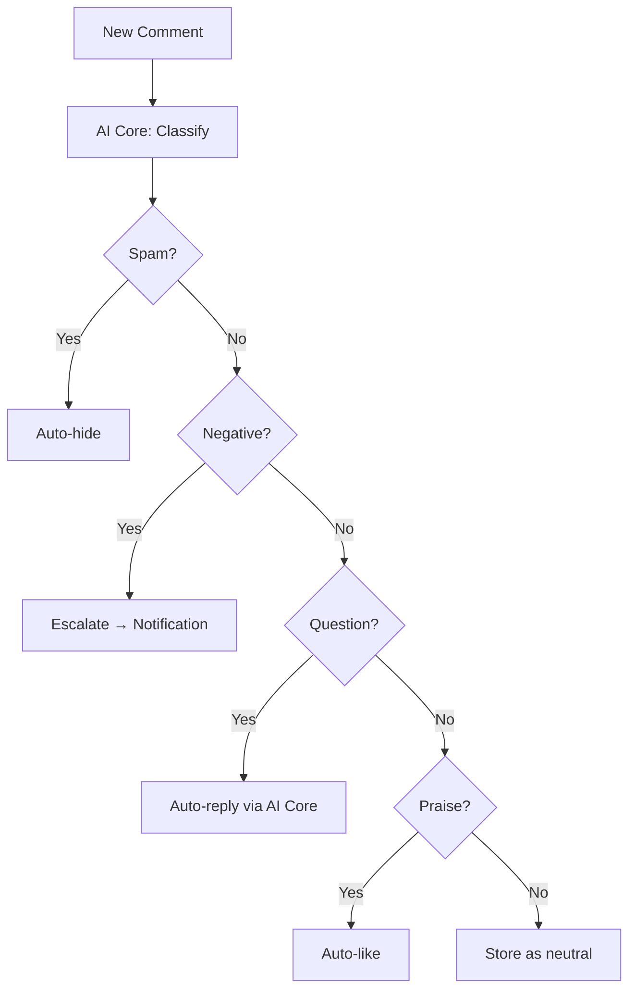

# Design — Comment Manager Service

## Overview

Dịch vụ quản lý bình luận trên Facebook/TikTok — Node.js 20, NestJS, Port 3005, PostgreSQL (comment_db). Phân loại bình luận (spam/negative/question/praise/neutral) qua AI Core, tự động ẩn spam (>= 0.85), escalate negative (>= 0.60), auto-reply FAQ (>= 0.70).

## Architecture

Xem **Classification Flow** bên dưới.

## Components and Interfaces

Xem **API Design**, **Kafka Events**, và **Classification Flow** bên dưới.
| Component | Technology |
|-----------|-----------|
| Runtime | Node.js 20 |
| Framework | NestJS 10 |
| Language | TypeScript 5 |
| Database | PostgreSQL 16 |
| ORM | Prisma |
| Queue | KafkaJS |
| AI | AI Core (REST client) |
| Testing | Jest |

## API Design

```
GET    /api/v1/permissions/manifest     — Expose permissions manifest for this service
GET    /api/v1/comments                  — List comments (filterable: post_id, classification, channel)
GET    /api/v1/comments/:id              — Get comment detail
PUT    /api/v1/comments/:id/classify     — Override classification
POST   /api/v1/comments/:id/reply        — Manual reply to comment
PUT    /api/v1/comments/:id/hide         — Hide comment
PUT    /api/v1/comments/:id/unhide       — Unhide comment
GET    /api/v1/comments/stats            — Classification stats (accuracy, volume by type)
GET    /api/v1/comments/mcp              — SSE connection endpoint for MCP Server
POST   /api/v1/comments/mcp/messages     — JSON-RPC message transport for MCP Server
```

## Data Models

```sql
CREATE TABLE comments (
    id UUID PRIMARY KEY DEFAULT gen_random_uuid(),
    tenant_id UUID NOT NULL,
    post_id UUID NOT NULL,
    channel VARCHAR(20) NOT NULL,
    platform_comment_id VARCHAR(255) NOT NULL,
    author_id VARCHAR(255) NOT NULL,
    author_name VARCHAR(255),
    content TEXT NOT NULL,
    classification VARCHAR(20), -- 'spam', 'negative', 'question', 'praise', 'neutral'
    classification_confidence FLOAT,
    is_override BOOLEAN DEFAULT FALSE,
    is_hidden BOOLEAN DEFAULT FALSE,
    auto_reply_sent BOOLEAN DEFAULT FALSE,
    auto_reply_text TEXT,
    metadata JSONB DEFAULT '{}',
    created_at TIMESTAMPTZ DEFAULT NOW(),
    updated_at TIMESTAMPTZ DEFAULT NOW()
);

CREATE TABLE classification_overrides (
    id UUID PRIMARY KEY DEFAULT gen_random_uuid(),
    comment_id UUID NOT NULL REFERENCES comments(id),
    tenant_id UUID NOT NULL,
    original_classification VARCHAR(20) NOT NULL,
    new_classification VARCHAR(20) NOT NULL,
    overridden_by UUID NOT NULL,
    created_at TIMESTAMPTZ DEFAULT NOW()
);

CREATE INDEX idx_comments_post ON comments(post_id, created_at DESC);
CREATE INDEX idx_comments_tenant ON comments(tenant_id, classification, created_at DESC);
CREATE INDEX idx_overrides_tenant ON classification_overrides(tenant_id, created_at DESC);
```

## Kafka Events

### Consumed: `channel.comment.received`
→ Classify + auto-action

### Published: `comment.escalation`
```json
{
  "tenant_id": "uuid",
  "comment_id": "uuid",
  "post_id": "uuid",
  "classification": "negative",
  "content": "string",
  "author_name": "string"
}
```

## Classification Flow




## Model Context Protocol (MCP) Tools

Dịch vụ Comment Manager Service đóng vai trò là một MCP SSE Server đăng ký các công cụ sau:

### 1. Tool: `hide_comment`
* **Mô tả:** Ẩn hoặc hiện bình luận cụ thể trên nền tảng mạng xã hội nhằm kiểm duyệt nội dung.
* **Tham số đầu vào (Schema):**
  * `comment_id` (string, UUID, required): ID của bình luận cần kiểm duyệt trong hệ thống.
  * `is_hidden` (boolean, optional, mặc định là true): Chỉ định ẩn (`true`) hoặc hiện (`false`).
  * `reason` (string, optional): Lý do ẩn (ví dụ: 'spam', 'negative', 'harassment').
* **Bảo mật:** Tham số `tenant_id` sẽ được tự động tiêm từ header `X-Tenant-ID` vào tham số thực thi hàm nghiệp vụ nhằm đảm bảo an toàn truy vấn và cập nhật trên database Prisma, cấm LLM tự sửa đổi.

## Correctness Properties

### Property 1: Tenant Isolation
**Validates: Requirements 4.1**
Moi query va operation phai filter theo tenant_id tu JWT claims. Khong co cross-tenant data leakage o bat ky tang nao (DB, Kafka, Redis, Qdrant, MinIO).

### Property 2: Idempotency
**Validates: Requirements 3.1**
Moi write operation phai co idempotency key de tranh duplicate processing khi retry. Kafka consumer phai idempotent.

### Property 3: At-least-once Delivery
**Validates: Requirements 3.1**
Kafka events phai duoc xu ly it nhat mot lan. Sau 3 retries voi exponential backoff (1s, 2s, 4s), event chuyen vao dead-letter queue.

### Property 4: Circuit Breaker Correctness
**Validates: Requirements 5.1**
Sync calls toi external services phai qua circuit breaker. Open sau 5 failures trong 30s, Half-Open probe sau 60s.

### Property 5: Data Consistency
**Validates: Requirements 3.1**
Distributed transactions dung Saga pattern voi compensating actions khi rollback. Moi destructive action ghi audit.events Kafka topic.
## Error Handling

| Scenario | Strategy |
|----------|----------|
| External API timeout | Retry t?i da 3 l?n v?i exponential backoff (1s, 2s, 4s); sau d� tr? v? l?i c� c?u tr�c |
| Database connection error | Circuit breaker + fallback response; alert qua Alertmanager |
| Kafka publish failure | Retry 3 l?n; n?u v?n th?t b?i ghi v�o dead-letter queue |
| Invalid tenant_id | Reject ngay v?i HTTP 403 + ghi security warning v�o audit log |
| Validation error | Tr? v? HTTP 422 v?i danh s�ch field errors chi ti?t |
| Unhandled exception | Log structured JSON v?i trace_id; tr? v? HTTP 500 v?i error_id d? debug |

## Testing Strategy

| Layer | Tool | Coverage Target |
|-------|------|----------------|
| Unit Tests | Jest (Node.js) / pytest (Python) / JUnit 5 (Java) | > 80% business logic |
| Integration Tests | Testcontainers (PostgreSQL, Redis, Kafka) | Happy path + error paths |
| Contract Tests | Pact (consumer-driven) cho gRPC interfaces | Chatbot?AI Core, Messaging?Chatbot |
| Property-Based Tests | fast-check (JS) / Hypothesis (Python) | Tenant isolation, idempotency |
| Load Tests | k6 | Chatbot E2E < 2s t?i 100 concurrent users |


## Zero-Trust HMAC Guard & Permission Manifest

### 1. Permission Manifest API
`GET /api/v1/permissions/manifest`
Trả về JSON chứa danh sách các tài nguyên và hành động được định nghĩa cho service này:
```json
{
    "service": "comment-manager",
    "resources": [
        {
            "name": "comments",
            "description": "Social media post comments",
            "actions": [
                "read",
                "update"
            ]
        }
    ]
}
```

### 2. Zero-Trust HMAC Signature Verification
Dịch vụ kiểm tra và xác thực chữ ký signature trên mỗi request tại lớp Guard/Interceptor của Node.js / NestJS:
1. Trích xuất `X-Tenant-ID`, `X-User-ID`, `X-User-Permissions` và `X-Permissions-Signature` từ headers.
2. Tính toán signature mong đợi:
   `expected_sig = HMAC_SHA256(GATEWAY_SIGNING_SECRET, X-Tenant-ID + ":" + X-User-ID + ":" + X-User-Permissions)`
3. So sánh `X-Permissions-Signature` với `expected_sig`. Nếu không khớp, trả về ngay lập tức mã lỗi `403 Forbidden` (Signature Mismatch).
4. So khớp in-memory O(1): parse `X-User-Permissions` thành một Set và đối chiếu với quyền yêu cầu của endpoint (ví dụ: `comment-manager:comments:read`).
   - Hỗ trợ wildcard: `*` (Super Admin bypass), `comment-manager:*` (Service bypass), và `comment-manager:comments:*` (Resource bypass).

## Security & Gateway Integration
- Dịch vụ được triển khai stateless phía sau Kong API Gateway.
- Gateway chịu trách nhiệm validate JWT token từ Keycloak, xác thực client scope `comment-manager`, và inject header `X-Tenant-ID` vào request.
- Dịch vụ tin tưởng hoàn toàn vào các header được Gateway inject để thực hiện logic nghiệp vụ và cô lập dữ liệu.

---

## Service Discovery Integration Design

Dịch vụ Comment Manager tích hợp lớp `ServiceRegistryClient` chạy song song với ứng dụng chính để hỗ trợ phát hiện dịch vụ động:

### 1. Kiến trúc Client
* **Cơ chế:**
  * **Startup Event:** Khi tiến trình của dịch vụ khởi động, client thực thi lệnh `SADD` để thêm IP:Port của node hiện tại vào Redis Set: `registry:service:comment-manager`.
  * **Heartbeat Thread/Task:** Chạy định kỳ mỗi 5 giây để thực hiện:
    * Ghi đè khóa sự sống: `SETEX registry:service:comment-manager:node:{ip}:{port} 15 "alive"`.
    * Đảm bảo IP vẫn tồn tại trong Set: `SADD registry:service:comment-manager {ip}:{port}`.
  * **Shutdown Event:** Khi nhận tín hiệu tắt tiến trình (`SIGTERM`/`SIGINT`), client thực hiện dọn dẹp:
    * Xóa IP khỏi Set: `SREM registry:service:comment-manager {ip}:{port}`.
    * Xóa khóa sống: `DEL registry:service:comment-manager:node:{ip}:{port}`.

### 2. Tích hợp theo Tech Stack
* **NestJS (Node.js):** Sử dụng các lifecycle hooks `OnModuleInit` và `OnApplicationShutdown` kết hợp thư viện `ioredis` và `setInterval` cho heartbeat.
* **FastAPI (Python):** Sử dụng lifespan event handlers của FastAPI kết hợp `asyncio.create_task` và `redis-py`.
* **Spring Boot (Java):** Sử dụng annotation `@PostConstruct` và `@PreDestroy` kết hợp `ScheduledExecutorService` và `Jedis`/`Lettuce`.


---

## Registry Client & Health Endpoint Design (Tối ưu hóa)
*   **Giải thuật phát hiện IP:**
    1. Lấy biến môi trường `CONTAINER_IP`.
    2. Nếu trống, quét các interface card mạng vật lý của OS để tìm IP IPv4 hợp lệ.
    3. Fallback: Tạo kết nối UDP fake đến `8.8.8.8:53`.
*   **Health Check Endpoint:**
    *   Endpoint: `/health`
    *   Response: `{"status": "UP", "timestamp": "ISO-8601", "details": {"database": "UP", "redis": "UP"}}`
    *   Kiểm tra kết nối Database và Redis. Trả về HTTP 200 nếu khỏe mạnh, HTTP 503 nếu lỗi kết nối cốt lõi.
