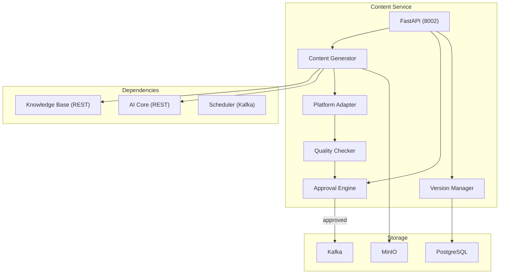
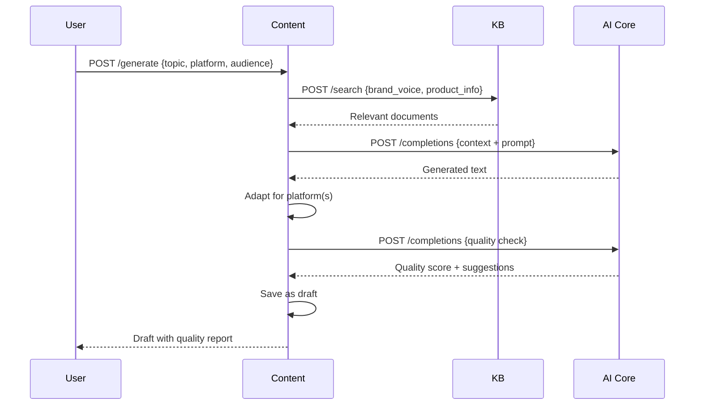

# Design — Content Service

## Overview

Dịch vụ tạo và quản lý nội dung AI — Python 3.12, FastAPI, Port 8002, PostgreSQL (content_db), MinIO. Sinh bài viết AI theo brand voice từ Knowledge Base, platform adaptation (Facebook: dài + hashtag, TikTok: ngắn + trend, Zalo: trang tr�ng), quality check (spelling, grammar, banned keywords), approval workflow, version history.

## Components and Interfaces

Xem **Architecture**, **API Design**, và **Content Generation Flow** bên dưới.
| Component | Technology |
|-----------|-----------|
| Runtime | Python 3.12 |
| Framework | FastAPI |
| Database | PostgreSQL 16 |
| ORM | SQLAlchemy 2 + asyncpg |
| Object Storage | MinIO (boto3) |
| Dependencies | AI Core (REST), Knowledge Base (REST) |
| Testing | pytest |

## Architecture



## API Design

```
POST   /api/v1/content/generate         — Generate content with AI
GET    /api/v1/content                   — List content (paginated, filterable)
GET    /api/v1/content/:id               — Get content detail
PUT    /api/v1/content/:id               — Update content manually
POST   /api/v1/content/:id/adapt         — Adapt for specific platform
POST   /api/v1/content/:id/approve       — Approve content
POST   /api/v1/content/:id/reject        — Reject with feedback
GET    /api/v1/content/:id/versions      — Version history
POST   /api/v1/content/:id/rollback      — Rollback to version
POST   /api/v1/media/upload              — Upload media file
```

## Content Generation Flow



## Data Models

```sql
CREATE TABLE posts (
    id UUID PRIMARY KEY DEFAULT gen_random_uuid(),
    tenant_id UUID NOT NULL,
    title VARCHAR(500),
    body TEXT NOT NULL,
    platform VARCHAR(20) NOT NULL,
    status VARCHAR(20) NOT NULL DEFAULT 'draft',
    quality_score FLOAT,
    media_urls TEXT[] DEFAULT '{}',
    hashtags TEXT[] DEFAULT '{}',
    suggested_time TIMESTAMPTZ,
    metadata JSONB DEFAULT '{}',
    created_by UUID NOT NULL,
    approved_by UUID,
    approved_at TIMESTAMPTZ,
    published_at TIMESTAMPTZ,
    campaign_id UUID,
    created_at TIMESTAMPTZ DEFAULT NOW(),
    updated_at TIMESTAMPTZ DEFAULT NOW()
);

CREATE TABLE content_versions (
    id UUID PRIMARY KEY DEFAULT gen_random_uuid(),
    post_id UUID NOT NULL REFERENCES posts(id) ON DELETE CASCADE,
    version_number INT NOT NULL,
    body TEXT NOT NULL,
    metadata JSONB DEFAULT '{}',
    change_reason VARCHAR(500),
    changed_by UUID NOT NULL,
    created_at TIMESTAMPTZ DEFAULT NOW()
);

CREATE TABLE approval_configs (
    id UUID PRIMARY KEY DEFAULT gen_random_uuid(),
    tenant_id UUID NOT NULL,
    flow_name VARCHAR(255) NOT NULL,
    steps JSONB NOT NULL, -- [{role: "manager", required: true}]
    is_default BOOLEAN DEFAULT FALSE,
    created_at TIMESTAMPTZ DEFAULT NOW()
);

CREATE INDEX idx_posts_tenant ON posts(tenant_id, status, created_at DESC);
CREATE INDEX idx_posts_campaign ON posts(campaign_id);
CREATE INDEX idx_versions_post ON content_versions(post_id, version_number DESC);
```

## Kafka Events Published

### `content.approved`
```json
{
  "event_id": "uuid",
  "tenant_id": "uuid",
  "post_id": "uuid",
  "platform": "facebook",
  "scheduled_time": "ISO8601 (optional)"
}
```

### `content.published`
```json
{
  "event_id": "uuid",
  "tenant_id": "uuid",
  "post_id": "uuid",
  "platform": "facebook",
  "platform_post_id": "string",
  "published_at": "ISO8601"
}
```


## Correctness Properties

### Property 1: Tenant Isolation
**Validates: Requirements 4.1**
Moi query va operation phai filter theo tenant_id tu JWT claims. Khong co cross-tenant data leakage o bat ky tang nao (DB, Kafka, Redis, Qdrant, MinIO).

### Property 2: Idempotency
**Validates: Requirements 3.1**
Moi write operation phai co idempotency key de tranh duplicate processing khi retry. Kafka consumer phai idempotent.

### Property 3: At-least-once Delivery
**Validates: Requirements 3.1**
Kafka events phai duoc xu ly it nhat mot lan. Sau 3 retries voi exponential backoff (1s, 2s, 4s), event chuyen vao dead-letter queue.

### Property 4: Circuit Breaker Correctness
**Validates: Requirements 5.1**
Sync calls toi external services phai qua circuit breaker. Open sau 5 failures trong 30s, Half-Open probe sau 60s.

### Property 5: Data Consistency
**Validates: Requirements 3.1**
Distributed transactions dung Saga pattern voi compensating actions khi rollback. Moi destructive action ghi audit.events Kafka topic.
## Error Handling

| Scenario | Strategy |
|----------|----------|
| External API timeout | Retry t?i da 3 l?n v?i exponential backoff (1s, 2s, 4s); sau dó tr? v? l?i có c?u trúc |
| Database connection error | Circuit breaker + fallback response; alert qua Alertmanager |
| Kafka publish failure | Retry 3 l?n; n?u v?n th?t b?i ghi vào dead-letter queue |
| Invalid tenant_id | Reject ngay v?i HTTP 403 + ghi security warning vào audit log |
| Validation error | Tr? v? HTTP 422 v?i danh sách field errors chi ti?t |
| Unhandled exception | Log structured JSON v?i trace_id; tr? v? HTTP 500 v?i error_id d? debug |

## Testing Strategy

| Layer | Tool | Coverage Target |
|-------|------|----------------|
| Unit Tests | Jest (Node.js) / pytest (Python) / JUnit 5 (Java) | > 80% business logic |
| Integration Tests | Testcontainers (PostgreSQL, Redis, Kafka) | Happy path + error paths |
| Contract Tests | Pact (consumer-driven) cho gRPC interfaces | Chatbot?AI Core, Messaging?Chatbot |
| Property-Based Tests | fast-check (JS) / Hypothesis (Python) | Tenant isolation, idempotency |
| Load Tests | k6 | Chatbot E2E < 2s t?i 100 concurrent users |
