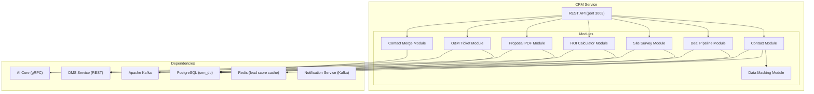
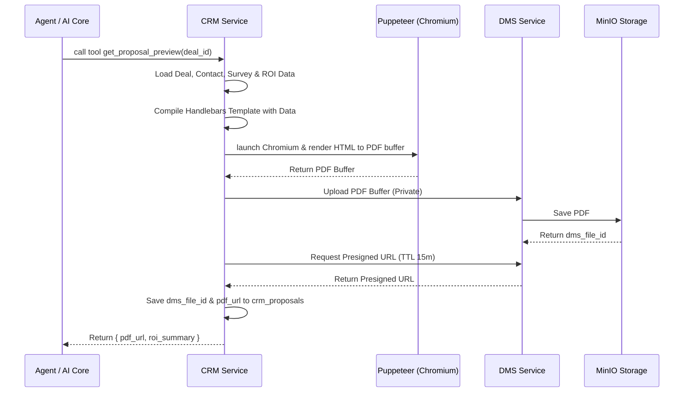
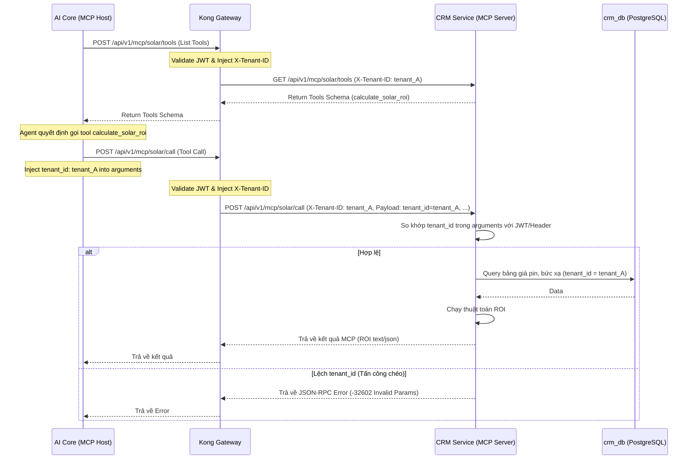

# Design — CRM Service

## Overview

Dịch vụ quản lý khách hàng đa kênh của Solavie — Node.js 20, NestJS, PostgreSQL (crm_db). Bao gồm: Contact Management (360° view, data masking), AI Lead Scoring, Contact Merge (auto + manual suggestion), Solar Deal Pipeline (Kanban 6 giai đoạn), Site Survey (khảo sát mái thực địa), ROI Calculator, Proposal PDF Generator, và O&M Ticketing (bảo trì sau bán hàng).

## Components and Interfaces

Xem **API Design** và **Architecture** bên dưới.

## Tech Stack
| Component | Technology |
|-----------|-----------|
| Runtime | Node.js 20 |
| Framework | NestJS 10 |
| Language | TypeScript 5 |
| Database | PostgreSQL 16 (crm_db) |
| ORM | Prisma |
| Queue | KafkaJS |
| Cache | Redis |
| Testing | Jest |
| Port | 3003 |

## Architecture



## API Design

```
GET    /api/v1/permissions/manifest     — Expose permissions manifest for this service
# Contact Management
GET    /api/v1/contacts                        — List contacts (paginated, filterable)
GET    /api/v1/contacts/:id                    — Get contact detail (360° view)
PUT    /api/v1/contacts/:id                    — Update contact
DELETE /api/v1/contacts/:id                    — Delete contact
POST   /api/v1/contacts/:id/tags               — Add tags
DELETE /api/v1/contacts/:id/tags/:tag          — Remove tag
GET    /api/v1/contacts/:id/history            — Interaction history
GET    /api/v1/contacts/:id/score              — Lead score breakdown

# Segments
GET    /api/v1/segments                        — List segments
POST   /api/v1/segments                        — Create segment
PUT    /api/v1/segments/:id                    — Update segment
GET    /api/v1/segments/:id/contacts           — Get contacts in segment

# Contact Merge
POST   /api/v1/contacts/merge                  — Execute merge (manual)
GET    /api/v1/contacts/merge-suggestions      — List pending merge suggestions
PATCH  /api/v1/contacts/merge-suggestions/:id  — Approve or dismiss suggestion

# Deal Pipeline
GET    /api/v1/deals                           — List deals (Kanban data)
POST   /api/v1/deals                           — Create deal
GET    /api/v1/deals/:id                       — Get deal detail
PATCH  /api/v1/deals/:id                       — Update deal (stage, assigned_to, lost_reason)
DELETE /api/v1/deals/:id                       — Delete deal

# Site Survey
GET    /api/v1/deals/:id/surveys               — Get survey for deal
POST   /api/v1/deals/:id/surveys               — Create/schedule survey
PATCH  /api/v1/deals/:id/surveys/:surveyId     — Update survey data (field measurements)

# ROI Calculator + Proposal PDF
GET    /api/v1/deals/:id/proposals             — List proposals for deal
POST   /api/v1/deals/:id/proposals             — Calculate ROI + create proposal
GET    /api/v1/deals/:id/proposals/:propId     — Get proposal detail
POST   /api/v1/deals/:id/proposals/:propId/pdf — Generate Proposal PDF → DMS

# O&M Ticketing
GET    /api/v1/tickets                         — List tickets (filterable by status, priority)
POST   /api/v1/tickets                         — Create ticket
GET    /api/v1/tickets/:id                     — Get ticket detail
PATCH  /api/v1/tickets/:id                     — Update ticket (status, assigned_to, notes)
```

## Data Models

```sql
-- ============================================================
-- CONTACTS & CHANNELS
-- ============================================================
CREATE TABLE contacts (
    id UUID PRIMARY KEY DEFAULT gen_random_uuid(),
    tenant_id VARCHAR(50) NOT NULL,
    display_name VARCHAR(255),
    email VARCHAR(255),
    phone VARCHAR(50),
    avatar_url TEXT,
    channel_ids JSONB DEFAULT '{}',         -- {"facebook": "id", "zalo": "id"}
    tags TEXT[] DEFAULT '{}',
    lead_score INT DEFAULT 0,
    lead_score_updated_at TIMESTAMPTZ,
    metadata JSONB DEFAULT '{}',
    first_seen_at TIMESTAMPTZ DEFAULT NOW(),
    last_interaction_at TIMESTAMPTZ,
    created_at TIMESTAMPTZ DEFAULT NOW(),
    updated_at TIMESTAMPTZ DEFAULT NOW()
);

CREATE TABLE contact_channels (
    id UUID PRIMARY KEY DEFAULT gen_random_uuid(),
    tenant_id VARCHAR(50) NOT NULL,
    contact_id UUID NOT NULL REFERENCES contacts(id) ON DELETE CASCADE,
    channel_type VARCHAR(20) NOT NULL,      -- 'facebook', 'zalo', 'tiktok'
    external_user_id VARCHAR(255) NOT NULL,
    linked_at TIMESTAMPTZ DEFAULT NOW(),
    UNIQUE(tenant_id, channel_type, external_user_id)
);

CREATE TABLE interactions (
    id UUID PRIMARY KEY DEFAULT gen_random_uuid(),
    tenant_id VARCHAR(50) NOT NULL,
    contact_id UUID NOT NULL REFERENCES contacts(id),
    type VARCHAR(50) NOT NULL,              -- 'message', 'comment', 'post_engagement'
    channel VARCHAR(20) NOT NULL,
    summary TEXT,
    sentiment VARCHAR(20),
    metadata JSONB DEFAULT '{}',
    created_at TIMESTAMPTZ DEFAULT NOW()
);

CREATE TABLE segments (
    id UUID PRIMARY KEY DEFAULT gen_random_uuid(),
    tenant_id VARCHAR(50) NOT NULL,
    name VARCHAR(255) NOT NULL,
    description TEXT,
    filter_criteria JSONB NOT NULL,         -- {"tags": ["vip"], "score_min": 80}
    contact_count INT DEFAULT 0,
    created_at TIMESTAMPTZ DEFAULT NOW()
);

-- ============================================================
-- CONTACT MERGE
-- ============================================================
CREATE TABLE merge_suggestions (
    id UUID PRIMARY KEY DEFAULT gen_random_uuid(),
    tenant_id VARCHAR(50) NOT NULL,
    primary_contact_id UUID NOT NULL REFERENCES contacts(id),
    secondary_contact_id UUID NOT NULL REFERENCES contacts(id),
    similarity_score NUMERIC(3,2) NOT NULL, -- 0.00 - 1.00
    match_reason VARCHAR(100) NOT NULL,     -- 'phone+name', 'phone+email', 'phone_only'
    status VARCHAR(15) NOT NULL DEFAULT 'pending', -- 'pending', 'merged', 'dismissed'
    created_at TIMESTAMPTZ DEFAULT NOW(),
    resolved_at TIMESTAMPTZ,
    resolved_by UUID
);

-- ============================================================
-- DEAL PIPELINE
-- ============================================================
CREATE TABLE crm_deals (
    id UUID PRIMARY KEY DEFAULT gen_random_uuid(),
    tenant_id VARCHAR(50) NOT NULL,
    contact_id UUID NOT NULL REFERENCES contacts(id),
    title VARCHAR(255) NOT NULL,
    status VARCHAR(30) NOT NULL DEFAULT 'lead',
    -- Stages: lead → consult → survey → proposal → negotiation → contract_signed | closed_lost
    lost_reason TEXT,
    assigned_to UUID,
    created_at TIMESTAMPTZ DEFAULT NOW(),
    updated_at TIMESTAMPTZ DEFAULT NOW()
);

-- ============================================================
-- SITE SURVEY
-- ============================================================
CREATE TABLE crm_surveys (
    id UUID PRIMARY KEY DEFAULT gen_random_uuid(),
    tenant_id VARCHAR(50) NOT NULL,
    deal_id UUID UNIQUE NOT NULL REFERENCES crm_deals(id),
    surveyor_id UUID NOT NULL,
    scheduled_at TIMESTAMPTZ NOT NULL,
    roof_area_sqm NUMERIC(6,2),             -- Diện tích mái (m²)
    roof_slope_deg NUMERIC(4,1),            -- Độ dốc (độ)
    roof_type VARCHAR(100),                 -- 'ngói', 'tôn', 'bê tông'
    roof_direction VARCHAR(50),             -- 'Nam', 'Đông Nam', 'Tây Nam', ...
    media_folder_id UUID,                   -- DMS folder chứa ảnh hiện trường
    notes TEXT,
    created_at TIMESTAMPTZ DEFAULT NOW()
);

-- ============================================================
-- ROI CALCULATOR + PROPOSAL PDF
-- ============================================================
CREATE TABLE crm_proposals (
    id UUID PRIMARY KEY DEFAULT gen_random_uuid(),
    tenant_id VARCHAR(50) NOT NULL,
    deal_id UUID NOT NULL REFERENCES crm_deals(id),
    monthly_bill NUMERIC(15,2) NOT NULL,    -- Hóa đơn điện trung bình (VND)
    system_size_kwp NUMERIC(6,2) NOT NULL,  -- Công suất đề xuất (kWp)
    panel_quantity INT NOT NULL,            -- Số lượng tấm pin
    estimated_kwh_month NUMERIC(8,2) NOT NULL, -- Sản lượng dự kiến/tháng (kWh)
    savings_percentage NUMERIC(5,2) NOT NULL,  -- Tỷ lệ tiết kiệm (%)
    payback_years NUMERIC(4,2) NOT NULL,    -- Thời gian hoàn vốn (năm)
    dms_file_id UUID,                       -- ID file PDF trong DMS
    created_at TIMESTAMPTZ DEFAULT NOW()
);

-- ============================================================
-- O&M TICKETING
-- ============================================================
CREATE TABLE crm_tickets (
    id UUID PRIMARY KEY DEFAULT gen_random_uuid(),
    tenant_id VARCHAR(50) NOT NULL,
    contact_id UUID NOT NULL REFERENCES contacts(id),
    title VARCHAR(255) NOT NULL,
    description TEXT NOT NULL,
    priority VARCHAR(15) NOT NULL DEFAULT 'medium', -- 'low', 'medium', 'high', 'critical'
    status VARCHAR(20) NOT NULL DEFAULT 'open',     -- 'open', 'assigned', 'in_progress', 'closed'
    assigned_to UUID,
    resolution_notes TEXT,
    media_folder_id UUID,                   -- DMS folder chứa ảnh nghiệm thu
    created_at TIMESTAMPTZ DEFAULT NOW(),
    closed_at TIMESTAMPTZ
);

-- ============================================================
-- INDEXES
-- ============================================================
CREATE INDEX idx_contacts_tenant ON contacts(tenant_id, last_interaction_at DESC);
CREATE INDEX idx_contacts_score ON contacts(tenant_id, lead_score DESC);
CREATE INDEX idx_contacts_tags ON contacts USING GIN(tags);
CREATE INDEX idx_contacts_phone ON contacts(tenant_id, phone) WHERE phone IS NOT NULL;
CREATE INDEX idx_interactions_contact ON interactions(contact_id, created_at DESC);
CREATE INDEX idx_deals_tenant ON crm_deals(tenant_id, status, updated_at DESC);
CREATE INDEX idx_deals_contact ON crm_deals(contact_id);
CREATE INDEX idx_tickets_tenant ON crm_tickets(tenant_id, status, priority);
CREATE INDEX idx_merge_suggestions_tenant ON merge_suggestions(tenant_id, status);
```

## Solar ROI Calculator — Công thức

```
Inputs:
  - monthly_bill (VND)       — Hóa đơn điện trung bình/tháng
  - roof_area_sqm (m²)       — Diện tích mái khả dụng
  - location_zone            — 'south' | 'central' | 'north'

Constants:
  - sqm_per_kwp = 6.5        — Trung bình 1 kWp ≈ 6-7m²
  - peak_sun_hours:
      south:   4.25 h/day    — Miền Nam: 4.0-4.5h
      central: 3.75 h/day    — Miền Trung: 3.5-4.0h
      north:   3.25 h/day    — Miền Bắc: 3.0-3.5h
  - system_efficiency = 0.80 — Hiệu suất hệ thống (80%)
  - evn_price_per_kwh        — Bảng giá EVN hiện hành (VND/kWh)

Calculations:
  max_kwp_by_area = roof_area_sqm / sqm_per_kwp
  monthly_kwh_needed = monthly_bill / evn_price_per_kwh
  optimal_kwp = min(max_kwp_by_area, monthly_kwh_needed / (peak_sun_hours * 30 * system_efficiency))
  system_size_kwp = round(optimal_kwp, 1)
  panel_quantity = ceil(system_size_kwp / 0.4)  -- Tấm pin 400Wp tiêu chuẩn
  estimated_kwh_month = system_size_kwp * peak_sun_hours * 30 * system_efficiency
  monthly_savings_vnd = estimated_kwh_month * evn_price_per_kwh
  savings_percentage = (monthly_savings_vnd / monthly_bill) * 100
  total_investment = system_size_kwp * unit_price_per_kwp  -- Từ bảng giá nội bộ
  payback_years = total_investment / (monthly_savings_vnd * 12)
```

## Proposal PDF Generation

Để hỗ trợ AI Core truy xuất báo giá dưới dạng tệp PDF thật gửi cho khách hàng, CRM Service triển khai phân hệ tạo báo giá PDF:
- **Tech Stack:** Puppeteer + Chromium Headless + Handlebars HTML templates.
- **Quy trình:** Render HTML template chứa logo Solavie, thông tin khách hàng, thông số kỹ thuật mái, bảng ROI và hình ảnh khảo sát → Chuyển đổi sang PDF buffer bằng Puppeteer → Upload lên DMS dưới dạng tệp `Private` → Tạo Presigned URL có TTL 15 phút.

### Sơ đồ tuần tự sinh Proposal PDF (Mermaid Diagram)


## Data Masking — Logic

```typescript
// Áp dụng khi data_masking_enabled = true
// Agent không có quyền contacts:mask_data → che thông tin nhạy cảm

function maskPhone(phone: string): string {
  // "0912345678" → "091****678"
  if (!phone || phone.length < 7) return phone;
  const prefix = phone.slice(0, 3);
  const suffix = phone.slice(-3);
  const masked = '*'.repeat(phone.length - 6);
  return `${prefix}${masked}${suffix}`;
}

function maskEmail(email: string): string {
  // "user@example.com" → "us**@example.com"
  const [local, domain] = email.split('@');
  if (local.length <= 2) return email;
  const visible = local.slice(0, 2);
  const masked = '*'.repeat(local.length - 2);
  return `${visible}${masked}@${domain}`;
}
```

## Contact Merge — Logic

```
Auto-Merge (transaction):
  Trigger: Contact phone updated OR new contact created with existing phone
  
  Rule 1 (Auto): phone_match AND (name_match OR email_match)
    - name_match: normalize(name_A) == normalize(name_B)
      normalize = lowercase + remove diacritics + trim
    - email_match: email_A == email_B (case-insensitive)
    → Execute merge transaction:
      1. Move all conversations, deals, tickets → primary_contact
      2. Move all contact_channels → primary_contact
      3. Merge tags (union)
      4. Keep higher lead_score
      5. Soft-delete secondary_contact

  Rule 2 (Suggestion): phone_match AND name_mismatch AND no_email_match
    → Create merge_suggestion with:
      similarity_score = phone_similarity_weight (0.70)
      match_reason = 'phone_only'
      status = 'pending'
    → Do NOT auto-merge
```

## Kafka Events

### Consumed
| Topic | Action |
|-------|--------|
| `messaging.conversation.created` | Auto-create Contact nếu chưa tồn tại; nếu message chứa Tên + SĐT hợp lệ → auto-create Deal ở giai đoạn `lead` |
| `channel.message.received` | Update interaction history + last_interaction_at + recalculate lead score |

### Published
| Topic | Trigger |
|-------|---------|
| `crm.lead.score.changed` | Lead score thay đổi > 10 điểm |
| `crm.contact.created` | Contact mới được tạo |
| `crm.deal.stage.changed` | Deal chuyển giai đoạn (payload: deal_id, from_stage, to_stage, tenant_id) |
| `crm.ticket.created` | O&M Ticket mới được tạo (payload: ticket_id, contact_id, priority, tenant_id) |
| `crm.ticket.closed` | Ticket chuyển sang `closed` → trigger CSAT survey qua Notification Service |

## Performance Optimization

| Technique | Impact |
|-----------|--------|
| Redis cache lead score | < 5ms lookup, invalidate on new interaction |
| GIN index on tags array | Fast tag-based segment queries |
| Composite index (tenant_id, status) on deals | Fast Kanban board load |
| Prisma connection pooling | Reuse DB connections |
| Kafka async for score events | Non-blocking score updates |


## Correctness Properties

### Property 1: Tenant Isolation
**Validates: Requirements 4.1**
Moi query va operation phai filter theo tenant_id tu JWT claims. Khong co cross-tenant data leakage o bat ky tang nao (DB, Kafka, Redis, Qdrant, MinIO).

### Property 2: Idempotency
**Validates: Requirements 3.1**
Moi write operation phai co idempotency key de tranh duplicate processing khi retry. Kafka consumer phai idempotent.

### Property 3: At-least-once Delivery
**Validates: Requirements 3.1**
Kafka events phai duoc xu ly it nhat mot lan. Sau 3 retries voi exponential backoff (1s, 2s, 4s), event chuyen vao dead-letter queue.

### Property 4: Circuit Breaker Correctness
**Validates: Requirements 5.1**
Sync calls toi external services phai qua circuit breaker. Open sau 5 failures trong 30s, Half-Open probe sau 60s.

### Property 5: Data Consistency
**Validates: Requirements 3.1**
Distributed transactions dung Saga pattern voi compensating actions khi rollback. Moi destructive action ghi audit.events Kafka topic.
## Error Handling

| Scenario | Strategy |
|----------|----------|
| External API timeout | Retry t?i da 3 l?n v?i exponential backoff (1s, 2s, 4s); sau d� tr? v? l?i c� c?u tr�c |
| Database connection error | Circuit breaker + fallback response; alert qua Alertmanager |
| Kafka publish failure | Retry 3 l?n; n?u v?n th?t b?i ghi v�o dead-letter queue |
| Invalid tenant_id | Reject ngay v?i HTTP 403 + ghi security warning v�o audit log |
| Validation error | Tr? v? HTTP 422 v?i danh s�ch field errors chi ti?t |
| Unhandled exception | Log structured JSON v?i trace_id; tr? v? HTTP 500 v?i error_id d? debug |

## Testing Strategy

| Layer | Tool | Coverage Target |
|-------|------|----------------|
| Unit Tests | Jest (Node.js) / pytest (Python) / JUnit 5 (Java) | > 80% business logic |
| Integration Tests | Testcontainers (PostgreSQL, Redis, Kafka) | Happy path + error paths |
| Contract Tests | Pact (consumer-driven) cho gRPC interfaces | Chatbot?AI Core, Messaging?Chatbot |
| Property-Based Tests | fast-check (JS) / Hypothesis (Python) | Tenant isolation, idempotency |
| Load Tests | k6 | Chatbot E2E < 2s t?i 100 concurrent users |


## Zero-Trust HMAC Guard & Permission Manifest

### 1. Permission Manifest API
`GET /api/v1/permissions/manifest`
Trả về JSON chứa danh sách các tài nguyên và hành động được định nghĩa cho service này:
```json
{
    "service": "crm",
    "resources": [
        {
            "name": "contacts",
            "description": "Customer contacts and profiles",
            "actions": [
                "create",
                "read",
                "update",
                "delete"
            ]
        },
        {
            "name": "deals",
            "description": "Sales deals management",
            "actions": [
                "read",
                "write"
            ]
        }
    ]
}
```

### 2. Zero-Trust HMAC Signature Verification
Dịch vụ kiểm tra và xác thực chữ ký signature trên mỗi request tại lớp Guard của NestJS (TypeScript):
1. Trích xuất `X-Tenant-ID`, `X-User-ID`, `X-User-Permissions` và `X-Permissions-Signature` từ headers.
2. Tính toán signature mong đợi:
   `expected_sig = HMAC_SHA256(GATEWAY_SIGNING_SECRET, X-Tenant-ID + ":" + X-User-ID + ":" + X-User-Permissions)`
3. So sánh `X-Permissions-Signature` với `expected_sig`. Nếu không khớp, trả về ngay lập tức mã lỗi `403 Forbidden` (Signature Mismatch).
4. So khớp in-memory O(1): parse `X-User-Permissions` thành một Set và đối chiếu với quyền yêu cầu của endpoint (ví dụ: `crm:contacts:create`).
   - Hỗ trợ wildcard: `*` (Super Admin bypass), `crm:*` (Service bypass), và `crm:contacts:*` (Resource bypass).

## Security & Gateway Integration
- Dịch vụ được triển khai stateless phía sau Kong API Gateway.
- Gateway chịu trách nhiệm validate JWT token từ Keycloak, xác thực client scope `crm`, và inject header `X-Tenant-ID` vào request.
- Dịch vụ tin tưởng hoàn toàn vào các header được Gateway inject để thực hiện logic nghiệp vụ và cô lập dữ liệu.

## MCP Server Integration

Để hỗ trợ AI Core (vai trò MCP Host) gọi các công cụ nghiệp vụ một cách bảo mật và cô lập đa thuê bao, CRM Service triển khai 3 MCP Server tương ứng với các phân hệ nghiệp vụ chính của mình. Các Server này chạy dưới dạng SSE (Server-Sent Events) Endpoint của NestJS/Fastify.

### 1. Phân chia MCP Servers & Các Tools Cung Cấp

#### 1.1. Solar Calc MCP Server (`solar_calc`)
*   **SSE Endpoint:** `/api/v1/mcp/solar`
*   **Danh sách Tools:**
    1.  `calculate_solar_roi`:
        *   **Mô tả:** Tính toán công suất khuyên dùng, sản lượng điện dự kiến, mức tiết kiệm tháng và năm hoàn vốn dựa trên tiền điện và diện tích mái.
        *   **Tham số (Input Schema):**
            ```json
            {
              "type": "object",
              "properties": {
                "monthly_bill": { "type": "number", "description": "Hóa đơn điện trung bình/tháng (VND)" },
                "roof_area_sqm": { "type": "number", "description": "Diện tích mái nhà khả dụng (m2)" },
                "location_zone": { "type": "string", "enum": ["south", "central", "north"], "description": "Khu vực địa lý để tính giờ nắng" }
              },
              "required": ["monthly_bill", "roof_area_sqm", "location_zone"]
            }
            ```
    2.  `get_proposal_preview`:
        *   **Mô tả:** Lấy thông tin tóm tắt và Presigned URL của đề xuất báo giá cũ để AI tổng hợp phản hồi và gửi link PDF cho khách hàng.
        *   **Tham số:**
            ```json
            {
              "type": "object",
              "properties": {
                "deal_id": { "type": "string", "format": "uuid", "description": "ID của Deal liên kết" }
              },
              "required": ["deal_id"]
            }
            ```
        *   **Kết quả trả về (Output Schema):**
            ```json
            {
              "pdf_url": "https://dms.solavie.id/presigned/...",
              "roi_summary": {
                "system_size_kwp": 5.2,
                "panel_quantity": 13,
                "estimated_kwh_month": 663.0,
                "savings_percentage": 59.7,
                "payback_years": 4.5
              }
            }
            ```

#### 1.2. CRM MCP Server (`crm`)
*   **SSE Endpoint:** `/api/v1/mcp/crm`
*   **Danh sách Tools:**
    1.  `get_contact_360`:
        *   **Mô tả:** Lấy thông tin chi tiết 360 độ của khách hàng (display_name, phone, email, tags, lead_score, deals, tickets).
        *   **Tham số:**
            ```json
            {
              "type": "object",
              "properties": {
                "contact_id": { "type": "string", "format": "uuid", "description": "ID khách hàng" }
              },
              "required": ["contact_id"]
            }
            ```
    2.  `create_lead_deal`:
        *   **Mô tả:** Tạo một Deal mới cho khách hàng tiềm năng khi họ đồng ý tư vấn.
        *   **Tham số:**
            ```json
            {
              "type": "object",
              "properties": {
                "contact_id": { "type": "string", "format": "uuid", "description": "ID khách hàng" },
                "title": { "type": "string", "description": "Tiêu đề deal bán hàng" }
              },
              "required": ["contact_id", "title"]
            }
            ```
    3.  `update_deal_stage`:
        *   **Mô tả:** Cập nhật giai đoạn của Deal (ví dụ từ lead sang consult).
        *   **Tham số:**
            ```json
            {
              "type": "object",
              "properties": {
                "deal_id": { "type": "string", "format": "uuid", "description": "ID của Deal" },
                "stage": { "type": "string", "enum": ["lead", "consult", "survey", "proposal", "negotiation", "contract_signed", "closed_lost"], "description": "Giai đoạn mới" }
              },
              "required": ["deal_id", "stage"]
            }
            ```

#### 1.3. O&M Ticket MCP Server (`om_ticket`)
*   **SSE Endpoint:** `/api/v1/mcp/om`
*   **Danh sách Tools:**
    1.  `create_om_ticket`:
        *   **Mô tả:** Tạo một Ticket O&M tiếp nhận sự cố báo hỏng inverter hoặc hệ thống của khách hàng.
        *   **Tham số:**
            ```json
            {
              "type": "object",
              "properties": {
                "contact_id": { "type": "string", "format": "uuid", "description": "ID khách hàng" },
                "title": { "type": "string", "description": "Tên sự cố" },
                "description": { "type": "string", "description": "Mô tả chi tiết sự cố" },
                "priority": { "type": "string", "enum": ["low", "medium", "high", "critical"], "description": "Mức độ ưu tiên" }
              },
              "required": ["contact_id", "title", "description"]
            }
            ```
    2.  `get_ticket_status`:
        *   **Mô tả:** Lấy thông tin trạng thái và cập nhật xử lý của O&M ticket.
        *   **Tham số:**
            ```json
            {
              "type": "object",
              "properties": {
                "ticket_id": { "type": "string", "format": "uuid", "description": "ID của ticket" }
              },
              "required": ["ticket_id"]
            }
            ```

---

### 2. Thiết Kế Cơ Chế Bảo Mật & Đa Thuê Bao (Multi-tenancy Security Design)

Mặc dù AI Core Gateway đã kiểm soát whitelisting và tiêm tham số, CRM Service vẫn thực thi cơ chế phòng thủ chiều sâu (Defense-in-depth) như sau:

1.  **JWT Verification:** Mọi HTTP Request thiết lập kết nối SSE hoặc gọi method qua JSON-RPC **PHẢI** mang Bearer Token hợp lệ. NestJS Guard sẽ validate token này thông qua Keycloak Public Key.
2.  **Tenant Bound:** Lấy `tenant_id` từ header `X-Tenant-ID` do Gateway inject (hoặc giải mã trực tiếp từ JWT claim `tenant_id`). Mọi câu lệnh SQL thông qua Prisma **PHẢI** lọc chặt chẽ theo `tenant_id` này.
3.  **Cross-tenant Parameter Validation:**
    *   Đối với mọi Tool Call nhận vào từ AI Core: `tenant_id` được tự động tiêm từ Gateway dưới dạng một tham số bắt buộc ẩn (đã được định nghĩa trong schema hoặc ghi đè động).
    *   CRM Service **PHẢI** so khớp giá trị `tenant_id` nhận được trong tham số của tool call với `tenant_id` lấy từ JWT của Request. Nếu phát hiện sai lệch (ví dụ: AI Core hoặc Kẻ tấn công cố gắng gửi tham số `tenant_id` của Tenant B trong khi JWT thuộc về Tenant A), CRM Service lập tức từ chối thực thi và trả về mã lỗi JSON-RPC `-32602` (Invalid params).

---

### 3. Sơ đồ Tương Tác luồng MCP SSE



---

## Service Discovery Integration Design

Dịch vụ CRM tích hợp lớp `ServiceRegistryClient` chạy song song với ứng dụng chính để hỗ trợ phát hiện dịch vụ động:

### 1. Kiến trúc Client
* **Cơ chế:**
  * **Startup Event:** Khi tiến trình của dịch vụ khởi động, client thực thi lệnh `SADD` để thêm IP:Port của node hiện tại vào Redis Set: `registry:service:crm`.
  * **Heartbeat Thread/Task:** Chạy định kỳ mỗi 5 giây để thực hiện:
    * Ghi đè khóa sự sống: `SETEX registry:service:crm:node:{ip}:{port} 15 "alive"`.
    * Đảm bảo IP vẫn tồn tại trong Set: `SADD registry:service:crm {ip}:{port}`.
  * **Shutdown Event:** Khi nhận tín hiệu tắt tiến trình (`SIGTERM`/`SIGINT`), client thực hiện dọn dẹp:
    * Xóa IP khỏi Set: `SREM registry:service:crm {ip}:{port}`.
    * Xóa khóa sống: `DEL registry:service:crm:node:{ip}:{port}`.

### 2. Tích hợp theo Tech Stack
* **NestJS (Node.js):** Sử dụng các lifecycle hooks `OnModuleInit` và `OnApplicationShutdown` kết hợp thư viện `ioredis` và `setInterval` cho heartbeat.
* **FastAPI (Python):** Sử dụng lifespan event handlers của FastAPI kết hợp `asyncio.create_task` và `redis-py`.
* **Spring Boot (Java):** Sử dụng annotation `@PostConstruct` và `@PreDestroy` kết hợp `ScheduledExecutorService` và `Jedis`/`Lettuce`.


---

## Registry Client & Health Endpoint Design (Tối ưu hóa)
*   **Giải thuật phát hiện IP:**
    1. Lấy biến môi trường `CONTAINER_IP`.
    2. Nếu trống, quét các interface card mạng vật lý của OS để tìm IP IPv4 hợp lệ.
    3. Fallback: Tạo kết nối UDP fake đến `8.8.8.8:53`.
*   **Health Check Endpoint:**
    *   Endpoint: `/health`
    *   Response: `{"status": "UP", "timestamp": "ISO-8601", "details": {"database": "UP", "redis": "UP"}}`
    *   Kiểm tra kết nối Database và Redis. Trả về HTTP 200 nếu khỏe mạnh, HTTP 503 nếu lỗi kết nối cốt lõi.
