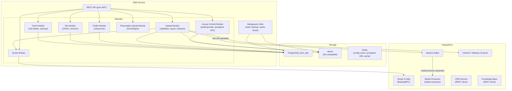
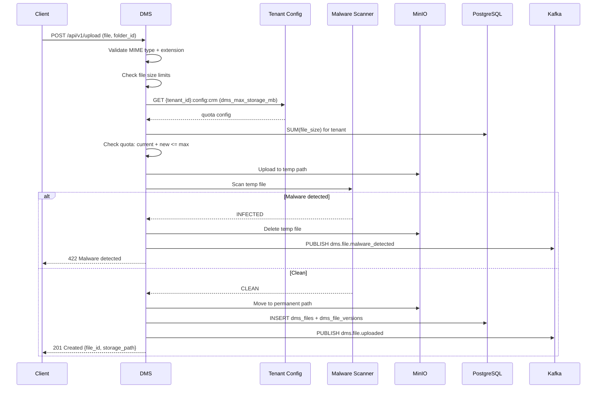

# Design — DMS Service (Document Management Service)

## Overview

Dịch vụ quản lý tệp tin và tài liệu của Solavie Marketing Platform — Node.js 20, NestJS, Port 3007, PostgreSQL (dms_db), MinIO, Kafka. Cung cấp: virtual folder tree, access mode Public/Private (Presigned URL TTL 15 phút), version control (tối đa N phiên bản/file), soft delete + trash 30 ngày, resumable upload (S3 Multipart cho files > 10MB), malware scanning (ClamAV), quota management per-tenant.

## Components and Interfaces

Xem **Architecture**, **API Design**, và **Upload Flow** bên dưới.

## Tech Stack
| Component | Technology |
|-----------|-----------|
| Runtime | Node.js 20 |
| Framework | NestJS 10 |
| Language | TypeScript 5 |
| Database | PostgreSQL 16 (dms_db) với Row-Level Security per tenant_id |
| Object Storage | MinIO (S3-compatible API) |
| Queue | Kafka (KafkaJS) |
| Cache | Redis (config hot-reload, presigned URL cache) |
| ORM | Prisma |
| Testing | Jest |
| Port | 3007 |

## Architecture



## API Design

```
GET    /api/v1/permissions/manifest     — Expose permissions manifest for this service
# Folder Management
GET    /api/v1/folders                         — Get folder tree (nested JSON)
POST   /api/v1/folders                         — Create folder
PATCH  /api/v1/folders/:id                     — Rename folder
PATCH  /api/v1/folders/:id/move                — Move folder to new parent
DELETE /api/v1/folders/:id                     — Soft delete folder (recursive)

# File Management
GET    /api/v1/files                           — List files in folder (paginated)
GET    /api/v1/files/:id                       — Get file metadata
GET    /api/v1/files/:id/download              — Get download URL (public URL or presigned)
DELETE /api/v1/files/:id                       — Soft delete file
PATCH  /api/v1/files/:id/move                  — Move file to another folder

# File Versions
GET    /api/v1/files/:id/versions              — List all versions
GET    /api/v1/files/:id/versions/:version/download — Download specific version
POST   /api/v1/files/:id/versions/:version/restore  — Restore version as current

# Upload
POST   /api/v1/upload                          — Single file upload (< 10MB)
POST   /api/v1/upload/multipart/init           — Init resumable upload session
POST   /api/v1/upload/multipart/:uploadId/part — Upload a part
GET    /api/v1/upload/multipart/:uploadId/parts — List uploaded parts
POST   /api/v1/upload/multipart/:uploadId/complete — Complete multipart upload
DELETE /api/v1/upload/multipart/:uploadId      — Abort multipart upload

# Trash
GET    /api/v1/trash                           — List trash items (paginated)
POST   /api/v1/trash/:id/restore               — Restore from trash
DELETE /api/v1/trash/:id                       — Permanent delete

# Quota
GET    /api/v1/quota                           — Get quota usage info
```

## Data Models
```sql
-- ============================================================
-- VIRTUAL FOLDER TREE
-- ============================================================
CREATE TABLE dms_folders (
    id UUID PRIMARY KEY DEFAULT gen_random_uuid(),
    tenant_id VARCHAR(50) NOT NULL,
    name VARCHAR(255) NOT NULL,
    parent_folder_id UUID REFERENCES dms_folders(id) ON DELETE CASCADE,
    access_mode VARCHAR(15) NOT NULL DEFAULT 'private', -- 'public' | 'private'
    deleted_at TIMESTAMPTZ,
    created_at TIMESTAMPTZ DEFAULT NOW(),
    UNIQUE(tenant_id, parent_folder_id, name) -- unique name within same parent
);

-- ============================================================
-- FILES
-- ============================================================
CREATE TABLE dms_files (
    id UUID PRIMARY KEY DEFAULT gen_random_uuid(),
    tenant_id VARCHAR(50) NOT NULL,
    folder_id UUID REFERENCES dms_folders(id),
    name VARCHAR(255) NOT NULL,
    current_version INT NOT NULL DEFAULT 1,
    deleted_at TIMESTAMPTZ,
    created_by UUID NOT NULL,
    created_at TIMESTAMPTZ DEFAULT NOW()
);

-- ============================================================
-- FILE VERSIONS
-- ============================================================
CREATE TABLE dms_file_versions (
    id UUID PRIMARY KEY DEFAULT gen_random_uuid(),
    file_id UUID NOT NULL REFERENCES dms_files(id) ON DELETE CASCADE,
    version INT NOT NULL,
    file_size BIGINT NOT NULL,              -- bytes
    mime_type VARCHAR(100) NOT NULL,
    storage_path VARCHAR(512) NOT NULL,     -- MinIO path: {tenant_id}/uploads/{file_id}/v{version}/{name}
    uploaded_by UUID NOT NULL,
    uploaded_at TIMESTAMPTZ DEFAULT NOW(),
    UNIQUE(file_id, version)
);

-- ============================================================
-- RESUMABLE UPLOAD SESSIONS
-- ============================================================
CREATE TABLE upload_sessions (
    id UUID PRIMARY KEY DEFAULT gen_random_uuid(),
    tenant_id VARCHAR(50) NOT NULL,
    folder_id UUID REFERENCES dms_folders(id),
    file_name VARCHAR(255) NOT NULL,
    file_size BIGINT NOT NULL,
    mime_type VARCHAR(100) NOT NULL,
    minio_upload_id VARCHAR(255) NOT NULL,  -- MinIO multipart upload ID
    parts_uploaded JSONB DEFAULT '[]',      -- [{part_number, etag, size}]
    status VARCHAR(20) NOT NULL DEFAULT 'in_progress', -- 'in_progress' | 'completed' | 'aborted'
    created_by UUID NOT NULL,
    created_at TIMESTAMPTZ DEFAULT NOW(),
    expires_at TIMESTAMPTZ NOT NULL         -- created_at + 24h
);

-- ============================================================
-- INDEXES
-- ============================================================
CREATE INDEX idx_folders_tenant ON dms_folders(tenant_id, parent_folder_id) WHERE deleted_at IS NULL;
CREATE INDEX idx_files_tenant ON dms_files(tenant_id, folder_id) WHERE deleted_at IS NULL;
CREATE INDEX idx_files_trash ON dms_files(tenant_id, deleted_at) WHERE deleted_at IS NOT NULL;
CREATE INDEX idx_folders_trash ON dms_folders(tenant_id, deleted_at) WHERE deleted_at IS NOT NULL;
CREATE INDEX idx_versions_file ON dms_file_versions(file_id, version DESC);
CREATE INDEX idx_sessions_tenant ON upload_sessions(tenant_id, status, expires_at);
```

## MinIO Path Convention

```
Single upload:
  {tenant_id}/uploads/{file_id}/v{version}/{original_filename}

Multipart (temp):
  {tenant_id}/uploads/tmp/{upload_session_id}/{part_number}

Processed media (from Media Processor):
  {tenant_id}/processed/{file_id}/original.webp
  {tenant_id}/processed/{file_id}/thumb_small.webp
  {tenant_id}/processed/{file_id}/thumb_medium.webp
  {tenant_id}/processed/{file_id}/thumb_large.webp
  {tenant_id}/processed/{file_id}/video.mp4
  {tenant_id}/processed/{file_id}/thumb_video.jpg
```

## Access Mode — URL Generation

```typescript
async function getDownloadUrl(file: DmsFile, version: DmsFileVersion): Promise<string> {
  const folder = await getFolderById(file.folder_id);
  
  if (folder.access_mode === 'public') {
    // CDN URL — permanent, no auth required
    return `${MINIO_PUBLIC_ENDPOINT}/${version.storage_path}`;
  } else {
    // Presigned URL — TTL 900 seconds (15 minutes)
    return await minioClient.presignedGetObject(
      MINIO_BUCKET,
      version.storage_path,
      900  // TTL in seconds
    );
  }
}
```

## Upload Flow



## Resumable Upload Flow (> 10MB)

```
1. Client: POST /upload/multipart/init
   → DMS: initiate MinIO multipart upload → get minio_upload_id
   → DMS: INSERT upload_sessions → return upload_id (UUID)

2. Client: POST /upload/multipart/{uploadId}/part?part_number=1
   → DMS: validate MD5 checksum
   → DMS: upload part to MinIO
   → DMS: UPDATE upload_sessions.parts_uploaded

3. Client: GET /upload/multipart/{uploadId}/parts
   → DMS: return list of uploaded parts

4. Client: POST /upload/multipart/{uploadId}/complete
   → DMS: MinIO CompleteMultipartUpload
   → DMS: Run format validation + quota check + malware scan
   → DMS: INSERT dms_files + dms_file_versions
   → DMS: PUBLISH dms.file.uploaded
   → DMS: UPDATE upload_sessions.status = 'completed'

5. On abort/expiry:
   → DMS: MinIO AbortMultipartUpload (cleanup temp parts)
   → DMS: UPDATE upload_sessions.status = 'aborted'
```

## Version Control Logic

```typescript
async function handleFileUpload(folderId: string, fileName: string, ...): Promise<DmsFile> {
  const existing = await findFileByName(folderId, fileName, tenantId);
  
  if (existing) {
    // New version
    const newVersion = existing.current_version + 1;
    const maxVersions = await getConfigValue(tenantId, 'dms_max_file_versions'); // default 5
    
    // Create new version record
    await createFileVersion(existing.id, newVersion, ...);
    
    // Prune oldest version if over limit
    if (newVersion > maxVersions) {
      const oldest = await getOldestVersion(existing.id);
      await deleteVersionFromMinIO(oldest.storage_path);
      await deleteVersionRecord(oldest.id);
    }
    
    await updateFileCurrentVersion(existing.id, newVersion);
    return existing;
  } else {
    // New file
    const file = await createFile(folderId, fileName, tenantId, ...);
    await createFileVersion(file.id, 1, ...);
    return file;
  }
}
```

## Soft Delete + Trash Cleanup

```typescript
// Soft delete (recursive for folders)
async function softDeleteFolder(folderId: string): Promise<void> {
  await db.transaction(async (tx) => {
    const now = new Date();
    // Recursive: mark all children
    await tx.executeRaw(`
      WITH RECURSIVE folder_tree AS (
        SELECT id FROM dms_folders WHERE id = $1
        UNION ALL
        SELECT f.id FROM dms_folders f
        JOIN folder_tree ft ON f.parent_folder_id = ft.id
      )
      UPDATE dms_folders SET deleted_at = $2
      WHERE id IN (SELECT id FROM folder_tree)
    `, [folderId, now]);
    
    // Mark all files in affected folders
    await tx.executeRaw(`
      UPDATE dms_files SET deleted_at = $1
      WHERE folder_id IN (
        WITH RECURSIVE folder_tree AS (...)
        SELECT id FROM folder_tree
      )
    `, [now]);
  });
}

// Background job: runs daily at 03:00 AM UTC+7 (20:00 UTC)
async function cleanupTrash(): Promise<void> {
  const cutoff = new Date(Date.now() - 30 * 24 * 60 * 60 * 1000); // 30 days ago
  
  const expiredFiles = await db.dmsFiles.findMany({
    where: { deleted_at: { lt: cutoff } },
    include: { versions: true }
  });
  
  for (const file of expiredFiles) {
    for (const version of file.versions) {
      await minioClient.removeObject(BUCKET, version.storage_path);
    }
    await db.dmsFiles.delete({ where: { id: file.id } });
  }
  
  // Also cleanup expired folders
  await db.dmsFolders.deleteMany({ where: { deleted_at: { lt: cutoff } } });
}
```

## Quota Management

```typescript
async function checkQuota(tenantId: string, newFileSize: number): Promise<void> {
  // Read from Redis cache first
  const cacheKey = `${tenantId}:config:crm`;
  let config = await redis.get(cacheKey);
  
  if (!config) {
    // Cache miss: query Tenant Config via gRPC
    config = await tenantConfigGrpc.getConfig(tenantId, 'crm_campaign');
    await redis.setex(cacheKey, 60, JSON.stringify(config));
  }
  
  const maxBytes = config.dms_max_storage_mb * 1_048_576;
  const currentUsage = await db.dmsFileVersions.aggregate({
    where: { file: { tenant_id: tenantId, deleted_at: null } },
    _sum: { file_size: true }
  });
  
  const used = currentUsage._sum.file_size ?? 0;
  
  if (used + newFileSize > maxBytes) {
    throw new QuotaExceededException({ used, available: maxBytes - used, max: maxBytes });
  }
  
  // Warn at 80%
  if ((used + newFileSize) / maxBytes > 0.80) {
    await kafka.publish('dms.quota.warning', {
      tenant_id: tenantId,
      used_bytes: used + newFileSize,
      max_bytes: maxBytes,
      percentage: ((used + newFileSize) / maxBytes * 100).toFixed(1)
    });
  }
}
```

## Kafka Events

### Published
| Topic | Trigger | Payload |
|-------|---------|---------|
| `dms.file.uploaded` | File upload successful | `{file_id, tenant_id, storage_path, mime_type, file_size, folder_id}` |
| `dms.file.malware_detected` | Malware scan positive | `{tenant_id, file_name, file_size, scan_result, timestamp}` |
| `dms.quota.warning` | Usage > 80% of quota | `{tenant_id, used_bytes, max_bytes, percentage}` |

### Consumed
| Topic | Action |
|-------|--------|
| `media.job.completed` | Update file metadata with processed output paths |
| `config.updates` | Refresh in-memory quota config when dms_max_storage_mb changes |

## Allowed File Types

```typescript
const ALLOWED_TYPES = {
  documents: {
    mimeTypes: ['application/pdf', 'application/vnd.openxmlformats-officedocument.wordprocessingml.document', 'text/plain', 'text/markdown'],
    extensions: ['.pdf', '.docx', '.txt', '.md'],
    maxSizeBytes: 50 * 1024 * 1024  // 50 MB
  },
  images: {
    mimeTypes: ['image/jpeg', 'image/png', 'image/webp'],
    extensions: ['.jpg', '.jpeg', '.png', '.webp'],
    maxSizeBytes: 100 * 1024 * 1024  // 100 MB
  },
  videos: {
    mimeTypes: ['video/mp4', 'video/quicktime'],
    extensions: ['.mp4', '.mov'],
    maxSizeBytes: 100 * 1024 * 1024  // 100 MB
  }
};
```

## Performance Targets

| Metric | Target |
|--------|--------|
| Single file upload (< 10MB) | < 3s end-to-end |
| Presigned URL generation | < 50ms |
| Folder tree query | < 200ms |
| Quota check (Redis hit) | < 10ms |
| Malware scan timeout | 30s max |
| Trash cleanup job | Daily at 03:00 AM UTC+7 |


## Correctness Properties

### Property 1: Tenant Isolation
**Validates: Requirements 4.1**
Moi query va operation phai filter theo tenant_id tu JWT claims. Khong co cross-tenant data leakage o bat ky tang nao (DB, Kafka, Redis, Qdrant, MinIO).

### Property 2: Idempotency
**Validates: Requirements 3.1**
Moi write operation phai co idempotency key de tranh duplicate processing khi retry. Kafka consumer phai idempotent.

### Property 3: At-least-once Delivery
**Validates: Requirements 3.1**
Kafka events phai duoc xu ly it nhat mot lan. Sau 3 retries voi exponential backoff (1s, 2s, 4s), event chuyen vao dead-letter queue.

### Property 4: Circuit Breaker Correctness
**Validates: Requirements 5.1**
Sync calls toi external services phai qua circuit breaker. Open sau 5 failures trong 30s, Half-Open probe sau 60s.

### Property 5: Data Consistency
**Validates: Requirements 3.1**
Distributed transactions dung Saga pattern voi compensating actions khi rollback. Moi destructive action ghi audit.events Kafka topic.
## Error Handling

| Scenario | Strategy |
|----------|----------|
| External API timeout | Retry t?i da 3 l?n v?i exponential backoff (1s, 2s, 4s); sau d� tr? v? l?i c� c?u tr�c |
| Database connection error | Circuit breaker + fallback response; alert qua Alertmanager |
| Kafka publish failure | Retry 3 l?n; n?u v?n th?t b?i ghi v�o dead-letter queue |
| Invalid tenant_id | Reject ngay v?i HTTP 403 + ghi security warning v�o audit log |
| Validation error | Tr? v? HTTP 422 v?i danh s�ch field errors chi ti?t |
| Unhandled exception | Log structured JSON v?i trace_id; tr? v? HTTP 500 v?i error_id d? debug |

## Testing Strategy

| Layer | Tool | Coverage Target |
|-------|------|----------------|
| Unit Tests | Jest (Node.js) / pytest (Python) / JUnit 5 (Java) | > 80% business logic |
| Integration Tests | Testcontainers (PostgreSQL, Redis, Kafka) | Happy path + error paths |
| Contract Tests | Pact (consumer-driven) cho gRPC interfaces | Chatbot?AI Core, Messaging?Chatbot |
| Property-Based Tests | fast-check (JS) / Hypothesis (Python) | Tenant isolation, idempotency |
| Load Tests | k6 | Chatbot E2E < 2s t?i 100 concurrent users |


## Zero-Trust HMAC Guard & Permission Manifest

### 1. Permission Manifest API
`GET /api/v1/permissions/manifest`
Trả về JSON chứa danh sách các tài nguyên và hành động được định nghĩa cho service này:
```json
{
    "service": "dms",
    "resources": [
        {
            "name": "files",
            "description": "Document files management",
            "actions": [
                "create",
                "read",
                "delete"
            ]
        }
    ]
}
```

### 2. Zero-Trust HMAC Signature Verification
Dịch vụ kiểm tra và xác thực chữ ký signature trên mỗi request tại lớp Guard/Interceptor của Go:
1. Trích xuất `X-Tenant-ID`, `X-User-ID`, `X-User-Permissions` và `X-Permissions-Signature` từ headers.
2. Tính toán signature mong đợi:
   `expected_sig = HMAC_SHA256(GATEWAY_SIGNING_SECRET, X-Tenant-ID + ":" + X-User-ID + ":" + X-User-Permissions)`
3. So sánh `X-Permissions-Signature` với `expected_sig`. Nếu không khớp, trả về ngay lập tức mã lỗi `403 Forbidden` (Signature Mismatch).
4. So khớp in-memory O(1): parse `X-User-Permissions` thành một Set và đối chiếu với quyền yêu cầu của endpoint (ví dụ: `dms:files:create`).
   - Hỗ trợ wildcard: `*` (Super Admin bypass), `dms:*` (Service bypass), và `dms:files:*` (Resource bypass).

## Security & Gateway Integration
- Dịch vụ được triển khai stateless phía sau Kong API Gateway.
- Gateway chịu trách nhiệm validate JWT token từ Keycloak, xác thực client scope `dms`, và inject header `X-Tenant-ID` vào request.
- Dịch vụ tin tưởng hoàn toàn vào các header được Gateway inject để thực hiện logic nghiệp vụ và cô lập dữ liệu.
