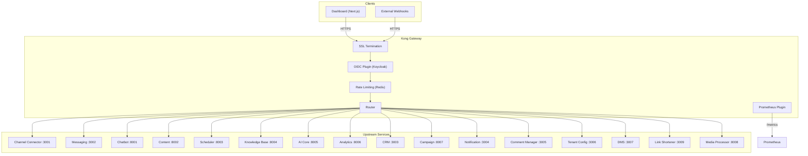
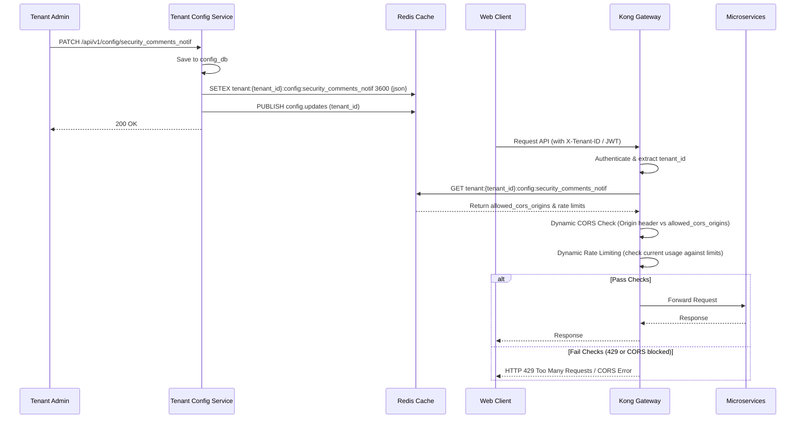
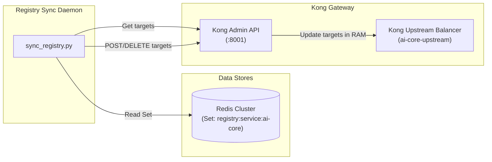

# Design — Gateway (Kong)

## Overview

API Gateway tập trung — Kong 3.7+, DB-less mode, Port 8000/8443 (proxy), 8001 (admin). SSL termination, OIDC authentication (Keycloak), rate limiting per-tenant (Redis), request transformation (inject X-Tenant-ID/X-User-ID/X-User-Roles từ JWT claims), WebSocket support, Prometheus metrics. Route tới tất cả 18 services.

## Components and Interfaces

Xem **Route Configuration** (kong.yml) và **Global Plugins** bên dưới.
| Component | Technology |
|-----------|-----------|
| Platform | Kong Gateway OSS 3.7+ |
| Mode | DB-less (declarative config) cho dev, DB mode cho production |
| Database | PostgreSQL 16 (kong_db) — production only |
| Plugins | oidc, rate-limiting, cors, request-transformer, prometheus, opentelemetry, dynamic-policy (custom) |
| Config | kong.yml (declarative) |
| Ports | 8000 (proxy HTTP), 8443 (proxy HTTPS), 8001 (admin API), 8444 (admin HTTPS) |

## Architecture



## Route Configuration

```yaml
# kong.yml (declarative config)
_format_version: "3.0"

services:
  # === Node.js Services ===
  - name: channel-connector
    url: http://channel-connector:3001
    routes:
      - name: channel-connector-api
        paths: ["/api/v1/channels"]
        strip_path: false
      - name: webhooks
        paths: ["/webhooks"]
        strip_path: false
        plugins:
          - name: key-auth
            config:
              anonymous: true  # Webhooks don't need auth

  - name: messaging
    url: http://messaging:3002
    routes:
      - name: messaging-api
        paths: ["/api/v1/conversations", "/api/v1/messages", "/api/v1/messaging/mcp"]
        strip_path: false
      - name: messaging-ws
        paths: ["/ws"]
        strip_path: false
        protocols: ["http", "https", "ws", "wss"]

  - name: crm
    url: http://crm:3003
    routes:
      - name: crm-api
        paths: ["/api/v1/contacts", "/api/v1/segments", "/api/v1/deals", "/api/v1/tickets", "/api/v1/mcp"]
        strip_path: false

  - name: notification
    url: http://notification:3004
    routes:
      - name: notification-api
        paths: ["/api/v1/notifications", "/api/v1/preferences", "/api/v1/notification/mcp"]
        strip_path: false

  - name: comment-manager
    url: http://comment-manager:3005
    routes:
      - name: comment-api
        paths: ["/api/v1/comments", "/api/v1/comments/mcp"]
        strip_path: false

  # === Python Services ===
  - name: chatbot
    url: http://chatbot:8001
    routes:
      - name: chatbot-api
        paths: ["/api/v1/chatbot"]
        strip_path: false

  - name: content
    url: http://content:8002
    routes:
      - name: content-api
        paths: ["/api/v1/content", "/api/v1/media", "/api/v1/content/mcp"]
        strip_path: false

  - name: knowledge-base
    url: http://knowledge-base:8004
    routes:
      - name: kb-api
        paths: ["/api/v1/documents", "/api/v1/search", "/api/v1/kb/mcp"]
        strip_path: false

  - name: ai-core
    url: http://ai-core:8005
    routes:
      - name: ai-api
        paths: ["/api/v1/completions", "/api/v1/embeddings", "/api/v1/models", "/api/v1/prompts", "/api/v1/usage"]
        strip_path: false

  # === Java Services ===
  - name: scheduler
    url: http://scheduler:8003
    routes:
      - name: scheduler-api
        paths: ["/api/v1/schedules", "/api/v1/automations", "/api/v1/scheduler/mcp"]
        strip_path: false

  - name: analytics
    url: http://analytics:8006
    routes:
      - name: analytics-api
        paths: ["/api/v1/metrics", "/api/v1/reports", "/api/v1/insights", "/api/v1/analytics/mcp"]
        strip_path: false

  - name: campaign
    url: http://campaign:8007
    routes:
      - name: campaign-api
        paths: ["/api/v1/campaigns"]
        strip_path: false

  # === New Services (Phase 5) ===
  - name: tenant-config
    url: http://tenant-config:3006
    routes:
      - name: tenant-config-api
        paths: ["/api/v1/config"]
        strip_path: false

  - name: dms
    url: http://dms:3007
    routes:
      - name: dms-files-api
        paths: ["/api/v1/files", "/api/v1/folders", "/api/v1/upload", "/api/v1/trash", "/api/v1/quota"]
        strip_path: false

  - name: link-shortener
    url: http://link-shortener:3009
    routes:
      - name: link-shortener-api
        paths: ["/api/v1/links"]
        strip_path: false
      - name: link-shortener-redirect
        # Public route — no auth required for redirect
        paths: ["/r"]
        strip_path: true
        plugins:
          - name: openid-connect
            config:
              anonymous: true  # Public redirect, no auth

  - name: media-processor
    url: http://media-processor:8008
    routes:
      - name: media-processor-api
        paths: ["/api/v1/media/jobs"]
        strip_path: false

# === Global Plugins ===
plugins:
  - name: dynamic-policy
    config:
      redis_host: redis
      redis_port: 6379
      # Note: Route scopes are resolved dynamically using Kong Route Tags (prefix "scope:<scope_name>")
      # for maximum flexibility and scalability. All API routes must define appropriate scope tags in kong.yml.


  - name: openid-connect
    config:
      issuer: "http://keycloak:8080/realms/solavie/.well-known/openid-configuration"
      client_id: "api-gateway"
      client_secret: "${KONG_OIDC_SECRET}"
      redirect_uri: null
      scopes: ["openid", "organization:*"]
      auth_methods: ["bearer"]
      consumer_claim: ["sub"]
      consumer_by: ["custom_id"]
    route:
      # Apply to all routes except webhooks and health
      exclude:
        - webhooks
        - health

  - name: rate-limiting
    config:
      policy: redis
      redis:
        host: redis
        port: 6379
      limit_by: header
      header_name: X-Tenant-ID
      minute: 200 # Default fallback limit per minute
      hour: 5000  # Default fallback limit per hour
      # Note: Tích hợp custom Lua handler (hoặc plugin wrapper) truy vấn Redis key:
      # "tenant:{tenant_id}:config:security_comments_notif" để lấy cấu hình rate limit
      # động "gateway_rate_limit_minute" và "gateway_rate_limit_hour" ghi đè lên cấu hình mặc định.

  - name: cors
    config:
      origins: ["*"] # Kiểm tra động Origin header so khớp với list "allowed_cors_origins" lưu trong Redis cache per tenant
      methods: ["GET", "POST", "PUT", "DELETE", "OPTIONS"]
      headers: ["Authorization", "Content-Type", "X-Tenant-ID"]
      credentials: true
      max_age: 3600

  - name: prometheus
    config:
      per_consumer: true
      status_code_metrics: true
      latency_metrics: true

  - name: request-transformer
    config:
      add:
        headers:
          - "X-Tenant-ID:$(jwt.claims.tenant_id)"
          - "X-User-ID:$(jwt.claims.sub)"
          - "X-User-Roles:$(jwt.claims.roles)"
```

## Rate Limiting Tiers

| Tier | Requests/min | Requests/hour | Use case |
|------|-------------|---------------|----------|
| Free | 60 | 1000 | Trial tenants |
| Standard | 200 | 5000 | Normal tenants |
| Enterprise | 1000 | 50000 | High-volume tenants |

## Dynamic Tenant Configuration Sync (CORS & Rate Limiting)

Hệ thống API Gateway (Kong) sử dụng Redis làm cơ sở dữ liệu phân tán (distributed cache) cho các cấu hình động của từng Tenant. Cấu hình được đồng bộ từ **Tenant Config Service** sang **Redis** và được Kong truy vấn theo luồng dưới đây:



### Redis Cache Schema for Gateway
- **Redis Key:** `tenant:{tenant_id}:config:security_comments_notif`
- **Value (JSON):**
```json
{
  "gateway_rate_limit_minute": 200,
  "gateway_rate_limit_hour": 5000,
  "allowed_cors_origins": ["https://mytenant.dashboard.solavie.com", "http://localhost:3000"]
}
```

- **Fallback mechanism:** Nếu không tìm thấy key cấu hình của tenant trong Redis (cache miss), Gateway sẽ sử dụng giá trị mặc định của hệ thống (Platform Defaults: 200 req/min, 5000 req/hour, allowed origins `*`).

## Health Check

```
GET /health → 200 OK (no auth required)
GET /status → Kong status page (admin only)
```

## Docker Compose

```yaml
kong:
  image: kong:3.7
  environment:
    KONG_DATABASE: "off"  # DB-less mode for dev
    KONG_DECLARATIVE_CONFIG: /etc/kong/kong.yml
    KONG_PROXY_LISTEN: "0.0.0.0:8000, 0.0.0.0:8443 ssl"
    KONG_ADMIN_LISTEN: "0.0.0.0:8001"
    KONG_LOG_LEVEL: info
  ports:
    - "8000:8000"
    - "8443:8443"
    - "8001:8001"
  volumes:
    - ./gateway/kong.yml:/etc/kong/kong.yml
  depends_on:
    - redis
```


## Service Discovery & Upstream Targets Sync (MỚI)

Để hỗ trợ cập nhật IP động cho các microservice nghiệp vụ (`ai-core`, v.v.) mà không làm mất tính năng cân bằng tải, active/passive health checks và tự động thử lại của Kong Gateway, hệ thống áp dụng cơ chế đồng bộ targets chạy ngầm:

1. **Upstream Configuration:** Các microservice nghiệp vụ được cấu hình trong `kong.yml` dưới dạng các Upstream ảo (ví dụ: `ai-core-upstream`). Dịch vụ Kong Service trỏ trực tiếp đến tên miền upstream ảo này.
2. **Registry Sync Daemon:** 
   * Một tiến trình chạy ngầm (`sync_registry.py`) sử dụng Python kết nối tới Redis Cluster để giám sát khóa Set `registry:service:ai-core`.
   * Daemon liên tục đối chiếu danh sách IP trên Redis với danh sách Target IP hiện tại của Upstream được khai báo trên Kong Admin API (`GET /upstreams/ai-core-upstream/targets`).
   * Nếu phát hiện sai lệch (IP mới được thêm hoặc IP cũ bị mất/hết hạn), daemon sẽ gọi Admin API nội bộ của Kong (`POST /upstreams/ai-core-upstream/targets` hoặc `DELETE /upstreams/ai-core-upstream/targets/{target}`) để cập nhật danh sách target trong memory của Kong.
3. **Resilience & Healthchecking:** 
   * Upstream của Kong được cấu hình Active/Passive Healthchecks để tự động phát hiện và ngắt định tuyến khỏi các target IP chết.
   * Cấu hình `retries: 5` giúp Kong tự động định tuyến lại request bị lỗi sang các target IP còn sống khác mà không phản hồi lỗi 502 về cho người dùng.



## Dynamic Permission Resolution (RBAC) & HMAC Signing

Kong Gateway sử dụng custom Lua plugin `dynamic-policy` để thực hiện phân giải quyền hạn động từ vai trò người dùng (User Roles) sang danh sách quyền hạn chi tiết (Permissions), sau đó ký số bằng HMAC-SHA256 để chống giả mạo khi chuyển tiếp request xuống downstream.

### Luồng Phân Giải Quyền Hạn (3-Step Lookup):
1.  **Bước 1: Giải mã JWT**: Trích xuất `tenant_id` từ claim `claims.organization[1]` (hoặc `claims.organization`), `user_id` (`sub`) và `roles` (từ `realm_access.roles` hoặc `roles`).
2.  **Bước 2: Tìm kiếm Quyền hạn**:
    - **Tầng 1 (L1 Cache - ngx.shared.DICT)**: Tra cứu bộ nhớ đệm dùng chung của Kong `perm_cache`. TTL là 5 phút. Cơ chế này đảm bảo dữ liệu cache đồng bộ giữa tất cả các workers của Nginx và tự động giải phóng khi đầy bộ nhớ (LRU eviction).
    - **Tầng 2 (L2 Cache - Redis)**: Gửi lệnh `GET tenant:{tenant_id}:role:{role}:permissions` tới Redis cho từng vai trò. Nếu thành công, ghi nhận lại vào L1 Cache.
    - **Tầng 3 (API Fallback qua Circuit Breaker)**: Nếu Redis sập hoặc cache miss, gửi HTTP Request gọi trực tiếp tới Tenant Config Service:
      `GET http://tenant-config:3006/api/v1/config/tenants/{tenant_id}/roles/permissions?roles=role`
      Sau khi nhận phản hồi, ghi ngược lại vào L2 Cache (TTL 1 hour) và L1 Cache (TTL 5 mins).
    - **Fail-Secure**: Nếu cả 3 bước đều thất bại và người dùng có vai trò, trả về lỗi `503 Service Unavailable` (Authorization service offline).

### Thiết kế Circuit Breaker:
Để tránh nghẽn luồng xử lý của Gateway khi dịch vụ Tenant Config Service bị chậm hoặc sập (gây nghẽn các worker socket), cuộc gọi API Fallback ở Tầng 3 được bọc bởi một bộ **Circuit Breaker** độc lập được cài đặt trực tiếp bằng Lua trong plugin `dynamic-policy`.
* **Cấu trúc Trạng thái (State Machine)**:
  - **CLOSED (Đóng)**: Hoạt động bình thường, chuyển tiếp cuộc gọi đến Tenant Config Service. Nếu thất bại liên tiếp 5 lần (timeout > 1s hoặc lỗi 5xx) trong vòng 30 giây, mạch sẽ chuyển sang **OPEN**.
  - **OPEN (Mở)**: Không gửi request đến Tenant Config Service. Trả về ngay lập tức dữ liệu cũ trong L1 Cache (nếu có, chấp nhận dữ liệu trễ) hoặc chặn và kích hoạt cơ chế *Fail-Secure* (trả về lỗi 503). Sau 30 giây, mạch tự động chuyển sang **HALF-OPEN**.
  - **HALF-OPEN (Nửa mở)**: Cho phép thử nghiệm gửi 1 request probe (kiểm chứng) đến Tenant Config Service. Nếu request thành công, mạch quay về **CLOSED**. Nếu thất bại, mạch quay về **OPEN** và reset thời gian chờ.
* **Lưu trữ Trạng thái**: Trạng thái của mạch được lưu trong một vùng nhớ dùng chung (`ngx.shared.circuit_state`) để đồng bộ giữa các worker.
3.  **Bước 3: Hợp nhất (Union Set) & Deterministic Sorting & Ánh xạ Wildcard**:
    - Gộp tất cả các quyền của các roles lại.
    - Ánh xạ Wildcard an toàn:
      - Nếu người dùng có vai trò `admin` thuộc Realm của tenant, tự động gán quyền `*` (wildcard) và chuyển tiếp đi (quyền `*` này bị giới hạn dữ liệu bởi `X-Tenant-ID` ở downstream).
      - Nếu người dùng có vai trò `system` hoặc `system_admin`, Gateway thực hiện kiểm tra: nếu `tenant_id` trùng khớp với Realm Master (`solavie-system-master`), tự động gán quyền `*` và cho phép bypass. Ngược lại, nếu vai trò hệ thống này được khai báo ở Realm của tenant thông thường, Gateway chặn request ngay lập tức và trả về `403 Forbidden` để ngăn chặn Privilege Escalation.
    - Sắp xếp tăng dần theo bảng chữ cái danh sách permissions để đảm bảo tính nhất quán (deterministic) khi tạo chữ ký số.
4.  **Bước 4: HMAC Signing**:
    - Payload ký: `tenant_id + ":" + user_id + ":" + user_permissions`
    - Signature: `hex(hmac_sha256(GATEWAY_SIGNING_SECRET, payload))`
5.  **Bước 5: Inject Headers**:
    - Inject `X-Tenant-ID` (khớp với header ban đầu hoặc trích xuất từ JWT).
    - Inject `X-User-ID` (user_id).
    - Inject `X-User-Permissions` (chuỗi CSV các quyền đã sắp xếp).
    - Inject `X-Permissions-Signature` (signature).
6.  **Bước 6: Token & User Revocation Verification**:
    - Check JTI Blacklist: Gửi lệnh `GET blacklist:jti:{jti}` tới Redis. Nếu có, lập tức trả về `401 Unauthorized` (Token has been revoked).
    - Check User Suspension: Gửi lệnh `GET blacklist:user:{user_id}` tới Redis. Nếu có, lập tức trả về `401 Unauthorized` (User has been suspended).

## Data Models

Service n�y kh�ng c� database ri�ng. Xem data models t?i c�c services li�n quan.

## Correctness Properties

### Property 1: Tenant Isolation
**Validates: Requirements 4.1**
Moi query va operation phai filter theo tenant_id tu JWT claims. Khong co cross-tenant data leakage o bat ky tang nao (DB, Kafka, Redis, Qdrant, MinIO).

### Property 2: Idempotency
**Validates: Requirements 3.1**
Moi write operation phai co idempotency key de tranh duplicate processing khi retry. Kafka consumer phai idempotent.

### Property 3: At-least-once Delivery
**Validates: Requirements 3.1**
Kafka events phai duoc xu ly it nhat mot lan. Sau 3 retries voi exponential backoff (1s, 2s, 4s), event chuyen vao dead-letter queue.

### Property 4: Circuit Breaker Correctness
**Validates: Requirements 5.1**
Sync calls toi external services phai qua circuit breaker. Open sau 5 failures trong 30s, Half-Open probe sau 60s.

### Property 5: Data Consistency
**Validates: Requirements 3.1**
Distributed transactions dung Saga pattern voi compensating actions khi rollback. Moi destructive action ghi audit.events Kafka topic.
## Error Handling

| Scenario | Strategy |
|----------|----------|
| External API timeout | Retry t?i da 3 l?n v?i exponential backoff (1s, 2s, 4s); sau d� tr? v? l?i c� c?u tr�c |
| Database connection error | Circuit breaker + fallback response; alert qua Alertmanager |
| Kafka publish failure | Retry 3 l?n; n?u v?n th?t b?i ghi v�o dead-letter queue |
| Invalid tenant_id | Reject ngay v?i HTTP 403 + ghi security warning v�o audit log |
| Validation error | Tr? v? HTTP 422 v?i danh s�ch field errors chi ti?t |
| Unhandled exception | Log structured JSON v?i trace_id; tr? v? HTTP 500 v?i error_id d? debug |

## Testing Strategy

| Layer | Tool | Coverage Target |
|-------|------|----------------|
| Unit Tests | Jest (Node.js) / pytest (Python) / JUnit 5 (Java) | > 80% business logic |
| Integration Tests | Testcontainers (PostgreSQL, Redis, Kafka) | Happy path + error paths |
| Contract Tests | Pact (consumer-driven) cho gRPC interfaces | Chatbot?AI Core, Messaging?Chatbot |
| Property-Based Tests | fast-check (JS) / Hypothesis (Python) | Tenant isolation, idempotency |
| Load Tests | k6 | Chatbot E2E < 2s t?i 100 concurrent users |
