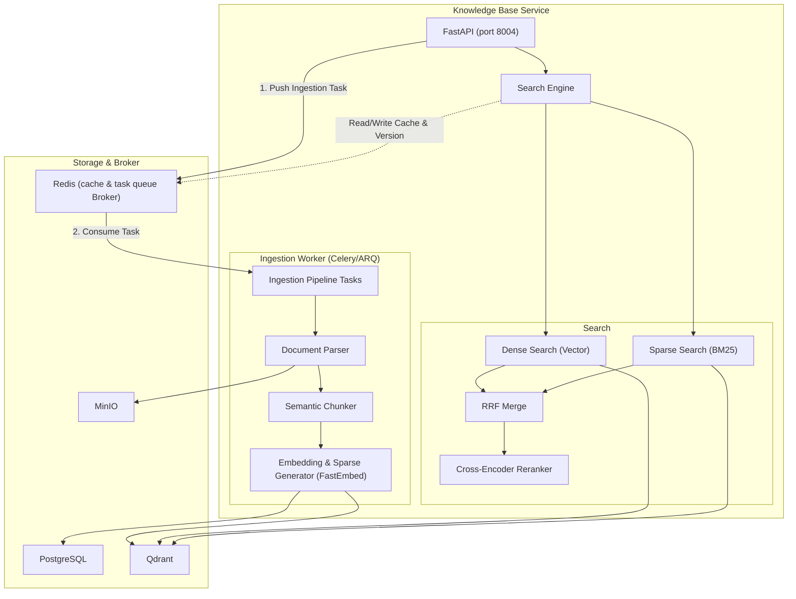

# Design — Knowledge Base Service

## Overview

Dịch vụ RAG pipeline và embedding — Python 3.12, FastAPI, Port 8004, PostgreSQL (knowledge_db), Qdrant. Ingestion pipeline (parse PDF/DOCX/TXT/MD → semantic chunking 256-512 tokens → embed text-embedding-3-small 512 dims → store Qdrant), hybrid search (dense vector + BM25 sparse + RRF merge), cross-encoder reranking (top-20 → top-5), int8 quantization (< 10ms p95).

## Components and Interfaces

Xem **Architecture**, **API Design**, **Chunking Strategy**, và **Search Pipeline** bên dưới.
| Component | Technology |
|-----------|-----------|
| Runtime | Python 3.12 |
| Framework | FastAPI |
| Task Queue | Celery / ARQ (Redis-backed worker for async ingestion) |
| Vector DB | Qdrant |
| Database | PostgreSQL 16 |
| ORM | SQLAlchemy 2 + asyncpg |
| Embedding | OpenAI text-embedding-3-small (512 dims) |
| Sparse Gen | FastEmbed (local SPLADE/BM25 tokenizer) |
| Reranker | BAAI/bge-reranker-v2-m3 (local, ONNX optimized fallback) |
| Document Parsing | unstructured, PyPDF2, python-docx |
| Object Storage | MinIO (boto3) |
| Cache & Queue | Redis |
| Testing | pytest + pytest-asyncio |

## Architecture



## API Design

```
POST   /api/v1/documents              — Upload document
GET    /api/v1/documents              — List documents (per tenant)
GET    /api/v1/documents/:id          — Get document detail + status
DELETE /api/v1/documents/:id          — Delete document + embeddings
POST   /api/v1/documents/:id/reindex  — Re-process document
GET    /api/v1/documents/:id/chunks   — View chunks

POST   /api/v1/search                 — Hybrid search query
POST   /api/v1/search/embed           — Get embedding for text (internal)
GET    /api/v1/kb/mcp                 — Establish MCP SSE connection
POST   /api/v1/kb/mcp/messages        — Post MCP JSON-RPC messages
```

## Data Models

```sql
CREATE TABLE documents (
    id UUID PRIMARY KEY DEFAULT gen_random_uuid(),
    tenant_id UUID NOT NULL,
    filename VARCHAR(500) NOT NULL,
    file_type VARCHAR(20) NOT NULL,
    file_size_bytes BIGINT NOT NULL,
    storage_path TEXT NOT NULL,
    chunk_count INT DEFAULT 0,
    status VARCHAR(20) NOT NULL DEFAULT 'processing',
    error_message TEXT,
    metadata JSONB DEFAULT '{}',
    uploaded_by UUID NOT NULL,
    created_at TIMESTAMPTZ DEFAULT NOW(),
    updated_at TIMESTAMPTZ DEFAULT NOW()
);

-- Lưu trữ Parent Chunks (Đoạn cha - chứa ngữ cảnh rộng 1000-2000 tokens)
CREATE TABLE parent_chunks (
    id UUID PRIMARY KEY DEFAULT gen_random_uuid(),
    document_id UUID NOT NULL REFERENCES documents(id) ON DELETE CASCADE,
    tenant_id UUID NOT NULL,
    parent_index INT NOT NULL,
    content TEXT NOT NULL,
    token_count INT NOT NULL,
    metadata JSONB DEFAULT '{}',
    created_at TIMESTAMPTZ DEFAULT NOW()
);

-- Lưu trữ Chunks (Đoạn con/Child Chunks - dùng để so khớp vector chính xác 100-200 tokens)
CREATE TABLE chunks (
    id UUID PRIMARY KEY DEFAULT gen_random_uuid(),
    document_id UUID NOT NULL REFERENCES documents(id) ON DELETE CASCADE,
    parent_chunk_id UUID REFERENCES parent_chunks(id) ON DELETE CASCADE, -- Liên kết Hierarchical
    tenant_id UUID NOT NULL,
    chunk_index INT NOT NULL,
    content TEXT NOT NULL,
    token_count INT NOT NULL,
    qdrant_point_id VARCHAR(255),
    metadata JSONB DEFAULT '{}',
    created_at TIMESTAMPTZ DEFAULT NOW()
);

CREATE INDEX idx_docs_tenant ON documents(tenant_id, status);
CREATE INDEX idx_parent_chunks_doc ON parent_chunks(document_id, parent_index);
CREATE INDEX idx_chunks_doc ON chunks(document_id, chunk_index);
CREATE INDEX idx_chunks_parent ON chunks(parent_chunk_id);
CREATE INDEX idx_chunks_tenant ON chunks(tenant_id);
```

## Qdrant Collection Config

```python
COLLECTION_CONFIG = {
    "vectors": {
        "openai": {
            "size": 512,
            "distance": "Cosine",
            "on_disk": False,  # RAM for speed
        },
        "local_fastembed": {
            "size": 384,
            "distance": "Cosine",
            "on_disk": False,
        }
    },
    "sparse_vectors": {
        "bm25": {}  # For hybrid search
    },
    "hnsw_config": {
        "m": 16,
        "ef_construct": 128,
        "full_scan_threshold": 10000,
    },
    "quantization_config": {
        "scalar": {
            "type": "int8",
            "quantile": 0.99,
            "always_ram": True,
        }
    }
}
# Result: 1M vectors × (512 + 384) dims × int8 ≈ 900MB RAM
# Search latency: p95 < 10ms
```

## Chunking Strategy

```python
class ChunkingConfig:
    CHUNK_SIZE = 400          # tokens
    CHUNK_OVERLAP = 80        # tokens (20%)
    SIMILARITY_THRESHOLD = 0.75  # for semantic boundary detection
    
    STRATEGIES = {
        "faq": "chunk_by_qa_pairs",      # Each Q&A = 1 chunk
        "product": "chunk_by_sections",   # Name, desc, price, specs
        "general": "semantic_chunk",      # Cosine similarity breakpoints
    }
```

## Search Pipeline

```python
async def hybrid_search(query: str, tenant_id: str, top_k: int = 5, bypass_rerank_threshold: float = 0.92):
    # 1. Embed query (with Local FastEmbed Fallback and Vector Field Routing)
    vector_field = "openai"
    try:
        query_vector = await get_cached_embedding(query, provider="openai")
    except Exception:
        # Fallback to local FastEmbed multilingual-e5-small (384 dims)
        query_vector = await get_cached_embedding(query, provider="fastembed_local")
        vector_field = "local_fastembed"
    
    # 2. Dense search (vector similarity on the routed field with tenant filter)
    dense_results = await qdrant.search(
        collection_name="knowledge_base",
        query_vector=query_vector,
        vector_name=vector_field,
        query_filter=Filter(
            must=[FieldCondition(key="tenant_id", match=MatchValue(value=tenant_id))]
        ),
        limit=20
    )
    
    # 3. Sparse search (BM25 generated locally via FastEmbed)
    sparse_results = await qdrant.search(
        collection_name="knowledge_base",
        query_vector=fastembed_sparse_encode(query),
        using="bm25",
        query_filter=Filter(
            must=[FieldCondition(key="tenant_id", match=MatchValue(value=tenant_id))]
        ),
        limit=20
    )
    
    # 4. Merge with RRF
    merged = reciprocal_rank_fusion(dense_results, sparse_results, k=60)
    
    # helper for deduplication
    def deduplicate_parent_chunks(results):
        seen_parents = set()
        unique = []
        for r in results:
            pid = r.metadata.get("parent_chunk_id")
            if pid not in seen_parents:
                seen_parents.add(pid)
                unique.append(r)
        return unique

    # 5. Rerank Bypass Check:
    # Kiểm tra trực tiếp độ tương đồng cosine lớn nhất của Dense Search (tránh check trên điểm RRF luôn < 0.1)
    if dense_results and dense_results[0].score >= bypass_rerank_threshold:
        return deduplicate_parent_chunks(merged)[:top_k]
        
    # 6. Rerank top-20 → top-5 (Rerank first, then deduplicate)
    reranked = await reranker.rank(
        query=query,
        documents=merged[:20],
        top_k=top_k * 2 # Fetch slightly more to account for duplicates
    )
    return deduplicate_parent_chunks(reranked)[:top_k]
```

## Performance Targets

| Metric | Target | How |
|--------|--------|-----|
| Vector search | < 10ms p95 | int8 quantization + RAM + 512 dims |
| Embedding throughput | > 1000 docs/min | Batch 100 + async |
| RAG accuracy | > 85% | Hybrid + rerank |
| Reranking | < 30ms | Local model, GPU optional |
| Embedding cache hit | > 60% | Redis TTL 1h |


## Correctness Properties

### Property 1: Tenant Isolation
**Validates: Requirements 4.1**
Moi query va operation phai filter theo tenant_id tu JWT claims. Khong co cross-tenant data leakage o bat ky tang nao (DB, Kafka, Redis, Qdrant, MinIO).

### Property 2: Idempotency
**Validates: Requirements 3.1**
Moi write operation phai co idempotency key de tranh duplicate processing khi retry. Kafka consumer phai idempotent.

### Property 3: At-least-once Delivery
**Validates: Requirements 3.1**
Kafka events phai duoc xu ly it nhat mot lan. Sau 3 retries voi exponential backoff (1s, 2s, 4s), event chuyen vao dead-letter queue.

### Property 4: Circuit Breaker Correctness
**Validates: Requirements 5.1**
Sync calls toi external services phai qua circuit breaker. Open sau 5 failures trong 30s, Half-Open probe sau 60s.

### Property 5: Data Consistency
**Validates: Requirements 3.1**
Distributed transactions dung Saga pattern voi compensating actions khi rollback. Moi destructive action ghi audit.events Kafka topic.
## Error Handling

| Scenario | Strategy |
|----------|----------|
| External API timeout | Retry t?i da 3 l?n v?i exponential backoff (1s, 2s, 4s); sau d� tr? v? l?i c� c?u tr�c |
| Database connection error | Circuit breaker + fallback response; alert qua Alertmanager |
| Kafka publish failure | Retry 3 l?n; n?u v?n th?t b?i ghi v�o dead-letter queue |
| Invalid tenant_id | Reject ngay v?i HTTP 403 + ghi security warning v�o audit log |
| Validation error | Tr? v? HTTP 422 v?i danh s�ch field errors chi ti?t |
| Unhandled exception | Log structured JSON v?i trace_id; tr? v? HTTP 500 v?i error_id d? debug |

## Testing Strategy

| Layer | Tool | Coverage Target |
|-------|------|----------------|
| Unit Tests | Jest (Node.js) / pytest (Python) / JUnit 5 (Java) | > 80% business logic |
| Integration Tests | Testcontainers (PostgreSQL, Redis, Kafka) | Happy path + error paths |
| Contract Tests | Pact (consumer-driven) cho gRPC interfaces | Chatbot?AI Core, Messaging?Chatbot |
| Property-Based Tests | fast-check (JS) / Hypothesis (Python) | Tenant isolation, idempotency |
| Load Tests | k6 | Chatbot E2E < 2s t?i 100 concurrent users |

## Security & Gateway Integration
- Dịch vụ được triển khai stateless phía sau Kong API Gateway.
- Gateway chịu trách nhiệm validate JWT token từ Keycloak, xác thực client scope `knowledge-base`, và inject header `X-Tenant-ID` vào request.
- Dịch vụ tin tưởng hoàn toàn vào các header được Gateway inject để thực hiện logic nghiệp vụ và cô lập dữ liệu.

## MCP Server Integration

Để hỗ trợ AI Core (vai trò MCP Host) truy vấn tri thức nội bộ một cách động và bảo mật, Knowledge Base Service triển khai một MCP Server chạy dưới dạng SSE Endpoint.

### 1. Định nghĩa MCP Server & Tools
*   **SSE Endpoint:** `/api/v1/kb/mcp` (với endpoint xử lý thông điệp `/api/v1/kb/mcp/messages`)
*   **Tool Exposed:** `knowledge_base_search(query: str, top_k: int = 5)`
    *   **Mô tả:** Tìm kiếm thông tin tri thức nội bộ của Solavie (Brochure sản phẩm, FAQ, chính sách kỹ thuật, cẩm nang lắp đặt) dựa trên dense/sparse search và reranker.
    *   **Input Schema:**
        ```json
        {
          "type": "object",
          "properties": {
            "query": { "type": "string", "description": "Từ khóa tìm kiếm tri thức" },
            "top_k": { "type": "integer", "description": "Số lượng kết quả trả về", "default": 5 }
          },
          "required": ["query"]
        }
        ```

### 2. Ràng buộc bảo mật & Đa thuê bao (Multi-tenancy Security)
*   **Xác thực:** Endpoint MCP yêu cầu xác thực JWT được Kong Gateway xác minh từ Keycloak.
*   **Cô lập dữ liệu:** `tenant_id` được trích xuất từ header `X-Tenant-ID`. Trước khi thực hiện Hybrid Search, service sẽ so khớp tham số `tenant_id` ẩn nhận được trong payload tool call với tenant trích xuất từ token. Quá trình Dense Search và Sparse Search trong Qdrant bắt buộc lọc theo metadata:
    ```python
    query_filter=Filter(
        must=[FieldCondition(key="tenant_id", match=MatchValue(value=tenant_id))]
    )
    ```

