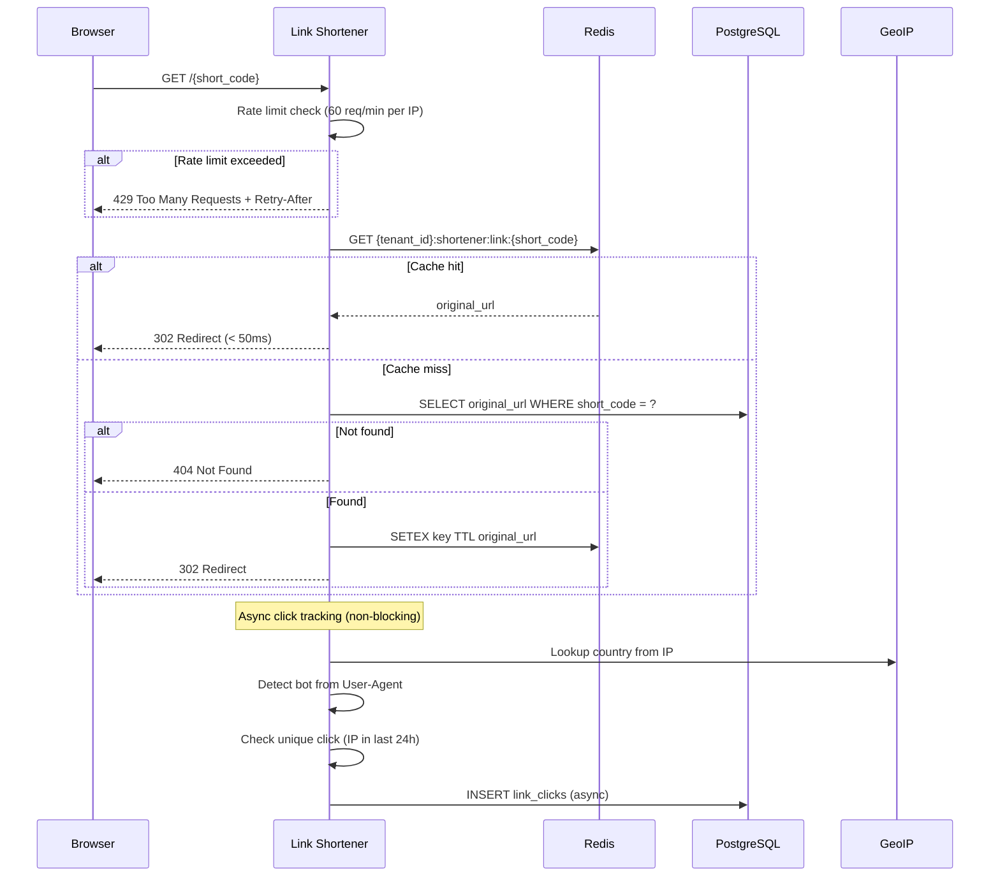

# Design — Link Shortener Service

## Overview

Dịch vụ rút gọn URL và theo dõi click cho chiến dịch marketing — Node.js 20, Fastify 4, Port 3009, PostgreSQL (shortener_db), Redis. Redis cache 100% ánh xạ short_code → original_url (TTL 30 ngày), circuit breaker fallback sang DB khi Redis down, click tracking bất đồng bộ (IP, user agent, country GeoIP, is_bot, is_unique), A/B Testing labels, rate limiting chống bot.

## Components and Interfaces

Xem **Architecture**, **API Design**, **Redirect Flow**, và **Circuit Breaker** bên dưới.

## Tech Stack
| Component | Technology |
|-----------|-----------|
| Runtime | Node.js 20 |
| Framework | Fastify 4 |
| Language | TypeScript 5 |
| Database | PostgreSQL 16 (shortener_db) |
| Cache | Redis 7 (link mapping, rate limiting) |
| GeoIP | MaxMind GeoLite2 (local DB) |
| Testing | Jest |
| Port | 3009 |

## Architecture

```mermaid
graph TB
    subgraph "Link Shortener Service"
        REST["Fastify REST API (port 3009)"]
        
        subgraph "Modules"
            SHORTEN["Shorten Module\n(create short link)"]
            REDIRECT["Redirect Module\n(lookup + 302)"]
            CLICK["Click Tracking Module\n(async write)"]
            ANALYTICS["Analytics Module\n(aggregation queries)"]
            CIRCUIT["Circuit Breaker\n(Redis fallback)"]
            RATELIMIT["Rate Limiter\n(Redis token bucket)"]
        end
    end

    subgraph "Storage"
        PG["PostgreSQL (shortener_db)"]
        Redis["Redis\n(link cache, rate limit state)"]
        GeoIP["MaxMind GeoLite2\n(local file)"]
    end

    Campaign["Campaign Service"] -->|POST /shorten| REST
    Customer["Customer Browser"] -->|GET /{short_code}| REST
    Dashboard["Dashboard"] -->|GET /analytics/...| REST
    
    REDIRECT --> CIRCUIT
    CIRCUIT -->|cache hit| Redis
    CIRCUIT -->|cache miss / Redis down| PG
    CLICK -->|async| PG
    CLICK --> GeoIP
    RATELIMIT --> Redis
```

## API Design

```
# Short Link Creation (authenticated, tenant-scoped)
POST   /api/v1/links/shorten              — Create short link
GET    /api/v1/links                      — List short links for tenant (paginated)

# Redirect (public, no auth)
GET    /{short_code}                      — Redirect + async click tracking

# Analytics
GET    /api/v1/links/analytics/:short_code          — Analytics per short link
GET    /api/v1/links/analytics/campaign/:campaign_id — Analytics per campaign (A/B comparison)

# Health
GET    /health                            — Liveness + circuit breaker status
```

## Data Models
```sql
-- ============================================================
-- SHORTENED LINKS
-- ============================================================
CREATE TABLE shortened_links (
    short_code VARCHAR(15) PRIMARY KEY,
    tenant_id VARCHAR(50) NOT NULL,
    original_url VARCHAR(2048) NOT NULL,
    campaign_id UUID,
    contact_id UUID,
    variant_label VARCHAR(10),              -- 'A' | 'B' | NULL
    created_at TIMESTAMPTZ DEFAULT NOW()
);

CREATE INDEX idx_links_tenant ON shortened_links(tenant_id, created_at DESC);
CREATE INDEX idx_links_campaign ON shortened_links(campaign_id) WHERE campaign_id IS NOT NULL;

-- ============================================================
-- LINK CLICKS
-- ============================================================
CREATE TABLE link_clicks (
    id UUID PRIMARY KEY DEFAULT gen_random_uuid(),
    tenant_id VARCHAR(50) NOT NULL,
    short_code VARCHAR(15) NOT NULL REFERENCES shortened_links(short_code),
    clicked_at TIMESTAMPTZ DEFAULT NOW(),
    ip_address VARCHAR(45),
    user_agent VARCHAR(512),
    country VARCHAR(50),                    -- ISO 3166-1 alpha-2 or 'UNKNOWN'
    is_bot BOOLEAN DEFAULT FALSE,
    is_unique BOOLEAN DEFAULT FALSE         -- True if first click from this IP in 24h
);

CREATE INDEX idx_clicks_short_code ON link_clicks(short_code, clicked_at DESC);
CREATE INDEX idx_clicks_tenant ON link_clicks(tenant_id, clicked_at DESC);
CREATE INDEX idx_clicks_campaign ON link_clicks(tenant_id, short_code) 
    WHERE is_bot = FALSE;
```

## Short Code Generation

```typescript
const ALPHABET = 'abcdefghijklmnopqrstuvwxyzABCDEFGHIJKLMNOPQRSTUVWXYZ0123456789';
const CODE_LENGTH = 8; // 62^8 = ~218 trillion combinations

function generateShortCode(): string {
  return Array.from({ length: CODE_LENGTH }, () =>
    ALPHABET[Math.floor(Math.random() * ALPHABET.length)]
  ).join('');
}

async function createUniqueShortCode(db: DB, tenantId: string): Promise<string> {
  for (let attempt = 0; attempt < 5; attempt++) {
    const code = generateShortCode();
    const exists = await db.shortenedLinks.findUnique({ where: { short_code: code } });
    if (!exists) return code;
  }
  throw new Error('Failed to generate unique short code after 5 attempts');
}
```

## Redis Cache Strategy

```typescript
// Cache key format
const CACHE_KEY = (tenantId: string, shortCode: string) =>
  `${tenantId}:shortener:link:${shortCode}`;

// TTL: 30 days (2,592,000 seconds)
const CACHE_TTL = 30 * 24 * 60 * 60;

// On create: write to cache immediately
await redis.setex(CACHE_KEY(tenantId, shortCode), CACHE_TTL, originalUrl);

// On redirect: read from cache first
async function resolveUrl(tenantId: string, shortCode: string): Promise<string | null> {
  const cached = await redis.get(CACHE_KEY(tenantId, shortCode));
  if (cached) return cached;
  
  // Cache miss: read from DB, repopulate cache
  const link = await db.shortenedLinks.findUnique({ where: { short_code: shortCode } });
  if (!link) return null;
  
  await redis.setex(CACHE_KEY(tenantId, shortCode), CACHE_TTL, link.original_url);
  return link.original_url;
}
```

## Circuit Breaker — Redis Fallback

```mermaid
stateDiagram-v2
    [*] --> Closed: Initial state
    
    Closed --> Open: 5 failures in 30s\n(timeout > 200ms OR connection refused)
    Open --> HalfOpen: After 60s probe
    HalfOpen --> Closed: Probe success
    HalfOpen --> Open: Probe failure
    
    note right of Closed: Normal: Redis cache lookup
    note right of Open: Fallback: Direct DB lookup\nClick events written sync to DB
    note right of HalfOpen: Single probe request to Redis
```

```typescript
class RedisCircuitBreaker {
  private state: 'closed' | 'open' | 'half-open' = 'closed';
  private failureCount = 0;
  private lastFailureTime: number = 0;
  
  async execute<T>(redisOp: () => Promise<T>, fallback: () => Promise<T>): Promise<T> {
    if (this.state === 'open') {
      if (Date.now() - this.lastFailureTime > 60_000) {
        this.state = 'half-open';
      } else {
        return fallback(); // Direct DB fallback
      }
    }
    
    try {
      const result = await Promise.race([
        redisOp(),
        new Promise((_, reject) => setTimeout(() => reject(new Error('timeout')), 200))
      ]) as T;
      
      if (this.state === 'half-open') this.state = 'closed';
      this.failureCount = 0;
      return result;
    } catch {
      this.failureCount++;
      this.lastFailureTime = Date.now();
      if (this.failureCount >= 5) this.state = 'open';
      return fallback();
    }
  }
}
```

## Redirect Flow



## Rate Limiting

```typescript
// Rate limit keys
const REDIRECT_RL_KEY = (ip: string) => `shortener:ratelimit:redirect:${ip}`;
const CREATE_RL_KEY = (tenantId: string) => `shortener:ratelimit:create:${tenantId}`;

// Limits
const REDIRECT_LIMIT = 60;   // per minute per IP
const CREATE_LIMIT = 100;    // per minute per tenant

// Implementation: sliding window counter in Redis
async function checkRateLimit(key: string, limit: number): Promise<boolean> {
  const count = await redis.incr(key);
  if (count === 1) await redis.expire(key, 60); // TTL 60s
  return count <= limit;
}
```

## Bot Detection

```typescript
const BOT_PATTERNS = /bot|crawler|spider|scraper|curl|wget|python-requests|go-http/i;

function isBot(userAgent: string | undefined): boolean {
  if (!userAgent) return true; // No UA = treat as bot
  return BOT_PATTERNS.test(userAgent);
}

// Bot clicks: recorded with is_bot=true, excluded from unique click analytics
```

## Analytics Queries

```sql
-- Per short_code analytics
SELECT
  COUNT(*) as total_clicks,
  COUNT(*) FILTER (WHERE is_unique = TRUE AND is_bot = FALSE) as unique_clicks,
  country,
  COUNT(*) as country_count
FROM link_clicks
WHERE short_code = $1 AND tenant_id = $2
  AND clicked_at >= NOW() - INTERVAL '90 days'
GROUP BY country
ORDER BY country_count DESC
LIMIT 10;

-- A/B comparison per campaign
SELECT
  sl.variant_label,
  COUNT(lc.id) as total_clicks,
  COUNT(lc.id) FILTER (WHERE lc.is_unique = TRUE AND lc.is_bot = FALSE) as unique_clicks
FROM shortened_links sl
LEFT JOIN link_clicks lc ON sl.short_code = lc.short_code
WHERE sl.campaign_id = $1 AND sl.tenant_id = $2
GROUP BY sl.variant_label;
```

## Performance Targets

| Metric | Target |
|--------|--------|
| Redirect (cache hit) | < 50ms |
| Redirect (cache miss) | < 200ms |
| Short link creation | < 300ms |
| Analytics query (90 days) | < 2s |
| Cache TTL | 30 days |
| Rate limit window | 60 seconds |


## Correctness Properties

### Property 1: Tenant Isolation
**Validates: Requirements 4.1**
Moi query va operation phai filter theo tenant_id tu JWT claims. Khong co cross-tenant data leakage o bat ky tang nao (DB, Kafka, Redis, Qdrant, MinIO).

### Property 2: Idempotency
**Validates: Requirements 3.1**
Moi write operation phai co idempotency key de tranh duplicate processing khi retry. Kafka consumer phai idempotent.

### Property 3: At-least-once Delivery
**Validates: Requirements 3.1**
Kafka events phai duoc xu ly it nhat mot lan. Sau 3 retries voi exponential backoff (1s, 2s, 4s), event chuyen vao dead-letter queue.

### Property 4: Circuit Breaker Correctness
**Validates: Requirements 5.1**
Sync calls toi external services phai qua circuit breaker. Open sau 5 failures trong 30s, Half-Open probe sau 60s.

### Property 5: Data Consistency
**Validates: Requirements 3.1**
Distributed transactions dung Saga pattern voi compensating actions khi rollback. Moi destructive action ghi audit.events Kafka topic.
## Error Handling

| Scenario | Strategy |
|----------|----------|
| External API timeout | Retry t?i da 3 l?n v?i exponential backoff (1s, 2s, 4s); sau d� tr? v? l?i c� c?u tr�c |
| Database connection error | Circuit breaker + fallback response; alert qua Alertmanager |
| Kafka publish failure | Retry 3 l?n; n?u v?n th?t b?i ghi v�o dead-letter queue |
| Invalid tenant_id | Reject ngay v?i HTTP 403 + ghi security warning v�o audit log |
| Validation error | Tr? v? HTTP 422 v?i danh s�ch field errors chi ti?t |
| Unhandled exception | Log structured JSON v?i trace_id; tr? v? HTTP 500 v?i error_id d? debug |

## Testing Strategy

| Layer | Tool | Coverage Target |
|-------|------|----------------|
| Unit Tests | Jest (Node.js) / pytest (Python) / JUnit 5 (Java) | > 80% business logic |
| Integration Tests | Testcontainers (PostgreSQL, Redis, Kafka) | Happy path + error paths |
| Contract Tests | Pact (consumer-driven) cho gRPC interfaces | Chatbot?AI Core, Messaging?Chatbot |
| Property-Based Tests | fast-check (JS) / Hypothesis (Python) | Tenant isolation, idempotency |
| Load Tests | k6 | Chatbot E2E < 2s t?i 100 concurrent users |

## Security & Gateway Integration
- Dịch vụ được triển khai stateless phía sau Kong API Gateway.
- Gateway chịu trách nhiệm validate JWT token từ Keycloak, xác thực client scope `link-shortener`, và inject header `X-Tenant-ID` vào request.
- Dịch vụ tin tưởng hoàn toàn vào các header được Gateway inject để thực hiện logic nghiệp vụ và cô lập dữ liệu.
