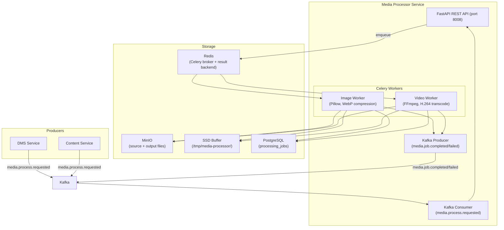

# Design — Media Processor Service

## Overview

Dịch vụ xử lý ảnh và video bất đồng bộ — Python 3.12, FastAPI, Port 8008, Celery 5 + Redis broker, MinIO, Kafka. Nhận job từ Kafka topic `media.process.requested`, xử lý bằng Celery workers (image queue priority > video queue), ghi đệm tạm thời ra SSD thay vì RAM để tránh OOM, retry tối đa 3 lần với exponential backoff, publish kết quả qua Kafka.

## Components and Interfaces

Xem **Architecture**, **API Design**, **Image Processing Task**, và **Video Processing Task** bên dưới.

## Tech Stack
| Component | Technology |
|-----------|-----------|
| Runtime | Python 3.12 |
| Framework | FastAPI |
| Workers | Celery 5 + Redis broker |
| Image Processing | Pillow (PIL) |
| Video Processing | FFmpeg (via ffmpeg-python) |
| Object Storage | MinIO (boto3 S3-compatible) |
| Database | PostgreSQL 16 (processing_jobs table) |
| ORM | SQLAlchemy 2 + asyncpg |
| Queue | Kafka (kafka-python) |
| Testing | pytest + pytest-asyncio |
| Port | 8008 |

## Architecture



## API Design

```
GET    /api/v1/permissions/manifest     — Expose permissions manifest for this service
# Job Management
GET    /api/v1/media/jobs/{job_id}         — Get job status (tenant-scoped)
GET    /api/v1/media/jobs/{job_id}/status  — Lightweight status check (< 200ms)

# Health
GET    /health                             — Liveness + SSD buffer usage
GET    /ready                              — Readiness (Redis + MinIO connectivity)
GET    /metrics                            — Prometheus metrics
```

## Data Models
```sql
CREATE TABLE processing_jobs (
    id UUID PRIMARY KEY DEFAULT gen_random_uuid(),
    tenant_id VARCHAR(50) NOT NULL,
    file_id UUID NOT NULL,
    media_type VARCHAR(10) NOT NULL,        -- 'image' | 'video'
    source_path TEXT NOT NULL,              -- MinIO path
    status VARCHAR(20) NOT NULL DEFAULT 'queued',
    -- Status: queued → processing → done | failed
    retry_count INT DEFAULT 0,
    output_paths JSONB,                     -- {original: path, thumb_small: path, ...}
    error_message TEXT,
    started_at TIMESTAMPTZ,
    completed_at TIMESTAMPTZ,
    created_at TIMESTAMPTZ DEFAULT NOW()
);

CREATE INDEX idx_jobs_tenant ON processing_jobs(tenant_id, status, created_at DESC);
CREATE INDEX idx_jobs_file ON processing_jobs(file_id);
CREATE INDEX idx_jobs_status ON processing_jobs(status) WHERE status IN ('queued', 'processing');
```

## Celery Configuration

```python
from celery import Celery

app = Celery(
    'media_processor',
    broker='redis://redis:6379/1',
    backend='redis://redis:6379/2',
)

app.conf.update(
    # Priority queues: image > video
    task_queues={
        'image': {'exchange': 'image', 'routing_key': 'image', 'queue_arguments': {'x-max-priority': 10}},
        'video': {'exchange': 'video', 'routing_key': 'video', 'queue_arguments': {'x-max-priority': 5}},
    },
    task_default_queue='image',
    task_routes={
        'tasks.process_image': {'queue': 'image'},
        'tasks.process_video': {'queue': 'video'},
    },
    
    # Retry policy
    task_acks_late=True,
    task_reject_on_worker_lost=True,
    
    # SSD buffer: avoid RAM OOM
    worker_prefetch_multiplier=1,  # One task at a time per worker
    
    # Serialization
    task_serializer='json',
    result_serializer='json',
    accept_content=['json'],
)
```

## Image Processing Task

```python
from celery import Task
from PIL import Image
import io, os

SSD_BUFFER_DIR = '/tmp/media-processor'
THUMBNAIL_SIZES = {
    'small': (150, 150),
    'medium': (400, 400),
    'large': (800, 800),
}

@app.task(
    bind=True,
    max_retries=3,
    default_retry_delay=30,  # 30s, 60s, 120s (exponential)
    queue='image',
    name='tasks.process_image'
)
def process_image(self, job_id: str, tenant_id: str, file_id: str, source_path: str):
    job_dir = os.path.join(SSD_BUFFER_DIR, job_id)
    os.makedirs(job_dir, exist_ok=True)
    
    try:
        # Update status to processing
        update_job_status(job_id, 'processing', started_at=datetime.utcnow())
        
        # 1. Download from MinIO to SSD buffer
        local_path = os.path.join(job_dir, 'source')
        minio_client.fget_object(BUCKET, source_path, local_path)
        
        # 2. Open image
        img = Image.open(local_path)
        output_paths = {}
        
        # 3. Compress to WebP quality=85%
        webp_path = os.path.join(job_dir, 'original.webp')
        img.save(webp_path, 'WEBP', quality=85)
        minio_dest = f'{tenant_id}/processed/{file_id}/original.webp'
        minio_client.fput_object(BUCKET, minio_dest, webp_path)
        output_paths['original'] = minio_dest
        
        # 4. Generate thumbnails (center crop, square)
        for size_name, (w, h) in THUMBNAIL_SIZES.items():
            if img.width < w or img.height < h:
                # Skip if source smaller than thumbnail
                continue
            
            thumb = ImageOps.fit(img, (w, h), Image.LANCZOS)
            thumb_path = os.path.join(job_dir, f'thumb_{size_name}.webp')
            thumb.save(thumb_path, 'WEBP', quality=85)
            minio_dest = f'{tenant_id}/processed/{file_id}/thumb_{size_name}.webp'
            minio_client.fput_object(BUCKET, minio_dest, thumb_path)
            output_paths[f'thumb_{size_name}'] = minio_dest
        
        # 5. Update job as done
        update_job_status(job_id, 'done', output_paths=output_paths, completed_at=datetime.utcnow())
        
        # 6. Publish completion event
        publish_kafka_event('media.job.completed', {
            'job_id': job_id,
            'tenant_id': tenant_id,
            'file_id': file_id,
            'output_paths': output_paths,
            'media_type': 'image',
            'completed_at': datetime.utcnow().isoformat(),
        })
        
    except Exception as exc:
        retry_count = self.request.retries
        backoff = 30 * (2 ** retry_count)  # 30s, 60s, 120s
        
        if retry_count < 3:
            update_job_status(job_id, 'queued', retry_count=retry_count + 1)
            raise self.retry(exc=exc, countdown=backoff)
        else:
            update_job_status(job_id, 'failed', error_message=str(exc))
            publish_kafka_event('media.job.failed', {
                'job_id': job_id, 'tenant_id': tenant_id, 'file_id': file_id,
                'error_message': str(exc), 'retry_count': 3,
                'failed_at': datetime.utcnow().isoformat(),
            })
    finally:
        # Always cleanup SSD buffer
        shutil.rmtree(job_dir, ignore_errors=True)
```

## Video Processing Task

```python
import ffmpeg

MAX_VIDEO_SIZE_BYTES = 100 * 1024 * 1024  # 100 MB

@app.task(
    bind=True,
    max_retries=3,
    default_retry_delay=30,
    queue='video',
    name='tasks.process_video'
)
def process_video(self, job_id: str, tenant_id: str, file_id: str, source_path: str):
    job_dir = os.path.join(SSD_BUFFER_DIR, job_id)
    os.makedirs(job_dir, exist_ok=True)
    
    try:
        update_job_status(job_id, 'processing', started_at=datetime.utcnow())
        
        # 1. Download to SSD buffer (NOT RAM)
        local_source = os.path.join(job_dir, 'source.mp4')
        minio_client.fget_object(BUCKET, source_path, local_source)
        
        # 2. Transcode: MP4 H.264, AAC 128kbps, max 1080p
        local_output = os.path.join(job_dir, 'video.mp4')
        (
            ffmpeg
            .input(local_source)
            .output(
                local_output,
                vcodec='libx264',
                acodec='aac',
                audio_bitrate='128k',
                vf='scale=trunc(min(iw\\,1920)/2)*2:trunc(min(ih\\,1080)/2)*2',  # max 1080p, keep ratio
                preset='medium',
                crf=23,
            )
            .overwrite_output()
            .run(capture_stdout=True, capture_stderr=True)
        )
        
        # 3. Extract thumbnail at 1 second
        local_thumb = os.path.join(job_dir, 'thumb_video.jpg')
        (
            ffmpeg
            .input(local_source, ss=1)
            .output(local_thumb, vframes=1, s='1280x720', vf='pad=1280:720:(ow-iw)/2:(oh-ih)/2')
            .overwrite_output()
            .run(capture_stdout=True, capture_stderr=True)
        )
        
        # 4. Upload to MinIO
        output_paths = {}
        for local_file, dest_name in [(local_output, 'video.mp4'), (local_thumb, 'thumb_video.jpg')]:
            minio_dest = f'{tenant_id}/processed/{file_id}/{dest_name}'
            minio_client.fput_object(BUCKET, minio_dest, local_file)
            output_paths[dest_name.split('.')[0]] = minio_dest
        
        update_job_status(job_id, 'done', output_paths=output_paths, completed_at=datetime.utcnow())
        publish_kafka_event('media.job.completed', {
            'job_id': job_id, 'tenant_id': tenant_id, 'file_id': file_id,
            'output_paths': output_paths, 'media_type': 'video',
            'completed_at': datetime.utcnow().isoformat(),
        })
        
    except Exception as exc:
        retry_count = self.request.retries
        backoff = 30 * (2 ** retry_count)
        
        if retry_count < 3:
            update_job_status(job_id, 'queued', retry_count=retry_count + 1)
            raise self.retry(exc=exc, countdown=backoff)
        else:
            update_job_status(job_id, 'failed', error_message=str(exc))
            publish_kafka_event('media.job.failed', {
                'job_id': job_id, 'tenant_id': tenant_id, 'file_id': file_id,
                'error_message': str(exc), 'retry_count': 3,
                'failed_at': datetime.utcnow().isoformat(),
            })
    finally:
        shutil.rmtree(job_dir, ignore_errors=True)
```

## Kafka Consumer — Job Intake

```python
from kafka import KafkaConsumer
import json

consumer = KafkaConsumer(
    'media.process.requested',
    bootstrap_servers=['kafka:9092'],
    group_id='media-processor',
    value_deserializer=lambda m: json.loads(m.decode('utf-8')),
    auto_offset_reset='earliest',
    enable_auto_commit=False,
)

async def consume_jobs():
    for message in consumer:
        event = message.value
        
        # Validate media_type
        if event['media_type'] not in ('image', 'video'):
            # Reject immediately
            create_failed_job(event, 'Unsupported media_type')
            consumer.commit()
            continue
        
        # Check video size limit
        if event['media_type'] == 'video' and event.get('file_size', 0) > MAX_VIDEO_SIZE_BYTES:
            create_failed_job(event, 'Video exceeds 100MB limit')
            publish_kafka_event('media.job.failed', {...})
            consumer.commit()
            continue
        
        # Check SSD buffer capacity
        if get_ssd_usage_percent() > 90:
            # Reject, log warning
            logger.warning('SSD buffer > 90%, rejecting job')
            consumer.commit()
            continue
        
        # Create job record
        job = create_job_record(event)
        
        # Enqueue to appropriate Celery queue
        if event['media_type'] == 'image':
            process_image.apply_async(
                args=[job.id, event['tenant_id'], event['file_id'], event['source_path']],
                queue='image'
            )
        else:
            process_video.apply_async(
                args=[job.id, event['tenant_id'], event['file_id'], event['source_path']],
                queue='video'
            )
        
        consumer.commit()
```

## SSD Buffer Management

```python
import shutil
import psutil

SSD_BUFFER_DIR = '/tmp/media-processor'
SSD_WARNING_THRESHOLD = 0.90  # 90%

def get_ssd_usage_percent() -> float:
    usage = psutil.disk_usage(SSD_BUFFER_DIR)
    return usage.percent / 100.0

def check_ssd_capacity(required_bytes: int) -> bool:
    usage = psutil.disk_usage(SSD_BUFFER_DIR)
    available = usage.free
    return available > required_bytes * 1.5  # 50% safety margin

# Each job gets isolated directory: /tmp/media-processor/{job_id}/
# Cleaned up in finally block regardless of success/failure
```

## Retry Policy

```
Retry schedule (exponential backoff):
  Attempt 1: immediate (first try)
  Retry 1:   after 30s
  Retry 2:   after 60s
  Retry 3:   after 120s
  After 3 retries: mark as 'failed', publish media.job.failed

Retryable errors:
  - MinIO connection error
  - FFmpeg transcode error
  - Pillow processing error
  - Network timeout

Non-retryable (fail immediately):
  - source_path not found in MinIO
  - media_type not supported
  - video > 100MB
  - SSD buffer > 90%
```

## Kafka Events

### Consumed
| Topic | Action |
|-------|--------|
| `media.process.requested` | Create Processing_Job, enqueue to Celery |

### Published
| Topic | Trigger | Payload |
|-------|---------|---------|
| `media.job.completed` | Job status → done | `{job_id, tenant_id, file_id, output_paths, media_type, completed_at}` |
| `media.job.failed` | Job status → failed (after 3 retries) | `{job_id, tenant_id, file_id, error_message, retry_count, failed_at}` |

## Performance Targets

| Metric | Target |
|--------|--------|
| Image processing (< 5MB) | < 10s |
| Video transcode (< 100MB, 1080p) | < 5 min |
| Job status API response | < 200ms |
| SSD buffer cleanup | Immediate after job completion |
| Retry backoff | 30s → 60s → 120s |
| Max concurrent image workers | 4 |
| Max concurrent video workers | 2 |


## Correctness Properties

### Property 1: Tenant Isolation
**Validates: Requirements 4.1**
Moi query va operation phai filter theo tenant_id tu JWT claims. Khong co cross-tenant data leakage o bat ky tang nao (DB, Kafka, Redis, Qdrant, MinIO).

### Property 2: Idempotency
**Validates: Requirements 3.1**
Moi write operation phai co idempotency key de tranh duplicate processing khi retry. Kafka consumer phai idempotent.

### Property 3: At-least-once Delivery
**Validates: Requirements 3.1**
Kafka events phai duoc xu ly it nhat mot lan. Sau 3 retries voi exponential backoff (1s, 2s, 4s), event chuyen vao dead-letter queue.

### Property 4: Circuit Breaker Correctness
**Validates: Requirements 5.1**
Sync calls toi external services phai qua circuit breaker. Open sau 5 failures trong 30s, Half-Open probe sau 60s.

### Property 5: Data Consistency
**Validates: Requirements 3.1**
Distributed transactions dung Saga pattern voi compensating actions khi rollback. Moi destructive action ghi audit.events Kafka topic.
## Error Handling

| Scenario | Strategy |
|----------|----------|
| External API timeout | Retry t?i da 3 l?n v?i exponential backoff (1s, 2s, 4s); sau d� tr? v? l?i c� c?u tr�c |
| Database connection error | Circuit breaker + fallback response; alert qua Alertmanager |
| Kafka publish failure | Retry 3 l?n; n?u v?n th?t b?i ghi v�o dead-letter queue |
| Invalid tenant_id | Reject ngay v?i HTTP 403 + ghi security warning v�o audit log |
| Validation error | Tr? v? HTTP 422 v?i danh s�ch field errors chi ti?t |
| Unhandled exception | Log structured JSON v?i trace_id; tr? v? HTTP 500 v?i error_id d? debug |

## Testing Strategy

| Layer | Tool | Coverage Target |
|-------|------|----------------|
| Unit Tests | Jest (Node.js) / pytest (Python) / JUnit 5 (Java) | > 80% business logic |
| Integration Tests | Testcontainers (PostgreSQL, Redis, Kafka) | Happy path + error paths |
| Contract Tests | Pact (consumer-driven) cho gRPC interfaces | Chatbot?AI Core, Messaging?Chatbot |
| Property-Based Tests | fast-check (JS) / Hypothesis (Python) | Tenant isolation, idempotency |
| Load Tests | k6 | Chatbot E2E < 2s t?i 100 concurrent users |


## Zero-Trust HMAC Guard & Permission Manifest

### 1. Permission Manifest API
`GET /api/v1/permissions/manifest`
Trả về JSON chứa danh sách các tài nguyên và hành động được định nghĩa cho service này:
```json
{
    "service": "media-processor",
    "resources": [
        {
            "name": "jobs",
            "description": "Media processing tasks",
            "actions": [
                "create",
                "read"
            ]
        }
    ]
}
```

### 2. Zero-Trust HMAC Signature Verification
Dịch vụ kiểm tra và xác thực chữ ký signature trên mỗi request tại lớp Guard/Interceptor của Python / FastAPI:
1. Trích xuất `X-Tenant-ID`, `X-User-ID`, `X-User-Permissions` và `X-Permissions-Signature` từ headers.
2. Tính toán signature mong đợi:
   `expected_sig = HMAC_SHA256(GATEWAY_SIGNING_SECRET, X-Tenant-ID + ":" + X-User-ID + ":" + X-User-Permissions)`
3. So sánh `X-Permissions-Signature` với `expected_sig`. Nếu không khớp, trả về ngay lập tức mã lỗi `403 Forbidden` (Signature Mismatch).
4. So khớp in-memory O(1): parse `X-User-Permissions` thành một Set và đối chiếu với quyền yêu cầu của endpoint (ví dụ: `media-processor:jobs:create`).
   - Hỗ trợ wildcard: `*` (Super Admin bypass), `media-processor:*` (Service bypass), và `media-processor:jobs:*` (Resource bypass).

## Security & Gateway Integration
- Dịch vụ được triển khai stateless phía sau Kong API Gateway.
- Gateway chịu trách nhiệm validate JWT token từ Keycloak, xác thực client scope `media-processor`, và inject header `X-Tenant-ID` vào request.
- Dịch vụ tin tưởng hoàn toàn vào các header được Gateway inject để thực hiện logic nghiệp vụ và cô lập dữ liệu.
