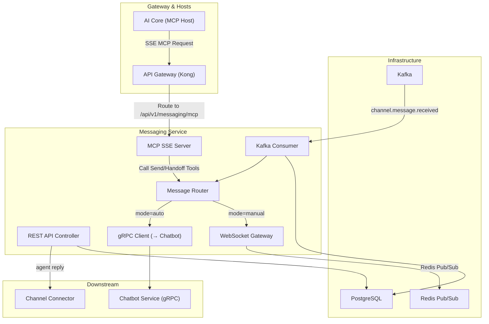

# Design — Messaging Service

## Overview

Dịch vụ quản lý hộp thư hợp nhất — Node.js 20, NestJS, Port 3002, PostgreSQL (messaging_db), Socket.IO + Redis Adapter. Unified Inbox từ tất cả kênh (Facebook/Zalo/TikTok), message routing (auto → Chatbot gRPC, manual → Agent WebSocket), handoff execution, hybrid routing algorithm (historical → queue claim → least busy), typing indicator, auto-close sau timeout.

## Components and Interfaces

Xem **Architecture**, **REST APIs**, **WebSocket Events**, và **gRPC Client** bên dưới.
| Component | Technology |
|-----------|-----------|
| Runtime | Node.js 20 |
| Framework | NestJS 10 |
| Language | TypeScript 5 |
| Database | PostgreSQL 16 |
| ORM | Prisma |
| Queue | KafkaJS (consumer + producer) |
| Realtime | Socket.IO + Redis Adapter |
| gRPC Client | @grpc/grpc-js + protobuf |
| MCP SDK | @modelcontextprotocol/sdk |
| Testing | Jest + Supertest |

## Architecture



## API Design

### REST APIs
```
GET    /api/v1/permissions/manifest     — Expose permissions manifest for this service
GET    /api/v1/conversations                  — List conversations (paginated)
GET    /api/v1/conversations/:id              — Get conversation detail
GET    /api/v1/conversations/:id/messages     — Get messages (paginated)
POST   /api/v1/conversations/:id/messages     — Agent sends reply
PUT    /api/v1/conversations/:id/assign       — Assign to agent
PUT    /api/v1/conversations/:id/mode         — Switch auto/manual
PUT    /api/v1/conversations/:id/status       — Change status (open/closed)
GET    /api/v1/conversations/stats            — Inbox stats (unread, pending)
GET    /api/v1/messaging/mcp                  — SSE connection endpoint for MCP Server
POST   /api/v1/messaging/mcp/messages         — JSON-RPC message transport for MCP Server
```

### WebSocket Events
```
// Client → Server
ws:subscribe     { conversation_ids: string[] }
ws:typing        { conversation_id: string, is_typing: boolean }

// Server → Client
ws:message.new   { conversation_id, message }
ws:conversation.updated { conversation_id, changes }
ws:typing        { conversation_id, sender_id, is_typing }
```

## Data Models

```sql
CREATE TABLE conversations (
    id UUID PRIMARY KEY DEFAULT gen_random_uuid(),
    tenant_id UUID NOT NULL,
    contact_id UUID NOT NULL,
    channel VARCHAR(20) NOT NULL,
    channel_conversation_id VARCHAR(255),
    mode VARCHAR(10) NOT NULL DEFAULT 'auto',
    assigned_agent_id UUID,
    status VARCHAR(20) NOT NULL DEFAULT 'open',
    unread_count INT DEFAULT 0,
    last_message_at TIMESTAMPTZ,
    last_message_preview TEXT,
    created_at TIMESTAMPTZ DEFAULT NOW(),
    updated_at TIMESTAMPTZ DEFAULT NOW()
);

CREATE TABLE messages (
    id UUID PRIMARY KEY DEFAULT gen_random_uuid(),
    tenant_id UUID NOT NULL,
    conversation_id UUID NOT NULL REFERENCES conversations(id),
    sender_type VARCHAR(10) NOT NULL, -- 'customer', 'bot', 'agent'
    sender_id VARCHAR(255) NOT NULL,
    content TEXT NOT NULL,
    content_type VARCHAR(20) DEFAULT 'text',
    attachments JSONB DEFAULT '[]',
    metadata JSONB DEFAULT '{}',
    sentiment VARCHAR(20),
    confidence_score FLOAT,
    created_at TIMESTAMPTZ DEFAULT NOW()
);

CREATE INDEX idx_conv_tenant_status ON conversations(tenant_id, status, last_message_at DESC);
CREATE INDEX idx_conv_agent ON conversations(assigned_agent_id, status);
CREATE INDEX idx_msg_conv ON messages(conversation_id, created_at DESC);
```

## gRPC Client (→ Chatbot)

```protobuf
// Calls ChatbotService.ProcessMessage
message ChatRequest {
  string tenant_id = 1;
  string conversation_id = 2;
  string message_content = 3;
  string language = 4;
  repeated Message history = 5;
}
```

## Kafka Events

### Consumed: `channel.message.received`
→ Create/update conversation, save message, route to bot or agent

### Published: `messaging.handoff.requested`
```typescript
interface HandoffEvent {
  tenant_id: string;
  conversation_id: string;
  reason: 'low_confidence' | 'sentiment_negative' | 'timeout';
  confidence_score?: number;
}
```

### Published: `messaging.conversation.created`
```typescript
interface ConversationCreatedEvent {
  tenant_id: string;
  conversation_id: string;
  contact_id: string;
  channel: string;
}
```


## Model Context Protocol (MCP) Tools

Messaging Service đóng vai trò là một MCP SSE Server, đăng ký các tools nghiệp vụ sau với AI Core (MCP Host):

### 1. Tool: `send_message`
* **Mô tả:** Gửi tin nhắn thay mặt cho bot hoặc hệ thống đến một cuộc hội thoại cụ thể.
* **Tham số đầu vào (Schema):**
  * `conversation_id` (string, UUID, required): ID của cuộc hội thoại đích.
  * `content` (string, required): Nội dung tin nhắn cần gửi.
  * `content_type` (string, optional, mặc định là 'text'): Kiểu nội dung ('text', 'image', 'file').
* **Bảo mật:** Tham số `tenant_id` sẽ được tự động tiêm từ header `X-Tenant-ID` của Gateway vào hàm nghiệp vụ xử lý, cấm LLM tự ý chèn hoặc sửa đổi tham số này.

### 2. Tool: `handoff_to_agent`
* **Mô tả:** Chuyển đổi trạng thái cuộc hội thoại sang chế độ Agent xử lý thủ công và kích hoạt phân bổ Agent.
* **Tham số đầu vào (Schema):**
  * `conversation_id` (string, UUID, required): ID của cuộc hội thoại cần chuyển hướng.
  * `reason` (string, optional): Lý do chuyển tiếp (ví dụ: 'user_request', 'complex_query', 'negative_sentiment').
* **Bảo mật:** Tương tự, `tenant_id` được inject trực tiếp từ request header để đảm bảo an toàn đa thuê.

## Correctness Properties

### Property 1: Tenant Isolation
**Validates: Requirements 4.1**
Moi query va operation phai filter theo tenant_id tu JWT claims. Khong co cross-tenant data leakage o bat ky tang nao (DB, Kafka, Redis, Qdrant, MinIO).

### Property 2: Idempotency
**Validates: Requirements 3.1**
Moi write operation phai co idempotency key de tranh duplicate processing khi retry. Kafka consumer phai idempotent.

### Property 3: At-least-once Delivery
**Validates: Requirements 3.1**
Kafka events phai duoc xu ly it nhat mot lan. Sau 3 retries voi exponential backoff (1s, 2s, 4s), event chuyen vao dead-letter queue.

### Property 4: Circuit Breaker Correctness
**Validates: Requirements 5.1**
Sync calls toi external services phai qua circuit breaker. Open sau 5 failures trong 30s, Half-Open probe sau 60s.

### Property 5: Data Consistency
**Validates: Requirements 3.1**
Distributed transactions dung Saga pattern voi compensating actions khi rollback. Moi destructive action ghi audit.events Kafka topic.
## Error Handling

| Scenario | Strategy |
|----------|----------|
| External API timeout | Retry t?i da 3 l?n v?i exponential backoff (1s, 2s, 4s); sau d� tr? v? l?i c� c?u tr�c |
| Database connection error | Circuit breaker + fallback response; alert qua Alertmanager |
| Kafka publish failure | Retry 3 l?n; n?u v?n th?t b?i ghi v�o dead-letter queue |
| Invalid tenant_id | Reject ngay v?i HTTP 403 + ghi security warning v�o audit log |
| Validation error | Tr? v? HTTP 422 v?i danh s�ch field errors chi ti?t |
| Unhandled exception | Log structured JSON v?i trace_id; tr? v? HTTP 500 v?i error_id d? debug |

## Testing Strategy

| Layer | Tool | Coverage Target |
|-------|------|----------------|
| Unit Tests | Jest (Node.js) / pytest (Python) / JUnit 5 (Java) | > 80% business logic |
| Integration Tests | Testcontainers (PostgreSQL, Redis, Kafka) | Happy path + error paths |
| Contract Tests | Pact (consumer-driven) cho gRPC interfaces | Chatbot?AI Core, Messaging?Chatbot |
| Property-Based Tests | fast-check (JS) / Hypothesis (Python) | Tenant isolation, idempotency |
| Load Tests | k6 | Chatbot E2E < 2s t?i 100 concurrent users |


## Zero-Trust HMAC Guard & Permission Manifest

### 1. Permission Manifest API
`GET /api/v1/permissions/manifest`
Trả về JSON chứa danh sách các tài nguyên và hành động được định nghĩa cho service này:
```json
{
    "service": "messaging",
    "resources": [
        {
            "name": "conversations",
            "description": "Customer chat conversations",
            "actions": [
                "chat",
                "read"
            ]
        }
    ]
}
```

### 2. Zero-Trust HMAC Signature Verification
Dịch vụ kiểm tra và xác thực chữ ký signature trên mỗi request tại lớp Guard/Interceptor của Node.js / NestJS:
1. Trích xuất `X-Tenant-ID`, `X-User-ID`, `X-User-Permissions` và `X-Permissions-Signature` từ headers.
2. Tính toán signature mong đợi:
   `expected_sig = HMAC_SHA256(GATEWAY_SIGNING_SECRET, X-Tenant-ID + ":" + X-User-ID + ":" + X-User-Permissions)`
3. So sánh `X-Permissions-Signature` với `expected_sig`. Nếu không khớp, trả về ngay lập tức mã lỗi `403 Forbidden` (Signature Mismatch).
4. So khớp in-memory O(1): parse `X-User-Permissions` thành một Set và đối chiếu với quyền yêu cầu của endpoint (ví dụ: `messaging:conversations:chat`).
   - Hỗ trợ wildcard: `*` (Super Admin bypass), `messaging:*` (Service bypass), và `messaging:conversations:*` (Resource bypass).

## Security & Gateway Integration
- Dịch vụ được triển khai stateless phía sau Kong API Gateway.
- Gateway chịu trách nhiệm validate JWT token từ Keycloak, xác thực client scope `messaging`, và inject header `X-Tenant-ID` vào request.
- Dịch vụ tin tưởng hoàn toàn vào các header được Gateway inject để thực hiện logic nghiệp vụ và cô lập dữ liệu.
