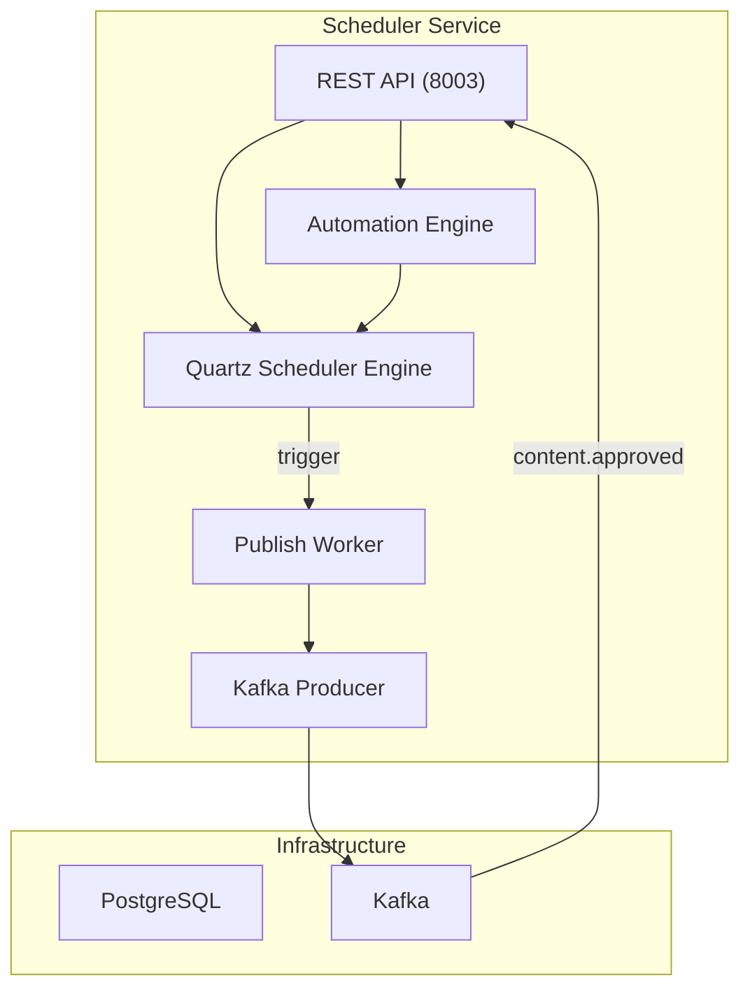

# Design — Scheduler Service

## Overview

Dịch vụ lên lịch đăng bài — Java 21, Spring Boot 3.2 + Quartz, Port 8003, PostgreSQL (scheduler_db). Đặt lịch đăng bài timezone-aware (Asia/Ho_Chi_Minh), Calendar View (tuần/tháng), drag-and-drop reschedule, Zalo OA → Broadcast Message conversion (do Zalo không hỗ trợ đăng bài tự động), exponential backoff retry (3 lần), automation flows.

## Components and Interfaces

Xem **Architecture**, **API Design**, và **Kafka Events** bên dưới.
| Component | Technology |
|-----------|-----------|
| Runtime | Java 21 |
| Framework | Spring Boot 3.2 |
| Scheduler | Quartz Scheduler |
| Database | PostgreSQL 16 |
| ORM | Spring Data JPA + Hibernate |
| Queue | Spring Kafka |
| Build | Gradle |
| Testing | JUnit 5 + Mockito + Testcontainers |

## Architecture



## API Design

```
GET    /api/v1/permissions/manifest     — Expose permissions manifest for this service
POST   /api/v1/schedules                — Create schedule
GET    /api/v1/schedules                — List schedules (paginated)
GET    /api/v1/schedules/:id            — Get schedule detail
PUT    /api/v1/schedules/:id            — Update schedule (reschedule)
DELETE /api/v1/schedules/:id            — Cancel schedule
GET    /api/v1/schedules/calendar       — Calendar view (query: month/week, timezone)

POST   /api/v1/automations             — Create automation flow
GET    /api/v1/automations             — List automations
GET    /api/v1/automations/:id         — Get automation detail
PUT    /api/v1/automations/:id         — Update automation
PUT    /api/v1/automations/:id/toggle  — Enable/disable
GET    /api/v1/automations/:id/history — Execution history
GET    /api/v1/scheduler/mcp            — SSE connection endpoint for MCP Server
POST   /api/v1/scheduler/mcp/messages   — JSON-RPC message transport for MCP Server
```

## Data Models

```sql
CREATE TABLE schedules (
    id UUID PRIMARY KEY DEFAULT gen_random_uuid(),
    tenant_id UUID NOT NULL,
    post_id UUID NOT NULL,
    channel_ids UUID[] NOT NULL,
    scheduled_at TIMESTAMPTZ NOT NULL,
    timezone VARCHAR(50) NOT NULL DEFAULT 'Asia/Ho_Chi_Minh',
    recurrence VARCHAR(50), -- null, 'daily', 'weekly', cron expression
    status VARCHAR(20) NOT NULL DEFAULT 'pending',
    retry_count INT DEFAULT 0,
    max_retries INT DEFAULT 3,
    last_error TEXT,
    created_by UUID NOT NULL,
    created_at TIMESTAMPTZ DEFAULT NOW(),
    updated_at TIMESTAMPTZ DEFAULT NOW()
);

CREATE TABLE automation_flows (
    id UUID PRIMARY KEY DEFAULT gen_random_uuid(),
    tenant_id UUID NOT NULL,
    name VARCHAR(255) NOT NULL,
    description TEXT,
    trigger_type VARCHAR(50) NOT NULL,
    trigger_config JSONB NOT NULL,
    actions JSONB NOT NULL,
    enabled BOOLEAN DEFAULT TRUE,
    created_by UUID NOT NULL,
    created_at TIMESTAMPTZ DEFAULT NOW(),
    updated_at TIMESTAMPTZ DEFAULT NOW()
);

CREATE TABLE automation_executions (
    id UUID PRIMARY KEY DEFAULT gen_random_uuid(),
    flow_id UUID NOT NULL REFERENCES automation_flows(id),
    tenant_id UUID NOT NULL,
    triggered_at TIMESTAMPTZ DEFAULT NOW(),
    status VARCHAR(20) NOT NULL,
    result JSONB,
    error TEXT,
    duration_ms INT
);

CREATE INDEX idx_schedules_due ON schedules(scheduled_at, status) WHERE status = 'pending';
CREATE INDEX idx_schedules_tenant ON schedules(tenant_id, scheduled_at DESC);
CREATE INDEX idx_auto_tenant ON automation_flows(tenant_id, enabled);
```

## Kafka Events (Luồng 4 - MỚI)
 
 ### Consumed Topics
 
 #### 1. Topic: `content.approved`
 - **Mô tả:** Nhận sự kiện bài viết được phê duyệt từ Content Service để tự động lên lịch nếu có thời gian gợi ý (`suggested_time`).
 
 #### 2. Topic: `content.published`
 - **Mô tả:** Nhận sự kiện đăng bài thành công từ Content/Publisher Service để cập nhật trạng thái schedule thành `published` trong DB.
 - **Payload:**
 ```json
 {
   "event_id": "uuid",
   "tenant_id": "uuid",
   "schedule_id": "uuid",
   "post_id": "uuid",
   "published_at": "ISO-8601 timestamp",
   "channel_id": "uuid"
 }
 ```
 
 #### 3. Topic: `scheduler.post.failed`
 - **Mô tả:** Nhận sự kiện đăng bài thất bại từ Content/Publisher Service để thực hiện cơ chế retry hoặc thông báo lỗi cho người dùng.
 - **Payload:**
 ```json
 {
   "event_id": "uuid",
   "tenant_id": "uuid",
   "schedule_id": "uuid",
   "post_id": "uuid",
   "error": "Error details string",
   "retry_count": 1
 }
 ```
 
 ### Published Topics
 
 #### 1. Topic: `scheduler.post.due`
 - **Mô tả:** Phát sự kiện yêu cầu đăng bài khi Quartz Scheduler trigger bài viết đến giờ hẹn xuất bản.
 - **Payload:**
 ```json
 {
   "event_id": "uuid",
   "tenant_id": "uuid",
   "schedule_id": "uuid",
   "post_id": "uuid",
   "channel_ids": ["uuid"],
   "action": "publish"
 }
 ```
 
 ## Quartz Job Config
```java
// Publish job runs every 30 seconds, checks for due schedules
@Scheduled(fixedRate = 30000)
public void checkDueSchedules() {
    List<Schedule> due = scheduleRepo.findDue(Instant.now());
    for (Schedule s : due) {
        kafkaTemplate.send("scheduler.post.due", buildEvent(s));
        s.setStatus("publishing");
        scheduleRepo.save(s);
    }
}
```


## Model Context Protocol (MCP) Tools

Dịch vụ Scheduler Service đóng vai trò là một MCP SSE Server đăng ký các công cụ sau:

### 1. Tool: `create_schedule`
* **Mô tả:** Lên lịch đăng bài viết hoặc thực thi công việc tự động vào thời điểm được chỉ định.
* **Tham số đầu vào (Schema):**
  * `post_id` (string, UUID, required): ID bài viết đã được phê duyệt cần đăng.
  * `scheduled_at` (string, ISO-8601 offset date-time format, required): Thời gian đăng bài lên lịch.
  * `channel_ids` (array of strings, UUIDs, required): Danh sách các ID kênh mạng xã hội đích để đăng bài.
  * `recurrence` (string, optional): Lặp lại (cron expression hoặc 'daily', 'weekly').
* **Bảo mật:** Tham số `tenant_id` sẽ được trích xuất từ header `X-Tenant-ID` và tự động tiêm vào Quartz Job Data Map và DB schedules, cấm LLM tự sửa đổi.

## Correctness Properties

### Property 1: Tenant Isolation
**Validates: Requirements 4.1**
Moi query va operation phai filter theo tenant_id tu JWT claims. Khong co cross-tenant data leakage o bat ky tang nao (DB, Kafka, Redis, Qdrant, MinIO).

### Property 2: Idempotency
**Validates: Requirements 3.1**
Moi write operation phai co idempotency key de tranh duplicate processing khi retry. Kafka consumer phai idempotent.

### Property 3: At-least-once Delivery
**Validates: Requirements 3.1**
Kafka events phai duoc xu ly it nhat mot lan. Sau 3 retries voi exponential backoff (1s, 2s, 4s), event chuyen vao dead-letter queue.

### Property 4: Circuit Breaker Correctness
**Validates: Requirements 5.1**
Sync calls toi external services phai qua circuit breaker. Open sau 5 failures trong 30s, Half-Open probe sau 60s.

### Property 5: Data Consistency
**Validates: Requirements 3.1**
Distributed transactions dung Saga pattern voi compensating actions khi rollback. Moi destructive action ghi audit.events Kafka topic.
## Error Handling

| Scenario | Strategy |
|----------|----------|
| External API timeout | Retry t?i da 3 l?n v?i exponential backoff (1s, 2s, 4s); sau d� tr? v? l?i c� c?u tr�c |
| Database connection error | Circuit breaker + fallback response; alert qua Alertmanager |
| Kafka publish failure | Retry 3 l?n; n?u v?n th?t b?i ghi v�o dead-letter queue |
| Invalid tenant_id | Reject ngay v?i HTTP 403 + ghi security warning v�o audit log |
| Validation error | Tr? v? HTTP 422 v?i danh s�ch field errors chi ti?t |
| Unhandled exception | Log structured JSON v?i trace_id; tr? v? HTTP 500 v?i error_id d? debug |

## Testing Strategy

| Layer | Tool | Coverage Target |
|-------|------|----------------|
| Unit Tests | Jest (Node.js) / pytest (Python) / JUnit 5 (Java) | > 80% business logic |
| Integration Tests | Testcontainers (PostgreSQL, Redis, Kafka) | Happy path + error paths |
| Contract Tests | Pact (consumer-driven) cho gRPC interfaces | Chatbot?AI Core, Messaging?Chatbot |
| Property-Based Tests | fast-check (JS) / Hypothesis (Python) | Tenant isolation, idempotency |
| Load Tests | k6 | Chatbot E2E < 2s t?i 100 concurrent users |


## Zero-Trust HMAC Guard & Permission Manifest

### 1. Permission Manifest API
`GET /api/v1/permissions/manifest`
Trả về JSON chứa danh sách các tài nguyên và hành động được định nghĩa cho service này:
```json
{
    "service": "scheduler",
    "resources": [
        {
            "name": "schedules",
            "description": "Scheduled tasks and posts",
            "actions": [
                "create",
                "read",
                "delete"
            ]
        }
    ]
}
```

### 2. Zero-Trust HMAC Signature Verification
Dịch vụ kiểm tra và xác thực chữ ký signature trên mỗi request tại lớp Guard/Interceptor của Spring Boot (Java):
1. Trích xuất `X-Tenant-ID`, `X-User-ID`, `X-User-Permissions` và `X-Permissions-Signature` từ headers.
2. Tính toán signature mong đợi:
   `expected_sig = HMAC_SHA256(GATEWAY_SIGNING_SECRET, X-Tenant-ID + ":" + X-User-ID + ":" + X-User-Permissions)`
3. So sánh `X-Permissions-Signature` với `expected_sig`. Nếu không khớp, trả về ngay lập tức mã lỗi `403 Forbidden` (Signature Mismatch).
4. So khớp in-memory O(1): parse `X-User-Permissions` thành một Set và đối chiếu với quyền yêu cầu của endpoint (ví dụ: `scheduler:schedules:create`).
   - Hỗ trợ wildcard: `*` (Super Admin bypass), `scheduler:*` (Service bypass), và `scheduler:schedules:*` (Resource bypass).

## Security & Gateway Integration
- Dịch vụ được triển khai stateless phía sau Kong API Gateway.
- Gateway chịu trách nhiệm validate JWT token từ Keycloak, xác thực client scope `scheduler`, và inject header `X-Tenant-ID` vào request.
- Dịch vụ tin tưởng hoàn toàn vào các header được Gateway inject để thực hiện logic nghiệp vụ và cô lập dữ liệu.

---

## Service Discovery Integration Design

Dịch vụ Scheduler tích hợp lớp `ServiceRegistryClient` chạy song song với ứng dụng chính để hỗ trợ phát hiện dịch vụ động:

### 1. Kiến trúc Client
* **Cơ chế:**
  * **Startup Event:** Khi tiến trình của dịch vụ khởi động, client thực thi lệnh `SADD` để thêm IP:Port của node hiện tại vào Redis Set: `registry:service:scheduler`.
  * **Heartbeat Thread/Task:** Chạy định kỳ mỗi 5 giây để thực hiện:
    * Ghi đè khóa sự sống: `SETEX registry:service:scheduler:node:{ip}:{port} 15 "alive"`.
    * Đảm bảo IP vẫn tồn tại trong Set: `SADD registry:service:scheduler {ip}:{port}`.
  * **Shutdown Event:** Khi nhận tín hiệu tắt tiến trình (`SIGTERM`/`SIGINT`), client thực hiện dọn dẹp:
    * Xóa IP khỏi Set: `SREM registry:service:scheduler {ip}:{port}`.
    * Xóa khóa sống: `DEL registry:service:scheduler:node:{ip}:{port}`.

### 2. Tích hợp theo Tech Stack
* **NestJS (Node.js):** Sử dụng các lifecycle hooks `OnModuleInit` và `OnApplicationShutdown` kết hợp thư viện `ioredis` và `setInterval` cho heartbeat.
* **FastAPI (Python):** Sử dụng lifespan event handlers của FastAPI kết hợp `asyncio.create_task` và `redis-py`.
* **Spring Boot (Java):** Sử dụng annotation `@PostConstruct` và `@PreDestroy` kết hợp `ScheduledExecutorService` và `Jedis`/`Lettuce`.


---

## Registry Client & Health Endpoint Design (Tối ưu hóa)
*   **Giải thuật phát hiện IP:**
    1. Lấy biến môi trường `CONTAINER_IP`.
    2. Nếu trống, quét các interface card mạng vật lý của OS để tìm IP IPv4 hợp lệ.
    3. Fallback: Tạo kết nối UDP fake đến `8.8.8.8:53`.
*   **Health Check Endpoint:**
    *   Endpoint: `/health`
    *   Response: `{"status": "UP", "timestamp": "ISO-8601", "details": {"database": "UP", "redis": "UP"}}`
    *   Kiểm tra kết nối Database và Redis. Trả về HTTP 200 nếu khỏe mạnh, HTTP 503 nếu lỗi kết nối cốt lõi.
