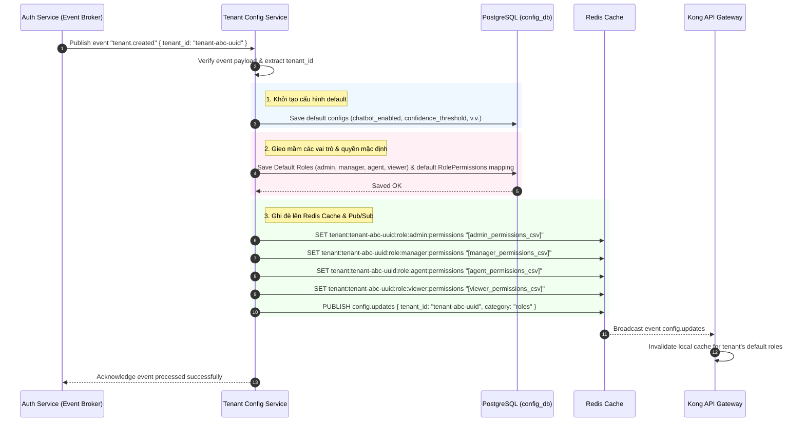
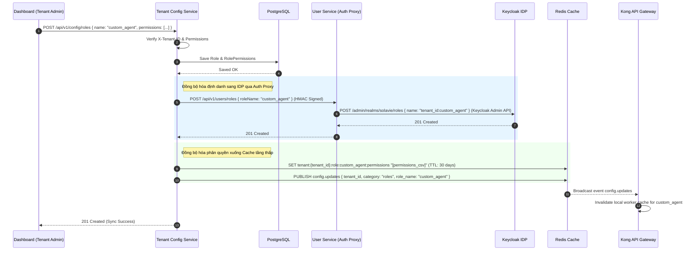

# Design — Tenant Config Service

## Overview

Dịch vụ quản lý tập trung toàn bộ cấu hình hệ thống và phân quyền tùy chỉnh (Custom Roles & Permissions) của Solavie Marketing Platform. 
- **Tech Stack:** Node.js 20, NestJS 10, Port 3006 (REST) / port 50053 (gRPC).
- **Storage & Cache:** PostgreSQL 16 (`config_db`), Redis 7.
- **Cơ chế Hot Reload:** Truyền tải cấu hình và quyền hạn mới xuống các dịch vụ nội bộ qua Redis Pub/Sub trong vòng < 5 giây.
- **Phân quyền Zero-Trust:** Verify chữ ký HMAC trên header `X-Permissions-Signature` để đảm bảo request đi qua API Gateway tin cậy.

### Phân cấp & Lưu trữ Cấu hình

1. **Cấu hình do System Admin kiểm soát (Gói cước & Phân hạng):**
   - **Định nghĩa Tiers/Plans:** Quy chuẩn hạn mức các gói cước (`free`, `standard`, `enterprise`) được định nghĩa chung trên toàn hệ thống.
   - **Gán hạng gói cho Tenant:** Được lưu trữ tại Redis dưới khóa `tenant:{tenant_id}:tier` và trong DB hệ thống.
   - **Không sử dụng System Master Keys:** Mỗi Tenant bắt buộc phải tự cấu hình khóa API riêng (BYOK) để sử dụng dịch vụ AI.

2. **Cấu hình do Tenant Admin kiểm soát:**
   - **Cấu hình nghiệp vụ (BYOK, Prompts, Thresholds):** Nằm trong bảng `tenant_configs` phân chia theo `tenant_id`. Các trường nhạy cảm được mã hóa đối xứng (AES-256).
   - **Quản lý vai trò & quyền hạn tùy chỉnh (Custom Roles & Permissions):** Lưu trữ trong bảng `roles` và `role_permissions`. Khi cập nhật, hệ thống tự động đồng bộ vai trò sang Keycloak và ghi đè permissions vào Redis cache để Gateway tra cứu.

---

## Architecture & Components

```mermaid
graph TB
    subgraph "Tenant Config Service (Port 3006 / 50053)"
        REST["REST API Controllers"]
        GRPC_S["gRPC Server"]
        
        subgraph "Modules"
            CONFIG_MOD["Config Module\n(CRUD + Validation)"]
            ROLE_MOD["Role & Permission Module\n(Auth Proxy Role Sync)"]
            HOTRELOAD["Hot Reload Module\n(Redis Pub/Sub)"]
            AUDIT["Audit Log Module"]
            DEFAULT["Default Config Module"]
        end
    end

    subgraph "Storage & Cache"
        PG[("PostgreSQL (config_db)")]
        Redis[("Redis Cache & Pub/Sub")]
        Keycloak[("Keycloak IDP")]
    end

    subgraph "Consumers & Gateway"
        Gateway["Kong API Gateway\n(Cache 3 tầng & Verification)"]
        AICore["AI Core Service"]
        CRMSvc["CRM Service"]
        US["User Service (Auth Proxy)"]
    end

    Dashboard["Dashboard (Admin)"] -->|HTTPS| REST
    REST --> CONFIG_MOD & ROLE_MOD
    GRPC_S --> CONFIG_MOD
    
    CONFIG_MOD --> PG
    ROLE_MOD --> PG
    ROLE_MOD -->|HTTP HMAC REST (Proxy)| US
    US -->|Keycloak Admin API| Keycloak
    
    CONFIG_MOD & ROLE_MOD --> HOTRELOAD
    CONFIG_MOD --> AUDIT --> PG
    
    HOTRELOAD -->|SET / PUBLISH| Redis
    Redis -->|Pub/Sub Notification| Gateway & AICore & CRMSvc
```

---

## Data Models (Prisma Schema)

Dịch vụ sử dụng Prisma ORM để quản trị cơ sở dữ liệu `config_db`. Dưới đây là đặc tả các model:

```prisma
datasource db {
  provider = "postgresql"
  url      = env("DATABASE_URL")
}

generator client {
  provider = "prisma-client-js"
}

// Cấu hình nghiệp vụ của Tenant
model TenantConfig {
  tenantId       String   @id @map("tenant_id") @db.VarChar(50)
  aiKbConfig     Json     @map("ai_kb_config")
  routingConfig  Json     @map("routing_config")
  contentConfig  Json     @map("content_config")
  crmConfig      Json     @map("crm_config")
  securityConfig Json     @map("security_config")
  updatedAt      DateTime @default(now()) @updatedAt @map("updated_at") @db.Timestamptz

  @@map("tenant_configs")
}

// Hạn mức tài nguyên mặc định của các gói cước hệ thống
model SystemTierLimit {
  tier                     String   @id @db.VarChar(50) // 'free', 'standard', 'enterprise'
  apiRequestsPerMin        Int      @default(200) @map("api_requests_per_min")
  aiWebSearchPerHour       Int      @default(50) @map("ai_web_search_per_hour")
  aiGenerateContentPerHour Int      @default(20) @map("ai_generate_content_per_hour")
  aiKbSearchPerHour        Int      @default(500) @map("ai_kb_search_per_hour")
  channelSendPerHour       Int      @default(200) @map("channel_send_per_hour")
  updatedAt                DateTime @default(now()) @updatedAt @map("updated_at") @db.Timestamptz

  @@map("system_tier_limits")
}

// Vai trò phân quyền (Hệ thống hoặc Tùy chỉnh của Tenant)
model Role {
  id          String           @id @default(uuid()) @db.Uuid
  tenantId    String           @map("tenant_id") @db.VarChar(50)
  name        String           @db.VarChar(100) // e.g., "custom_agent", "support_lead"
  isSystem    Boolean          @default(false) @map("is_system") // true đối với: admin, manager, agent, viewer
  description String?          @db.VarChar(255)
  createdAt   DateTime         @default(now()) @map("created_at") @db.Timestamptz
  updatedAt   DateTime         @default(now()) @updatedAt @map("updated_at") @db.Timestamptz
  permissions RolePermission[]

  @@unique([tenantId, name])
  @@map("roles")
}

// Ánh xạ Quyền hạn (Permissions) cho từng Vai trò
model RolePermission {
  id        String   @id @default(uuid()) @db.Uuid
  roleId    String   @map("role_id") @db.Uuid
  resource  String   @db.VarChar(100) // e.g., "campaign", "ai-core", "tenant-config"
  action    String   @db.VarChar(50)  // e.g., "read", "write", "*"
  role      Role     @relation(fields: [roleId], references: [id], onDelete: Cascade)
  createdAt DateTime @default(now()) @map("created_at") @db.Timestamptz

  @@unique([roleId, resource, action])
  @@map("role_permissions")
}

// Nhật ký kiểm toán thay đổi cấu hình
model ConfigAuditLog {
  id        String   @id @default(dbgenerated("gen_random_uuid()")) @db.Uuid
  tenantId  String   @map("tenant_id") @db.VarChar(50)
  changedBy String   @map("changed_by") @db.Uuid
  category  String   @db.VarChar(50)
  fieldName String   @map("field_name") @db.VarChar(100)
  oldValue  Json?    @map("old_value")
  newValue  Json?    @map("new_value")
  changedAt DateTime @default(now()) @map("changed_at") @db.Timestamptz

  @@index([tenantId, changedAt(sort: Desc)])
  @@index([tenantId, category, changedAt(sort: Desc)])
  @@map("config_audit_logs")
}
```

---

## REST API Interface

### 1. Cấu hình Nghiệp vụ (Tenant Configs)
- `GET /api/v1/config` — Lấy toàn bộ cấu hình (5 categories) của Tenant (dựa trên `X-Tenant-ID` header).
- `GET /api/v1/config/:category` — Lấy cấu hình của một category xác định.
- `PATCH /api/v1/config/:category` — Cập nhật một phần cấu hình của category (Chỉ Tenant Admin).

### 2. Quản lý vai trò & quyền hạn (Custom Roles)
- `GET /api/v1/config/roles` — Lấy danh sách vai trò và quyền hạn chi tiết của Tenant.
- `POST /api/v1/config/roles` — Tạo một vai trò tùy chỉnh mới (Realm Role) và gán danh sách permissions.
  - **Validation:** Trường `name` bắt buộc không được trùng với danh sách các từ khóa bảo lưu của hệ thống: `['system', 'system_admin', 'super_admin', 'root']` (không phân biệt chữ hoa/chữ thường). Nếu trùng, trả về `400 Bad Request`.
  - **Body:**
    ```json
    {
      "name": "support_level_2",
      "description": "Custom agent for VIP escalation support",
      "permissions": [
        { "resource": "chatbot", "action": "read" },
        { "resource": "crm", "action": "*" }
      ]
    }
    ```
- `PUT /api/v1/config/roles/:role_name/permissions` — Cập nhật/ghi đè danh sách permissions của một vai trò tùy chỉnh.
  - **Body:**
    ```json
    {
      "permissions": [
        { "resource": "chatbot", "action": "*" },
        { "resource": "crm", "action": "read" }
      ]
    }
    ```
- `DELETE /api/v1/config/roles/:role_name` — Xóa một vai trò tùy chỉnh. Chặn xóa các vai trò mặc định (`admin`, `manager`, `agent`, `viewer`).

### 3. Quản lý Hạn mức Hệ thống (System Admin Only)
- `GET /api/v1/system/tiers` — Xem danh sách các gói cước và hạn mức tài nguyên đi kèm.
- `POST /api/v1/system/tiers` — Khởi tạo hoặc cập nhật hạn mức của một gói cước.
- `DELETE /api/v1/system/tiers/:tier` — Xóa gói cước (chỉ cho phép nếu không có tenant nào sử dụng).

### 4. Zero-Trust Access Control
- `GET /api/v1/permissions/manifest` — Trả về danh sách tài nguyên và hành động được hỗ trợ bởi dịch vụ để hỗ trợ giao diện quản trị chọn quyền.

---

## Tenant Onboarding & Default Roles Seeding Flow

Khi Auth Service (hoặc Platform Admin) kích hoạt tạo Tenant mới, Tenant Config Service nhận sự kiện và tự động khởi tạo cấu hình cùng gieo mầm (seed) các vai trò và quyền hạn mặc định:



---

## Custom Role Sync & Invalidation Flow

Khi Tenant Admin cập nhật vai trò hoặc danh sách quyền hạn tùy chỉnh, hệ thống thực hiện đồng bộ song song tới Keycloak Realm (qua Auth Proxy) và lưu trữ Redis Cache, đồng thời bắn tín hiệu hủy cache (invalidation) cho API Gateway.



---

## Config Validation Rules

Mọi PATCH request cập nhật cấu hình nghiệp vụ đều được validate nghiêm ngặt thông qua NestJS `ValidationPipe` (class-validator) và schema định nghĩa trước:

```typescript
const CONFIG_VALIDATION_SCHEMA = {
  confidence_threshold: { type: 'float', min: 0.60, max: 0.95 },
  kb_chunk_size: { type: 'int', min: 128, max: 1024 },
  kb_chunk_overlap_percentage: { type: 'float', min: 5, max: 30 },
  rag_relevance_threshold: { type: 'float', min: 0.0, max: 1.0 },
  offline_mode_behavior: { type: 'enum', values: ['lead_capture', 'ai_warning', 'offline_msg'] },
  handoff_routing_algorithm: { type: 'enum', values: ['round_robin', 'least_busy', 'queue_claim', 'hybrid'] },
  manual_to_auto_timeout_hours: { type: 'float', min: 1, max: 24 },
  auto_close_timeout_hours: { type: 'float', min: 1, max: 48 },
  auto_approve_quality_threshold: { type: 'float', min: 0.0, max: 1.0 },
  max_post_retry_attempts: { type: 'int', min: 1, max: 5 },
  max_daily_posts_per_channel: { type: 'int', min: 1, max: 50 },
  hot_lead_threshold: { type: 'int', min: 0, max: 100 },
  contact_auto_merge_threshold: { type: 'float', min: 0.0, max: 1.0 },
  session_timeout_minutes: { type: 'int', min: 5, max: 480 },
  audit_log_retention_days: { type: 'int', min: 30, max: 365 },
  dms_max_storage_mb: { type: 'int', min: 100, max: 100000 },
  dms_max_file_versions: { type: 'int', min: 1, max: 20 },
  campaign_fb_outside_24h_action: { type: 'enum', values: ['skip', 'use_tag', 'paid'] },
  gateway_rate_limit_minute: { type: 'int', min: 10, max: 1000 },
  gateway_rate_limit_hour: { type: 'int', min: 100, max: 50000 },
  auth_password_min_length: { type: 'int', min: 6, max: 30 },
  auth_max_login_attempts: { type: 'int', min: 3, max: 20 },
  allowed_cors_origins: { type: 'array', items: { type: 'string' } },
  mcp_server_whitelist: { 
    type: 'array', 
    items: { 
      type: 'object', 
      properties: { 
        server_name: { type: 'string' }, 
        sse_url: { type: 'string', pattern: '^https?:\\/\\/[a-zA-Z0-9-._~:\\/]+' },
        status: { type: 'enum', values: ['active', 'inactive'] },
        description: { type: 'string', optional: true },
        custom_headers: { type: 'object', optional: true }
      } 
    },
    optional: true
  }
};
```
*Lưu ý:* Các trường kiểu boolean phải là giá trị Boolean thực tế (`true`/`false`), không chấp nhận chuỗi `"true"` hoặc số `1`/`0`.

---

## gRPC Interface

Microservices nội bộ giao tiếp nhanh qua gRPC (port 50053) khi cache miss:

```protobuf
syntax = "proto3";
package tenantconfig;

service TenantConfigService {
  rpc GetConfig(GetConfigRequest) returns (GetConfigResponse);
  rpc GetAllConfig(GetAllConfigRequest) returns (GetAllConfigResponse);
}

message GetConfigRequest {
  string tenant_id = 1;
  string category = 2;  // ai_kb | chat_routing | content_scheduler | crm_campaign | security_comments_notif
}

message GetConfigResponse {
  string tenant_id = 1;
  string category = 2;
  string config_json = 3;  // JSON string của cấu hình category
  string updated_at = 4;
}

message GetAllConfigRequest {
  string tenant_id = 1;
}

message GetAllConfigResponse {
  string tenant_id = 1;
  string ai_kb_config = 2;
  string routing_config = 3;
  string content_config = 4;
  string crm_config = 5;
  string security_config = 6;
  string updated_at = 7;
}
```

---

## Redis Key Map & Pub/Sub Channels

| Key / Channel | Loại | Định dạng dữ liệu | TTL |
|---|---|---|---|
| `{tenant_id}:config:{category}` | String | JSON Object cấu hình | 3600 giây (1h) |
| `tenant:{tenant_id}:tier` | String | Tên gói cước (`free`, `standard`, ...) | Không giới hạn |
| `tier:{tier_name}:limits` | String | JSON Object hạn mức tài nguyên gói cước | 86400 giây (24h) |
| `tenant:{tenant_id}:role:{role_name}:permissions` | String | CSV của các permission (sắp xếp tăng dần alphabet) | 30 ngày (Long TTL) |
| `config.updates` | Channel | Payload thông báo thay đổi cấu hình/vai trò | N/A (Pub/Sub) |
| `system.limits.updates` | Channel | Payload thông báo thay đổi hạn mức gói | N/A (Pub/Sub) |

### Event Payloads:
- **`config.updates` (cho Category Config):**
  ```json
  {
    "tenant_id": "solavie-001",
    "category": "ai_kb",
    "updated_fields": ["confidence_threshold", "chatbot_enabled"],
    "updated_at": "2026-06-07T01:44:23Z"
  }
  ```
- **`config.updates` (cho Roles & Permissions):**
  ```json
  {
    "tenant_id": "solavie-001",
    "category": "roles",
    "role_name": "custom_agent",
    "updated_at": "2026-06-07T01:44:23Z"
  }
  ```

---

## Zero-Trust HMAC Guard & Request Verification

Dịch vụ thực thi Zero-Trust bảo vệ tất cả REST API endpoints bằng việc kiểm tra signature từ API Gateway chuyển tiếp qua.

### 1. Verification Flow:
1. Trích xuất các headers từ HTTP Request:
   - `X-Tenant-ID`: Mã định danh Tenant.
   - `X-User-ID`: Mã định danh người dùng.
   - `X-User-Permissions`: Danh sách quyền người dùng dạng CSV (ví dụ: `tenant-config:configs:read,tenant-config:configs:write`).
   - `X-Permissions-Signature`: Chữ ký số HMAC do Gateway tạo.
2. Kiểm tra chữ ký:
   - Sử dụng thuật toán `HMAC-SHA256` với khóa bí mật `GATEWAY_SIGNING_SECRET`.
   - Payload ký: `X-Tenant-ID + ":" + X-User-ID + ":" + X-User-Permissions`.
   - Sử dụng `crypto.timingSafeEqual` (hoặc `compare_digest` tương đương trong Node) để so sánh chữ ký nhận được với chữ ký tính toán nhằm chống tấn công Timing Attacks.
   - Nếu không khớp hoặc thiếu header, từ chối ngay lập tức với mã lỗi `403 Forbidden` (Signature Mismatch).

### 2. Match Quyền In-Memory O(1):
Sau khi verify chữ ký thành công, Guard chuyển đổi `X-User-Permissions` thành một Set trong memory để kiểm tra quyền hạn của user với endpoint yêu cầu:
- **Wildcard Bypass:**
  - Nếu Set chứa `*` (Super Admin), cho phép qua mọi endpoint.
  - Nếu Set chứa `tenant-config:*`, cho phép truy cập toàn bộ API của service này.
  - Nếu endpoint yêu cầu quyền `tenant-config:configs:read` và Set chứa `tenant-config:configs:*` hoặc chính xác `tenant-config:configs:read`, request được chấp thuận.
  - Ngược lại, trả về `403 Forbidden` (Insufficient Permissions).

---

## Audit Log & Sensitive Data Redaction

Mọi thao tác thay đổi cấu hình đều được ghi nhật ký kiểm toán.
- **Che dữ liệu nhạy cảm (Redaction):** Hệ thống tự động quét qua các field thuộc blacklist: `['api_key', 'secret', 'password', 'token', 'webhook_secret']` và ghi đè giá trị trong audit log là `[REDACTED]` trước khi lưu DB.
- **Retention Job:** Một background cron job chạy lúc 02:00 AM hàng ngày để quét và dọn dẹp các bản ghi `config_audit_logs` có thời gian khởi tạo lớn hơn số ngày quy định trong `audit_log_retention_days` (mặc định 90 ngày) của Tenant đó.

---

## Performance Targets

- **gRPC GetConfig / GetAllConfig Latency:** < 100ms.
- **REST GET /config (Cache Hit):** < 50ms.
- **Đồng bộ hóa thay đổi (Hot Reload):** < 5 giây trên toàn hệ thống (Gateway invalidate local cache và downstream services load lại từ Redis).

---

## Testing Strategy

- **Unit Tests (Jest):** Coverage tối thiểu 80% business logic của các validator, guard HMAC, sync logic.
- **Integration Tests:** Sử dụng Testcontainers khởi chạy PostgreSQL và Redis để kiểm thử kết nối DB, ghi log audit, cơ chế Pub/Sub.
- **Contract Tests (Pact):** Kiểm thử ràng buộc gRPC Interface giữa Tenant Config Service và các downstream service (AI Core, CRM, Chatbot).
