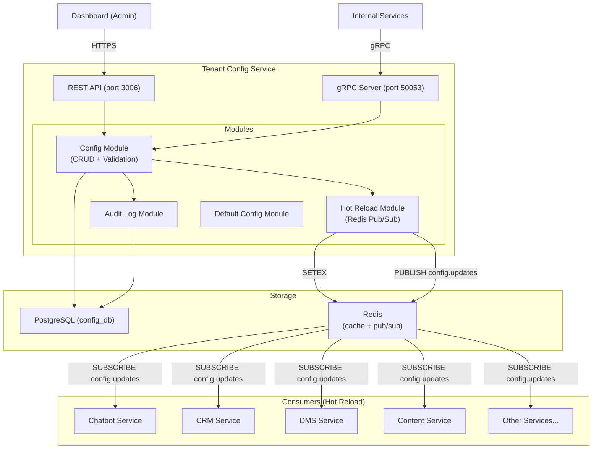
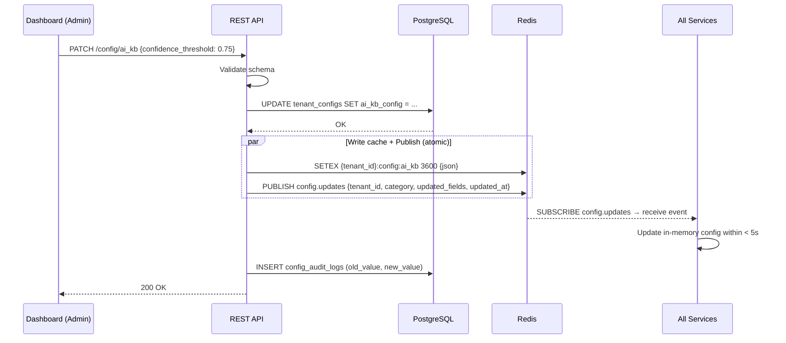

# Design — Tenant Config Service

## Overview

Dịch vụ quản lý tập trung toàn bộ cấu hình hệ thống của Solavie Marketing Platform — Node.js 20, NestJS, Port 3006 (REST) / 50053 (gRPC), PostgreSQL (config_db), Redis. Cung cấp REST API CRUD cho Dashboard, hot-reload qua Redis Pub/Sub (< 5 giây), gRPC Config Reader cho services truy vấn khi cache miss, validation schema, audit log, và default config khi Tenant mới được tạo.

## Components and Interfaces

Xem **REST API Design**, **gRPC Interface**, và **Hot Reload Flow** bên dưới.

## Tech Stack
| Component | Technology |
|-----------|-----------|
| Runtime | Node.js 20 |
| Framework | NestJS 10 |
| Language | TypeScript 5 |
| Database | PostgreSQL 16 (config_db) |
| ORM | Prisma |
| Cache | Redis 7 (hot-reload pub/sub, config cache) |
| gRPC | @grpc/grpc-js + @grpc/proto-loader |
| Testing | Jest |
| Port | 3006 (REST) / 50053 (gRPC) |

## Architecture



## REST API Design

```
# Config CRUD
GET    /api/v1/config                    — Get all config (5 categories) for tenant
GET    /api/v1/config/:category          — Get config by category
PATCH  /api/v1/config/:category          — Partial update config (Admin only)

# Audit Log
GET    /api/v1/config/audit-log          — List audit log (paginated, 50/page)

# Health
GET    /health                           — Liveness probe
GET    /ready                            — Readiness probe
GET    /metrics                          — Prometheus metrics

# Categories: ai_kb | chat_routing | content_scheduler | crm_campaign | security_comments_notif
```

## gRPC Interface

```protobuf
syntax = "proto3";
package tenantconfig;

service TenantConfigService {
  rpc GetConfig(GetConfigRequest) returns (GetConfigResponse);
  rpc GetAllConfig(GetAllConfigRequest) returns (GetAllConfigResponse);
}

message GetConfigRequest {
  string tenant_id = 1;
  string category = 2;  // ai_kb | chat_routing | content_scheduler | crm_campaign | security_comments_notif
}

message GetConfigResponse {
  string tenant_id = 1;
  string category = 2;
  string config_json = 3;  // JSON string of config object
  string updated_at = 4;
}

message GetAllConfigRequest {
  string tenant_id = 1;
}

message GetAllConfigResponse {
  string tenant_id = 1;
  string ai_kb_config = 2;
  string routing_config = 3;
  string content_config = 4;
  string crm_config = 5;
  string security_config = 6;
  string updated_at = 7;
}
```

## Data Models
```sql
-- ============================================================
-- TENANT CONFIGS
-- ============================================================
CREATE TABLE tenant_configs (
    tenant_id VARCHAR(50) PRIMARY KEY,
    ai_kb_config JSONB NOT NULL,
    routing_config JSONB NOT NULL,
    content_config JSONB NOT NULL,
    crm_config JSONB NOT NULL,
    security_config JSONB NOT NULL,
    updated_at TIMESTAMPTZ DEFAULT NOW()
);

-- ============================================================
-- AUDIT LOGS
-- ============================================================
CREATE TABLE config_audit_logs (
    id UUID PRIMARY KEY DEFAULT gen_random_uuid(),
    tenant_id VARCHAR(50) NOT NULL,
    changed_by UUID NOT NULL,
    category VARCHAR(50) NOT NULL,
    field_name VARCHAR(100) NOT NULL,
    old_value JSONB,
    new_value JSONB,
    changed_at TIMESTAMPTZ DEFAULT NOW()
);

CREATE INDEX idx_audit_tenant ON config_audit_logs(tenant_id, changed_at DESC);
CREATE INDEX idx_audit_category ON config_audit_logs(tenant_id, category, changed_at DESC);
```

## Config Schema — 5 Categories

### Category: `ai_kb`
```typescript
interface AiKbConfig {
  chatbot_enabled: boolean;                    // Default: true
  chatbot_system_prompt_override?: string;     // Max 10,000 chars
  confidence_threshold: number;                // [0.60, 0.95], Default: 0.70
  auto_handoff_on_negative: boolean;           // Default: true
  ai_vision_invoice_reading: boolean;          // Default: true
  rag_relevance_threshold: number;             // [0.0, 1.0], Default: 0.50
  kb_chunk_size: number;                       // [128, 1024], Default: 512
  kb_chunk_overlap_percentage: number;         // [5, 30], Default: 10
  llm_model_routing: Record<string, string>;   // {use_case: model_name}
  ai_fallback_models: string[];                // Fallback model list
  required_approvals: string[];                // Tools requiring human approval
  api_keys?: Record<string, { api_key_encrypted: string; api_base?: string; is_active: boolean }>;
}
```

### Category: `chat_routing`
```typescript
interface ChatRoutingConfig {
  working_hours: Record<string, { start: string; end: string }>;
  // {0: {start: "08:00", end: "17:30"}, ..., 6: null} (0=Sun, 6=Sat)
  offline_mode_behavior: 'lead_capture' | 'ai_warning' | 'offline_msg';
  offline_message?: string;                    // Static message for offline_msg mode
  handoff_routing_algorithm: 'round_robin' | 'least_busy' | 'queue_claim' | 'hybrid';
  manual_to_auto_timeout_hours: number;        // [1, 24], Default: 2
  auto_close_timeout_hours: number;            // [1, 48], Default: 24
}
```

### Category: `content_scheduler`
```typescript
interface ContentSchedulerConfig {
  require_content_approval: boolean;           // Default: true
  auto_approve_quality_threshold: number;      // [0.0, 1.0], Default: 0.85
  max_post_retry_attempts: number;             // [1, 5], Default: 3
  max_daily_posts_per_channel: number;         // [1, 50], Default: 10
  campaign_fb_outside_24h_action: 'skip' | 'use_tag' | 'paid';
  banned_keywords: string[];                   // Blocked words in posts
}
```

### Category: `crm_campaign`
```typescript
interface CrmCampaignConfig {
  lead_scoring_rules: Record<string, number>;  // {factor: weight}
  hot_lead_threshold: number;                  // [0, 100], Default: 80
  contact_auto_merge_threshold: number;        // [0.0, 1.0], Default: 0.90
  data_masking_enabled: boolean;               // Default: true
  dms_max_storage_mb: number;                  // [100, 100000], Default: 5000
  dms_max_file_versions: number;               // [1, 20], Default: 5
}
```

### Category: `security_comments_notif`
```typescript
interface SecurityCommentsNotifConfig {
  session_timeout_minutes: number;             // [5, 480], Default: 60
  audit_log_retention_days: number;            // [30, 365], Default: 90
  comment_auto_hide_spam: boolean;             // Default: true
  comment_spam_threshold: number;              // [0.0, 1.0], Default: 0.80
  notification_channels: string[];             // ['email', 'push', 'in_app']
  gateway_rate_limit_minute: number;           // [10, 1000], Default: 200
  gateway_rate_limit_hour: number;             // [100, 50000], Default: 5000
  allowed_cors_origins: string[];              // Default: ['*']
  auth_password_min_length: number;            // [6, 30], Default: 8
  auth_max_login_attempts: number;             // [3, 20], Default: 5
}
```

## Hot Reload Flow



## Validation Rules

```typescript
const CONFIG_VALIDATION_SCHEMA = {
  confidence_threshold: { type: 'float', min: 0.60, max: 0.95 },
  kb_chunk_size: { type: 'int', min: 128, max: 1024 },
  kb_chunk_overlap_percentage: { type: 'float', min: 5, max: 30 },
  rag_relevance_threshold: { type: 'float', min: 0.0, max: 1.0 },
  offline_mode_behavior: { type: 'enum', values: ['lead_capture', 'ai_warning', 'offline_msg'] },
  handoff_routing_algorithm: { type: 'enum', values: ['round_robin', 'least_busy', 'queue_claim', 'hybrid'] },
  manual_to_auto_timeout_hours: { type: 'float', min: 1, max: 24 },
  auto_close_timeout_hours: { type: 'float', min: 1, max: 48 },
  auto_approve_quality_threshold: { type: 'float', min: 0.0, max: 1.0 },
  max_post_retry_attempts: { type: 'int', min: 1, max: 5 },
  max_daily_posts_per_channel: { type: 'int', min: 1, max: 50 },
  hot_lead_threshold: { type: 'int', min: 0, max: 100 },
  contact_auto_merge_threshold: { type: 'float', min: 0.0, max: 1.0 },
  session_timeout_minutes: { type: 'int', min: 5, max: 480 },
  audit_log_retention_days: { type: 'int', min: 30, max: 365 },
  dms_max_storage_mb: { type: 'int', min: 100, max: 100000 },
  dms_max_file_versions: { type: 'int', min: 1, max: 20 },
  campaign_fb_outside_24h_action: { type: 'enum', values: ['skip', 'use_tag', 'paid'] },
  gateway_rate_limit_minute: { type: 'int', min: 10, max: 1000 },
  gateway_rate_limit_hour: { type: 'int', min: 100, max: 50000 },
  auth_password_min_length: { type: 'int', min: 6, max: 30 },
  auth_max_login_attempts: { type: 'int', min: 3, max: 20 },
  // Boolean fields: strict true/false only, reject 0/1 or "true"/"false"
};
```

## Default Config (New Tenant)

```typescript
const DEFAULT_CONFIG = {
  ai_kb_config: {
    chatbot_enabled: true,
    confidence_threshold: 0.70,
    auto_handoff_on_negative: true,
    ai_vision_invoice_reading: true,
    rag_relevance_threshold: 0.50,
    kb_chunk_size: 512,
    kb_chunk_overlap_percentage: 10,
    llm_model_routing: {},
    ai_fallback_models: [],
    required_approvals: [],
    api_keys: {},
  },
  routing_config: {
    working_hours: {
      "1": { start: "08:00", end: "17:30" },
      "2": { start: "08:00", end: "17:30" },
      "3": { start: "08:00", end: "17:30" },
      "4": { start: "08:00", end: "17:30" },
      "5": { start: "08:00", end: "17:30" },
      "6": { start: "08:00", end: "12:00" },
    },
    offline_mode_behavior: 'lead_capture',
    handoff_routing_algorithm: 'hybrid',
    manual_to_auto_timeout_hours: 2,
    auto_close_timeout_hours: 24,
  },
  content_config: {
    require_content_approval: true,
    auto_approve_quality_threshold: 0.85,
    max_post_retry_attempts: 3,
    max_daily_posts_per_channel: 10,
    campaign_fb_outside_24h_action: 'skip',
    banned_keywords: [],
  },
  crm_config: {
    lead_scoring_rules: {},
    hot_lead_threshold: 80,
    contact_auto_merge_threshold: 0.90,
    data_masking_enabled: true,
    dms_max_storage_mb: 5000,
    dms_max_file_versions: 5,
  },
  security_config: {
    session_timeout_minutes: 60,
    audit_log_retention_days: 90,
    comment_auto_hide_spam: true,
    comment_spam_threshold: 0.80,
    notification_channels: ['push', 'in_app'],
    gateway_rate_limit_minute: 200,
    gateway_rate_limit_hour: 5000,
    allowed_cors_origins: ['*'],
    auth_password_min_length: 8,
    auth_max_login_attempts: 5,
  },
};
```

## Redis Key Format

```
Config cache:    {tenant_id}:config:{category}     TTL: 3600s (1 hour)
Pub/Sub channel: config.updates

Event payload (config.updates):
{
  "tenant_id": "solavie-001",
  "category": "ai_kb",
  "updated_fields": ["confidence_threshold", "chatbot_enabled"],
  "updated_at": "2026-06-01T10:00:00Z"
}
```

## Audit Log — Sensitive Field Masking

```typescript
const SENSITIVE_FIELDS = ['api_key', 'secret', 'password', 'token', 'webhook_secret'];

function maskSensitiveValue(fieldName: string, value: any): any {
  if (SENSITIVE_FIELDS.some(f => fieldName.toLowerCase().includes(f))) {
    return '[REDACTED]';
  }
  return value;
}
```

## Error Handling

| Scenario | HTTP Status | Behavior |
|----------|-------------|----------|
| Invalid JWT | 401 | Reject |
| Non-admin PATCH | 403 | Reject |
| Validation failure | 422 | Return field-level errors |
| DB save OK, Redis fail | 207 | Return Multi-Status, retry Redis 3x |
| Redis Pub/Sub fail | 200 | Log error, services fallback via cache miss |
| Tenant not found (gRPC) | - | Return default config |

## Performance Targets

| Metric | Target |
|--------|--------|
| gRPC GetConfig response | < 100ms |
| REST GET /config response | < 50ms (Redis hit) |
| Hot reload propagation | < 5s to all services |
| Config cache TTL | 3600s (1 hour) |


## Correctness Properties

### Property 1: Tenant Isolation
**Validates: Requirements 4.1**
Moi query va operation phai filter theo tenant_id tu JWT claims. Khong co cross-tenant data leakage o bat ky tang nao (DB, Kafka, Redis, Qdrant, MinIO).

### Property 2: Idempotency
**Validates: Requirements 3.1**
Moi write operation phai co idempotency key de tranh duplicate processing khi retry. Kafka consumer phai idempotent.

### Property 3: At-least-once Delivery
**Validates: Requirements 3.1**
Kafka events phai duoc xu ly it nhat mot lan. Sau 3 retries voi exponential backoff (1s, 2s, 4s), event chuyen vao dead-letter queue.

### Property 4: Circuit Breaker Correctness
**Validates: Requirements 5.1**
Sync calls toi external services phai qua circuit breaker. Open sau 5 failures trong 30s, Half-Open probe sau 60s.

### Property 5: Data Consistency
**Validates: Requirements 3.1**
Distributed transactions dung Saga pattern voi compensating actions khi rollback. Moi destructive action ghi audit.events Kafka topic.
## Error Handling

| Scenario | Strategy |
|----------|----------|
| External API timeout | Retry t?i da 3 l?n v?i exponential backoff (1s, 2s, 4s); sau d� tr? v? l?i c� c?u tr�c |
| Database connection error | Circuit breaker + fallback response; alert qua Alertmanager |
| Kafka publish failure | Retry 3 l?n; n?u v?n th?t b?i ghi v�o dead-letter queue |
| Invalid tenant_id | Reject ngay v?i HTTP 403 + ghi security warning v�o audit log |
| Validation error | Tr? v? HTTP 422 v?i danh s�ch field errors chi ti?t |
| Unhandled exception | Log structured JSON v?i trace_id; tr? v? HTTP 500 v?i error_id d? debug |

## Testing Strategy

| Layer | Tool | Coverage Target |
|-------|------|----------------|
| Unit Tests | Jest (Node.js) / pytest (Python) / JUnit 5 (Java) | > 80% business logic |
| Integration Tests | Testcontainers (PostgreSQL, Redis, Kafka) | Happy path + error paths |
| Contract Tests | Pact (consumer-driven) cho gRPC interfaces | Chatbot?AI Core, Messaging?Chatbot |
| Property-Based Tests | fast-check (JS) / Hypothesis (Python) | Tenant isolation, idempotency |
| Load Tests | k6 | Chatbot E2E < 2s t?i 100 concurrent users |

## Security & Gateway Integration
- Dịch vụ được triển khai stateless phía sau Kong API Gateway.
- Gateway chịu trách nhiệm validate JWT token từ Keycloak, xác thực client scope `tenant-config`, và inject header `X-Tenant-ID` vào request.
- Dịch vụ tin tưởng hoàn toàn vào các header được Gateway inject để thực hiện logic nghiệp vụ và cô lập dữ liệu.
