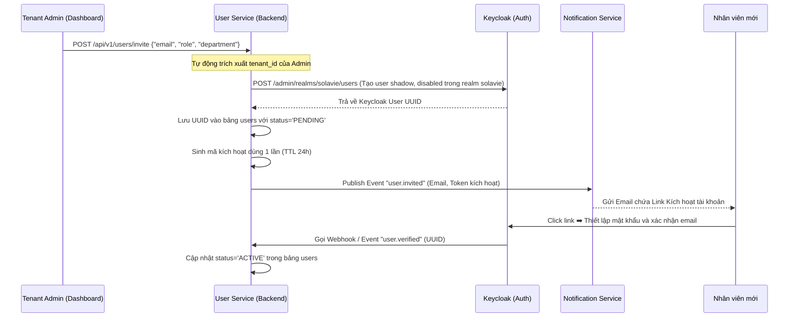
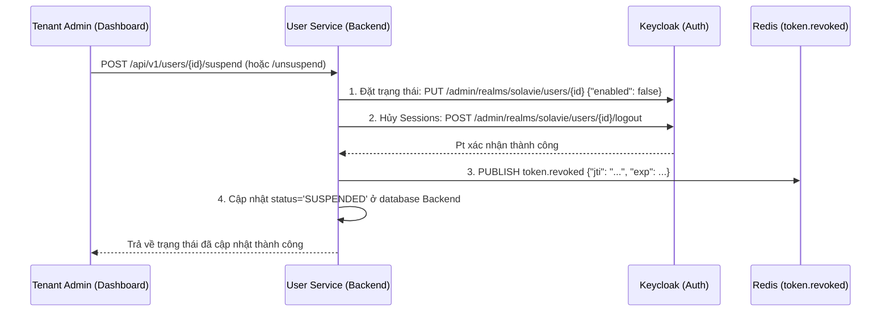
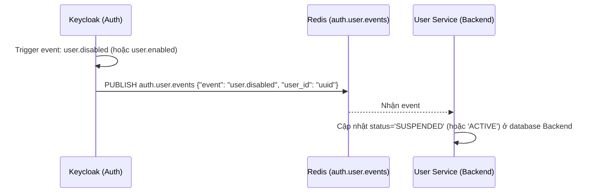
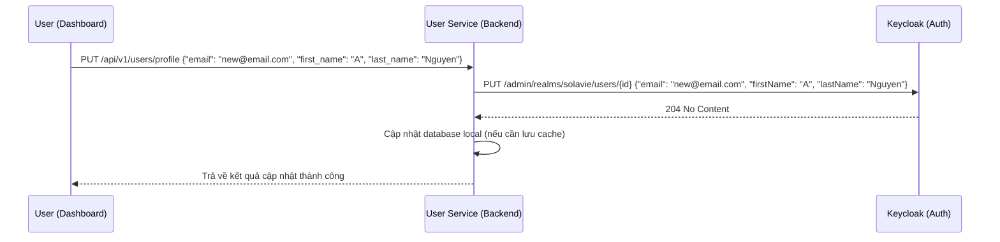

# Design — User Service (Internal Profile)

## Overview
User Service quản lý hồ sơ nghiệp vụ và trạng thái của các nhân viên (Users). Service được thiết kế theo kiến trúc Microservice hướng sự kiện, giao tiếp nội bộ qua gRPC và đồng bộ trạng thái qua event streams.

## Architectural Diagram

```
                 [ Kong API Gateway ]
                         │  (Headers: X-User-Id, X-Tenant-Id)
                         ▼
             [ User Service (NestJS) ] ── (gRPC/REST) ──► [ Other Services ]
               │                 │
      (Read/Write)               │ (Admin API / Webhook)
               ▼                 ▼
     [ PostgreSQL DB ]    [ Keycloak (Auth) ]
    (solavie_user_db)
```

## Data Models

Cơ sở dữ liệu `solavie_user_db` được lưu trữ trên PostgreSQL 16 và áp dụng chính sách Row-Level Security (RLS) để cô lập dữ liệu đa tenant.

### Bảng `users`
Bảng lưu trữ thông tin nghiệp vụ và trạng thái làm việc của nhân viên:

```sql
CREATE TABLE users (
    id UUID PRIMARY KEY, -- Trùng khớp 100% với User UUID trong Keycloak
    tenant_id UUID NOT NULL, -- Định danh doanh nghiệp sở hữu nhân viên
    phone_number VARCHAR(20) DEFAULT NULL,
    avatar_url VARCHAR(255) DEFAULT NULL,
    department VARCHAR(50) DEFAULT NULL,
    status VARCHAR(20) NOT NULL DEFAULT 'PENDING', -- PENDING, ACTIVE, SUSPENDED
    created_at TIMESTAMP WITH TIME ZONE DEFAULT CURRENT_TIMESTAMP,
    updated_at TIMESTAMP WITH TIME ZONE DEFAULT CURRENT_TIMESTAMP
);

-- Bật tính năng Row-Level Security (RLS)
ALTER TABLE users ENABLE ROW LEVEL SECURITY;

-- Thiết lập Policy cô lập đa tenant
CREATE POLICY tenant_user_isolation_policy ON users
    USING (tenant_id = current_setting('app.current_tenant_id', true)::UUID);
```

### Bảng `user_preferences`
Bảng lưu trữ cấu hình giao diện cá nhân của nhân viên:

```sql
CREATE TABLE user_preferences (
    user_id UUID PRIMARY KEY REFERENCES users(id) ON DELETE CASCADE,
    theme VARCHAR(20) NOT NULL DEFAULT 'dark',
    language VARCHAR(10) NOT NULL DEFAULT 'vi',
    notifications_enabled BOOLEAN NOT NULL DEFAULT TRUE,
    created_at TIMESTAMP WITH TIME ZONE DEFAULT CURRENT_TIMESTAMP,
    updated_at TIMESTAMP WITH TIME ZONE DEFAULT CURRENT_TIMESTAMP
);

-- Bật tính năng RLS
ALTER TABLE user_preferences ENABLE ROW LEVEL SECURITY;

-- Thiết lập Policy liên kết qua bảng users để kiểm tra tenant_id
CREATE POLICY tenant_pref_isolation_policy ON user_preferences
    USING (user_id IN (SELECT id FROM users WHERE tenant_id = current_setting('app.current_tenant_id', true)::UUID));
```

## REST & gRPC API Endpoints

### 1. REST APIs (Dành cho Dashboard gọi qua Gateway)
* `POST /api/v1/users/invite` (Yêu cầu quyền Admin)
  * Mô tả: Gửi email mời nhân viên tham gia hệ thống và tạo tài khoản tạm thời.
  * Body: `{"email": "employee@tenant.com", "role": "agent", "department": "Marketing"}`
* `GET /api/v1/users/me`
  * Mô tả: Trả về thông tin cá nhân và cấu hình preferences của User hiện tại.
  * Headers: Chứa `X-User-Id` và `X-Tenant-Id`.
* `PUT /api/v1/users/profile`
  * Mô tả: Cập nhật thông tin avatar, số điện thoại của User.
  * Body: `{"phone_number": "0987...", "avatar_url": "https://..."}`
* `PUT /api/v1/users/preferences`
  * Mô tả: Thay đổi cấu hình giao diện (theme, ngôn ngữ).
  * Body: `{"theme": "light", "language": "en"}`
* `POST /api/v1/users/:id/roles` (Yêu cầu quyền Admin)
  * Mô tả: Gán vai trò tùy chỉnh cho nhân viên.
  * Body: `{"roleName": "custom_role"}`
* `DELETE /api/v1/users/:id/roles/:name` (Yêu cầu quyền Admin)
  * Mô tả: Thu hồi vai trò tùy chỉnh khỏi nhân viên.
* `POST /api/v1/users/roles` (API nội bộ/Auth Proxy - Yêu cầu signature hệ thống)
  * Mô tả: Tạo vai trò tùy chỉnh trên Keycloak.
  * Body: `{"roleName": "custom_role"}`
* `DELETE /api/v1/users/roles/:name` (API nội bộ/Auth Proxy - Yêu cầu signature hệ thống)
  * Mô tả: Xóa vai trò tùy chỉnh trên Keycloak.

### 2. gRPC Interface (Dành cho giao tiếp nội bộ tốc độ cao)
```protobuf
syntax = "proto3";

package solavie.user.v1;

service UserService {
  rpc GetUserProfile (GetUserProfileRequest) returns (GetUserProfileResponse);
  rpc ValidateUserAccess (ValidateUserAccessRequest) returns (ValidateUserAccessResponse);
}

message GetUserProfileRequest {
  string user_id = 1;
  string tenant_id = 2;
}

message GetUserProfileResponse {
  string user_id = 1;
  string tenant_id = 2;
  string phone_number = 3;
  string avatar_url = 4;
  string department = 5;
  string status = 6;
}

message ValidateUserAccessRequest {
  string user_id = 1;
  string tenant_id = 2;
  string required_role = 3;
}

message ValidateUserAccessResponse {
  bool is_allowed = 1;
}
```

## Key Workflows

### 📨 1. Quy trình Mời và Kích hoạt Tài khoản (Invitation Flow)



### 🔄 2. Quy trình Khóa/Mở khóa tài khoản (User Suspension & Activation)

Để đảm bảo tính nhất quán, hành động khóa hoặc mở khóa tài khoản nhân viên có thể xuất phát từ hai nơi:

#### Luồng A: Thao tác từ Dashboard (Do Admin của Tenant thực hiện - US ➡️ KC)


#### Luồng B: Thao tác từ trang Keycloak Admin Console hoặc do Brute Force (KC ➡️ US)


### 🔄 3. Quy trình Cập nhật thông tin Danh tính (Identity Update Flow - US ➡️ KC)

Khi người dùng cập nhật các trường thông tin danh tính cơ bản (Email, Họ, Tên) từ trang cá nhân trên Dashboard:




## Zero-Trust HMAC Guard & Permission Manifest

### 1. Permission Manifest API
`GET /api/v1/permissions/manifest`
Trả về JSON chứa danh sách các tài nguyên và hành động được định nghĩa cho service này:
```json
{
  "service": "auth",
  "resources": [
    {
      "name": "users",
      "description": "Tenant workspace users",
      "actions": [
        "read",
        "write",
        "invite",
        "suspend",
        "unsuspend"
      ]
    },
    {
      "name": "roles",
      "description": "Tenant workspace roles",
      "actions": [
        "create",
        "delete",
        "assign",
        "revoke"
      ]
    }
  ]
}
```

### 2. Zero-Trust HMAC Signature Verification trong NestJS (TypeScript)
Dịch vụ thực hiện kiểm tra và xác thực chữ ký signature trên mỗi request tại lớp `Guard` của NestJS (TypeScript):

#### A. Trích xuất & Xác thực Chữ ký (Timing-Safe Signature Verification)
1. Lấy các HTTP Headers: `x-tenant-id`, `x-user-id`, `x-user-permissions`, và `x-permissions-signature`.
2. Tạo chuỗi ký dạng: `payload = tenant_id + ":" + user_id + ":" + user_permissions`
3. Tính toán chữ ký mong đợi bằng khóa `GATEWAY_SIGNING_SECRET`:
   ```typescript
   import * as crypto from 'crypto';

   const expectedSignature = crypto
     .createHmac('sha256', process.env.GATEWAY_SIGNING_SECRET)
     .update(payload)
     .digest('hex');
   ```
4. So sánh hai chữ ký bằng phương pháp **Timing-Safe** chống side-channel attacks:
   ```typescript
   const a = Buffer.from(receivedSignature, 'hex');
   const b = Buffer.from(expectedSignature, 'hex');
   if (a.length !== b.length || !crypto.timingSafeEqual(a, b)) {
       throw new ForbiddenException('Forbidden: Signature Mismatch');
   }
   ```

#### B. Phân giải Quyền hạn (Dynamic RBAC Check)
* `PermissionsGuard` phân tách danh sách `x-user-permissions` dạng CSV thành một tập hợp (`Set`).
* So khớp quyền với endpoint nghiệp vụ (ví dụ: cần quyền `auth:users:read`):
  - Kiểm tra nếu chứa `*` (Wildcard toàn hệ thống) -> Cho phép.
  - Kiểm tra nếu chứa `auth:*` (Wildcard toàn service) -> Cho phép.
  - Kiểm tra nếu chứa `auth:users:*` (Wildcard toàn tài nguyên) -> Cho phép.
  - Kiểm tra nếu chứa chính xác `auth:users:read` -> Cho phép.
  - Ngược lại -> Ném ra lỗi `403 Forbidden`.

#### C. Thiết lập Tenant Context cho RLS
Do NestJS chạy trên kiến trúc đơn luồng (Event Loop) với các request bất đồng bộ, để thiết lập chính xác context `tenant_id` cho cơ sở dữ liệu PostgreSQL (Row-Level Security), dịch vụ sử dụng `AsyncLocalStorage` phối hợp với Prisma Client Extensions:

1. **AsyncLocalStorage Middleware:**
   ```typescript
   import { AsyncLocalStorage } from 'async_hooks';
   export const tenantStorage = new AsyncLocalStorage<{ tenantId: string }>();
   ```
   Middleware này sẽ bắt các request từ Gateway, đọc `x-tenant-id` và lưu vào kho lưu trữ luồng bất đồng bộ (`tenantStorage.run({ tenantId }, next)`).

2. **Prisma Client RLS Extension:**
   Khi khởi tạo Prisma Client, đăng ký một extension chặn các sự kiện `$queryRaw` hoặc `$executeRaw` và các nghiệp vụ database để thiết lập context:
   ```typescript
   export const prisma = new PrismaClient().$extends({
     query: {
       $allOperations({ model, operation, args, query }) {
         const context = tenantStorage.getStore();
         const tenantId = context?.tenantId;
         if (!tenantId) {
           throw new UnauthorizedException('Tenant context missing');
         }
         return prisma.$transaction(async (tx) => {
           // Đăng ký tenant_id hiện tại vào session PostgreSQL
           await tx.$executeRawUnsafe(`SET LOCAL app.current_tenant_id = '${tenantId}';`);
           return query(args);
         });
       },
     },
   });
   ```

---

## Service Discovery Integration Design

Dịch vụ User tích hợp lớp `ServiceRegistryClient` chạy song song với ứng dụng chính để hỗ trợ phát hiện dịch vụ động:

### 1. Kiến trúc Client
* **Cơ chế:**
  * **Startup Event:** Khi tiến trình của dịch vụ khởi động, client thực thi lệnh `SADD` để thêm IP:Port của node hiện tại vào Redis Set: `registry:service:user`.
  * **Heartbeat Thread/Task:** Chạy định kỳ mỗi 5 giây để thực hiện:
    * Ghi đè khóa sự sống: `SETEX registry:service:user:node:{ip}:{port} 15 "alive"`.
    * Đảm bảo IP vẫn tồn tại trong Set: `SADD registry:service:user {ip}:{port}`.
  * **Shutdown Event:** Khi nhận tín hiệu tắt tiến trình (`SIGTERM`/`SIGINT`), client thực hiện dọn dẹp:
    * Xóa IP khỏi Set: `SREM registry:service:user {ip}:{port}`.
    * Xóa khóa sống: `DEL registry:service:user:node:{ip}:{port}`.

### 2. Tích hợp theo Tech Stack
* **NestJS (Node.js):** Sử dụng các lifecycle hooks `OnModuleInit` và `OnApplicationShutdown` kết hợp thư viện `ioredis` và `setInterval` cho heartbeat.
* **FastAPI (Python):** Sử dụng lifespan event handlers của FastAPI kết hợp `asyncio.create_task` và `redis-py`.
* **Spring Boot (Java):** Sử dụng annotation `@PostConstruct` và `@PreDestroy` kết hợp `ScheduledExecutorService` và `Jedis`/`Lettuce`.
